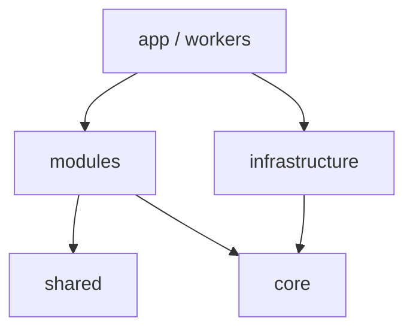

# Arquitectura del repositorio

> Referencia práctica del código que existe hoy en CRUMAFOOD Platform y de las
> reglas que deben guiar su evolución.

| Campo | Valor |
|---|---|
| Estado | Vigente |
| Alcance | Estructura de `src/`, dependencias y convenciones de módulos |
| Base verificada | `main` al 24 de septiembre de 2026 |
| Documentos relacionados | [`docs/architecture/`](docs/architecture/README.md), [`docs/engineering/code-standards.md`](docs/engineering/code-standards.md) |

## 1. Propósito

Este documento responde cuatro preguntas operativas:

1. ¿Dónde debe vivir cada tipo de código?
2. ¿Qué capas pueden depender de cuáles?
3. ¿Cómo se organiza un módulo de negocio en el estado actual del repositorio?
4. ¿Qué decisiones recientes explican estructuras que de otro modo parecerían arbitrarias?

Describe el estado real, pero no convierte toda excepción histórica en una regla.
Cuando el código existente contradice una dirección deseada, la excepción queda
registrada como deuda y no como precedente para código nuevo.

## 2. Estructura real de `src/`

```text
src/
├── app/              Rutas, layouts, Server Actions y Route Handlers de Next.js
├── config/           Configuración interna independiente del proveedor
├── core/             Primitivas transversales puras de dominio y aplicación
├── infrastructure/   Supabase, HTTP, caché, mensajería, observabilidad y storage
├── modules/          Capacidades de negocio y sus cortes verticales
├── shared/           UI, providers, schemas, errores y utilidades reutilizables
├── testing/          Pruebas de arquitectura, integración, rendimiento y fixtures
├── types/            Declaraciones globales y tipos generados de base de datos
└── workers/          Jobs, consumidores, colas, procesadores y schedulers
```

### `src/app`

Es la capa de entrega de Next.js. Contiene las superficies:

```text
src/app/
├── (admin)/
├── (auth)/
├── (storefront)/
├── api/
└── mobile/
```

Una ruta debe encargarse de composición, autenticación/autorización, traducción
de parámetros, selección de dependencias y presentación. Las reglas de negocio
reutilizables no deben nacer en `app`.

### `src/core`

Contiene piezas estables y no específicas de un módulo:

- abstracciones (`Repository`, `Service`, `UseCase`, `AggregateRoot`);
- contratos (`Result`, paginación y respuestas);
- errores de dominio y aplicación;
- eventos;
- tipos base y value objects genéricos;
- motores transversales que no dependen de Next.js ni Supabase.

`src/core` no es lo mismo que `src/modules/core`. Este último es un corte
histórico pequeño para comportamiento de aplicación compartido; no debe crecer
como un segundo núcleo genérico.

### `src/infrastructure`

Agrupa detalles técnicos reemplazables:

- `cache/`;
- `database/`;
- `http/`;
- `integrations/` —incluido Supabase—;
- `messaging/`;
- `observability/`;
- `resilience/`;
- `scheduler/`;
- `security/`;
- `storage/`.

Los tipos generados de Supabase viven en `src/types/database/`; los clientes y
aliases tipados viven en `src/infrastructure/integrations/supabase/`.

### `src/shared`

Contiene código reutilizable que no pertenece a una capacidad de negocio:

- componentes de layout compartidos;
- design tokens y estilos;
- errores de aplicación reutilizables;
- formularios y modales genéricos;
- providers de React;
- schemas, validadores y transforms genéricos;
- seguridad transversal;
- tipos, hooks y utilidades;
- el sistema de UI en `shared/ui`.

Una pieza no se vuelve `shared` solo porque dos archivos la usen. Debe carecer
de vocabulario y reglas propias de un módulo de negocio.

### `src/testing`

Reserva las pruebas que cruzan límites: contratos de arquitectura, resiliencia
de rutas, integración, E2E, rendimiento, QA, mocks y fixtures. Las pruebas
unitarias específicas permanecen junto al código (`*.test.ts[x]`). Las pruebas
de contratos de base de datos permanecen en `src/infrastructure/database/` y
las pruebas SQL en `supabase/tests/`.

### `src/workers`

Es un punto de entrada alternativo a `app`: ejecuta trabajo asíncrono mediante
consumidores, jobs, orquestadores, procesadores, colas y schedulers. Debe llamar
casos de uso de módulos y adaptadores de infraestructura, nunca componentes UI.

## 3. Módulos presentes

El directorio `src/modules/` contiene actualmente:

```text
accounting      analytics       billing          cart
catalog         checkout        contracts        core
crm             customers       dms              finance
fulfillment     hr              identity         inventory
logistics       manufacturing   marketing        notifications
orders          payments        pricing          procurement
production      promotions      quality          realtime
sales           scheduling      search           storefront
subscriptions   super-admin     supply-chain     warehouse
```

No todos representan una implementación terminada.

- Con código funcional o cortes activos: `analytics`, `catalog`, `core`, `crm`,
  `customers`, `finance`, `identity`, `inventory`, `manufacturing`, `orders`,
  `procurement`, `production`, `quality`, `sales`, `storefront` y `warehouse`.
- Reservados mediante archivos `.ts` de un byte o scaffolding mínimo:
  `accounting`, `billing`, `cart`, `checkout`, `contracts`, `dms`,
  `fulfillment`, `hr`, `logistics`, `marketing`, `notifications`, `payments`,
  `pricing`, `promotions`, `realtime`, `scheduling`, `search`, `subscriptions`,
  `super-admin` y `supply-chain`.

Una carpeta reservada indica intención de producto, no una API disponible. No
debe importarse ni completarse con más carpetas vacías.

## 4. Dirección de dependencias

La columna vertebral predeterminada es:



`app → modules → shared/core` expresa dirección, no una obligación de atravesar
todas las capas. `app` puede usar `shared/ui` directamente y puede construir un
cliente de `infrastructure` para inyectarlo a un caso de uso.

| Origen | Puede depender de | No debe depender de |
|---|---|---|
| `app` | APIs públicas de `modules`, `shared`, `core`; `infrastructure` solo para composición | detalles internos de otro route group; reglas de negocio embebidas |
| `workers` | `modules/application`, `infrastructure`, `core`, `shared` no visual | `app`, componentes React |
| `modules/*/domain` | sí mismo y `core` puro | `app`, React, Next.js, Supabase, `infrastructure` |
| `modules/*/application` | `domain`, `core`, contratos compartidos y puertos | `app`, componentes UI; adaptadores concretos nuevos |
| `modules/*/components` | el mismo módulo y `shared/ui` | `app` y detalles internos de otros módulos |
| `modules/*/infrastructure` | contratos del mismo módulo, `core`, infraestructura global | `app`, UI |
| `shared` | `shared`, `core` y librerías genéricas | `app`, capacidades de `modules`, clientes de proveedor |
| `core` | otros archivos de `core` y lenguaje estándar | `app`, `modules`, `shared`, `infrastructure`, frameworks |
| `infrastructure` | `core`, puertos de módulos y SDK externos | rutas o componentes de `app`, UI |
| `testing` | cualquier capa que necesite verificar | código productivo no debe importar `testing` |

### Composición con infraestructura

La ruta puede crear `createTypedClient()` y pasarlo a una función de aplicación.
El caso de uso recibe un tipo o puerto explícito. En código migrado, los errores
de Supabase se normalizan mediante `requireRows`, `requireOptional` o
`requireSingle` antes de alcanzar la UI.

Los repositorios actuales en varios `application/` todavía reciben
`TypedSupabaseClient` directamente. Es una frontera transicional aceptada para
los cortes existentes; código nuevo debe preferir un puerto propio cuando la
lógica necesite independencia real del proveedor.

### Dependencias entre módulos

Un módulo no debe importar detalles internos de otro. Las opciones, en orden,
son:

1. contrato público de `application`;
2. puerto pequeño definido por el consumidor;
3. evento tipado para comunicación desacoplada;
4. composición desde `app` o un worker.

`identity` es una capacidad transversal autorizada para autenticación,
permisos y contexto del actor. Aun así, los consumidores deben importar sus
contratos públicos (`guards`, `permissions`) y no sus adaptadores internos.

### Grado de enforcement

Estas reglas tienen dos niveles de control:

- TypeScript estricto, ESLint, React Hooks, ausencia de `any` explícito, uso del
  cliente Supabase tipado, composición del Dashboard y resiliencia de rutas ya
  cuentan con validaciones ejecutables.
- La matriz completa de dependencias entre carpetas todavía no está codificada
  en ESLint. Hasta que exista esa puerta de CI, se exige revisión arquitectónica
  de imports nuevos y pruebas de contrato para los cortes migrados.

Una excepción que ya existe no autoriza otra. Si una dependencia rompe esta
matriz, el PR debe corregirla o documentar explícitamente su carácter temporal.

## 5. Convención real de un módulo

La estructura es incremental. No todos los módulos necesitan todas las carpetas.
Para código nuevo o para un corte que se migra, la forma canónica es:

```text
src/modules/<module>/
├── domain/           Entidades, value objects, reglas, eventos y tipos puros
├── application/      Casos de uso, contratos, DTO, puertos y orquestación
├── components/       Componentes, formularios y vistas del módulo
├── infrastructure/   Adaptadores propios del módulo, si son necesarios
├── hooks/            Hooks exclusivos del módulo, si existen
├── schemas/          Validación de entrada específica del módulo
├── services/         Compatibilidad temporal; preferir application/use-cases
└── index.ts          API pública deliberada cuando el módulo la necesite
```

Reglas de uso:

- `domain/` es opcional; se crea cuando hay reglas puras reales, no como
  scaffolding vacío.
- `application/` es la frontera principal para acciones de negocio y lecturas.
- `components/` es el nombre predominante actual para presentación. Las carpetas
  `ui/` y `presentation/` existentes —principalmente en `identity` y módulos
  antiguos— son compatibles, pero no justifican crear tres nombres equivalentes.
- `infrastructure/` dentro del módulo se usa solo para adaptadores exclusivos de
  esa capacidad. Los adaptadores generales pertenecen a `src/infrastructure/`.
- `services/` y `store/` son estructuras heredadas; no son obligatorias.
- No se crean carpetas vacías “por si acaso”.
- Un `index.ts` exporta una API pública intencional; no debe reexportarse a sí
  mismo ni formar ciclos.

### Ejemplo de flujo

```text
app/(admin)/products/new/page.tsx
  ├─ crea/recibe el cliente tipado
  ├─ llama modules/inventory/application
  ├─ compone modules/catalog/components
  └─ usa shared/ui
```

La página conoce la composición completa. El dominio y los componentes
reutilizables no conocen la ruta.

## 6. API pública e imports

Los aliases vigentes son:

```text
@/*                 → src/*
@/modules/*         → src/modules/*
@/shared/*          → src/shared/*
@/infrastructure/*  → src/infrastructure/*
@/config/*          → src/config/*
@/core/*            → src/core/*
```

- Se prefieren aliases para imports entre áreas y rutas relativas dentro de una
  unidad pequeña.
- No se importa desde un archivo de prueba o story en código productivo.
- Un barrel debe ser pequeño y estable. Si oculta ciclos o aumenta mucho el
  grafo, se importa el archivo público concreto.
- Los archivos usan `kebab-case`; componentes, clases y tipos usan `PascalCase`;
  funciones, variables y hooks usan `camelCase`.

## 7. Decisiones registradas

### 7.1 Eliminación de `shared/ui/loading`

`src/shared/ui/loading/` se eliminó en el PR #99 porque no contenía componentes
reales. Sus subcarpetas (`chart-loading`, `form-loading`, `modal-loading`,
`page-loading`, `skeleton` y `table-loading`) eran barrels de un byte que se
reexportaban a sí mismos o entre sí. Esto producía ciclos y ninguna parte del
producto los consumía.

Las fuentes canónicas son ahora:

- `src/shared/ui/loading-state/` para el indicador reutilizable;
- `src/shared/ui/feedback/page-skeleton.tsx` para skeletons de página;
- `loading.tsx` junto a la ruta para feedback inmediato de Next.js;
- estados específicos de tablas dentro de `shared/ui/data-table/`.

No debe recrearse un directorio genérico `shared/ui/loading/` como agregador.
Una nueva variante debe vivir junto al patrón que representa y tener un
consumidor real.

### 7.2 Estructura de `identity/guards`

Antes del PR #97, `auth.guard.ts` importaba `AuthorizationError` desde
`permission.guard.ts`, mientras `permission.guard.ts` importaba
`AuthorizationActor` desde `auth.guard.ts`. Ese acoplamiento formaba un ciclo y
mezclaba contratos, errores y ejecución.

La estructura actual separa hojas neutrales:

```text
identity/guards/
├── types.ts                 AuthorizationActor y AuthorizationContext
├── authorization-error.ts  AuthorizationError, reason e isAuthorizationError
├── auth.guard.ts            construye el actor autenticado
├── permission.guard.ts      exige un permiso
├── action.guard.ts          compone autenticación + permiso
├── role.guard.ts
├── tenant.guard.ts
└── organization.guard.ts
```

La dirección interna es:

```text
types.ts ───────────────┐
authorization-error.ts ├─> auth/permission guards ─> action.guard.ts
permissions constants ─┘
```

Consecuencias de la decisión:

- los tipos compartidos ya no dependen de un guard ejecutable;
- el error de autorización tiene un único origen;
- los límites pueden usar `isAuthorizationError(error)` sin inspeccionar
  mensajes ni confundir la clase con una función;
- los guards conservan un cliente Supabase tipado y fallan cerrados cuando no
  pueden construir el contexto de autorización;
- nuevos tipos o errores neutrales deben permanecer fuera de archivos que los
  consumen.

El PR #98 corrigió imports residuales después de esta separación. La regla es
mantener el grafo acíclico, no añadir barrels que vuelvan a ocultar el ciclo.

### 7.3 Reorganización de frontend y tipos

Los PR #95 y #96 consolidaron:

- providers en `src/shared/providers`;
- layouts reutilizables en `src/shared/components/layout`;
- formularios dentro del módulo propietario;
- Supabase y utilidades de proveedor en `src/infrastructure`;
- pruebas transversales en `src/testing`;
- declaraciones globales en `src/types`;
- vistas de operación móvil en `manufacturing` y `warehouse`.

Las rutas antiguas bajo `src/lib`, `src/providers` y componentes administrativos
genéricos no deben restablecerse. Si hace falta compatibilidad temporal, debe
ser un reexport explícito con una tarea de retiro.

### 7.4 Configuración de ESLint

ESLint usa flat config en `eslint.config.mjs`. El plugin de React Hooks debe
estar registrado y consumido; un import sin uso falla por diseño. Los scripts
deben ejecutarse con el toolchain fijado por el repositorio: Node 24 y pnpm
10.34.5.

## 8. Excepciones y deuda conocida

Las siguientes dependencias existen hoy, pero no deben copiarse:

| Excepción actual | Dirección de corrección |
|---|---|
| `shared/components/layout` y `shared/ui/mobile-shell` importan `identity` o `analytics` | mover shells que conocen negocio hacia `app` o inyectar sus piezas |
| algunos formularios de módulos importan Server Actions desde `app` | inyectar callbacks o mover la acción a `application` |
| `analytics/application` importa repositorios de `inventory/application` | definir contrato público/puerto o componer desde `app` |
| varios repositorios de `application` conocen tipos concretos de Supabase | introducir puertos al migrar cada corte vertical |
| `core/decision-engine` importa un tipo de `shared` | mover el contrato estable a `core` |
| algunos módulos conservan `ui`, `presentation`, `services` y `components` a la vez | converger gradualmente, sin una reorganización masiva sin pruebas |

Las correcciones se realizan por corte vertical y con TDD. No se autoriza una
mudanza masiva solo para hacer coincidir nombres de carpetas.

## 9. Reglas para cambios nuevos

Antes de agregar un archivo:

1. Identificar el módulo propietario y la superficie que lo entrega.
2. Colocar reglas puras en `domain`, orquestación en `application` y React en
   `components`.
3. Mantener `app` como composición.
4. Evitar una dependencia nueva desde `shared` o `core` hacia negocio.
5. No añadir carpetas, barrels o aliases sin consumidores reales.
6. Modelar errores esperados y conservar detalles internos únicamente en
   `cause`.
7. Añadir pruebas en la capa correspondiente.
8. Ejecutar tipos, lint, unitarias, build, Storybook y pruebas de base de datos
   cuando el cambio las afecte.

Comandos mínimos:

```bash
pnpm run typecheck
pnpm run lint
pnpm run test
pnpm run build
pnpm run build-storybook
```

Para validar formato y archivos accidentales:

```bash
git diff --check
git status --short
```

## 10. Evolución de estas reglas

Este archivo documenta el mapa operativo del repositorio. Las decisiones
costosas de revertir continúan requiriendo un ADR en
`docs/architecture/adr/`. Cuando cambie una frontera, deben actualizarse en el
mismo PR:

1. el código;
2. las pruebas de arquitectura aplicables;
3. este documento;
4. el ADR o documento especializado que corresponda.

La fuente de verdad final es el conjunto coherente de decisión aprobada,
documentación vigente, pruebas ejecutables y código verificado.
