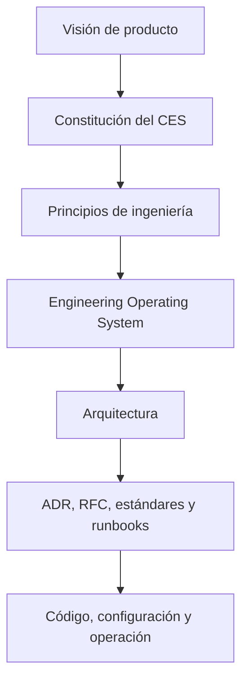

# Documentación de Arquitectura de CRUMAFOOD Platform

> **Este directorio es el índice oficial de las decisiones, límites y estrategias arquitectónicas de CRUMAFOOD Platform.**

## Estado del documento

| Campo | Valor |
|---|---|
| Estado | Aprobado |
| Versión | 2.0 |
| Propietarios | Product Owner y responsable de arquitectura |
| Alcance | Catálogo, orden de lectura, autoridad, estados, mantenimiento y gobierno documental |
| Autoridad | Derivado de la Visión, la Constitución y el CRUMAFOOD Engineering System |
| Revisión | Cuando se agregue, retire, renombre o cambie la autoridad de un documento arquitectónico |

---

## 1. Propósito

Este README permite:

- localizar la documentación vigente;
- conocer qué documento gobierna cada tema;
- distinguir propuestas de decisiones aprobadas;
- seguir un orden de lectura;
- detectar vacíos;
- resolver contradicciones;
- y mantener arquitectura, código y operación sincronizados.

No sustituye los documentos enlazados.

---

## 2. Alcance de este directorio

`docs/architecture/` contiene arquitectura transversal de plataforma.

Incluye:

- visión del sistema;
- Business Core;
- datos;
- seguridad;
- integración;
- despliegue;
- clientes;
- operación;
- calidad;
- rendimiento;
- aislamiento multi-tenant;
- y Design System.

Las decisiones específicas se registrarán mediante ADR y los diseños por explorar mediante RFC.

---

## 3. Jerarquía documental



Un documento inferior no podrá contradecir silenciosamente a uno superior.

---

## 4. Documentos fundacionales

| Documento | Propósito |
|---|---|
| [Visión de producto](../vision.md) | Define el problema, propósito y dirección del producto |
| [Constitución](../engineering/constitution.md) | Establece compromisos no negociables del Engineering System |
| [Principios de ingeniería](../engineering/engineering-principles.md) | Convierte compromisos en criterios de decisión |
| [Engineering Operating System](../engineering/engineering-operating-system.md) | Define cómo diseñar, construir, verificar, liberar y aprender |

Estos documentos gobiernan la interpretación de la arquitectura.

---

## 5. Catálogo arquitectónico

| Área | Documento | Estado |
|---|---|---|
| Sistema | [system-overview.md](system-overview.md) | Propuesto para aprobación |
| Negocio | [business-core.md](business-core.md) | Propuesto para aprobación |
| Datos | [data-architecture.md](data-architecture.md) | Propuesto para aprobación |
| Seguridad | [security-architecture.md](security-architecture.md) | Propuesto para aprobación |
| Integraciones | [integration-architecture.md](integration-architecture.md) | Propuesto para aprobación |
| Despliegue | [deployment-architecture.md](deployment-architecture.md) | Propuesto para aprobación |
| Frontend | [frontend-architecture.md](frontend-architecture.md) | Propuesto para aprobación |
| Mobile | [mobile-architecture.md](mobile-architecture.md) | Propuesto para aprobación |
| Desktop | [desktop-architecture.md](desktop-architecture.md) | Propuesto para aprobación |
| Observabilidad | [observability-architecture.md](observability-architecture.md) | Propuesto para aprobación |
| Pruebas | [testing-strategy.md](testing-strategy.md) | Propuesto para aprobación |
| Rendimiento | [performance-architecture.md](performance-architecture.md) | Propuesto para aprobación |
| Multi-tenancy | [multi-tenancy-architecture.md](multi-tenancy-architecture.md) | Propuesto para aprobación |
| Design System | [design-system-architecture.md](design-system-architecture.md) | Propuesto para aprobación |

El estado de este índice no aprueba automáticamente los documentos enlazados.

---

## 6. Orden de lectura recomendado

Para comprender la plataforma completa:

1. [Visión de producto](../vision.md);
2. [Constitución](../engineering/constitution.md);
3. [Principios de ingeniería](../engineering/engineering-principles.md);
4. [Engineering Operating System](../engineering/engineering-operating-system.md);
5. [Arquitectura general](system-overview.md);
6. [Business Core](business-core.md);
7. [Datos](data-architecture.md);
8. [Seguridad](security-architecture.md);
9. [Integraciones](integration-architecture.md);
10. [Despliegue](deployment-architecture.md);
11. clientes aplicables;
12. operación y calidad;
13. rendimiento, multi-tenancy y Design System.

---

## 7. Ruta para desarrollo de negocio

Quien implemente una capacidad de negocio deberá leer:

1. [business-core.md](business-core.md);
2. [data-architecture.md](data-architecture.md);
3. [security-architecture.md](security-architecture.md);
4. [testing-strategy.md](testing-strategy.md);
5. y el documento del cliente o integración correspondiente.

Las reglas no vivirán exclusivamente en UI, Server Actions o SQL ad hoc.

---

## 8. Ruta para frontend

Quien trabaje en Web deberá leer:

1. [frontend-architecture.md](frontend-architecture.md);
2. [design-system-architecture.md](design-system-architecture.md);
3. [security-architecture.md](security-architecture.md);
4. [performance-architecture.md](performance-architecture.md);
5. [testing-strategy.md](testing-strategy.md);
6. y [observability-architecture.md](observability-architecture.md).

---

## 9. Ruta para Mobile

Quien trabaje en Mobile deberá leer:

1. [mobile-architecture.md](mobile-architecture.md);
2. [business-core.md](business-core.md);
3. [integration-architecture.md](integration-architecture.md);
4. [security-architecture.md](security-architecture.md);
5. [design-system-architecture.md](design-system-architecture.md);
6. [testing-strategy.md](testing-strategy.md);
7. y [performance-architecture.md](performance-architecture.md).

---

## 10. Ruta para Desktop

Quien trabaje en Desktop deberá leer:

1. [desktop-architecture.md](desktop-architecture.md);
2. [frontend-architecture.md](frontend-architecture.md);
3. [integration-architecture.md](integration-architecture.md);
4. [security-architecture.md](security-architecture.md);
5. [deployment-architecture.md](deployment-architecture.md);
6. [design-system-architecture.md](design-system-architecture.md);
7. y [testing-strategy.md](testing-strategy.md).

Tauri 2 continúa sujeto a ADR definitivo y piloto.

---

## 11. Ruta para datos y backend

Quien cambie persistencia, API o procesos deberá leer:

1. [data-architecture.md](data-architecture.md);
2. [business-core.md](business-core.md);
3. [security-architecture.md](security-architecture.md);
4. [integration-architecture.md](integration-architecture.md);
5. [multi-tenancy-architecture.md](multi-tenancy-architecture.md);
6. [performance-architecture.md](performance-architecture.md);
7. y [testing-strategy.md](testing-strategy.md).

---

## 12. Ruta para operación

Quien despliegue u opere la plataforma deberá leer:

1. [deployment-architecture.md](deployment-architecture.md);
2. [observability-architecture.md](observability-architecture.md);
3. [security-architecture.md](security-architecture.md);
4. [performance-architecture.md](performance-architecture.md);
5. [testing-strategy.md](testing-strategy.md);
6. y [integration-architecture.md](integration-architecture.md).

---

## 13. Arquitectura general

[system-overview.md](system-overview.md) define:

- contexto;
- productos;
- vista lógica;
- módulos;
- dependencias;
- dirección evolutiva;
- y decisiones que requieren ADR.

Cuando exista duda sobre el lugar de una capacidad, se consultará primero este documento.

---

## 14. Business Core

[business-core.md](business-core.md) gobierna:

- dominio;
- aplicación;
- puertos;
- adaptadores;
- propiedad modular;
- casos de uso;
- transacciones;
- eventos;
- y errores.

Desktop, Web, Mobile e integraciones no reinterpretarán reglas esenciales.

---

## 15. Datos

[data-architecture.md](data-architecture.md) gobierna:

- PostgreSQL/Supabase;
- autoridad;
- modelo;
- integridad;
- RLS;
- migraciones;
- inventario;
- lotes;
- auditoría;
- respaldo;
- y recuperación.

`database-map.md` es una intención auxiliar y no sustituye el baseline del esquema desplegado.

---

## 16. Seguridad

[security-architecture.md](security-architecture.md) gobierna:

- identidad;
- sesión;
- autenticación;
- autorización;
- RLS;
- secretos;
- API;
- webhooks;
- archivos;
- clientes;
- incidentes;
- y recuperación.

La seguridad se verifica por éxito y denegación.

---

## 17. Integraciones

[integration-architecture.md](integration-architecture.md) gobierna:

- APIs;
- contratos;
- eventos;
- outbox e inbox;
- idempotencia;
- terceros;
- webhooks;
- jobs;
- archivos;
- y resiliencia.

Una integración nunca accederá a tablas como contrato externo.

---

## 18. Despliegue

[deployment-architecture.md](deployment-architecture.md) gobierna:

- build;
- CI/CD;
- entornos;
- Vercel;
- Supabase;
- configuración;
- secretos;
- migraciones;
- rollback;
- recuperación;
- y evolución topológica.

Una versión no termina al compilar.

---

## 19. Clientes

Los clientes tienen responsabilidades distintas:

| Cliente | Documento | Enfoque |
|---|---|---|
| Web | [frontend-architecture.md](frontend-architecture.md) | Renderizado, estado, formularios, navegación y experiencia |
| Mobile | [mobile-architecture.md](mobile-architecture.md) | Operación táctil, scanner, conectividad y sincronización |
| Desktop | [desktop-architecture.md](desktop-architecture.md) | Tauri, bridge nativo, hardware, archivos y distribución |

Ningún cliente es autoridad del negocio por sí mismo.

---

## 20. Operación y calidad

| Disciplina | Documento |
|---|---|
| Logs, métricas, trazas, alertas y SLO | [observability-architecture.md](observability-architecture.md) |
| Unitarias, integración, contratos, E2E y CI | [testing-strategy.md](testing-strategy.md) |
| Latencia, capacidad, caché y escalado | [performance-architecture.md](performance-architecture.md) |

Estas disciplinas forman parte de la entrega, no una etapa posterior.

---

## 21. Capacidades transversales

| Capacidad | Documento |
|---|---|
| Aislamiento organizacional | [multi-tenancy-architecture.md](multi-tenancy-architecture.md) |
| Lenguaje visual y componentes | [design-system-architecture.md](design-system-architecture.md) |

Ambos documentos contienen decisiones que deberán formalizarse mediante ADR antes de ciertas implementaciones productivas.

---

## 22. Estados documentales

| Estado | Significado |
|---|---|
| Borrador | Contenido incompleto, abierto a estructuración |
| Propuesto para aprobación | Contenido completo pendiente de decisión |
| Aprobado | Autoridad vigente dentro de su alcance |
| Reemplazado | Conservado como historia, con sucesor explícito |
| Retirado | Ya no aplica y no tiene autoridad |

No se usará “Aprobado” como sinónimo de “archivo creado”.

---

## 23. Autoridad

Un documento arquitectónico aprobado tiene autoridad sobre:

- nuevas implementaciones;
- refactors;
- migraciones;
- revisiones;
- y excepciones

dentro de su alcance.

Una propuesta orienta, pero sus decisiones irreversibles requieren aprobación.

---

## 24. Contradicciones

Cuando dos documentos parezcan contradecirse:

1. verificar alcance;
2. verificar estado;
3. verificar versión;
4. aplicar el documento de mayor autoridad;
5. registrar la discrepancia;
6. corregir ambos si es necesario;
7. y crear ADR cuando exista una decisión material.

No se elegirá silenciosamente el texto más conveniente.

---

## 25. Tipos de documento

| Tipo | Uso |
|---|---|
| Arquitectura | Define límites, principios y dirección |
| ADR | Registra una decisión arquitectónica tomada |
| RFC | Explora un cambio antes de decidir |
| Estándar | Define una práctica obligatoria concreta |
| Guía | Explica una forma recomendada de trabajo |
| Runbook | Describe respuesta operativa |
| Catálogo | Enumera contratos, señales o activos |

Cada pregunta deberá vivir en el tipo apropiado.

---

## 26. ADR

Un Architecture Decision Record se creará cuando una decisión:

- sea difícil de revertir;
- afecte varias áreas;
- cambie un límite;
- introduzca proveedor;
- modifique aislamiento;
- establezca un estándar;
- o tenga trade-offs importantes.

Un ADR registra la decisión, no reemplaza la discusión previa.

---

## 27. Estructura ADR objetivo

```text
docs/architecture/
└── adr/
    ├── README.md
    ├── 0000-template.md
    ├── 0001-<decision>.md
    └── ...
```

La numeración será secuencial y no se reutilizará.

---

## 28. Contenido de un ADR

Cada ADR incluirá:

- título;
- estado;
- fecha;
- propietarios;
- contexto;
- fuerzas;
- opciones;
- decisión;
- consecuencias;
- riesgos;
- controles;
- migración;
- validación;
- y referencias.

El ADR deberá ser suficientemente breve para revisarse.

---

## 29. Estados ADR

| Estado | Significado |
|---|---|
| Propuesto | Pendiente de decisión |
| Aceptado | Vigente |
| Rechazado | Evaluado y no elegido |
| Reemplazado | Sustituido por otro ADR |
| Deprecado | Vigente solo durante transición |

Un ADR aceptado no se reescribe para ocultar la decisión original.

---

## 30. RFC

Un RFC se utilizará cuando:

- el problema requiera exploración;
- existan varias opciones;
- falte evidencia;
- se necesite spike;
- o la decisión afecte a varias personas.

El RFC podrá cerrar con ADR, implementación, rechazo o aprendizaje.

---

## 31. Decisiones prioritarias

El conjunto actual identifica como prioritarias:

- Tenant frente a Organización y clave canónica;
- baseline y ubicación de migraciones;
- roles, permisos y scopes;
- topología Desktop/Tauri;
- estrategia offline;
- eventos, outbox e inbox;
- pipeline CI/CD;
- proveedor de observabilidad;
- SLO, RPO y RTO;
- estrategia de caché;
- formato de design tokens;
- y Storybook.

La prioridad final seguirá riesgo y secuencia de implementación.

---

## 32. Ownership

Cada documento tendrá:

- propietario;
- revisores;
- estado;
- versión;
- alcance;
- y trigger de revisión.

El propietario mantiene coherencia; no decide unilateralmente temas fuera de su autoridad.

---

## 33. Revisión

Un documento se revisará cuando:

- cambie tecnología;
- cambie contrato;
- cambie modelo de datos;
- aparezca un incidente;
- una excepción se repita;
- un ADR lo reemplace;
- o una implementación demuestre que el supuesto era incorrecto.

También tendrá revisión periódica proporcional al riesgo.

---

## 34. Cambios

Todo cambio documental relevante explicará:

- qué cambió;
- por qué;
- qué documentos afecta;
- qué código debe migrar;
- qué decisión lo autoriza;
- y cómo se verificará.

No se actualizará arquitectura para justificar retroactivamente una omisión sin registrar el motivo.

---

## 35. Pull Requests

Un Pull Request que afecte arquitectura deberá:

- enlazar documento, ADR o RFC;
- actualizar contenido relacionado;
- explicar compatibilidad;
- incluir pruebas;
- incluir migración;
- y registrar evidencia operativa cuando corresponda.

La documentación forma parte de Definition of Done.

---

## 36. Nuevo documento

Antes de crear un archivo se verificará:

- que el tema no esté gobernado;
- que el alcance sea transversal;
- que tenga propietario;
- que no sea mejor ADR, RFC o guía;
- y que pueda mantenerse.

La proliferación de documentos sin autoridad reduce claridad.

---

## 37. Convención de nombres

Los nombres:

- usarán kebab-case;
- serán descriptivos;
- evitarán fechas salvo registros;
- no incluirán “final”;
- y mantendrán sufijos consistentes.

Ejemplos:

- `data-architecture.md`;
- `testing-strategy.md`;
- `0001-tenant-isolation-model.md`.

---

## 38. Plantilla arquitectónica

Un documento transversal deberá incluir:

- título;
- declaración;
- estado;
- propósito;
- alcance;
- principios;
- estado actual;
- estado objetivo;
- decisiones;
- seguridad;
- pruebas;
- observabilidad;
- transición;
- riesgos;
- conformidad;
- y pendientes.

La profundidad será proporcional al tema.

---

## 39. Enlaces

Los enlaces internos serán relativos.

Al renombrar un archivo:

- se actualizarán referencias;
- se verificará navegación;
- se conservará redirect documental si la plataforma lo permite;
- y se registrará el cambio.

Un enlace roto es un defecto documental.

---

## 40. Diagramas

Los diagramas:

- usarán Mermaid cuando sea adecuado;
- tendrán propósito;
- se mantendrán pequeños;
- coincidirán con el texto;
- y evitarán detalles efímeros.

El texto seguirá siendo comprensible sin depender únicamente del diagrama.

---

## 41. Lenguaje

La documentación oficial se mantiene en español.

Los términos técnicos podrán conservar su nombre habitual:

- Business Core;
- Tenant;
- RLS;
- API;
- ADR;
- RFC;
- SLO;
- y Definition of Done.

Cada término ambiguo se definirá.

---

## 42. Evidencia

Una afirmación de estado actual deberá respaldarse mediante:

- código;
- configuración;
- esquema;
- pipeline;
- pruebas;
- proveedor;
- o evidencia operativa.

Una carpeta o dependencia no demuestra una capacidad funcional.

---

## 43. Propuesta frente a implementación

Los documentos distinguen:

- lo que existe;
- lo que se propone;
- lo que se aprobó;
- y lo que se verificó.

No se considerarán implementados:

- Tauri;
- OpenTelemetry;
- Sentry;
- Storybook;
- Vitest;
- Playwright;
- Redis;
- colas;
- réplicas;
- ni multi-tenancy productivo

solo porque aparezcan en la documentación.

---

## 44. Excepciones

Una excepción arquitectónica incluirá:

- regla afectada;
- motivo;
- alcance;
- riesgo;
- control compensatorio;
- propietario;
- aprobación;
- vencimiento;
- y plan de cierre.

Las excepciones no serán indefinidas.

---

## 45. Riesgos documentales

| Riesgo | Control |
|---|---|
| Documento obsoleto | Owner y trigger de revisión |
| Contradicción | Jerarquía y ADR |
| Estado inflado | Evidencia verificable |
| Enlaces rotos | Validación automatizada |
| Decisión perdida | ADR |
| Exceso de documentos | Criterios de creación |
| Implementación divergente | Definition of Done |
| Historia reescrita | ADR inmutable |

---

## 46. Automatización objetivo

CI deberá verificar progresivamente:

- archivos enlazados;
- Markdown;
- headings;
- Mermaid cuando sea viable;
- metadata mínima;
- estados válidos;
- y referencias ADR.

La automatización no decidirá la calidad del contenido, pero evitará deriva mecánica.

---

## 47. Criterios de conformidad documental

El conjunto será conforme cuando:

- el catálogo esté actualizado;
- cada área tenga autoridad;
- los estados sean honestos;
- los enlaces funcionen;
- las decisiones materiales tengan ADR;
- el código siga la arquitectura;
- las excepciones sean visibles;
- y las revisiones tengan propietario.

---

## 48. Próxima etapa

Con el catálogo transversal completo, la próxima etapa documental es:

1. crear `docs/architecture/adr/README.md`;
2. crear `docs/architecture/adr/0000-template.md`;
3. priorizar ADR-0001;
4. aprobar o ajustar los documentos propuestos;
5. y vincular decisiones con el backlog de implementación.

El primer ADR se elegirá por riesgo y dependencia, no por conveniencia.

---

## 49. Declaración final

> **La arquitectura de CRUMAFOOD no es una colección de archivos: es un sistema de decisiones trazables. Este índice mantiene visible qué gobierna cada tema, qué falta decidir y qué debe demostrar la implementación.**
