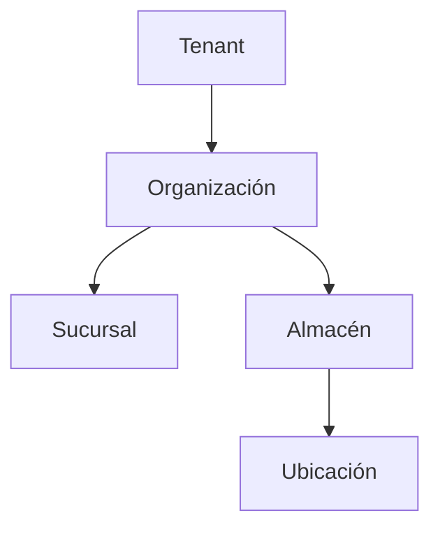

# ADR-0003: Adoptar RBAC con permisos canónicos y scopes jerárquicos

> **Propuesta:** autorizar mediante membresía de tenant, roles que agrupan permisos y grants limitados por scopes organizacionales explícitos, con denegación por defecto.

## Metadata

| Campo | Valor |
|---|---|
| Estado | Propuesto |
| Fecha | 2026-07-12 |
| Decisores | Product Owner, responsable de arquitectura, responsable de seguridad y responsable de Identity & Access |
| Consultados | Datos, responsables de módulos, operación, Mobile y Desktop |
| Informados | Desarrollo, calidad, soporte y responsables de integraciones |
| Propietario | Identity & Access con corresponsabilidad de Seguridad |
| Alcance | Membresías, roles, permisos, scopes, casos de uso, RLS, sesiones, clientes, auditoría y revocación |
| Reemplaza | No aplica |
| Reemplazado por | No aplica |
| RFC relacionado | No aplica; requiere prototipo de evaluación y RLS antes de aceptación |
| Issues relacionados | Pendiente: normalización de `user_roles`, catálogo de permisos, scopes y matriz de pruebas |

---

## 1. Resumen ejecutivo

La plataforma necesita un modelo de autorización uniforme.

El código actual consulta `user_roles` y contiene comparaciones dispersas como `role === 'admin'`. Este enfoque no expresa tenant, organización, almacén, acción, recurso ni contexto.

La decisión propuesta es:

> **CRUMAFOOD adopta RBAC como base: permisos canónicos `<resource>.<action>`, roles que agrupan permisos y asignaciones de rol a membresías dentro de scopes jerárquicos; toda autorización deniega por defecto y se verifica en caso de uso y PostgreSQL/RLS.**

---

## 2. Contexto

ADR-0001 propone Tenant como frontera de aislamiento.

ADR-0002 propone baseline y migraciones canónicas.

Los documentos de seguridad y multi-tenancy establecen:

- identidad autenticada;
- membresía activa;
- mínimo privilegio;
- permisos explícitos;
- scopes;
- RLS;
- auditoría;
- y service role limitada.

Falta decidir cómo se representan y evalúan estos elementos de forma consistente.

---

## 3. Problema

Un rol de texto global no puede responder de forma segura:

- ¿en qué tenant actúa?;
- ¿qué acción puede ejecutar?;
- ¿sobre qué organización?;
- ¿sobre qué almacén?;
- ¿sobre qué recurso?;
- ¿hasta cuándo?;
- ¿qué ocurre al revocarlo?;
- y ¿cómo lo aplica RLS?

La duplicación de comparaciones crea deriva y permisos excesivos.

---

## 4. Alcance

Esta decisión cubre:

- membresía;
- catálogo de permisos;
- roles;
- templates;
- assignments;
- scopes;
- herencia;
- evaluación;
- RLS;
- revocación;
- clientes;
- offline;
- auditoría;
- y pruebas.

No cubre:

- MFA;
- impersonation;
- autorización de clientes externos;
- políticas comerciales;
- ni acceso break-glass detallado.

---

## 5. Fuerzas de decisión

| Fuerza | Importancia | Implicación |
|---|---|---|
| Mínimo privilegio | Crítica | Un grant debe limitar acción y scope |
| Comprensibilidad | Alta | Soporte y usuarios deben explicar el acceso |
| Multi-tenancy | Crítica | Un rol nunca cruza tenants |
| Integridad | Crítica | RLS y caso de uso deben coincidir |
| Evolución modular | Alta | Cada módulo posee sus permisos |
| Operación | Alta | Alta, cambio y revocación deben ser confiables |
| Rendimiento | Alta | Evaluación y policies deben ser acotadas |
| Offline | Alta | El servidor reautoriza comandos diferidos |
| Configurabilidad | Media | Tenants pueden agrupar permisos sin inventarlos |
| Simplicidad | Alta | Evitar reglas de deny y precedencia complejas inicialmente |

---

## 6. Restricciones

La decisión deberá respetar:

- Tenant técnico de ADR-0001;
- esquema versionado de ADR-0002;
- Supabase Auth;
- PostgreSQL RLS;
- Business Core independiente;
- Web, Mobile y Desktop como clientes no privilegiados;
- service role solo en backend;
- y auditoría de acciones sensibles.

No se aceptará autorización basada únicamente en navegación o componentes.

---

## 7. Supuestos

Esta propuesta asume que:

- una identidad puede tener membresías en uno o más tenants en el futuro;
- el rollout inicial puede limitar contexto activo a un tenant;
- los permisos canónicos cambian con menor frecuencia que los roles;
- los scopes organizacionales forman una jerarquía acotada;
- y la mayoría de accesos se expresa con roles más contexto.

Los supuestos deberán probarse con escenarios reales de Inventario, Producción, Picking e Identity.

---

## 8. Criterios de decisión

| Criterio | Prioridad | Evaluación |
|---|---|---|
| Denegación segura | Crítica | Casos negativos y RLS |
| Expresividad | Alta | Acción, recurso y scope |
| Explicabilidad | Alta | Razón de allow/deny |
| Integridad tenant | Crítica | Aislamiento A/B |
| Rendimiento | Alta | Consulta y policy |
| Mantenibilidad | Alta | Catálogo modular |
| Revocación | Alta | Efecto conocido |
| Configurabilidad | Media | Roles por tenant |
| Offline | Alta | Reautorización |

---

## 9. Opciones consideradas

| Opción | Resumen | Resultado propuesto |
|---|---|---|
| A | RBAC con scopes jerárquicos y contexto | Elegida |
| B | Roles globales de texto | Rechazada |
| C | Permisos directos por usuario | No elegida como base |
| D | ABAC/policy engine general | Diferida |
| E | Autorización solo mediante RLS | Rechazada |

---

## 10. Opción A — RBAC con scopes

### Descripción

Una membresía recibe uno o más roles dentro de scopes.

Los roles agrupan permisos canónicos.

La evaluación combina:

- actor;
- tenant;
- membresía;
- permiso;
- scope;
- recurso;
- y contexto.

### Ventajas

- comprensible;
- configurable;
- auditable;
- compatible con RLS;
- modular;
- y suficiente para la jerarquía actual.

### Desventajas

- requiere catálogo y migración;
- la herencia debe ser explícita;
- y las policies pueden ser complejas.

### Resultado

Se elige.

---

## 11. Opción B — Roles globales de texto

### Descripción

El código compara valores como `admin`, `manager` u `operator`.

### Ventajas

- implementación inicial corta.

### Desventajas

- sin scope;
- duplicación;
- privilegio excesivo;
- difícil auditoría;
- y cambios invasivos.

### Resultado

Se rechaza.

---

## 12. Opción C — Permisos directos por usuario

### Descripción

Cada usuario recibe permisos individualmente.

### Ventajas

- granularidad.

### Desventajas

- administración costosa;
- deriva;
- difícil explicación;
- y offboarding riesgoso.

### Resultado

No se usa como modelo principal. Las excepciones deberán resolverse con roles acotados y temporales.

---

## 13. Opción D — ABAC o policy engine general

### Descripción

Las reglas se expresan mediante atributos y un motor de políticas.

### Ventajas

- alta expresividad;
- decisiones contextuales;
- y posible centralización.

### Desventajas

- mayor complejidad;
- debugging;
- tooling;
- dependencia;
- y costo de adopción.

### Resultado

Se difiere. El contexto complementará RBAC sin adoptar un lenguaje general de políticas.

---

## 14. Opción E — Solo RLS

### Descripción

PostgreSQL decide todo acceso sin autorización explícita de aplicación.

### Ventajas

- defensa cercana a datos.

### Desventajas

- mensajes poco accionables;
- reglas de transición difíciles;
- acciones sin fila no representables;
- y lógica de negocio dentro de policies.

### Resultado

Se rechaza. RLS seguirá siendo defensa obligatoria, no única.

---

## 15. Decisión propuesta

Se propone:

> **CRUMAFOOD utiliza RBAC con permisos canónicos y asignaciones de rol a membresías dentro de scopes jerárquicos. La ausencia de grant deniega. Los casos de uso autorizan intención y PostgreSQL/RLS protege filas.**

La decisión incluye:

- permisos globales versionados;
- roles tenant-scoped;
- templates de rol administrados por plataforma;
- membresías;
- assignments con vigencia;
- scopes jerárquicos;
- herencia explícita;
- denegación por defecto;
- ausencia de explicit deny en la primera versión;
- y separación de roles de plataforma.

---

## 16. Identidad y membresía

Supabase Auth identifica a la persona.

La membresía determina:

- tenant;
- estado;
- elegibilidad;
- vigencia;
- y relación con roles.

Una identidad autenticada sin membresía activa no obtiene acceso al tenant.

La membresía será la raíz de autorización tenant-scoped.

---

## 17. Permisos canónicos

Los permisos seguirán:

```text
<resource>.<action>
```

Ejemplos:

- `catalog.product.read`;
- `catalog.product.manage`;
- `inventory.movement.create`;
- `inventory.adjustment.approve`;
- `production.order.start`;
- `quality.lot.release`;
- `sales.order.confirm`;
- `identity.role.manage`.

---

## 18. Propiedad de permisos

Cada módulo será propietario de sus permisos.

El catálogo:

- se versionará;
- tendrá descripción;
- clasificará riesgo;
- indicará scopes permitidos;
- y no será editable arbitrariamente por tenants.

Eliminar o renombrar un permiso requerirá migración.

---

## 19. Acciones

Las acciones usarán verbos estables:

- read;
- create;
- update;
- delete;
- manage;
- approve;
- release;
- start;
- confirm;
- cancel;
- export;
- y administer.

`manage` no se usará si oculta capacidades de alto riesgo que necesitan separación.

---

## 20. Roles de tenant

Un rol de tenant:

- pertenece a tenant;
- tiene nombre y descripción;
- agrupa permisos;
- tiene estado;
- puede basarse en template;
- y deja auditoría.

El nombre no constituye autoridad.

Dos tenants pueden usar el mismo nombre con permisos distintos.

---

## 21. Templates de rol

La plataforma podrá proporcionar templates:

- Administrador de tenant;
- Supervisor;
- Operador de inventario;
- Operador de producción;
- Picker;
- y Auditor.

Un template ayuda a crear un rol.

El rol tenant-scoped resultante será la asignación autoritativa.

Los cambios a template no modificarán silenciosamente roles existentes.

---

## 22. Roles de plataforma

Los roles de plataforma:

- administran infraestructura o soporte;
- viven fuera del catálogo ordinario del tenant;
- no se asignan por un administrador de tenant;
- requieren MFA;
- y tienen auditoría reforzada.

No existirá un rol compartido `super_admin` usado cotidianamente.

---

## 23. Assignments

Un assignment relaciona:

- tenant;
- membresía;
- rol;
- scope;
- fecha de inicio;
- fecha de expiración;
- otorgante;
- motivo;
- y estado.

La combinación tendrá constraints contra cruces de tenant.

---

## 24. Scopes

Los scopes estables serán:

- tenant;
- organización;
- sucursal;
- almacén;
- ubicación.

El acceso a un recurso concreto se resolverá mediante:

- pertenencia a scope;
- propiedad;
- asignación;
- o condición del caso de uso.

No se creará necesariamente un scope persistido por cada documento.

---

## 25. Jerarquía



Sucursal y Almacén no se asumirán siempre en una relación padre-hijo.

Ambos pueden depender directamente de Organización.

---

## 26. Representación persistente de scopes

Se propone una tabla canónica de scopes de autorización:

```text
authorization_scopes
  id
  tenant_id
  scope_type
  parent_scope_id
  active
```

Las entidades organizacionales referenciarán su scope uno a uno.

Los assignments referenciarán `scope_id`, evitando FKs polimórficas sin integridad.

---

## 27. Integridad de scopes

PostgreSQL deberá impedir:

- parent de otro tenant;
- ciclos;
- tipo de hijo inválido;
- assignment cross-tenant;
- scope inactivo nuevo;
- y entidad vinculada al tipo incorrecto.

Las reglas se expresarán mediante constraints o funciones pequeñas, versionadas y probadas.

---

## 28. Herencia

Un grant en scope ancestro podrá aplicar a descendientes solo según una matriz explícita.

Ejemplos:

- Tenant alcanza organizaciones, sucursales, almacenes y ubicaciones;
- Organización alcanza sus sucursales, almacenes y ubicaciones;
- Almacén alcanza sus ubicaciones;
- Sucursal no alcanza automáticamente almacenes no vinculados.

La herencia no se deducirá de nombres.

---

## 29. Explicit deny

La primera versión no tendrá reglas `deny` configurables.

La semántica será:

- sin permiso: denegado;
- permiso sin scope: denegado;
- membresía inactiva: denegado;
- recurso fuera de scope: denegado;
- condición de negocio inválida: denegado.

Esto evita conflictos allow/deny difíciles de explicar.

---

## 30. Evaluación

La evaluación recibirá:

```text
AuthorizationRequest
  actor
  tenant
  permission
  requestedScope
  resource
  context
```

Devolverá:

- allowed;
- reason code;
- effective scope;
- policy version;
- y datos mínimos de auditoría.

---

## 31. Servicio de autorización

El Business Core consumirá un puerto de autorización.

La implementación:

- resolverá membresía;
- roles;
- permisos;
- scopes;
- vigencia;
- y contexto.

No dependerá directamente de componentes React ni de strings dispersos.

---

## 32. Reason codes

Los motivos serán estables:

- unauthenticated;
- membership_inactive;
- permission_missing;
- scope_missing;
- scope_mismatch;
- resource_outside_scope;
- assignment_expired;
- policy_condition_failed;
- y privileged_path_required.

El cliente recibirá un mensaje seguro.

La observabilidad conservará el reason code.

---

## 33. RLS

RLS verificará:

- tenant;
- membresía;
- scope efectivo;
- y operación.

Las policies podrán usar funciones auxiliares pequeñas y estables.

No duplicarán toda la lógica de transición del Business Core.

Las consultas con service role tendrán autorización previa explícita.

---

## 34. Claims

Los tokens podrán contener:

- identidad;
- tenant activo mínimo;
- y versión de sesión

si se demuestra necesario.

No contendrán el catálogo completo de permisos o scopes cuando pueda quedar obsoleto o crecer sin límite.

La autoridad actual se verificará en servidor.

---

## 35. Caché de autorización

Se podrá cachear el contexto efectivo por:

- entorno;
- tenant;
- membresía;
- versión de grants;
- y sesión.

La caché:

- tendrá TTL corto;
- invalidación;
- límite;
- y fallback deny.

No se compartirá entre tenants.

---

## 36. Revocación

Cambiar o revocar un grant deberá:

- incrementar versión;
- invalidar caché;
- afectar nuevas operaciones;
- cerrar o renovar sesión cuando el riesgo lo exija;
- notificar clientes conectados cuando sea viable;
- y auditar.

Una operación ya comprometida no se revertirá sin regla de negocio.

---

## 37. Vigencia

Los assignments podrán tener:

- `valid_from`;
- `valid_until`;
- estado;
- y motivo.

Los accesos temporales expirarán automáticamente.

La zona de tiempo se almacenará de forma no ambigua.

---

## 38. Administración de roles

Para administrar roles se requiere permiso específico.

Un administrador de tenant:

- no crea permisos canónicos;
- no asigna roles de plataforma;
- no excede su tenant;
- no puede otorgar permisos que no puede delegar cuando aplique;
- y no elimina la última vía de recuperación administrativa.

---

## 39. Separación de funciones

Las capacidades de alto riesgo podrán requerir roles distintos:

- crear ajuste;
- aprobar ajuste;
- ejecutar pago;
- aprobar pago;
- liberar lote;
- cambiar roles;
- y exportar datos.

El modelo soportará separación, pero las reglas de negocio decidirán cuándo es obligatoria.

---

## 40. UI

La UI usará autorización para:

- navegación;
- visibilidad;
- enabled/disabled;
- y mensajes.

Esto mejora experiencia, pero no protege por sí solo.

Las rutas y casos de uso volverán a autorizar.

No se mostrarán acciones que nunca podrán ejecutarse.

---

## 41. API y Server Actions

Cada mutación:

- autentica;
- resuelve tenant;
- resuelve membresía;
- verifica permiso;
- verifica scope;
- ejecuta caso de uso;
- y deja auditoría.

El cliente no podrá otorgarse scope enviando IDs válidos.

---

## 42. Mobile

Mobile mostrará:

- tenant;
- almacén;
- ubicación;
- y tarea activos.

Un permiso descargado ayuda a UX, pero el servidor reautoriza cada comando.

Los cambios de autorización se aplicarán al reconectar.

---

## 43. Desktop

Desktop no obtiene privilegio por estar instalado.

El bridge nativo:

- no sustituye autorización;
- valida command y capability;
- usa sesión de plataforma;
- y restringe hardware por caso de uso.

Los permisos del sistema operativo son distintos de los permisos del negocio.

---

## 44. Offline

Los comandos offline conservarán:

- actor;
- tenant;
- scope solicitado;
- permiso esperado;
- fecha capturada;
- y correlación.

Al sincronizar:

- se verifica sesión;
- membresía;
- permiso actual;
- scope;
- estado;
- y conflicto.

Una autorización antigua no garantiza ejecución futura.

---

## 45. Integraciones y jobs

Las identidades de servicio tendrán:

- tenant o plataforma explícitos;
- permisos mínimos;
- scopes;
- rotación;
- y auditoría.

Los jobs globales no usarán un rol tenant ordinario.

Cada operación scoped resolverá su tenant.

---

## 46. Service role

Service role no es un rol del modelo RBAC.

Es una credencial técnica privilegiada que:

- solo vive en backend;
- ejecuta casos explícitos;
- requiere autorización previa;
- valida tenant y scope;
- registra auditoría;
- y está separada de la identidad efectiva.

---

## 47. Auditoría

Las decisiones sensibles registrarán:

- actor;
- membresía;
- tenant;
- permiso;
- rol;
- scope solicitado;
- scope efectivo;
- recurso;
- resultado;
- reason code;
- cambios de grants;
- otorgante;
- y correlación.

La auditoría no almacenará secretos.

---

## 48. Observabilidad

Se observarán:

- allow/deny agregados;
- reason codes;
- latencia;
- cache hit;
- grants expirados;
- cambios de roles;
- intentos cross-tenant;
- service role;
- y fallos RLS.

Los IDs se seudonimizarán cuando corresponda.

---

## 49. Consecuencias positivas

- autorización uniforme;
- mínimo privilegio;
- scopes explicables;
- roles configurables;
- separación de plataforma;
- RLS alineada;
- revocación controlada;
- mejor UX;
- y pruebas sistemáticas.

---

## 50. Consecuencias negativas

- nuevo modelo persistente;
- migración de `user_roles`;
- policies más complejas;
- necesidad de catálogo;
- invalidación;
- administración adicional;
- y curva de aprendizaje.

---

## 51. Impacto arquitectónico

| Área | Impacto |
|---|---|
| Business Core | Puerto y políticas de autorización |
| Datos | Memberships, roles, scopes, assignments y RLS |
| Seguridad | Default deny, mínimo privilegio y revocación |
| Integraciones | Identidades de servicio scoped |
| Frontend | Guards de experiencia, no autoridad final |
| Mobile | Contexto visible y reautorización |
| Desktop | Separación capability/permiso |
| Observabilidad | Reason codes y latencia |
| Pruebas | Matriz positiva/negativa |
| Multi-tenancy | Todo grant pertenece a tenant |

---

## 52. Migración

La transición seguirá:

1. baseline de ADR-0002;
2. inventario de roles actuales;
3. catálogo de permisos;
4. memberships;
5. roles y role_permissions;
6. scopes;
7. assignments;
8. servicio de autorización;
9. migración de guards;
10. RLS;
11. clientes;
12. y retiro de comparaciones.

No se eliminará el control actual antes de activar el reemplazo.

---

## 53. Compatibilidad

Durante transición:

- roles actuales se mapearán a templates;
- las rutas nuevas usarán permisos;
- las rutas antiguas mantendrán un adaptador temporal;
- y la telemetría medirá decisiones divergentes.

El adaptador temporal tendrá fecha de retiro.

No se mantendrán dos fuentes autoritativas indefinidamente.

---

## 54. Validación previa a Aceptado

Este ADR podrá pasar a Aceptado cuando:

- ADR-0001 y ADR-0002 tengan evidencia suficiente para el modelo;
- se inventaríen roles actuales;
- exista catálogo inicial por módulo;
- el prototipo evalúe tenant, warehouse y location;
- una revocación invalide acceso;
- RLS coincida con caso de uso;
- el rendimiento sea aceptable;
- y Seguridad, Identity, Datos y Arquitectura aprueben.

---

## 55. Estrategia de pruebas

Se probarán:

- autenticación;
- membresía;
- roles;
- permisos;
- scopes;
- herencia;
- expiración;
- revocación;
- tenant A/B;
- RLS;
- service role;
- UI;
- API;
- Mobile;
- Desktop;
- offline;
- y auditoría.

---

## 56. Matriz mínima

| Actor | Permiso | Scope | Recurso | Resultado |
|---|---|---|---|---|
| Sin sesión | read | A | A | Denegado |
| Miembro A sin rol | read | A | A | Denegado |
| Operador A | inventory.movement.create | Almacén A1 | A1 | Permitido |
| Operador A | inventory.movement.create | Almacén A2 | A2 | Denegado |
| Operador A | inventory.adjustment.approve | A1 | A1 | Denegado |
| Supervisor A | inventory.adjustment.approve | Organización A | A1 | Permitido por herencia |
| Miembro A | read | Tenant A | Tenant B | Denegado |
| Assignment expirado | read | A | A | Denegado |

---

## 57. Rendimiento

Se medirán:

- tiempo de evaluación;
- consultas;
- cache hit;
- tamaño de contexto;
- latencia RLS;
- cardinalidad de assignments;
- y revocación.

Se evitará cargar todos los permisos de todos los tenants en cada request.

La optimización no reducirá seguridad.

---

## 58. Riesgos y controles

| Riesgo | Condición | Impacto | Control | Propietario | Señal |
|---|---|---|---|---|---|
| Privilegio excesivo | Rol amplio | Alto | Permisos finos y revisión | Seguridad | Grants de alto riesgo |
| Scope cruzado | Assignment incorrecto | Crítico | Constraints y RLS | Datos | Denegación A/B |
| Revocación tardía | Caché obsoleta | Alto | Versionado e invalidación | Identity | Acceso post-revoke |
| Herencia ambigua | Grafo incorrecto | Alto | Matriz explícita | Arquitectura | Decisión divergente |
| Role string residual | Código antiguo | Alto | Lint y migración | Desarrollo | Uso detectado |
| Policy lenta | Joins excesivos | Medio/Alto | Índices y caché segura | Datos | p95 auth |
| Super admin cotidiano | Atajo operativo | Crítico | Roles de plataforma separados | Seguridad | Uso privilegiado |
| Offline obsoleto | Grant revocado | Alto | Reautorización sync | Mobile | Comando denegado |

---

## 59. Plan de implementación

| Entrega | Alcance | Propietario | Evidencia |
|---|---|---|---|
| Inventario | Roles y guards actuales | Identity | Catálogo |
| Permisos | Registry por módulos | Arquitectura/Módulos | Revisión |
| Persistencia | Roles, scopes y assignments | Datos | Migraciones |
| Evaluador | Puerto y adapter | Identity | Unitarias |
| RLS | Policies y helpers | Seguridad/Datos | Matriz A/B |
| Migración | Compatibilidad temporal | Desarrollo | Cero divergencias |
| Clientes | Guards UX y reauth | Frontend/Mobile/Desktop | E2E |
| Revocación | Versiones e invalidación | Identity | Test temporal |

---

## 60. Preguntas abiertas

Antes de Aceptado se resolverá:

- ¿qué roles existen hoy y dónde se usan?;
- ¿qué permisos iniciales posee cada módulo?;
- ¿qué scopes son necesarios en el primer rollout?;
- ¿cómo se relaciona Sucursal con Almacén?;
- ¿qué grants pueden delegarse?;
- ¿qué latencia máxima se acepta?;
- ¿qué mecanismo invalida sesiones?;
- ¿cómo se materializa el grafo para RLS?;
- y ¿qué roles base requiere Producto?

---

## 61. Triggers de revisión

Este ADR se revisará cuando:

- los atributos superen la expresividad de RBAC;
- se requiera explicit deny;
- aparezcan políticas regulatorias;
- se adopte policy engine;
- el volumen de scopes degrade rendimiento;
- se habilite impersonation;
- o cambie el modelo multi-organización.

Fecha de revisión sugerida: después del piloto multi-tenant y antes de permisos configurables externos.

---

## 62. Registro de aprobación

| Rol | Decisión | Fecha | Evidencia |
|---|---|---|---|
| Product Owner | Pendiente | — | — |
| Responsable de arquitectura | Pendiente | — | — |
| Responsable de seguridad | Pendiente | — | — |
| Responsable de Identity & Access | Pendiente | — | — |
| Responsable de datos | Consultado, pendiente | — | — |

El estado permanecerá Propuesto hasta completar validación y aprobaciones.

---

## 63. Historial

| Fecha | Cambio | Autor o rol |
|---|---|---|
| 2026-07-12 | Propuesta inicial | Responsable de arquitectura |

Después de Aceptado, un cambio de modelo requerirá un ADR nuevo.

---

## 64. Referencias

- [Registro ADR](README.md)
- [Plantilla ADR](0000-template.md)
- [ADR-0001: Tenant isolation](0001-tenant-isolation-model.md)
- [ADR-0002: Schema baseline](0002-schema-baseline-and-migrations.md)
- [Arquitectura de seguridad](../security-architecture.md)
- [Arquitectura multi-tenant](../multi-tenancy-architecture.md)
- [Business Core](../business-core.md)
- [Estrategia de pruebas](../testing-strategy.md)

---

## 65. Resultado de la propuesta

Si se acepta, cada autorización podrá explicar:

- quién;
- en qué tenant;
- mediante qué membresía;
- con qué permiso;
- por qué rol;
- dentro de qué scope;
- sobre qué recurso;
- y con qué resultado.

Si se rechaza, deberá elegirse un modelo que preserve el mismo nivel de aislamiento, revocación, auditoría y verificabilidad.

---

## 66. Declaración final

> **CRUMAFOOD no autorizará por títulos como “admin”. Autorizará una acción concreta, para una identidad concreta, dentro de un tenant y un scope explícitos, con evidencia suficiente para permitir o denegar.**
