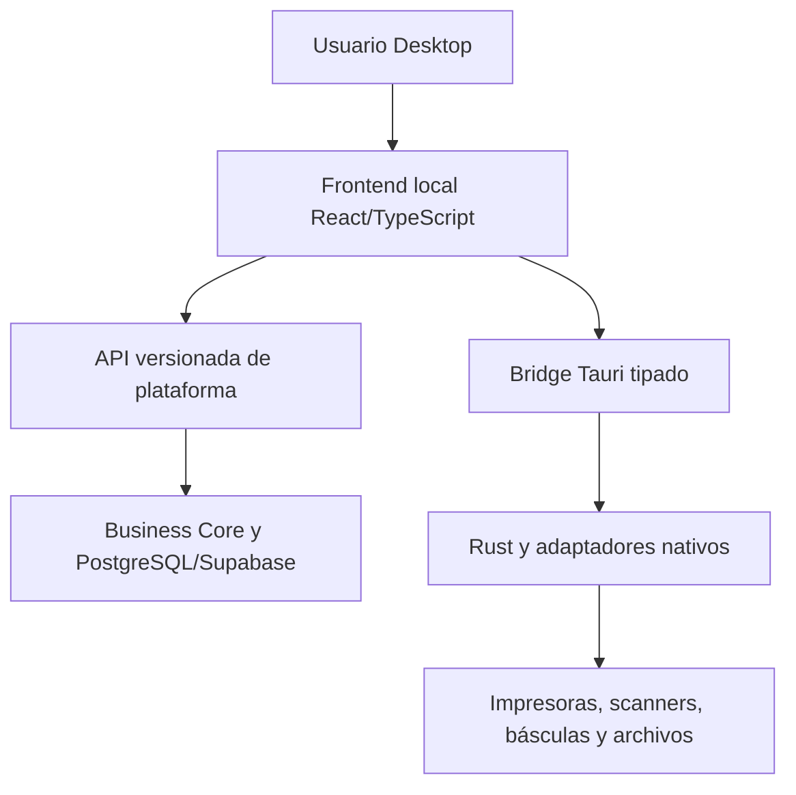

# ADR-0004: Adoptar Tauri 2 con frontend local y API versionada

> **Propuesta:** construir Desktop como cliente Tauri 2 con assets locales, bridge Rust mínimo y capacidades nativas explícitas, manteniendo la autoridad de negocio en la plataforma.

## Metadata

| Campo | Valor |
|---|---|
| Estado | Propuesto |
| Fecha | 2026-07-12 |
| Decisores | Product Owner, responsable de arquitectura, responsable de seguridad y responsable de Desktop |
| Consultados | Operación, frontend, integraciones, datos, calidad y soporte |
| Informados | Responsables de módulos, Mobile, despliegue y usuarios piloto |
| Propietario | Responsable de Desktop con corresponsabilidad de arquitectura |
| Alcance | Tauri, WebView, frontend, Rust, bridge, API, Auth, hardware, archivos, distribución, actualización y piloto |
| Reemplaza | No aplica |
| Reemplazado por | No aplica |
| RFC relacionado | No aplica; requiere spike técnico y piloto antes de aceptación |
| Issues relacionados | Pendiente: spike Tauri, auth PKCE, hardware, firma, updater y plataforma piloto |

---

## 1. Resumen ejecutivo

CRUMAFOOD necesita una experiencia Desktop para operación administrativa intensiva, integración con hardware y distribución controlada.

El repositorio actual no contiene Tauri, Rust, instaladores ni updater.

La decisión propuesta es:

> **CRUMAFOOD adopta Tauri 2 para Desktop, empaqueta el frontend localmente, consume una API de plataforma versionada y limita Rust a integración nativa mediante commands tipados y capabilities mínimas.**

Desktop no duplica el Business Core, no contiene secretos de servidor y no obtiene privilegios por estar instalado.

---

## 2. Contexto

La estrategia Platform-first define:

- Desktop como experiencia principal de gestión;
- Mobile para operación táctil;
- Web para portales;
- API como contrato;
- y Business Core compartido.

Desktop necesita:

- impresión;
- etiquetas;
- scanners;
- básculas;
- archivos;
- atajos;
- actualización;
- y diagnóstico.

---

## 3. Problema

La plataforma debe decidir:

- runtime Desktop;
- origen de la UI;
- frontera nativa;
- relación con API;
- autenticación;
- distribución;
- y soporte.

Sin esta decisión, una implementación puede:

- incrustar una web remota con privilegios nativos;
- duplicar reglas;
- acoplar release Web/Desktop;
- exponer comandos amplios;
- o almacenar secretos de forma insegura.

---

## 4. Alcance

Esta decisión cubre:

- Tauri 2;
- assets locales;
- WebView;
- frontend React/TypeScript;
- build frontend;
- bridge Rust;
- commands;
- capabilities;
- API;
- auth;
- sesiones;
- hardware;
- archivos;
- almacenamiento seguro;
- firma;
- updater;
- plataformas;
- y piloto.

No decide:

- estrategia offline de negocio;
- base de datos local;
- protocolo definitivo de cada dispositivo;
- primer sistema operativo;
- ni herramienta final de monorepo.

---

## 5. Fuerzas de decisión

| Fuerza | Importancia | Implicación |
|---|---|---|
| Seguridad | Crítica | La WebView no tendrá acceso nativo general |
| Reutilización | Alta | React, TypeScript, tokens y contratos deben aprovecharse |
| Peso y recursos | Alta | El cliente debe ser razonable para equipos operativos |
| Hardware | Crítica | Impresión, scanner y báscula requieren adaptadores |
| Actualización | Crítica | Builds y updates deben estar firmados |
| Independencia de release | Alta | Desktop y API evolucionan a ritmos distintos |
| Portabilidad | Alta | Windows/macOS/Linux son objetivos posibles |
| Operación | Alta | Instalación, diagnóstico y rollback deben ser soportables |
| Offline | Media actual | Se decidirá por capacidad, no por topología implícita |
| Skills | Alta | TypeScript existente y Rust nuevo requieren transición |

---

## 6. Restricciones

La decisión deberá respetar:

- Business Core como autoridad;
- API versionada;
- Supabase Auth;
- ADR-0001 y ADR-0003 para tenant y autorización;
- secretos fuera del binario;
- capabilities mínimas;
- actualización firmada;
- compatibilidad con versiones anteriores;
- y hardware detrás de puertos.

No se asumirá conexión permanente para diagnóstico, pero offline transaccional requerirá ADR separado.

---

## 7. Supuestos

Esta propuesta asume que:

- Tauri 2 satisface los requisitos de WebView y distribución tras el spike;
- el frontend puede empaquetarse como assets locales;
- la API podrá exponer contratos Desktop;
- el hardware prioritario tiene protocolos accesibles;
- y existe capacidad para mantener Rust.

Los supuestos deberán verificarse antes de Aceptado.

---

## 8. Criterios de decisión

| Criterio | Prioridad | Evaluación |
|---|---|---|
| Superficie de ataque | Crítica | Threat model y capabilities |
| Hardware | Crítica | Piloto con dispositivos reales |
| Peso y memoria | Alta | Benchmark comparativo |
| Reutilización | Alta | UI, contratos y Design System |
| Distribución | Alta | Instalador, firma y updater |
| Compatibilidad | Alta | API y clientes antiguos |
| Multiplataforma | Alta | Matriz de build y ejecución |
| Operabilidad | Alta | Logs, diagnóstico y recuperación |
| Mantenibilidad | Alta | Frontera TS/Rust |

---

## 9. Opciones consideradas

| Opción | Resumen | Resultado propuesto |
|---|---|---|
| A | Tauri 2, frontend local y API remota | Elegida |
| B | Tauri con aplicación Web remota embebida | Rechazada |
| C | Electron con frontend local | No elegida |
| D | Aplicaciones nativas separadas | No elegida |
| E | PWA/Web sin cliente Desktop | Insuficiente |

---

## 10. Opción A — Tauri 2 con frontend local

### Descripción

Tauri empaqueta assets frontend.

La UI consume API HTTPS y commands Rust pequeños para capacidades nativas.

### Ventajas

- superficie nativa controlable;
- menor runtime comparado con Chromium empaquetado;
- reutilización de React/TypeScript;
- assets disponibles al iniciar;
- release Desktop explícita;
- y bridge tipado.

### Desventajas

- WebViews varían por sistema;
- Rust añade skills;
- la distribución multiplataforma requiere CI;
- y no todo código Next.js puede empaquetarse directamente.

### Resultado

Se elige sujeto a spike y piloto.

---

## 11. Opción B — UI remota embebida

### Descripción

Tauri abre la aplicación Web alojada y le concede commands nativos.

### Ventajas

- una sola UI desplegada;
- cambios inmediatos;
- y menor empaquetado inicial.

### Desventajas

- un origen remoto obtiene cercanía a capacidades nativas;
- Web y Desktop quedan acoplados;
- un despliegue Web puede romper clientes instalados;
- inicio depende de red;
- CSP y navegación son más complejos;
- y el blast radius aumenta.

### Resultado

Se rechaza como topología principal.

---

## 12. Opción C — Electron

### Descripción

Electron empaqueta Chromium y Node con frontend local.

### Ventajas

- ecosistema maduro;
- runtime consistente;
- tooling conocido;
- e integración nativa amplia.

### Desventajas

- mayor tamaño y memoria;
- superficie Node/Chromium;
- actualización y hardening;
- y duplicación de runtime.

### Resultado

No se elige inicialmente. Será fallback si el spike Tauri falla criterios críticos.

---

## 13. Opción D — Nativo por plataforma

### Descripción

Se desarrollan clientes Windows, macOS y Linux por separado.

### Ventajas

- integración máxima;
- UX nativa;
- y control de plataforma.

### Desventajas

- tres stacks;
- alta inversión;
- poca reutilización;
- y releases complejas.

### Resultado

No se elige.

---

## 14. Opción E — Solo PWA/Web

### Descripción

La operación usa navegador o PWA sin cliente nativo.

### Ventajas

- distribución simple;
- una aplicación;
- y menor mantenimiento.

### Desventajas

- hardware irregular;
- impresión limitada;
- archivos y drivers;
- actualización no controlada como binario;
- y soporte operativo insuficiente.

### Resultado

Se mantiene Web/PWA para sus casos, pero no cubre Desktop completo.

---

## 15. Decisión propuesta

Se propone:

> **Desktop se implementa con Tauri 2, frontend local, API remota versionada y bridge Rust mínimo. La UI no carga la aplicación Web productiva como origen principal ni ejecuta reglas autoritativas duplicadas.**

La decisión incluye:

- assets locales;
- composición Desktop dedicada;
- contratos compartidos;
- commands Rust tipados;
- capabilities por ventana;
- adaptadores de hardware;
- Auth con PKCE/deep link;
- almacenamiento seguro;
- builds y updates firmados;
- canales;
- observabilidad;
- y piloto.

---

## 16. Topología



La API gobierna negocio.

Rust gobierna capacidades locales.

---

## 17. Frontend local

El frontend:

- se compila a assets locales;
- tiene versión;
- conoce versión API compatible;
- funciona sin depender de servir HTML remoto;
- usa Design System;
- y separa código específico de Desktop.

La herramienta de build final se elegirá mediante spike.

---

## 18. Next.js y empaquetado

El frontend actual usa Next.js App Router, Server Components y Server Actions.

No todo ese runtime puede copiarse directamente a assets estáticos.

El spike evaluará:

- entrypoint Desktop dedicado;
- reutilización de componentes;
- contratos compartidos;
- build estático compatible;
- y separación de responsabilidades.

No se forzará static export de rutas incompatibles.

---

## 19. Estructura objetivo

La estructura lógica será:

```text
desktop/
├── frontend/
├── src-tauri/
│   ├── src/
│   ├── capabilities/
│   └── tauri.conf.json
└── tests/
```

La ubicación final dependerá de si el repositorio adopta monorepo.

No se reorganizará todo antes del spike.

---

## 20. Business Core

Desktop no implementará de nuevo:

- FEFO;
- inventario;
- costos;
- permisos;
- estados;
- pagos;
- ni trazabilidad.

Podrá compartir tipos, validaciones de borde y componentes, pero la operación autoritativa se ejecutará mediante plataforma.

---

## 21. API versionada

Desktop consumirá una API con:

- versión;
- autenticación;
- autorización;
- idempotencia;
- errores estables;
- paginación;
- compatibilidad;
- y correlación.

No accederá directamente a tablas como contrato.

---

## 22. Compatibilidad API

Cada release Desktop declarará:

- versión mínima;
- versión máxima o rango;
- capabilities requeridas;
- y política de deprecación.

La API deberá:

- mantener clientes soportados;
- responder incompatibilidad de forma controlada;
- y observar adopción de versiones.

---

## 23. Bridge

El bridge será una frontera de seguridad.

Cada command:

- tendrá nombre;
- input;
- output;
- errores;
- autorización local;
- capability;
- timeout;
- cancelación;
- y logging seguro.

No se expondrá shell general.

---

## 24. Rust

Rust se limitará a:

- OS;
- hardware;
- archivos;
- almacenamiento seguro;
- updater;
- ventanas;
- y diagnóstico nativo.

No contendrá una segunda implementación del Business Core.

El código tendrá `fmt`, `clippy`, pruebas y revisión.

---

## 25. Capabilities

Las capabilities serán:

- mínimas;
- por ventana;
- por command;
- por plugin;
- y revisadas.

Una ventana de login no necesitará hardware.

Una ventana de diagnóstico no tendrá permisos de negocio.

Default será deny.

---

## 26. Plugins

Cada plugin Tauri se evaluará por:

- necesidad;
- permisos;
- mantenimiento;
- plataforma;
- bundle;
- licencia;
- y salida.

No se instalará un plugin solo por conveniencia.

Los plugins no usados se retirarán.

---

## 27. Navegación y orígenes

La WebView cargará únicamente assets y orígenes aprobados.

La navegación externa:

- se abrirá en navegador;
- usará allowlist;
- validará esquema;
- y bloqueará orígenes inesperados.

Un link externo no heredará capabilities nativas.

---

## 28. Autenticación

Supabase Auth seguirá como proveedor de identidad.

Desktop usará:

- Authorization Code con PKCE;
- navegador del sistema;
- redirect/deep link registrado;
- state y nonce cuando corresponda;
- y callback validado.

No se capturarán credenciales en una WebView no revisada.

---

## 29. Deep links

El deep link:

- tendrá esquema o asociación aprobada;
- validará origen;
- procesará una sola vez;
- limitará parámetros;
- evitará replay;
- y no ejecutará commands arbitrarios.

Se probará instalación múltiple, aplicación cerrada y sesión expirada.

---

## 30. Sesión

Los tokens:

- no vivirán en localStorage ordinario;
- se almacenarán mediante mecanismo seguro;
- tendrán expiración;
- se renovarán;
- se revocarán;
- y se eliminarán en logout.

La sesión seguirá tenant, membresía y autorización de ADR-0001/0003.

---

## 31. Secretos

El binario no contendrá:

- service role;
- secretos de webhook;
- claves de firma privadas;
- credenciales de proveedor;
- ni connection strings privilegiadas.

Las claves públicas de cliente se tratarán según su diseño y límites.

---

## 32. Hardware Ports

La aplicación definirá puertos para:

- PrintLabel;
- PrintDocument;
- ScanBarcode;
- ReadScale;
- PickFile;
- SaveFile;
- y ListDevices.

Los adaptadores Rust implementarán protocolos concretos.

La UI no conocerá drivers.

---

## 33. Impresión

La impresión cubrirá:

- impresora;
- formato;
- copias;
- tamaño;
- calibración;
- estado;
- timeout;
- retry;
- y resultado.

Reimprimir una etiqueta sensible requerirá permiso y auditoría.

---

## 34. Scanner

Se soportará inicialmente:

- keyboard wedge;
- y captura manual.

Serial, USB o APIs específicas se añadirán por adaptador.

El scanner no autoriza el recurso leído.

---

## 35. Báscula

La báscula tendrá:

- protocolo;
- unidad;
- estabilidad;
- tara;
- rango;
- precisión;
- timeout;
- y estado.

Una lectura será input; el Business Core decidirá si es válida para la operación.

---

## 36. Archivos

Los commands de archivo:

- usarán dialogs;
- limitarán extensiones;
- validarán tamaño;
- evitarán traversal;
- manejarán sobrescritura;
- y no expondrán rutas innecesarias.

Los archivos sensibles tendrán expiración y limpieza.

---

## 37. Almacenamiento local

Se almacenará únicamente:

- preferencias;
- configuración no secreta;
- estado de dispositivo;
- logs acotados;
- y caché diseñada.

Datos transaccionales offline requieren ADR separado.

La elección de base local no queda autorizada aquí.

---

## 38. Offline

La topología local no implica offline de negocio.

Sin conexión, Desktop podrá:

- iniciar;
- mostrar diagnóstico;
- acceder a configuración segura;
- y comunicar indisponibilidad.

Operaciones offline, colas y conflictos se decidirán mediante ADR-0005 u otro ADR específico.

---

## 39. Firma de código

Los artefactos productivos estarán firmados según plataforma.

Se definirán:

- certificados;
- custodia;
- acceso;
- rotación;
- timestamp;
- recuperación;
- y revocación.

Las claves privadas no vivirán en el repositorio.

---

## 40. Updater

El updater:

- verificará firma;
- usará TLS;
- conocerá canal;
- descargará artefacto compatible;
- manejará interrupción;
- confirmará instalación;
- y permitirá recuperación.

No se instalará una actualización sin verificación criptográfica.

---

## 41. Canales

Se proponen:

- internal;
- beta;
- stable.

Cada canal tendrá:

- audiencia;
- promoción;
- telemetría;
- rollback;
- y soporte.

Una release no saltará de desarrollo a stable sin piloto.

---

## 42. Plataformas

Windows, macOS y Linux son objetivos posibles.

El orden se decidirá con:

- equipos reales;
- hardware;
- drivers;
- soporte;
- firma;
- distribución;
- y costo.

No se declara soporte simultáneo antes de validar la matriz.

---

## 43. Primer piloto

El piloto seleccionará una plataforma y una estación real.

Incluirá:

- instalación;
- login;
- API;
- impresión;
- scanner;
- báscula si aplica;
- archivos;
- actualización;
- diagnóstico;
- y soporte.

La plataforma se elegirá con inventario, no por preferencia técnica.

---

## 44. Distribución

La distribución será controlada:

- artefacto;
- checksum;
- firma;
- versión;
- canal;
- notas;
- y fuente autorizada.

No se compartirán instaladores por canales informales sin trazabilidad.

---

## 45. Observabilidad

Desktop emitirá de forma segura:

- versión;
- canal;
- plataforma;
- OS;
- instalación seudonimizada;
- inicio;
- error;
- API;
- command;
- hardware;
- updater;
- y sincronización futura.

No registrará tokens ni payloads sensibles.

---

## 46. Diagnóstico

La pantalla de diagnóstico mostrará:

- versión;
- API;
- conectividad;
- sesión segura;
- plugins;
- devices;
- última actualización;
- y logs redactados.

Un paquete de soporte requerirá consentimiento y tendrá limpieza.

---

## 47. Consecuencias positivas

- cliente ligero;
- capabilities controlables;
- UI local;
- reutilización frontend;
- integración de hardware;
- separación negocio/nativo;
- releases identificables;
- y ruta multiplataforma.

---

## 48. Consecuencias negativas

- nuevo stack Rust;
- build por plataforma;
- WebView variable;
- firma y certificados;
- updater;
- laboratorio de hardware;
- soporte de versiones;
- y necesidad de frontend Desktop componible.

---

## 49. Impacto arquitectónico

| Área | Impacto |
|---|---|
| Business Core | No se duplica; se consume por contratos |
| Integraciones | API Desktop versionada |
| Seguridad | Bridge, capabilities, PKCE y firma |
| Despliegue | Pipelines y artefactos por plataforma |
| Frontend | Entry point local y reutilización |
| Design System | Componentes y temas compartidos |
| Testing | Rust, instalador, hardware y updater |
| Observabilidad | Telemetría de instalación y device |
| Operación | Canales, soporte y laboratorio |

---

## 50. Seguridad

El threat model cubrirá:

- WebView comprometida;
- XSS;
- command injection;
- plugin vulnerable;
- navegación externa;
- deep link;
- token;
- archivo malicioso;
- updater;
- supply chain;
- dispositivo hostil;
- y acceso físico.

Desktop no será confiable solo por estar instalado.

---

## 51. Testing

Se requieren:

- unitarias TypeScript;
- unitarias Rust;
- commands;
- serialization;
- capabilities;
- auth;
- deep links;
- secure storage;
- API;
- hardware fakes;
- dispositivos reales;
- archivos;
- instalador;
- updater;
- firma;
- recuperación;
- y accesibilidad.

---

## 52. CI

El pipeline Desktop ejecutará:

1. instalación determinista;
2. typecheck;
3. lint;
4. frontend tests;
5. build frontend;
6. `cargo fmt --check`;
7. `cargo clippy`;
8. `cargo test`;
9. build Tauri;
10. firma en contexto protegido;
11. verificación de artefacto;
12. y publicación por canal.

---

## 53. Matriz de hardware

La evidencia registrará:

| Campo | Ejemplo de contenido |
|---|---|
| Plataforma | Windows/macOS/Linux |
| Versión | OS y arquitectura |
| Dispositivo | Modelo |
| Firmware | Versión |
| Driver | Versión |
| Conexión | USB/Serial/Red/Bluetooth |
| Protocolo | Identificador |
| Resultado | Compatible/Limitado/No compatible |

---

## 54. Rendimiento

Se medirán:

- tamaño de instalador;
- arranque;
- memoria;
- CPU;
- navegación;
- API;
- command;
- impresión;
- y updater.

La comparación con Electron se realizará en el spike si Tauri no cumple objetivos.

---

## 55. Migración e implementación

La secuencia propuesta es:

1. estabilizar contratos;
2. spike Tauri;
3. entrypoint frontend local;
4. bridge mínimo;
5. Auth;
6. printer/scanner;
7. firma;
8. updater;
9. diagnóstico;
10. piloto;
11. beta;
12. stable.

No se migrará toda la UI antes de demostrar el vertical slice.

---

## 56. Vertical slice

El primer slice será una tarea real con:

- login;
- consulta API;
- permiso;
- lectura o captura;
- hardware;
- resultado;
- auditoría;
- y diagnóstico.

La tarea exacta se elegirá por valor y disponibilidad de hardware.

---

## 57. Rollback

El rollback Desktop podrá:

- detener promoción;
- retirar canal;
- ofrecer versión anterior compatible;
- desactivar feature;
- o corregir forward.

La API conservará compatibilidad durante la ventana.

Un updater defectuoso tendrá canal de recuperación documentado.

---

## 58. Validación previa a Aceptado

Este ADR podrá pasar a Aceptado cuando:

- el spike compile y ejecute Tauri 2;
- assets locales funcionen;
- API versionada responda;
- PKCE/deep link sea seguro;
- secure storage pase revisión;
- capabilities bloqueen commands no permitidos;
- un dispositivo real funcione;
- instalador y updater estén firmados;
- se mida tamaño y recursos;
- y Seguridad, Desktop, Operación y Arquitectura aprueben.

---

## 59. Riesgos y controles

| Riesgo | Condición | Impacto | Control | Propietario | Señal |
|---|---|---|---|---|---|
| WebView a native | XSS invoca command | Crítico | Capabilities y validación | Seguridad | Command denegado |
| Update malicioso | Firma inválida | Crítico | Verificación criptográfica | Operación | Update rechazado |
| Token expuesto | Storage débil | Crítico | Secure storage | Seguridad | Hallazgo |
| Driver incompatible | Hardware real | Alto | Matriz y fallback | Desktop | Error device |
| API incompatible | Cliente antiguo | Alto | Versionado | Integraciones | Error de versión |
| WebView divergente | OS distinto | Medio/Alto | Matriz | Desktop | E2E por plataforma |
| Rust duplicado | Regla nativa | Alto | Límites y revisión | Arquitectura | Dependencia de dominio |
| Certificado perdido | Custodia deficiente | Crítico | Gestión y recuperación | Operación | Alerta de expiración |

---

## 60. Preguntas abiertas

Antes de Aceptado se resolverá:

- ¿qué plataforma inicia el piloto?;
- ¿qué tarea es el vertical slice?;
- ¿qué hardware es prioritario?;
- ¿qué herramienta construye el frontend local?;
- ¿qué estructura de repositorio se usará?;
- ¿qué mecanismo de secure storage cumple por plataforma?;
- ¿qué proveedor/canal aloja updates?;
- ¿qué certificados se requieren?;
- y ¿qué versiones API soportará cada release?

---

## 61. Triggers de revisión

Este ADR se revisará cuando:

- Tauri no cumpla hardware o seguridad;
- WebView produzca incompatibilidad material;
- Electron reduzca riesgo total;
- se requiera offline transaccional;
- cambie la topología API;
- se adopte monorepo;
- o una plataforma deje de ser soportable.

Fecha de revisión sugerida: al cerrar el spike y después del piloto.

---

## 62. Registro de aprobación

| Rol | Decisión | Fecha | Evidencia |
|---|---|---|---|
| Product Owner | Pendiente | — | — |
| Responsable de arquitectura | Pendiente | — | — |
| Responsable de seguridad | Pendiente | — | — |
| Responsable de Desktop | Pendiente | — | — |
| Responsable de operación | Pendiente | — | — |

El estado permanecerá Propuesto hasta cumplir gates y aprobaciones.

---

## 63. Historial

| Fecha | Cambio | Autor o rol |
|---|---|---|
| 2026-07-12 | Propuesta inicial | Responsable de arquitectura |

Después de Aceptado, un cambio de topología requerirá un ADR nuevo.

---

## 64. Referencias

- [Registro ADR](README.md)
- [Plantilla ADR](0000-template.md)
- [Arquitectura Desktop](../desktop-architecture.md)
- [Arquitectura general](../system-overview.md)
- [Business Core](../business-core.md)
- [Arquitectura de integración](../integration-architecture.md)
- [Arquitectura de seguridad](../security-architecture.md)
- [Arquitectura de despliegue](../deployment-architecture.md)
- [Estrategia de pruebas](../testing-strategy.md)

---

## 65. Resultado de la propuesta

Si se acepta, CRUMAFOOD tendrá una topología Desktop clara que permite integrar hardware sin convertir la aplicación instalada en una segunda plataforma de negocio.

Si se rechaza, deberá elegirse una alternativa que cumpla los mismos criterios de seguridad, distribución, hardware, compatibilidad y operación.

---

## 66. Declaración final

> **Desktop será una extensión segura de CRUMAFOOD Platform: la UI local servirá a la operación, Rust abrirá solo las capacidades nativas necesarias y la plataforma conservará la autoridad del negocio.**
