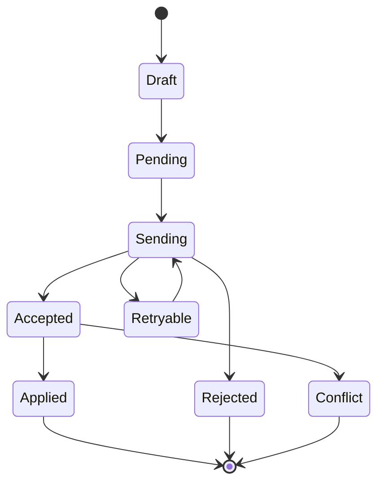

# ADR-0005: Adoptar sincronización offline por comandos y proyecciones

> **Propuesta:** mantener CRUMAFOOD online-first y habilitar offline solo por capacidad mediante proyecciones locales mínimas, comandos durables e idempotentes y sincronización explícita con la API.

## Metadata

| Campo | Valor |
|---|---|
| Estado | Propuesto |
| Fecha | 2026-07-12 |
| Decisores | Product Owner, responsable de arquitectura, responsable de seguridad y responsables de Mobile y Desktop |
| Consultados | Business Core, datos, integración, operación, calidad y usuarios piloto |
| Informados | Responsables de módulos, soporte y responsables de despliegue |
| Propietario | Arquitectura de clientes con corresponsabilidad de Integración |
| Alcance | Mobile, Desktop, almacenamiento local, comandos, API de sync, conflictos, autorización, seguridad, observabilidad y piloto |
| Reemplaza | No aplica |
| Reemplazado por | No aplica |
| RFC relacionado | No aplica; cada capacidad offline requiere diseño y piloto |
| Issues relacionados | Pendiente: sync protocol, command store, change feed, storage spikes y piloto |

---

## 1. Resumen ejecutivo

Mobile y Desktop deben tolerar conectividad débil, pero CRUMAFOOD no puede convertir cada dispositivo en una base de datos autoritativa.

La decisión propuesta es:

> **CRUMAFOOD permanece online-first. Las capacidades offline aprobadas almacenan proyecciones mínimas y una cola durable de comandos; sincronizan mediante API push/pull; y el servidor reautoriza, valida e integra cada comando contra PostgreSQL.**

No se replicarán tablas arbitrariamente ni se aplicará last-write-wins a inventario, dinero o documentos críticos.

---

## 2. Contexto

Mobile opera en:

- almacenes;
- recepción;
- producción;
- picking;
- scanners;
- y redes intermitentes.

Desktop puede requerir continuidad limitada y hardware local.

ADR-0004 deja offline transaccional fuera de la topología Tauri.

Este ADR define la estrategia común.

---

## 3. Problema

Sin estrategia explícita, los clientes pueden:

- cachear tablas completas;
- editar réplicas;
- perder comandos;
- duplicar movimientos;
- aceptar permisos revocados;
- mezclar tenants;
- resolver conflictos silenciosamente;
- o conservar datos sensibles indefinidamente.

La conectividad intermitente debe tolerarse sin comprometer integridad.

---

## 4. Alcance

Esta decisión cubre:

- online-first;
- catálogo de capacidades offline;
- proyecciones locales;
- command queue;
- idempotencia;
- push;
- pull;
- cursors;
- conflictos;
- reautorización;
- tenant y device;
- seguridad local;
- borrado;
- almacenamiento candidato;
- observabilidad;
- pruebas;
- y piloto.

No define qué flujos concretos se habilitan para todos los clientes.

---

## 5. Fuerzas de decisión

| Fuerza | Importancia | Implicación |
|---|---|---|
| Integridad | Crítica | El servidor decide efectos transaccionales |
| Continuidad operativa | Alta | Tareas acotadas deben sobrevivir cortes |
| Idempotencia | Crítica | Retry no duplica efectos |
| Autorización | Crítica | Cada comando se reautoriza |
| Multi-tenancy | Crítica | Datos y comandos nunca mezclan tenant |
| Experiencia | Alta | Estado de sync y conflicto debe ser visible |
| Seguridad local | Alta | Datos mínimos, cifrado y borrado |
| Batería y red | Alta | Sync incremental y acotado |
| Portabilidad | Alta | Protocolo común, storage por cliente |
| Operación | Alta | Diagnóstico y recuperación verificables |

---

## 6. Restricciones

La decisión deberá respetar:

- PostgreSQL como autoridad;
- Business Core en servidor;
- ADR-0001 tenant;
- ADR-0003 autorización;
- API versionada;
- idempotencia;
- auditoría;
- y datos locales mínimos.

No se confiará en `navigator.onLine` como prueba suficiente de conectividad.

---

## 7. Supuestos

Esta propuesta asume que:

- algunos flujos pueden modelarse como comandos discretos;
- el servidor puede conservar resultados de idempotencia;
- los clientes pueden persistir una cola local;
- la API puede ofrecer proyecciones y cambios;
- y los usuarios aceptan resolver ciertos conflictos.

Cada flujo deberá verificar estos supuestos antes de habilitarse offline.

---

## 8. Criterios de decisión

| Criterio | Prioridad | Evaluación |
|---|---|---|
| Integridad transaccional | Crítica | Resultado servidor |
| Recuperación de retry | Crítica | Idempotencia y replay |
| Seguridad | Crítica | Cifrado, scope y borrado |
| Conflictos | Crítica | Política por comando |
| UX | Alta | Estado accionable |
| Red y batería | Alta | Volumen y frecuencia |
| Portabilidad | Alta | API común |
| Operación | Alta | Métricas y diagnóstico |
| Complejidad | Alta | Capacidad incremental |

---

## 9. Opciones consideradas

| Opción | Resumen | Resultado propuesto |
|---|---|---|
| A | Comandos + proyecciones + sync API | Elegida |
| B | Replicación bidireccional de tablas | Rechazada |
| C | Caché de páginas y retry de requests | Insuficiente |
| D | Solo online | Base predeterminada, pero insuficiente para capacidades piloto |
| E | Base completa local autoritativa | Rechazada |

---

## 10. Opción A — Comandos y proyecciones

### Descripción

El cliente guarda:

- proyecciones mínimas para la tarea;
- comandos pendientes;
- resultados;
- cursor;
- y metadata de sync.

El servidor procesa comandos mediante Business Core y publica cambios de proyección.

### Ventajas

- autoridad clara;
- payload controlado;
- idempotencia;
- conflictos explícitos;
- storage intercambiable;
- y auditoría.

### Desventajas

- protocolo específico;
- trabajo por capacidad;
- change feed;
- migraciones locales;
- y UX de conflicto.

### Resultado

Se elige.

---

## 11. Opción B — Replicación de tablas

### Descripción

Cliente y servidor sincronizan filas y columnas directamente.

### Ventajas

- apariencia genérica;
- queries locales flexibles.

### Desventajas

- expone modelo interno;
- mezcla reglas con merge;
- conflictos complejos;
- RLS difícil;
- y alto acoplamiento a schema.

### Resultado

Se rechaza.

---

## 12. Opción C — Caché y retry HTTP

### Descripción

La PWA cachea páginas y reintenta requests fallidas.

### Ventajas

- bajo costo inicial;
- útil para assets y lectura simple.

### Desventajas

- no garantiza durabilidad;
- no modela comandos;
- no resuelve duplicados;
- no explica conflictos;
- y puede repetir mutaciones.

### Resultado

Se conserva para assets y lecturas, no como sync de negocio.

---

## 13. Opción D — Solo online

### Descripción

Toda operación exige servidor disponible.

### Ventajas

- máxima simplicidad;
- autoridad inmediata.

### Desventajas

- interrupción en redes reales;
- pérdida de productividad;
- y captura manual posterior.

### Resultado

Sigue siendo default de capacidades no aprobadas. No cubre el piloto offline.

---

## 14. Opción E — Base local autoritativa

### Descripción

Cada instalación ejecuta lógica y persistencia completa, luego consolida.

### Ventajas

- independencia prolongada.

### Desventajas

- Business Core duplicado;
- autoridad dividida;
- conflictos graves;
- migraciones por dispositivo;
- y soporte complejo.

### Resultado

Se rechaza.

---

## 15. Decisión propuesta

Se propone:

> **Offline se habilita por capacidad mediante proyecciones locales mínimas y comandos durables. El servidor conserva autoridad, reautoriza y procesa; el cliente sincroniza por API versionada usando idempotencia, cursors y resultados explícitos.**

La decisión incluye:

- capability registry;
- command envelope;
- cola local;
- idempotency key;
- push batch;
- pull incremental;
- cursor opaco;
- políticas de conflicto;
- reautorización;
- cifrado según riesgo;
- borrado;
- y piloto.

---

## 16. Online-first

Online-first significa:

- el flujo preferido usa servidor;
- la confirmación autoritativa llega del servidor;
- la UI distingue queued de completed;
- y offline es una degradación diseñada.

No significa asumir conectividad perfecta.

---

## 17. Offline por capacidad

Cada capacidad se clasificará:

| Clase | Comportamiento |
|---|---|
| Online-only | No permite iniciar sin servidor |
| Read offline | Permite consultar proyección local |
| Draft offline | Guarda borrador sin efecto de negocio |
| Command offline | Encola comando reautorizable |
| Restricted offline | Requiere condiciones, plazo o dispositivo |

La clasificación será parte del contrato del caso de uso.

---

## 18. Criterios para habilitar una capacidad

Una capacidad podrá operar offline cuando:

- tiene comando discreto;
- efecto idempotente;
- dataset acotado;
- política de conflicto;
- autorización revalidable;
- UX clara;
- datos protegibles;
- y piloto.

Si falta uno, permanecerá online-only.

---

## 19. Autoridad

PostgreSQL conserva:

- hechos;
- inventario;
- dinero;
- estados;
- auditoría;
- permisos;
- y resultado de comandos.

El cliente conserva copias derivadas.

Un estado local no confirmado no se mostrará como hecho definitivo.

---

## 20. Proyecciones locales

Una proyección incluirá solo datos necesarios para:

- identificar tarea;
- mostrar contexto;
- validar formato básico;
- capturar input;
- y explicar resultado.

No copiará columnas por conveniencia.

Cada proyección tendrá versión y TTL.

---

## 21. No replicación directa

El cliente no:

- hace sync genérico de tablas;
- aplica SQL al servidor;
- envía filas arbitrarias;
- ni decide merges por columna.

El contrato será un comando de negocio o una consulta de proyección.

Esto desacopla schema y cliente.

---

## 22. Command envelope

```text
OfflineCommand
  commandId
  idempotencyKey
  commandType
  schemaVersion
  tenantId
  actorId
  deviceId
  requestedScope
  capturedAt
  baseVersion
  payload
```

El payload será tipado y mínimo.

---

## 23. Identificadores

`commandId` identifica la instancia local.

`idempotencyKey` identifica el efecto lógico.

Ambos serán:

- únicos;
- opacos;
- persistentes;
- y estables entre retries.

No se regenerará la idempotency key en cada intento.

---

## 24. Estados del comando



Cada transición se persistirá atómicamente en el cliente.

---

## 25. Cola local

La cola será:

- durable;
- ordered cuando importe;
- bounded;
- tenant-scoped;
- device-scoped;
- observable;
- y migrable.

No se almacenará solo en memoria.

Una cola llena bloqueará nuevas capturas con mensaje accionable.

---

## 26. Orden

El orden se definirá por stream lógico:

- documento;
- orden;
- lote;
- tarea;
- o recurso.

Comandos independientes podrán sincronizarse en paralelo con límite.

No se impondrá un orden global innecesario.

---

## 27. Push

El cliente enviará batches acotados.

La API devolverá resultado por comando:

- accepted;
- applied;
- duplicate;
- rejected;
- conflict;
- retryable;
- y incompatible.

Una respuesta parcial no perderá comandos no confirmados.

---

## 28. Procesamiento servidor

El servidor:

1. autentica;
2. resuelve tenant;
3. verifica device;
4. valida versión;
5. reautoriza;
6. valida schema;
7. consulta idempotencia;
8. ejecuta caso de uso;
9. persiste resultado;
10. audita;
11. y responde.

---

## 29. Idempotencia servidor

El servidor conservará:

- tenant;
- idempotency key;
- command type;
- fingerprint;
- actor;
- device;
- resultado;
- fecha;
- y expiración según política.

Misma key con payload distinto se rechazará.

---

## 30. Pull

El cliente solicitará cambios mediante cursor opaco.

La respuesta incluirá:

- siguiente cursor;
- upserts;
- tombstones;
- versión;
- server time;
- y límites.

El cursor no será un timestamp proporcionado por cliente.

---

## 31. Change feed

El servidor producirá cambios desde:

- outbox;
- change log;
- o proyección versionada

según el módulo.

No dependerá de recorrer tablas completas en cada sync.

La estrategia concreta se coordinará con el ADR de eventos.

---

## 32. Bootstrap

El bootstrap:

- autentica;
- autoriza;
- identifica tenant y scope;
- descarga snapshot acotado;
- establece cursor;
- y registra versión.

Será resumible cuando el volumen lo requiera.

No descargará datos de scopes no autorizados.

---

## 33. Conflictos

Un conflicto ocurre cuando:

- cambió la versión base;
- cambió el estado;
- el recurso se cerró;
- cambió inventario;
- cambió permiso;
- o el comando ya no es válido.

El servidor clasificará el conflicto.

El cliente no lo ocultará.

---

## 34. Política por dominio

Cada command type definirá:

- precondiciones;
- versión base;
- merge permitido;
- rechazo;
- compensación;
- y UX.

No existirá una política universal para todos los datos.

---

## 35. Prohibición de last-write-wins

No se usará last-write-wins para:

- inventario;
- reservas;
- lotes;
- dinero;
- pagos;
- estados;
- aprobaciones;
- ni trazabilidad.

Estas operaciones se aceptan, rechazan o reconcilian mediante reglas del Business Core.

---

## 36. Resoluciones permitidas

Una capacidad podrá usar:

- rebase y reintento;
- merge de campos no críticos;
- corrección manual;
- comando compensatorio;
- cancelación;
- o rechazo definitivo.

La política será explícita y probada.

---

## 37. Reautorización

Todo comando se autoriza al sincronizar según:

- sesión;
- membresía;
- permiso;
- scope;
- tenant;
- estado del recurso;
- y política vigente.

El permiso existente al capturar no garantiza ejecución posterior.

---

## 38. Sesión offline

Sin red:

- no se inicia una identidad nueva contra el servidor;
- se puede usar una sesión local vigente según política;
- se limita el tiempo;
- se muestra estado;
- y se bloquean capacidades sensibles.

La política exacta de duración requerirá threat model.

---

## 39. Tenant y cambio de contexto

Todos los datos y comandos incluyen tenant.

Al cambiar tenant:

- se pausa sync;
- se verifican pendientes;
- se resuelven o conservan aislados;
- se limpia UI;
- y se abre storage separado.

No se mezclan colas.

---

## 40. Device

`deviceId`:

- identifica instalación;
- no es secreto;
- no prueba identidad;
- y se vincula a sesión.

El servidor podrá suspender un device.

Los comandos conservarán device para auditoría y soporte.

---

## 41. Almacenamiento Mobile/PWA

IndexedDB es candidato para:

- proyecciones;
- cola;
- metadata;
- y cursor.

Su adopción requiere spike de:

- cuotas;
- atomicidad;
- migraciones;
- compatibilidad;
- borrado;
- y protección.

Cache Storage se reservará principalmente para assets y responses aprobadas.

---

## 42. Almacenamiento Desktop

SQLite o un plugin equivalente es candidato para Desktop.

El spike evaluará:

- cifrado;
- key management;
- migraciones;
- locks;
- backup local;
- corrupción;
- tamaño;
- y soporte multiplataforma.

No se autoriza todavía un motor específico.

---

## 43. Cifrado

Los datos sensibles locales requerirán:

- clasificación;
- cifrado en reposo;
- clave protegida;
- rotación;
- bloqueo por sesión;
- y borrado.

En Web/PWA se reconocerán los límites frente a un origen comprometido.

Si no puede protegerse proporcionalmente, el dato no se almacena offline.

---

## 44. Datos prohibidos

No se almacenarán offline por defecto:

- service role;
- secretos;
- credenciales de terceros;
- datos de pago completos;
- documentos no necesarios;
- exports;
- logs sensibles;
- ni datasets completos.

Cada excepción requiere revisión de seguridad.

---

## 45. Borrado

Se borrarán datos locales ante:

- logout;
- revocación;
- cambio de tenant cuando la política lo exija;
- expiración;
- pérdida reportada;
- desinstalación cuando sea viable;
- y solicitud administrativa.

El borrado remoto no se considera garantizado mientras el device está desconectado.

---

## 46. Migraciones locales

Cada store tendrá:

- schema version;
- migraciones forward;
- validación;
- rollback seguro o recuperación;
- y backup temporal cuando aplique.

Una actualización no descartará comandos pendientes.

Si la versión es incompatible, se detendrá sync y se guiará recuperación.

---

## 47. Compatibilidad de protocolo

El protocolo declarará:

- API version;
- command schema version;
- projection version;
- mínimo cliente;
- y capabilities.

El servidor rechazará versiones incompatibles con mensaje estable.

Las deprecaciones observarán adopción.

---

## 48. Background sync

No se asumirá que el navegador ejecutará sync confiable en background.

La aplicación sincronizará:

- al abrir;
- al recuperar foco;
- al detectar conectividad útil;
- por acción del usuario;
- y en background solo cuando la plataforma lo garantice.

Desktop podrá usar un servicio acotado sin convertirse en daemon ilimitado.

---

## 49. Batería y red

Se aplicarán:

- batches;
- compresión;
- backoff;
- jitter;
- delta;
- límites;
- pausa en background;
- y preferencia de red cuando corresponda.

El polling agresivo está prohibido.

---

## 50. UX de sincronización

La UI mostrará:

- online/offline;
- pendiente;
- enviando;
- completado;
- retry;
- rechazado;
- conflicto;
- y última sincronización.

Un usuario podrá ver qué trabajo aún no está confirmado.

No se mostrará “Guardado” si solo está en cola sin aclaración.

---

## 51. Recuperación

La recuperación cubrirá:

- app cerrada;
- crash;
- batería agotada;
- red interrumpida;
- storage lleno;
- migración fallida;
- sesión expirada;
- y comando corrupto.

Nunca se borrará la cola para “arreglar” un error sin exportación o decisión explícita.

---

## 52. Auditoría

El servidor registrará:

- actor;
- tenant;
- device;
- command;
- idempotency key;
- capturedAt;
- receivedAt;
- permiso;
- resultado;
- conflicto;
- y correlación.

El log local no sustituye auditoría.

---

## 53. Observabilidad

Se medirán:

- devices activos;
- comandos pendientes;
- edad de cola;
- batch;
- retries;
- duplicados;
- conflictos;
- rechazos;
- incompatibilidad;
- sync latency;
- payload;
- y storage.

Las métricas evitarán IDs de alta cardinalidad.

---

## 54. Consecuencias positivas

- continuidad acotada;
- autoridad clara;
- idempotencia;
- protocolo compartido;
- conflictos visibles;
- storage intercambiable;
- soporte Mobile/Desktop;
- y crecimiento gradual.

---

## 55. Consecuencias negativas

- API de sync;
- change feed;
- storage por cliente;
- migraciones locales;
- UX compleja;
- observabilidad;
- mayor testing;
- y soporte de versiones.

---

## 56. Impacto arquitectónico

| Área | Impacto |
|---|---|
| Business Core | Commands y políticas de conflicto |
| Datos | Idempotencia, change feed y proyecciones |
| Seguridad | Storage, reautorización y revocación |
| Integraciones | API push/pull y envelopes |
| Mobile | IndexedDB candidato y UX de sync |
| Desktop | SQLite candidato y proceso local |
| Observabilidad | Métricas de cola y conflictos |
| Testing | Red, replay, storage y pilotos |
| Multi-tenancy | Colas y proyecciones separadas |

---

## 57. Testing

Se probarán:

- offline al iniciar;
- caída durante captura;
- caída durante push;
- duplicate;
- payload distinto con misma key;
- orden;
- retry;
- conflicto;
- permiso revocado;
- tenant cambiado;
- device suspendido;
- storage lleno;
- migración local;
- versión incompatible;
- y recuperación.

---

## 58. Piloto

El primer piloto:

- cubrirá un flujo reversible o controlado;
- tendrá un tenant;
- un scope;
- dispositivos representativos;
- red degradada;
- soporte presente;
- y criterio de abortar.

No comenzará con pagos, valuación o ajustes irreversibles.

---

## 59. Validación previa a Aceptado

Este ADR podrá pasar a Aceptado cuando:

- exista command envelope probado;
- el servidor aplique idempotencia;
- push/pull recupere una interrupción;
- un permiso revocado sea denegado;
- un conflicto crítico no use last-write-wins;
- storage sobreviva restart;
- logout borre datos según política;
- tenant A/B permanezcan aislados;
- se mida batería, red y cola;
- y Producto, Seguridad, Mobile/Desktop y Arquitectura aprueben.

---

## 60. Riesgos y controles

| Riesgo | Condición | Impacto | Control | Propietario | Señal |
|---|---|---|---|---|---|
| Duplicado | Retry | Crítico | Idempotencia | Integración | Duplicate rate |
| Dato obsoleto | Proyección vieja | Alto | TTL y version | Cliente | Freshness |
| Permiso revocado | Device offline | Alto | Reautorización | Seguridad | Reject reason |
| Mezcla tenant | Storage compartido | Crítico | Partición y tests | Cliente | A/B failure |
| Pérdida de cola | Crash/migración | Crítico | Durabilidad | Cliente | Recovery test |
| LWW crítico | Merge genérico | Crítico | Policy por command | Business Core | Conflict |
| Storage expuesto | Device comprometido | Alto | Minimización/cifrado | Seguridad | Hallazgo |
| Retry storm | Red vuelve | Alto | Backoff/jitter | Cliente | Request rate |

---

## 61. Plan de implementación

| Entrega | Alcance | Propietario | Evidencia |
|---|---|---|---|
| Catálogo | Clasificar capacidades | Producto/Arquitectura | Matriz |
| Contrato | Command envelope y resultados | Integración | Contract tests |
| Servidor | Idempotencia y processor | Business Core | Replay tests |
| Pull | Proyección y cursor | Datos/Integración | Delta tests |
| Mobile storage | Spike IndexedDB | Mobile | Recovery |
| Desktop storage | Spike SQLite | Desktop | Recovery |
| UX | Estado y conflictos | Diseño/Clientes | Usabilidad |
| Piloto | Flujo controlado | Operación | Evidencia |

---

## 62. Preguntas abiertas

Antes de Aceptado se resolverá:

- ¿qué flujo inicia el piloto?;
- ¿qué datos mínimos requiere?;
- ¿cuánto tiempo puede operar offline?;
- ¿qué tamaño máximo tendrá la cola?;
- ¿qué TTL aplica a proyecciones?;
- ¿cómo se genera el change feed?;
- ¿qué storage gana cada spike?;
- ¿qué cifrado es viable?;
- ¿qué comandos requieren orden?;
- y ¿qué conflictos requieren usuario?

---

## 63. Triggers de revisión

Este ADR se revisará cuando:

- se necesite offline prolongado;
- aparezca sincronización entre dispositivos;
- cambie el modelo tenant;
- se adopte un motor local;
- el volumen exceda límites;
- se requiera background garantizado;
- o un incidente cuestione seguridad local.

Fecha de revisión sugerida: después del primer piloto y antes del segundo command type.

---

## 64. Registro de aprobación

| Rol | Decisión | Fecha | Evidencia |
|---|---|---|---|
| Product Owner | Pendiente | — | — |
| Responsable de arquitectura | Pendiente | — | — |
| Responsable de seguridad | Pendiente | — | — |
| Responsable de Mobile | Pendiente | — | — |
| Responsable de Desktop | Pendiente | — | — |
| Responsable de integración | Consultado, pendiente | — | — |

El estado permanecerá Propuesto hasta completar piloto y aprobaciones.

---

## 65. Historial

| Fecha | Cambio | Autor o rol |
|---|---|---|
| 2026-07-12 | Propuesta inicial | Responsable de arquitectura |

Después de Aceptado, un cambio de estrategia requerirá un ADR nuevo.

---

## 66. Referencias

- [Registro ADR](README.md)
- [Plantilla ADR](0000-template.md)
- [ADR-0001: Tenant isolation](0001-tenant-isolation-model.md)
- [ADR-0003: Authorization](0003-authorization-model.md)
- [ADR-0004: Desktop Tauri](0004-desktop-tauri-topology.md)
- [Arquitectura Mobile](../mobile-architecture.md)
- [Arquitectura Desktop](../desktop-architecture.md)
- [Arquitectura de integración](../integration-architecture.md)
- [Arquitectura de seguridad](../security-architecture.md)
- [Estrategia de pruebas](../testing-strategy.md)

---

## 67. Resultado de la propuesta

Si se acepta, CRUMAFOOD podrá habilitar continuidad offline sin dividir la autoridad del negocio ni replicar su esquema interno en cada cliente.

Si se rechaza, cada capacidad permanecerá online-only hasta elegir una alternativa con idempotencia, reautorización, aislamiento, conflictos y recuperación equivalentes.

---

## 68. Declaración final

> **Offline en CRUMAFOOD no significará “trabajar con una copia y arreglar después”. Significará capturar intención de forma durable, sincronizarla con identidad y contexto, y permitir que el Business Core decida el resultado autoritativo.**
