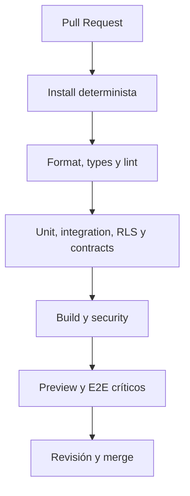

# ADR-0007: Adoptar GitHub Actions como pipeline CI/CD gobernado

> **Propuesta:** usar GitHub Actions como autoridad de validación y orquestación, Vercel como runtime Web y Supabase CLI para migraciones, con promoción explícita a Production.

## Metadata

| Campo | Valor |
|---|---|
| Estado | Propuesto |
| Fecha | 2026-07-12 |
| Decisores | Product Owner, responsable de arquitectura y responsable de operación |
| Consultados | Desarrollo, calidad, seguridad, datos, frontend e integración |
| Informados | Responsables de módulos, soporte y usuarios de releases |
| Propietario | Operación/Platform Engineering con corresponsabilidad de Arquitectura |
| Alcance | CI, Pull Requests, checks, Preview, migraciones, despliegue, Production, evidencia y recuperación |
| Reemplaza | No aplica |
| Reemplazado por | No aplica |
| RFC relacionado | No aplica; requiere pipeline piloto antes de aceptación |
| Issues relacionados | Pendiente: lockfile, scripts, PR checks, Supabase local, Vercel deploy y smoke tests |

---

## 1. Resumen ejecutivo

El workflow actual de GitHub Actions se activa solo con push a `main` y ejecuta únicamente checkout. No valida tipos, lint, pruebas, build ni despliegue.

La decisión propuesta es:

> **GitHub Actions será la autoridad de CI y el orquestador de CD. Cada Pull Request deberá pasar gates obligatorios; Vercel desplegará artefactos Web; Supabase CLI aplicará migraciones versionadas; y Production requerirá aprobación explícita, smoke tests y evidencia de recuperación.**

---

## 2. Contexto

CRUMAFOOD usa:

- GitHub;
- Next.js;
- TypeScript;
- Vercel;
- Supabase/PostgreSQL;
- y documentación de arquitectura versionada.

ADR-0002 requiere baseline y migraciones.

La estrategia de pruebas exige unitarias, integración, RLS, contratos y E2E.

Estas capacidades aún no están implementadas en CI.

---

## 3. Problema

Sin pipeline gobernado:

- código no validado llega a main;
- build puede fallar después del merge;
- migrations pueden divergir;
- Preview puede usar configuración incorrecta;
- Production puede desplegarse sin aprobación;
- y no existe evidencia reproducible de una release.

Compilar localmente no resuelve el riesgo.

---

## 4. Alcance

Esta decisión cubre:

- triggers;
- branch protection;
- instalación;
- cache;
- quality gates;
- pruebas;
- seguridad;
- Preview;
- main;
- releases;
- migraciones;
- Vercel;
- Production;
- secrets;
- environments;
- concurrencia;
- artefactos;
- smoke tests;
- rollback;
- observabilidad;
- y evidencias.

No fija todavía versión de Node ni gestor de paquetes definitivo.

---

## 5. Fuerzas de decisión

| Fuerza | Importancia | Implicación |
|---|---|---|
| Calidad antes de merge | Crítica | Checks requeridos en PR |
| Reproducibilidad | Crítica | Versiones y lockfile |
| Integridad de datos | Crítica | Migraciones gobernadas |
| Seguridad | Crítica | Secrets, permisos y scans |
| Velocidad de feedback | Alta | Jobs paralelos y cache |
| Recuperación | Crítica | Rollback/roll-forward |
| Trazabilidad | Alta | Commit, artefacto y release |
| Simplicidad | Alta | Servicios actuales antes de añadir plataforma |
| Costo | Alta | Runners y previews acotados |
| Separación de entornos | Crítica | Preview no toca Production |

---

## 6. Restricciones

La decisión deberá respetar:

- ADR-0002 para migraciones;
- Vercel como hosting actual;
- Supabase como datos;
- main protegida;
- secretos fuera del repositorio;
- despliegues pequeños;
- compatibilidad expand-contract;
- y pruebas proporcionales al riesgo.

Production no será entorno de primera prueba.

---

## 7. Supuestos

Esta propuesta asume que:

- GitHub Actions puede ejecutar los checks;
- Vercel puede recibir despliegues orquestados;
- Supabase CLI puede operar en CI;
- existen proyectos o entornos separados antes de Production;
- y el equipo puede aprobar promociones.

Los supuestos se validarán con un pipeline piloto.

---

## 8. Criterios de decisión

| Criterio | Prioridad | Evaluación |
|---|---|---|
| Gates obligatorios | Crítica | Branch protection |
| Reproducibilidad | Crítica | Build desde clone limpio |
| Migraciones seguras | Crítica | Reset y entorno no productivo |
| Promoción controlada | Crítica | Environment approval |
| Evidencia | Alta | Reportes y release metadata |
| Recuperación | Crítica | Drill |
| Feedback | Alta | Duración p50/p95 |
| Seguridad | Crítica | OIDC/secrets/permisos |
| Costo | Alta | Minutos y almacenamiento |

---

## 9. Opciones consideradas

| Opción | Resumen | Resultado propuesto |
|---|---|---|
| A | GitHub Actions orquesta CI/CD | Elegida |
| B | Vercel Git Integration como pipeline completo | Insuficiente |
| C | CI externo dedicado | No elegido |
| D | Scripts manuales locales | Rechazada |

---

## 10. Opción A — GitHub Actions

### Descripción

Workflows versionados ejecutan checks y despliegues.

Vercel y Supabase son destinos.

### Ventajas

- cerca del código;
- branch protection;
- environments;
- approvals;
- logs;
- matrices;
- y extensibilidad.

### Desventajas

- YAML y runners;
- secrets;
- mantenimiento;
- y costo de minutos.

### Resultado

Se elige.

---

## 11. Opción B — Solo Vercel Git Integration

### Descripción

Cada push genera Preview o Production y build de Next.js.

### Ventajas

- integración simple;
- Preview automático.

### Desventajas

- no cubre toda la estrategia de pruebas;
- migraciones y RLS quedan fuera;
- approvals y evidence son limitados;
- y build no sustituye CI.

### Resultado

Se conserva como capacidad de despliegue si se integra al control, no como autoridad total.

---

## 12. Opción C — CI externo

### Descripción

Otro proveedor ejecuta pipeline.

### Ventajas

- capacidades especializadas;
- potencial rendimiento.

### Desventajas

- proveedor nuevo;
- configuración;
- secrets;
- costo;
- y menor necesidad actual.

### Resultado

No se elige.

---

## 13. Opción D — Manual

### Descripción

Una persona ejecuta scripts y despliega.

### Ventajas

- no requiere configuración inicial.

### Desventajas

- no reproducible;
- errores;
- evidencia incompleta;
- dependencia personal;
- y acceso privilegiado.

### Resultado

Se rechaza como proceso normal.

---

## 14. Decisión propuesta

Se propone:

> **GitHub Actions ejecuta CI en Pull Requests y orquesta promociones. Vercel despliega la aplicación Web y Supabase CLI gestiona migraciones. Production se protege mediante GitHub Environment, aprobación explícita, smoke tests y observabilidad.**

La decisión incluye:

- checks requeridos;
- instalación determinista;
- workflows reutilizables;
- Preview;
- release;
- migrations;
- approvals;
- concurrency;
- secrets;
- artefactos;
- y recovery.

---

## 15. Modelo de ramas

`main` será la rama integrable y desplegable.

El trabajo usará ramas cortas y Pull Requests.

Se evitarán ramas de release permanentes mientras no exista necesidad.

Hotfix seguirá PR y gates acelerados, sin omitir controles críticos.

---

## 16. Protección de main

Main requerirá:

- Pull Request;
- checks verdes;
- revisión;
- conversaciones resueltas;
- rama actualizada según política;
- y restricción de push directo.

Administradores no bypassarán de forma rutinaria.

Las excepciones quedarán auditadas.

---

## 17. Triggers

Los workflows usarán:

- `pull_request`;
- push a `main`;
- `workflow_dispatch`;
- schedule para suites periódicas;
- y release/tag cuando se apruebe.

Los forks y contribuciones externas no recibirán secrets productivos.

---

## 18. Instalación determinista

CI usará:

- runtime fijado;
- gestor fijado;
- lockfile versionado;
- instalación frozen;
- y cache basada en lockfile.

El ADR futuro de Node/gestor definirá valores exactos.

Sin lockfile no se considerará reproducible.

---

## 19. Scripts canónicos

`package.json` expondrá comandos estables:

```text
format:check
typecheck
lint
test
test:integration
test:contracts
test:e2e
build
```

El pipeline llamará scripts del repositorio, no duplicará lógica compleja en YAML.

---

## 20. Gate de formato

El formato:

- tendrá herramienta fijada;
- será verificable;
- no modificará archivos en CI;
- y fallará con instrucciones locales.

La elección de formatter requiere configuración, no una dependencia sin uso.

---

## 21. Gate de tipos

Typecheck ejecutará TypeScript sin emitir.

Será independiente del build.

No se ignorarán errores mediante casts amplios o configuración relajada.

Los tipos generados deberán estar disponibles antes.

---

## 22. Gate de lint

Lint:

- usará comando compatible con Next.js/ESLint;
- fallará ante errores;
- tendrá política de warnings;
- y ejecutará reglas arquitectónicas progresivas.

`ignoreDuringBuilds` solo será aceptable si lint obligatorio ya pasó.

---

## 23. Pruebas unitarias

Se ejecutarán en cada PR.

Deberán:

- ser rápidas;
- deterministas;
- producir reporte;
- y fallar el merge.

La cobertura será señal de riesgo, no cifra vanidosa.

---

## 24. Integración y PostgreSQL

CI levantará Supabase/PostgreSQL aislado.

Aplicará:

- baseline;
- migraciones;
- seed de prueba;
- integración;
- constraints;
- funciones;
- y transacciones.

No usará Production.

---

## 25. RLS y autorización

Las pruebas incluirán:

- anónimo;
- autenticado;
- tenant A/B;
- permisos;
- scopes;
- service role encapsulada;
- y denegaciones.

Una suite con service role no valida RLS.

---

## 26. Contratos

CI verificará:

- API;
- schemas;
- eventos;
- webhooks;
- commands offline;
- y compatibilidad.

Un cambio incompatible fallará antes de merge o requerirá versión y migración.

---

## 27. Build

`next build` será obligatorio en cada PR.

El build:

- usa configuración segura de prueba;
- no necesita secretos productivos;
- verifica rutas y bundling;
- y no sustituye los demás gates.

---

## 28. E2E

Los E2E críticos podrán ejecutarse:

- en PR para flujos esenciales;
- sobre Preview para integración;
- y en schedule para matriz amplia.

Usarán datos aislados e identidades de prueba.

No ejecutarán pagos reales.

---

## 29. Seguridad

Los gates incluirán progresivamente:

- secret scanning;
- dependency review;
- vulnerabilidades;
- licenses;
- SAST;
- configuración;
- headers;
- y artefactos.

Un hallazgo crítico bloqueará promoción.

---

## 30. Arquitectura y documentación

CI verificará:

- enlaces;
- ADR index;
- Markdown;
- límites de imports cuando existan;
- y archivos generados.

La automatización no sustituirá revisión arquitectónica.

---

## 31. Pipeline de Pull Request



Los jobs independientes se paralelizarán.

---

## 32. Preview

Cada PR elegible tendrá Preview.

Preview:

- usa configuración no productiva;
- no comparte datos Production;
- no ejecuta jobs productivos;
- usa sandbox;
- expira;
- y se identifica en observabilidad.

El acceso podrá restringirse.

---

## 33. Datos de Preview

Preview usará:

- proyecto aislado;
- schema efímero;
- o entorno estable no productivo

según ADR futuro de entornos Supabase.

Nunca utilizará service role productiva.

Los fixtures serán sintéticos.

---

## 34. Push a main

Después del merge:

- se repiten gates esenciales;
- se produce release candidate;
- se identifica commit;
- se generan artefactos;
- se ejecutan pruebas de integración;
- y se prepara promoción.

No se confía únicamente en checks ejecutados antes de rebase/merge.

---

## 35. Artefacto

El artefacto tendrá:

- commit SHA;
- versión;
- checksums;
- metadata;
- dependencias;
- y entorno objetivo.

Cuando sea viable, Vercel recibirá un build preconstruido o una promoción verificable del mismo commit.

No se desplegará código distinto al validado.

---

## 36. Migraciones

Las migraciones seguirán ADR-0002.

Antes de Production:

- se valida historial;
- se detecta drift;
- se prueba en entorno no productivo;
- se verifica backup;
- y se confirma compatibilidad.

Los cambios serán expand-contract.

---

## 37. Orden de Production

La secuencia general será:

1. aprobar promoción;
2. validar estado;
3. confirmar recuperación;
4. aplicar migración compatible;
5. desplegar aplicación;
6. ejecutar smoke;
7. observar;
8. cerrar release.

Excepciones requerirán runbook específico.

---

## 38. Aprobación de Production

Production usará GitHub Environment protegido.

Requerirá:

- autoridad;
- resumen de cambio;
- riesgos;
- evidencia;
- migraciones;
- rollback;
- ventana cuando aplique;
- y aprobación.

La aprobación no será un click sin contexto.

---

## 39. Secrets

Los secrets:

- vivirán en stores autorizados;
- se separarán por environment;
- usarán mínimo privilegio;
- rotarán;
- y no aparecerán en logs.

Se preferirá OIDC o credenciales de corta vida cuando el proveedor lo permita.

---

## 40. Permisos de workflow

Cada workflow declarará permissions mínimos.

Se limitarán:

- contents;
- pull requests;
- deployments;
- packages;
- id-token;
- y actions.

Acciones de terceros se fijarán por versión o commit confiable.

---

## 41. Environments

Se distinguirán:

- Development;
- CI;
- Preview;
- Staging si se aprueba;
- y Production.

Cada environment tendrá:

- variables;
- secrets;
- datos;
- dominios;
- approvals;
- y retención.

---

## 42. Concurrencia

En PR:

- una ejecución nueva podrá cancelar la anterior.

En Production:

- no se cancelará una migración o despliegue a mitad;
- existirá un lock de promoción;
- y solo una release modificará el entorno a la vez.

---

## 43. Timeouts

Cada job tendrá timeout.

Se limitarán:

- instalación;
- tests;
- build;
- migrations;
- deploy;
- y smoke.

Un timeout se tratará como fallo, no como éxito desconocido.

---

## 44. Retries

Los retries automáticos se usarán solo para infraestructura transitoria.

No se reintentará ciegamente:

- una prueba determinista;
- una migración parcial;
- un error de tipos;
- ni un fallo de seguridad.

La flakiness se corregirá.

---

## 45. Smoke tests

Después del deploy se verificará:

- liveness;
- versión;
- assets;
- login o sesión controlada;
- lectura autorizada;
- endpoint crítico;
- conectividad;
- y señal de observabilidad.

Production usará acciones no destructivas.

---

## 46. Observación posterior

La release tendrá una ventana de observación con:

- errores;
- latencia;
- tráfico;
- dependencias;
- jobs;
- migraciones;
- y SLO.

Los marcadores de deploy permitirán comparación.

---

## 47. Rollback

El código podrá:

- promover deployment anterior;
- desactivar feature;
- o corregir forward.

La base no se revertirá automáticamente si ya recibió datos nuevos.

La compatibilidad expand-contract permite volver a código anterior dentro de ventana.

---

## 48. Roll-forward

Se preferirá roll-forward para:

- migrations;
- datos;
- y estados irreversibles.

La corrección tendrá:

- prioridad;
- revisión proporcional;
- pruebas;
- observabilidad;
- y post-incidente cuando aplique.

---

## 49. Evidencia

Cada pipeline conservará:

- commit;
- checks;
- reportes;
- cobertura;
- migraciones;
- artefacto;
- deployment ID;
- smoke;
- aprobación;
- y resultado.

La retención seguirá sensibilidad y costo.

---

## 50. Release metadata

Production expondrá de forma segura:

- release ID;
- commit;
- versión;
- build time;
- migration state;
- y deployment time.

No expondrá secrets ni configuración interna.

---

## 51. Notificaciones

El pipeline notificará:

- fallo de main;
- Preview fallido;
- promoción solicitada;
- Production iniciada;
- Production fallida;
- smoke fallido;
- y rollback.

Las notificaciones tendrán enlace a evidencia.

---

## 52. Consecuencias positivas

- calidad antes de merge;
- branch protection;
- entornos separados;
- migrations gobernadas;
- Production aprobada;
- trazabilidad;
- recuperación;
- y feedback automatizado.

---

## 53. Consecuencias negativas

- mantenimiento de workflows;
- mayor tiempo inicial;
- runners;
- secrets;
- ambientes;
- flakiness visible;
- y disciplina de releases.

---

## 54. Impacto arquitectónico

| Área | Impacto |
|---|---|
| Desarrollo | Scripts y gates locales |
| Datos | Migraciones y drift en pipeline |
| Seguridad | Scans, environments y secrets |
| Testing | Suites por PR/main/schedule |
| Despliegue | GitHub orquesta Vercel/Supabase |
| Observabilidad | Release markers y smoke |
| Operación | Approvals, rollback y runbooks |
| Desktop | Pipeline separado futuro según ADR-0004 |

---

## 55. Testing del pipeline

Se probarán:

- PR válido;
- check fallido;
- Preview;
- secret ausente;
- migración válida;
- migración fallida;
- deploy fallido;
- smoke fallido;
- concurrency;
- cancelación PR;
- lock Production;
- rollback;
- y workflow manual.

---

## 56. Validación previa a Aceptado

Este ADR podrá pasar a Aceptado cuando:

- exista lockfile y runtime fijado;
- PR ejecute typecheck, lint, tests y build;
- main esté protegido;
- Supabase local aplique migrations;
- Preview esté aislado;
- Production use approval;
- un deploy piloto ejecute smoke;
- un rollback drill funcione;
- secrets no se filtren;
- y Arquitectura, Operación, Seguridad y Producto aprueben.

---

## 57. Métricas

Se medirán:

- success rate;
- duración;
- queue time;
- flakiness;
- cache hit;
- tiempo a feedback;
- frecuencia de deploy;
- lead time;
- change failure rate;
- y recovery time.

Las métricas mejorarán el sistema, no evaluarán personas.

---

## 58. Riesgos y controles

| Riesgo | Condición | Impacto | Control | Propietario | Señal |
|---|---|---|---|---|---|
| Merge roto | Checks incompletos | Alto | Branch protection | Desarrollo | Main failure |
| Secret expuesto | Logs/action | Crítico | Masking/OIDC/scan | Seguridad | Secret alert |
| Preview a Production | Config errónea | Crítico | Environments | Operación | Audit |
| Migración parcial | Fallo | Crítico | Runbook/compatibilidad | Datos | Migration error |
| Pipeline flaky | Tests inestables | Alto | Ownership/quarantine | QA | Retry rate |
| Supply chain | Action comprometida | Crítico | Pin y review | Seguridad | Dependency alert |
| Deploy simultáneo | Concurrency | Alto | Environment lock | Operación | Overlap |
| Rollback incompatible | Schema contract | Crítico | Expand-contract | Arquitectura | Smoke fail |

---

## 59. Plan de implementación

| Entrega | Alcance | Propietario | Evidencia |
|---|---|---|---|
| Foundation | Runtime, gestor, lockfile | Desarrollo | Install limpio |
| Scripts | Format/types/lint/tests/build | Desarrollo/QA | Local + CI |
| PR CI | Checks y protection | Operación | Merge bloqueado |
| Data CI | Supabase reset/RLS | Datos | Suite |
| Preview | Vercel aislado | Frontend/Operación | URL + E2E |
| Production | Environment y approval | Operación | Deploy |
| Recovery | Rollback drill | Operación | Runbook |
| Observability | Release y smoke | Operación | Dashboard |

---

## 60. Preguntas abiertas

Antes de Aceptado se resolverá:

- ¿qué Node y gestor se fijan?;
- ¿qué lockfile se adopta?;
- ¿Vercel Git Integration se desactiva o coordina?;
- ¿cómo se crea Preview de datos?;
- ¿se requiere Staging?;
- ¿qué checks bloquean inicialmente?;
- ¿qué approvals requiere Production?;
- ¿cómo se aplica migration history?;
- ¿qué smoke es no destructivo?;
- y ¿qué retención de artefactos se necesita?

---

## 61. Triggers de revisión

Este ADR se revisará cuando:

- se adopte monorepo;
- existan varias aplicaciones;
- se cambie Vercel;
- se cambie Supabase;
- se adopte GitOps;
- crezca el costo de runners;
- se requieran releases coordinadas;
- o un incidente cuestione promoción.

Fecha de revisión sugerida: tras diez promociones productivas o el primer incidente de pipeline.

---

## 62. Registro de aprobación

| Rol | Decisión | Fecha | Evidencia |
|---|---|---|---|
| Product Owner | Pendiente | — | — |
| Responsable de arquitectura | Pendiente | — | — |
| Responsable de operación | Pendiente | — | — |
| Responsable de seguridad | Consultado, pendiente | — | — |
| Responsable de datos | Consultado, pendiente | — | — |
| Responsable de calidad | Consultado, pendiente | — | — |

El estado permanecerá Propuesto hasta completar pipeline piloto y recovery drill.

---

## 63. Historial

| Fecha | Cambio | Autor o rol |
|---|---|---|
| 2026-07-12 | Propuesta inicial | Responsable de arquitectura |

Después de Aceptado, un cambio de autoridad u orquestador requerirá ADR nuevo.

---

## 64. Referencias

- [Registro ADR](README.md)
- [Plantilla ADR](0000-template.md)
- [ADR-0002: Schema baseline](0002-schema-baseline-and-migrations.md)
- [Arquitectura de despliegue](../deployment-architecture.md)
- [Estrategia de pruebas](../testing-strategy.md)
- [Arquitectura de seguridad](../security-architecture.md)
- [Arquitectura de observabilidad](../observability-architecture.md)
- [Arquitectura de rendimiento](../performance-architecture.md)

---

## 65. Resultado de la propuesta

Si se acepta, cada cambio deberá demostrar calidad antes de integrarse y cada release productiva tendrá una secuencia, autoridad, evidencia y recuperación conocidas.

Si se rechaza, deberá elegirse una alternativa que cubra PR gates, migraciones, aislamiento, aprobación Production, smoke, evidencia y rollback con el mismo nivel de control.

---

## 66. Declaración final

> **CRUMAFOOD no desplegará por esperanza. Cada cambio será verificable antes del merge, cada promoción será explícita y cada release llegará a Production con evidencia suficiente para observarla, contenerla y recuperarla.**
