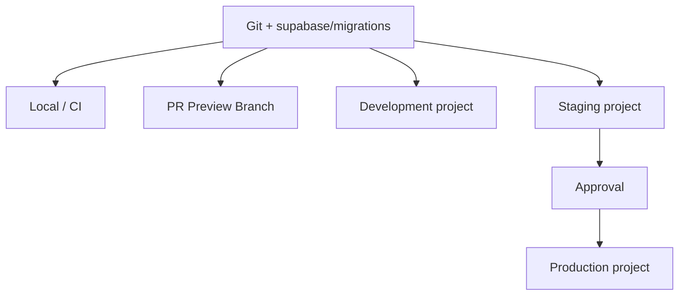

# ADR-0014: Separar Supabase por entorno y usar branches efímeras en Preview

> **Propuesta:** operar Local/CI con Supabase CLI, mantener proyectos permanentes independientes para Development, Staging y Production, y crear una Supabase Preview Branch sin datos productivos por Pull Request.

## Metadata

| Campo | Valor |
|---|---|
| Estado | Propuesto |
| Fecha | 2026-07-12 |
| Decisores | Product Owner, responsable de arquitectura, responsable de seguridad, responsable de datos y responsable de operación |
| Consultados | Desarrollo, calidad, frontend, integraciones, soporte, Mobile y Desktop |
| Informados | Responsables de módulos, usuarios de releases y administradores de Supabase/Vercel |
| Propietario | Platform Engineering/Operación, con corresponsabilidad de Datos y Seguridad |
| Alcance | Local, CI, Development, Preview, Staging, Production, proyectos, branches, credenciales, datos, migraciones, Auth, Storage e integraciones |
| Reemplaza | No aplica |
| Reemplazado por | No aplica |
| RFC relacionado | No aplica; requiere piloto de Preview y promoción antes de aceptación |
| Issues relacionados | Pendiente: supabase init, baseline, proyectos dev/stg/prod, branching, Vercel sync, seeds, secretos y promoción |

---

## 1. Resumen ejecutivo

El repositorio solo declara variables Supabase en `.env.example`. No contiene `supabase/config.toml`, migraciones, seeds, referencias de proyectos ni automatización de entornos. Una Preview podría apuntar accidentalmente al mismo backend que Production.

La decisión propuesta es:

> **CRUMAFOOD separará datos, credenciales y servicios Supabase por entorno. Local y CI usarán stacks efímeros creados desde migraciones; Development, Staging y Production serán proyectos permanentes distintos; cada Pull Request relevante usará una Preview Branch independiente, data-less y poblada exclusivamente con seeds sintéticos.**

La integración GitHub de Supabase podrá crear branches y checks, pero la opción automática “Deploy to production” permanecerá desactivada. GitHub Actions y el Environment `Production` conservarán la autoridad de promoción definida en ADR-0007.

---

## 2. Contexto

Supabase provee actualmente o potencialmente:

- PostgreSQL;
- Auth;
- RLS;
- Storage;
- Realtime;
- Edge Functions;
- secretos;
- logs;
- backups;
- y conexiones de integración.

Separar solo la URL de base de datos no separa todos esos recursos.

---

## 3. Estado actual

El repositorio contiene:

```text
NEXT_PUBLIC_SUPABASE_URL=
NEXT_PUBLIC_SUPABASE_ANON_KEY=
SUPABASE_SERVICE_ROLE_KEY=
```

No se identificó:

- directorio `supabase/`;
- `config.toml`;
- `migrations/`;
- seed canónico;
- CLI fijada;
- proyecto Development;
- proyecto Staging;
- política Preview;
- ni mapeo Vercel/Supabase.

---

## 4. Problema

Compartir un backend entre entornos puede:

- exponer datos productivos en una Preview pública;
- aplicar migraciones de una rama a Production;
- enviar correos, SMS o webhooks reales;
- mezclar usuarios y sesiones;
- ejecutar jobs duplicados;
- contaminar métricas y auditoría;
- y permitir que una service role productiva llegue a un build no confiable.

La separación debe abarcar plataforma completa, no solo tablas.

---

## 5. Alcance

Esta decisión cubre:

- topología de entornos;
- proyectos permanentes;
- preview branches;
- Supabase CLI local;
- CI aislado;
- migraciones;
- seeds;
- variables y secretos;
- Vercel environments;
- Auth;
- Storage;
- Realtime;
- Edge Functions;
- integraciones;
- jobs;
- acceso;
- observabilidad;
- backup proporcional;
- y promoción.

No define:

- proveedor de backup externo;
- runbook completo de desastre;
- región final;
- plan comercial definitivo;
- organización Supabase separada para Production;
- ni estrategia de datos anonimizados a gran escala.

---

## 6. Principios

1. Production nunca es entorno de prueba;
2. una credencial pertenece a un único entorno;
3. una Preview no recibe datos productivos;
4. el esquema proviene de migraciones versionadas;
5. los seeds son sintéticos y deterministas;
6. CI no depende de un proyecto compartido;
7. service role nunca llega al navegador;
8. promoción usa el mismo artefacto/migraciones aprobados;
9. cada entorno tiene límites, observabilidad y owners;
10. Preview es descartable;
11. Staging es estable;
12. y Production requiere aprobación explícita.

---

## 7. Fuerzas de decisión

| Fuerza | Importancia | Implicación |
|---|---|---|
| Protección de datos | Crítica | Nada productivo en no-production |
| Integridad de esquema | Crítica | Migraciones iguales y ordenadas |
| Review de Pull Requests | Alta | Preview aislada y reproducible |
| Auth/Storage | Crítica | Recursos y credenciales propios |
| CI determinista | Crítica | Stack local efímero por job |
| Costo | Alta | Entornos permanentes y branches medidos |
| Operación | Alta | Staging estable y Production restringido |
| Velocidad | Alta | Branch automática por PR |
| Trazabilidad | Crítica | Commit, migration set y project ref |
| Recuperación | Alta | Backup proporcional y restore probado |

---

## 8. Restricciones

La decisión deberá respetar:

- `supabase/migrations/` como autoridad según ADR-0002;
- GitHub Actions según ADR-0007;
- Vercel como hosting Web;
- Node/pnpm según ADR-0013;
- multi-tenancy y RLS en todo entorno;
- Production sin secrets en Preview;
- datos sintéticos fuera de Production;
- y expansión/contracción compatible para promociones.

---

## 9. Supuestos

La propuesta asume que:

- el plan puede financiar proyectos permanentes y branching;
- Supabase Branching permanece disponible en el plan contratado;
- Docker o runtime compatible está disponible local/CI;
- Vercel y Supabase pueden sincronizar Preview credentials;
- no se necesita copiar datos productivos para validar la mayoría de cambios;
- y el equipo puede administrar tres proyectos permanentes.

Si costo o capacidad contradicen estos supuestos, el ADR deberá revisarse, no degradar aislamiento silenciosamente.

---

## 10. Criterios de decisión

| Criterio | Prioridad | Evidencia |
|---|---|---|
| Aislamiento | Crítica | Project refs, keys y datos distintos |
| Reproducibilidad | Crítica | Reset desde cero y seeds |
| Preview | Alta | PR crea branch y Vercel usa sus variables |
| Promoción | Crítica | Staging antes de Production con aprobación |
| Seguridad | Crítica | Secrets y accesos separados |
| Integridad | Crítica | RLS, migrations y drift checks |
| Costo | Alta | Presupuesto y cleanup |
| Operación | Alta | Logs, alertas y owners por entorno |
| Salida | Alta | CLI/migrations no dependen del dashboard |

---

## 11. Opciones consideradas

| Opción | Resumen | Resultado |
|---|---|---|
| A | Tres proyectos permanentes + Preview Branches | Elegida |
| B | Un proyecto compartido con tenants de prueba | No elegida |
| C | Solo Local + Production | No elegida |
| D | Proyecto por cada developer/PR manual | No elegida |
| E | Staging como branch persistente del proyecto Productivo | No elegida inicialmente |

---

## 12. Opción A — Proyectos y branches

Ventajas:

- aislamiento real de credenciales y servicios;
- Preview automática;
- Staging estable;
- no copia datos productivos;
- y promoción verificable.

Desventajas:

- costo mayor;
- más configuración y secrets;
- riesgo de drift si CI no gobierna;
- y dependencia del feature Branching para Preview completa.

---

## 13. Opción B — Proyecto compartido

Usar un tenant por rama reduce costo, pero no aísla:

- Auth config;
- service role;
- Storage buckets;
- Edge secrets;
- jobs;
- logs;
- extensiones;
- ni migraciones incompatibles.

Se descarta como arquitectura objetivo.

---

## 14. Opción C — Local + Production

Es económica, pero no ofrece entorno estable para integraciones, smoke tests, restauración o validación operativa previa.

Se descarta para Production gobernada.

---

## 15. Opción D — Proyecto manual por PR

Ofrece aislamiento, pero provisioning, credentials, cleanup y sincronización manual son lentos y propensos a error.

Supabase Branching resuelve ese ciclo de vida de forma más adecuada.

---

## 16. Opción E — Staging como branch persistente

Una persistent branch puede servir como Staging, pero mantiene acoplamiento operativo al proyecto base y al modelo de branches.

Se prefiere proyecto Staging separado para:

- lifecycle independiente;
- acceso distinto;
- backup propio;
- integraciones estables;
- y promoción gobernada por CI.

Podrá reevaluarse por costo.

---

## 17. Decisión propuesta

CRUMAFOOD adoptará:

1. Supabase local por developer;
2. Supabase local efímero por job CI;
3. proyecto permanente Development;
4. Preview Branch efímera por Pull Request relevante;
5. proyecto permanente Staging;
6. proyecto permanente Production;
7. migraciones comunes desde Git;
8. seeds distintos por propósito;
9. secrets propios por entorno;
10. Vercel conectado al backend correcto;
11. integración Supabase sin auto-deploy de Production;
12. y promoción manual controlada por GitHub Environment.

---

## 18. Topología



La flecha representa promoción de configuración y migraciones, nunca copia general de datos hacia entornos inferiores.

---

## 19. Matriz de entornos

| Entorno | Tipo | Vida | Datos | Acceso |
|---|---|---|---|---|
| Local | CLI/Docker | Por developer | Sintéticos | Developer |
| CI | CLI/Docker | Por job | Fixtures sintéticos | Runner |
| Development | Proyecto | Permanente | Sintéticos compartidos | Desarrollo |
| Preview | Supabase Branch | PR | Seed sintético | PR/revisores |
| Staging | Proyecto | Permanente | Sintéticos production-like | Equipo limitado |
| Production | Proyecto | Permanente | Reales | Mínimo privilegio |

---

## 20. Convención de nombres

Nombres conceptuales:

```text
cruma-local
cruma-ci-<run-id>
cruma-dev
cruma-pr-<number>
cruma-stg
cruma-prod
```

Los IDs reales de proyecto no se codificarán en lógica de dominio.

---

## 21. Identidad de entorno

Cada runtime conocerá una identidad explícita:

- `local`;
- `ci`;
- `development`;
- `preview`;
- `staging`;
- o `production`.

No se inferirá Production únicamente por hostname, branch name o presencia de datos.

La identidad será visible en logs y diagnósticos, no necesariamente al usuario final.

---

## 22. Directorio canónico

ADR-0002 se materializará como:

```text
supabase/
  config.toml
  migrations/
  seeds/
    local.sql
    test.sql
    preview.sql
    staging.sql
  functions/
  tests/
```

Production no recibirá seeds demo. Los datos de referencia indispensables usarán migración o seed productivo separado, idempotente y aprobado.

---

## 23. `config.toml`

`supabase/config.toml` será versionado.

Declarará configuración común y remotes cuando sea soportado y seguro.

No contendrá:

- passwords;
- service-role keys;
- OAuth secrets;
- SMTP credentials;
- ni project refs secretos tratados como credenciales.

Los valores sensibles se resolverán desde el gestor autorizado.

---

## 24. Local

Local será la ruta predeterminada de desarrollo.

El flujo deberá permitir:

```text
supabase start
supabase db reset
supabase test db
supabase stop
```

El stack se crea desde migraciones y seed local.

Un developer no dependerá de cambios manuales en `cruma-dev` para ejecutar pruebas básicas.

---

## 25. CI

Cada job de datos tendrá stack aislado o servicio efímero propio.

CI ejecutará:

- start;
- reset;
- migrations;
- seed test;
- pgTAP/RLS;
- integración;
- drift checks;
- type generation;
- y teardown.

No usará Production ni el proyecto Development compartido para pruebas mutables.

---

## 26. Paralelismo CI

Jobs paralelos no compartirán:

- base;
- schema mutable;
- usuarios;
- buckets;
- ports sin namespace;
- ni estado de Auth.

Cada ejecución usará puertos, containers, databases o run IDs aislados.

La limpieza no dependerá de que un job anterior haya finalizado correctamente.

---

## 27. Development permanente

`cruma-dev` servirá para:

- colaboración manual;
- integraciones sandbox que requieren callback remoto;
- demos internas no contractuales;
- y validación exploratoria.

No será:

- autoridad de schema;
- sustituto de CI;
- staging;
- ni depósito de datos productivos.

Podrá resetearse con comunicación y runbook.

---

## 28. Preview Branch

Cada Pull Request relevante creará una branch separada con:

- instancia;
- API URL;
- credentials;
- Auth;
- Storage;
- Realtime;
- schema de la rama;
- functions/config aplicables;
- y seed sintético.

No copiará datos de Production.

---

## 29. Cuándo crear Preview

Se creará cuando el PR afecte:

- `supabase/**`;
- queries o adapters Supabase;
- Auth/RLS;
- Storage;
- Realtime;
- integrations que requieran backend;
- o flujo funcional revisable.

PR exclusivamente documental podrá omitirla.

La regla será automática y auditable.

---

## 30. Ciclo de vida Preview

La branch:

1. se crea al abrir/reabrir PR;
2. aplica migrations;
3. configura servicios permitidos;
4. ejecuta seed una vez;
5. publica credentials a Vercel Preview;
6. ejecuta smoke/tests;
7. se actualiza con commits;
8. y se elimina al mergear/cerrar.

Un job periódico detectará branches huérfanas.

---

## 31. Preview data-less

Las branches nuevas no recibirán copia del proyecto principal.

Esto será un control obligatorio, no opcional.

Si una prueba requiere forma productiva compleja se usarán:

- factories;
- fixtures;
- generadores;
- o dataset anonimizado específicamente aprobado.

Nunca un dump directo de Production.

---

## 32. Seed Preview

El seed Preview será:

- sintético;
- determinista;
- idempotente cuando corresponda;
- multi-tenant;
- pequeño;
- representativo;
- sin comunicaciones reales;
- y versionado.

Incluirá casos de éxito, límites, denegación y estados vacíos sin crear secretos.

---

## 33. Recreación de Preview

Si una migración de la rama se reescribe o revierte durante revisión, la branch podrá eliminarse y recrearse.

Los datos manuales de Preview son descartables.

La recreación ejecutará todas las migraciones y seed desde cero y deberá producir resultado equivalente.

---

## 34. Integración GitHub de Supabase

Se habilitará para:

- automatic branching;
- cambios relevantes;
- migrations en Preview;
- status check requerido;
- y sincronización con Vercel.

La opción **Deploy to production** permanecerá desactivada.

GitHub Actions será la única autoridad de promoción productiva.

---

## 35. Check requerido

El check de Supabase Preview deberá completar:

- health;
- config;
- migrate;
- seed;
- functions cuando aplique;
- y estado final.

Un PR con migración inválida no podrá mergearse.

No se ignorará un check pendiente cerrando y reabriendo sin causa.

---

## 36. Race con Vercel

La integración puede actualizar variables de Preview después de iniciar un deployment de Vercel y redeployar automáticamente.

El pipeline verificará:

- project ref esperado;
- deployment más reciente;
- variables correctas;
- y smoke posterior al redeploy.

No se aprobará la primera Preview únicamente porque tenga URL.

---

## 37. Staging

`cruma-stg` será proyecto permanente para:

- release candidate;
- expand-contract;
- integraciones sandbox estables;
- smoke completo;
- performance controlada;
- recuperación;
- y aprobación operativa.

No contendrá datos productivos sin proceso específico de anonimización aprobado.

---

## 38. Staging y Vercel

Staging tendrá un Vercel Environment o deployment estable explícitamente mapeado a `cruma-stg`.

No se asumirá que una branch Git llamada `staging` recibe automáticamente variables Staging: Vercel trata branches no productivas como Preview salvo configuración adicional.

El pipeline comprobará URL y project ref.

---

## 39. Production

`cruma-prod` será el único proyecto con datos reales.

Tendrá:

- acceso restringido;
- backups/PITR según ADR-0009 y ADR futuro;
- network controls disponibles;
- MFA;
- owners redundantes;
- logs y alertas;
- integraciones reales;
- y change management.

No se enlazará desde laptops para cambios ad hoc.

---

## 40. Organizaciones Supabase

Inicialmente los proyectos podrán vivir en una organización con RBAC suficiente.

Separar `cruma-prod` en una organización Production restringida se evaluará cuando:

- el plan lo permita;
- crezca el equipo;
- exista exigencia contractual;
- o la separación de roles sea insuficiente.

Esta decisión futura no cambia la separación de proyectos.

---

## 41. Variables públicas

Cada entorno recibirá su propia:

- `NEXT_PUBLIC_SUPABASE_URL`;
- `NEXT_PUBLIC_SUPABASE_ANON_KEY` durante compatibilidad;
- o `NEXT_PUBLIC_SUPABASE_PUBLISHABLE_KEY` como nombre objetivo.

Una key pública no es service role, pero sigue perteneciendo a un único proyecto y entorno.

El rename de variable será implementación separada y compatible.

---

## 42. Secrets servidor

Cada entorno tendrá secrets únicos:

- service role/secret key;
- database password;
- Supabase access token de despliegue;
- OAuth secrets;
- SMTP;
- webhook signing secrets;
- function secrets;
- y terceros.

No se copiará la service role de Production a Preview o Staging.

---

## 43. Project refs

Los project refs se almacenarán en configuración CI/Environment autorizada.

No se usarán como secretos suficientes por sí mismos, pero se evitará hardcodearlos en lógica o scripts genéricos.

Cada job mostrará un alias de entorno y verificará el ref antes de una operación destructiva.

---

## 44. Guardas destructivas

Comandos como reset, drop o seed demo deberán negarse contra Production.

La guarda verificará múltiples señales:

- Environment de GitHub;
- project ref allowlisted;
- identidad de entorno;
- comando;
- aprobación;
- y, para acciones críticas, confirmación explícita.

Un nombre de branch no será suficiente.

---

## 45. Auth

Cada entorno tendrá:

- usuarios propios;
- sessions propias;
- redirect URLs;
- email templates;
- providers;
- rate limits;
- CAPTCHA cuando aplique;
- y SMTP.

Un usuario Production no iniciará sesión automáticamente en Staging o Preview.

---

## 46. Redirect URLs

Auth configurará:

- URL canónica de Production;
- URL de Staging;
- localhost permitido;
- y patrones Preview estrictamente necesarios.

No se añadirá wildcard amplio que permita redirección a dominios controlados por terceros.

El callback validará destino y entorno.

---

## 47. Correo y SMS

Local/CI usarán mail catcher o fake.

Development, Preview y Staging usarán:

- sandbox;
- allowlist de destinatarios;
- prefijos visibles;
- límites bajos;
- y credenciales no productivas.

Solo Production podrá usar proveedor y remitente reales aprobados.

---

## 48. OAuth

Los proveedores OAuth usarán aplicaciones/credentials separadas cuando el proveedor lo permita.

Preview no heredará client secrets productivos.

Si un proveedor no soporta callbacks dinámicos seguros, esa integración se deshabilitará en Preview o usará proxy/sandbox aprobado.

---

## 49. RLS

Las políticas RLS provendrán de las mismas migraciones en todos los entornos.

CI probará:

- acceso permitido;
- denegación;
- tenants cruzados;
- service role;
- funciones security definer;
- y cambios de rol.

No se relajará RLS en Development para facilitar demos.

---

## 50. Multi-tenancy en fixtures

Seeds no productivos incluirán al menos:

- dos tenants;
- usuarios con roles distintos;
- IDs deterministas;
- recursos con IDs cercanos;
- y casos de cruce prohibido.

Un dataset de un solo tenant no demuestra aislamiento.

---

## 51. Storage

Cada proyecto/branch tendrá buckets propios.

Los fixtures usarán archivos sintéticos y pequeños.

Se verificará:

- políticas;
- paths scoped;
- signed URLs;
- expiración;
- límites;
- y cleanup.

No se copiarán objetos productivos a no-production.

---

## 52. Realtime

Realtime se configurará por entorno.

Preview y Staging probarán subscriptions con datos sintéticos.

Los canales, payloads y RLS conservarán tenant.

No se conectará un cliente Preview al Realtime de Production aunque la base principal sea distinta.

---

## 53. Edge Functions

Functions se desplegarán desde `supabase/functions/` con secrets propios.

Cada function conocerá su entorno y negará efectos externos no permitidos.

Preview no ejecutará pagos, mensajes o mutaciones reales de terceros.

El deployment de functions será parte del status del entorno.

---

## 54. Webhooks entrantes

Cada entorno tendrá endpoints y signing secrets distintos.

Production no enviará eventos a Preview.

Development/Staging usarán sandbox o replay controlado con payload sintético.

Las URLs efímeras se registrarán y eliminarán al cerrar el PR cuando el tercero lo permita.

---

## 55. Integraciones salientes

La configuración declarará por entorno:

- provider mode;
- base URL;
- account;
- credential;
- allowlist;
- rate limit;
- y side effects permitidos.

El default no productivo será fail-closed para efectos irreversibles.

---

## 56. Jobs y cron

Preview tendrá jobs deshabilitados por defecto.

Staging podrá habilitarlos de forma controlada con:

- schedule distinto;
- locks propios;
- datos sintéticos;
- y destino sandbox.

Solo Production ejecutará cron operativo real.

---

## 57. Migraciones

Toda migración seguirá:

```text
local reset -> CI reset/tests -> Preview Branch -> Staging -> approval -> Production
```

El mismo archivo inmutable avanzará entre etapas.

No se reconstruirá SQL distinto por entorno salvo configuración explícita fuera de la migración canónica.

---

## 58. Expand-contract

Staging validará el orden compatible:

1. expandir schema;
2. desplegar código tolerante;
3. ejecutar backfill;
4. observar;
5. cambiar lecturas/escrituras;
6. contraer en release posterior.

Preview de una sola rama no demuestra compatibilidad con versiones productivas concurrentes.

---

## 59. Promoción a Staging

Después de merge y gates:

- GitHub Actions enlazará explícitamente `cruma-stg`;
- verificará ref;
- aplicará migraciones pendientes;
- desplegará functions/config aprobadas;
- ejecutará seed/reset solo según política Staging;
- desplegará Web;
- y ejecutará smoke.

---

## 60. Promoción a Production

Production requerirá:

- commit aprobado;
- checks verdes;
- evidencia Staging;
- backup/punto de recuperación cuando aplique;
- revisión de migración;
- GitHub Environment approval;
- project ref verificado;
- aplicación de migraciones;
- deployment Web compatible;
- smoke;
- y observación.

No se habilitará auto-deploy directo de Supabase en merge.

---

## 61. Orden código-datos

El pipeline definirá por release:

- migración antes o después del código;
- compatibility window;
- backfill;
- feature flag;
- verificación;
- y recuperación.

Separar proyectos no resuelve por sí mismo el orden de cambios incompatibles.

---

## 62. Drift

Se detectará drift entre:

- migraciones Git;
- Local reset;
- Development;
- Staging;
- y Production.

Un cambio hecho en Dashboard deberá:

- detener promoción;
- extraerse/reconciliarse;
- revisarse;
- y convertirse en migración.

No se elegirá silenciosamente el entorno “más reciente”.

---

## 63. Types

Los tipos TypeScript se generarán desde schema canónico reconstruido o entorno autorizado.

CI fallará si los tipos versionados divergen.

No se generarán tipos desde Production como paso rutinario de un PR.

La fuente y versión quedarán en el artifact.

---

## 64. Datos de Development

Development usará:

- seeds enterprise-ready;
- IDs deterministas;
- upserts;
- slugs/SKUs sintéticos;
- tenants múltiples;
- relaciones limpias;
- y resets comunicados.

No almacenará copias informales de clientes reales.

---

## 65. Datos de Staging

Staging priorizará forma y volumen representativos mediante generación sintética.

Datos anonimizados solo se permitirán si existe:

- finalidad;
- minimización;
- proceso irreversible verificado;
- aprobación de seguridad/privacidad;
- retención;
- acceso;
- y eliminación.

“Ocultar el nombre” no basta para anonimizar.

---

## 66. Production seeds

Production solo recibirá:

- catálogos indispensables;
- configuración inicial autorizada;
- roles/permisos canónicos;
- y referencias requeridas.

Serán idempotentes, auditables y separados de demo/test data.

Crear usuarios demo o transacciones ejemplo en Production está prohibido.

---

## 67. Backups

La política será proporcional:

| Entorno | Backup |
|---|---|
| Local/CI | No; reconstruir desde Git/seed |
| Preview | No; descartable |
| Development | Opcional según costo; reconstruible |
| Staging | Backup suficiente para drills y continuidad de prueba |
| Production | RPO/RTO, PITR y restore conforme ADR-0009/ADR futuro |

No se restaurará Production sobre un entorno inferior sin anonimización y autorización.

---

## 68. Observabilidad

Toda señal incluirá entorno y project alias.

Dashboards y alertas separarán:

- Preview noise;
- Staging validation;
- y Production operations.

Una alerta Preview no paginará operación salvo riesgo de seguridad o plataforma compartida.

---

## 69. Logs

Logs no mezclarán datasets ni credentials.

Se redactarán:

- JWTs;
- keys;
- connection strings;
- emails;
- payloads;
- y SQL parameters sensibles.

Preview logs se eliminarán conforme a su ciclo de vida y plan.

---

## 70. Acceso

| Entorno | Acceso humano |
|---|---|
| Local | Developer propietario |
| CI | Service identity efímera |
| Development | Equipo de desarrollo |
| Preview | Autores/revisores autorizados |
| Staging | Desarrollo senior, QA, Operación |
| Production | Mínimo grupo operativo |

MFA será obligatorio para administración remota.

---

## 71. Credenciales CI

GitHub Environments separarán:

- Development;
- Staging;
- Production.

Production requerirá reviewers y secrets propios.

Los PR de forks no recibirán secrets sensibles ni crearán branches remotas sin política explícita.

---

## 72. OIDC y tokens

Se preferirán credenciales de corta duración/OIDC cuando Supabase y el flujo lo permitan.

Mientras se usen access tokens:

- scope mínimo;
- rotación;
- environment secret;
- no logs;
- revocación;
- y owner.

Un token personal no será identidad permanente del pipeline.

---

## 73. Costos

Se medirá:

- proyectos permanentes;
- compute;
- branching;
- tiempo activo;
- Storage;
- egress;
- logs;
- backups;
- y branches huérfanas.

Preview podrá pausar o eliminarse automáticamente según capacidades del plan.

El costo no se reducirá compartiendo Production con pruebas.

---

## 74. Cuotas

No-production tendrá límites bajos para:

- emails/SMS;
- Storage;
- Realtime;
- functions;
- egress;
- conexiones;
- y terceros.

Un loop en Preview no deberá agotar cuota productiva.

---

## 75. Fallo de Branching

Si Branching no está disponible:

- CI local continúa siendo obligatorio;
- Preview Web podrá operar con mocks o sin backend mutable;
- Staging seguirá aislado;
- Production no se compartirá;
- y se documentará limitación.

No se usará `cruma-prod` como fallback de Preview.

---

## 76. Fallo de sincronización Vercel

Si Vercel recibe credentials incorrectas:

1. bloquear aprobación;
2. detener smoke destructivo;
3. comparar PR/branch/project ref;
4. rotar si hubo exposición;
5. redeployar con variables correctas;
6. verificar ausencia de efectos cruzados;
7. y registrar incidente.

---

## 77. Consecuencias positivas

- datos productivos fuera de Preview;
- credenciales y Auth aislados;
- migrations probadas varias veces;
- CI reproducible;
- Staging estable;
- reviews funcionales reales;
- menor riesgo de side effects;
- y trazabilidad de promoción.

---

## 78. Consecuencias negativas

- costo de tres proyectos y branching;
- mayor número de secrets/configuraciones;
- operación y cleanup adicionales;
- diferencias inevitables de datos;
- complejidad de callbacks Auth/OAuth;
- y posibilidad de drift si se permiten cambios Dashboard.

---

## 79. Riesgos y controles

| Riesgo | Control |
|---|---|
| Preview apunta a Production | Project-ref assertion y secrets separados |
| Service role filtrada | GitHub Environments y browser scan |
| Branch con datos reales | Data-less + seed sintético |
| Vercel race | Redeploy y smoke del ref esperado |
| Drift Dashboard | Detection y migrations-only |
| Jobs duplicados | Disabled por default fuera de Production |
| OAuth/SMTP real | Credentials sandbox separadas |
| Branch huérfana | Lifecycle automático y sweeper |
| Costo excesivo | Métricas, pausa y cleanup |
| Auto-deploy salta aprobación | Deploy to production desactivado |

---

## 80. Plan de implementación

### Fase 0 — Inventario

- identificar proyecto actual;
- clasificar si contiene datos reales;
- inventariar Auth/Storage/functions/secrets;
- y capturar baseline conforme ADR-0002.

### Fase 1 — Repositorio

- fijar Supabase CLI;
- ejecutar `supabase init`;
- crear `config.toml`;
- crear migrations;
- separar seeds;
- y probar reset.

### Fase 2 — No-production permanente

- crear `cruma-dev`;
- crear `cruma-stg`;
- aplicar migrations;
- configurar sandbox;
- y validar RLS.

### Fase 3 — Preview

- habilitar plan/Branching;
- conectar GitHub y Vercel;
- desactivar auto Production;
- abrir PR canario;
- y verificar branch data-less.

### Fase 4 — Pipeline

- CI local;
- promotion Staging;
- approval Production;
- project-ref assertions;
- smoke;
- y observabilidad.

### Fase 5 — Gobierno

- accesos;
- backups;
- costos;
- cleanup;
- runbooks;
- y aceptación.

---

## 81. Migración desde el proyecto actual

Si el proyecto existente contiene datos reales:

- se tratará como candidato Production;
- no se clonará hacia abajo;
- se extraerá schema/baseline;
- se crearán entornos inferiores desde migrations;
- y se poblarán con synthetic seeds.

Si es solo demo:

- se inventariará;
- se podrá recrear como Development;
- y Production se creará limpia mediante proceso aprobado.

---

## 82. Piloto

El piloto deberá demostrar:

1. reset local desde cero;
2. CI con dos tenants;
3. PR crea Preview Branch;
4. Preview no contiene datos del proyecto base;
5. seed sintético ejecuta;
6. Vercel usa URL/key de la branch;
7. RLS bloquea cruce;
8. Storage está separado;
9. closing PR elimina branch;
10. Staging recibe misma migration;
11. auto Production está desactivado;
12. y promoción Production requiere aprobación.

---

## 83. Criterios para Aceptado

Este ADR podrá pasar a Aceptado cuando:

- exista `supabase/` canónico;
- baseline y reset sean reproducibles;
- CLI esté fijada;
- proyectos dev/stg/prod estén inventariados;
- secrets sean distintos;
- Preview data-less funcione;
- Vercel sync se verifique;
- GitHub required check esté activo;
- auto-deploy Productivo esté desactivado;
- CI no use backend compartido;
- RLS/multi-tenant pasen;
- Staging y Production tengan promoción controlada;
- costos y owners estén aprobados;
- y Seguridad, Datos, Operación y Producto acepten evidencia.

---

## 84. Preguntas abiertas

Antes de Aceptado se resolverá:

- ¿qué proyecto actual contiene datos reales?;
- ¿qué plan de Supabase se contratará?;
- ¿qué región usarán los tres proyectos?;
- ¿Production vivirá en organización separada?;
- ¿qué versión de CLI se fija?;
- ¿qué seeds exactos corresponden a cada entorno?;
- ¿qué Vercel Environment representa Staging?;
- ¿qué OAuth providers soportan callbacks Preview?;
- ¿qué branches requieren Supabase Preview?;
- ¿qué retención/costo tendrán branches?;
- y ¿qué datos, si alguno, requieren anonimización para Staging?

---

## 85. Métricas de la decisión

Se seguirá:

- environments con project ref correcto;
- Preview branches creadas/eliminadas;
- tiempo de provisión;
- failures de migrate/seed;
- drift;
- RLS failures;
- credentials cross-environment detectadas;
- side effects bloqueados;
- branches huérfanas;
- costo por entorno;
- y promociones Staging/Production exitosas.

---

## 86. Triggers de revisión

Este ADR se revisará cuando:

- cambie Supabase Branching;
- cambie plan/costo;
- Vercel cambie environment mapping;
- se adopte otra plataforma de datos;
- se requieran datos anonimizados;
- se cree organización Production separada;
- se incorpore multi-region;
- un incidente cruce entornos;
- o Staging como proyecto no justifique su costo.

---

## 87. Registro de aprobación

| Rol | Estado | Evidencia |
|---|---|---|
| Product Owner | Pendiente | Costo y nivel de aislamiento |
| Arquitectura | Pendiente | Topología y promoción |
| Seguridad | Pendiente | Secrets, acceso y datos |
| Datos | Pendiente | Baseline, migrations y RLS |
| Operación | Pendiente | Proyectos, CI, Vercel y cleanup |
| Calidad | Pendiente | Fixtures, tests y Preview |

El texto no equivale a aprobación.

---

## 88. Historial

| Fecha | Cambio |
|---|---|
| 2026-07-12 | Creación de la propuesta ADR-0014 |

---

## 89. Referencias

- [Arquitectura de despliegue](../deployment-architecture.md)
- [Arquitectura de datos](../data-architecture.md)
- [Arquitectura de seguridad](../security-architecture.md)
- [Arquitectura multi-tenant](../multi-tenancy-architecture.md)
- [Estrategia de pruebas](../testing-strategy.md)
- [ADR-0001 — Tenant isolation](0001-tenant-isolation-model.md)
- [ADR-0002 — Baseline y migraciones](0002-schema-baseline-and-migrations.md)
- [ADR-0007 — Pipeline CI/CD](0007-ci-cd-pipeline.md)
- [ADR-0009 — SLO, RPO y RTO](0009-service-level-and-recovery-objectives.md)
- [ADR-0013 — Node y pnpm](0013-node-and-package-manager.md)
- [Supabase — Managing Environments](https://supabase.com/docs/guides/deployment/managing-environments)
- [Supabase — Branching](https://supabase.com/docs/guides/deployment/branching)
- [Supabase — GitHub Integration](https://supabase.com/docs/guides/deployment/branching/github-integration)
- [Supabase — Vercel Branch Integration](https://supabase.com/docs/guides/deployment/branching/integrations)
- [Supabase — Branch Configuration](https://supabase.com/docs/guides/deployment/branching/configuration)
- [Supabase — Local Development](https://supabase.com/docs/guides/local-development/overview)
- [Supabase — Seeding](https://supabase.com/docs/guides/local-development/seeding-your-database)
- [Supabase — Production Checklist](https://supabase.com/docs/guides/deployment/going-into-prod)

Las capacidades se verificaron el 2026-07-12. Branching requería plan Pro, las branches eran data-less y la integración Vercel sincronizaba credenciales de Preview.

---

## 90. Resultado de la propuesta

La propuesta establece una frontera operativa real entre desarrollo, revisión, staging y negocio productivo.

El mismo schema avanza mediante migraciones; los datos no bajan desde Production; las credenciales nunca se comparten; Preview nace y muere con el PR; y Production conserva una aprobación explícita fuera de automatismos del proveedor.

---

## 91. Declaración final

> **CRUMAFOOD tratará cada entorno como una frontera de datos, identidad y efectos: una Preview podrá parecerse a Production en estructura, pero jamás heredará sus datos, credenciales ni autoridad para operar el negocio real.**
