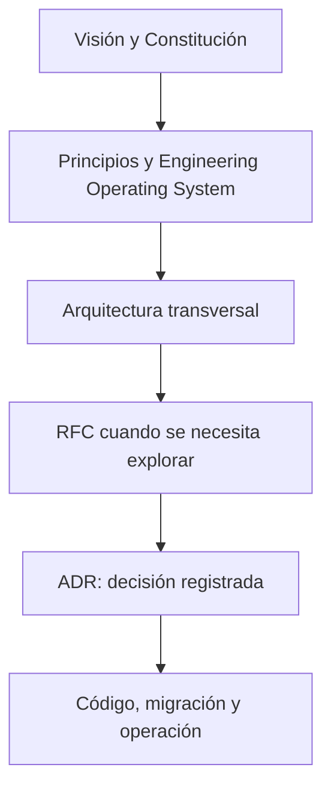

# Architecture Decision Records de CRUMAFOOD Platform

> **Una decisión importante debe poder entenderse sin depender de la memoria de quien la tomó.**

## Estado del documento

| Campo | Valor |
|---|---|
| Estado | Aprobado |
| Versión | 1.0 |
| Propietarios | Product Owner y responsable de arquitectura |
| Aprobado por | Product Owner de CRUMAFOOD Platform |
| Fecha de aprobación | 2026-08-01 |
| Estado de implementación | Operativo de forma manual; existen índice, plantilla y quince ADR numerados: ADR-0012 y ADR-0013 están Aceptados y los trece restantes continúan Propuestos; permanece pendiente automatizar las validaciones ADR en CI |
| Base de evidencia | Revisión de `docs/architecture/adr/README.md`, `0000-template.md`, los ADR 0001–0015 y `.github/workflows/ci.yml`; numeración e índice presentes, sin verificaciones automatizadas de nombres, metadata, estados, enlaces o reemplazos |
| Alcance | Registro, numeración, estados, creación, aprobación, reemplazo y mantenimiento de ADR |
| Autoridad | Derivado de `docs/engineering/constitution.md`, `docs/engineering/engineering-principles.md`, `docs/engineering/engineering-operating-system.md`, `docs/architecture/README.md`, `docs/vision.md` y el CES |
| Revisión | Cuando cambie el proceso de decisiones, plantilla, estados, autoridad o convención de almacenamiento |

---

## 1. Propósito

Este directorio conserva las decisiones arquitectónicas significativas de CRUMAFOOD Platform.

Su propósito es:

- explicar qué se decidió;
- conservar el contexto;
- mostrar alternativas;
- hacer visibles los trade-offs;
- registrar consecuencias;
- vincular evidencia;
- evitar discusiones repetidas;
- y permitir que una decisión sea reemplazada sin borrar su historia.

---

## 2. Qué es un ADR

Un Architecture Decision Record es un registro breve de una decisión arquitectónica importante, su contexto y sus consecuencias.

Un ADR responde:

- ¿qué problema exigía una decisión?;
- ¿qué fuerzas importaban?;
- ¿qué opciones se evaluaron?;
- ¿qué se eligió?;
- ¿por qué?;
- ¿qué consecuencias se aceptaron?;
- y ¿cómo se verificará?

---

## 3. Qué no es un ADR

Un ADR no es:

- una lluvia de ideas;
- una especificación completa;
- un roadmap;
- un ticket;
- un runbook;
- una guía de instalación;
- una aprobación de producto;
- ni una justificación retroactiva sin evidencia.

Un ADR Aceptado registra una decisión tomada.

Un ADR Propuesto documenta la decisión solicitada y su razonamiento, pero todavía no tiene autoridad.

---

## 4. Jerarquía



Un ADR no puede contradecir un documento de mayor autoridad sin actualizar o reemplazar formalmente el marco correspondiente.

---

## 5. Relación con la arquitectura

Los documentos de [arquitectura](../README.md) definen principios, límites y dirección.

Los ADR:

- cierran decisiones pendientes;
- eligen entre alternativas;
- autorizan cambios significativos;
- y explican excepciones duraderas.

Un ADR deberá enlazar los documentos que afecta.

---

## 6. Relación con RFC

Se usará RFC cuando:

- el problema no esté comprendido;
- existan varias opciones materiales;
- se requiera discusión;
- falte evidencia;
- se necesite un spike;
- o participen varios dominios.

El RFC explora.

El ADR registra el resultado.

---

## 7. Relación con tickets

El ticket organiza trabajo.

El ADR conserva la decisión.

Un ADR podrá enlazar:

- iniciativa;
- epic;
- issue;
- Pull Request;
- migración;
- release;
- y runbook.

Cerrar un ticket no vuelve obsoleta una decisión.

---

## 8. Cuándo crear un ADR

Se creará un ADR cuando una decisión:

- afecte estructura o dependencias;
- establezca una tecnología o proveedor relevante;
- defina un patrón compartido;
- modifique límites entre módulos;
- establezca estrategia de datos;
- establezca estrategia de seguridad;
- establezca estrategia offline;
- establezca estrategia de integración;
- cambie una unidad desplegable;
- reemplace una decisión previa;
- o sea probable que alguien pregunte en el futuro por qué el sistema se diseñó así.

---

## 9. Cuándo no crear un ADR

No se necesita ADR para:

- refactor local reversible;
- corrección de defecto sin cambio de contrato;
- dependencia interna trivial;
- estilo ya gobernado;
- configuración operativa rutinaria;
- o implementación directa de una decisión vigente.

La ausencia de ADR no elimina la necesidad de pruebas, revisión y documentación apropiadas.

---

## 10. Umbral de decisión

El nivel de formalidad crecerá con:

- irreversibilidad;
- alcance;
- riesgo;
- costo;
- seguridad;
- impacto en datos;
- dependencia de proveedor;
- y tiempo de vida.

Ante duda, se preferirá un ADR breve a una decisión importante perdida.

---

## 11. Ubicación

Los ADR viven en:

```text
docs/architecture/adr/
```

La carpeta contendrá:

- este índice;
- la plantilla;
- y decisiones numeradas.

No se dispersarán ADR en módulos sin un índice central.

---

## 12. Convención de nombres

El formato será:

```text
NNNN-titulo-descriptivo.md
```

Ejemplos:

- `0000-template.md`;
- `0001-tenant-isolation-model.md`;
- `0002-schema-baseline-and-migrations.md`.

El título usará inglés o términos técnicos estables en kebab-case; el contenido oficial permanecerá en español.

---

## 13. Numeración

- `0000` queda reservado para la plantilla;
- las decisiones comienzan en `0001`;
- los números aumentan secuencialmente;
- un número no se reutiliza;
- un ADR rechazado conserva su número;
- y un ADR reemplazado conserva su archivo.

La numeración expresa secuencia de registro, no prioridad.

---

## 14. Reserva de número

Un número se asignará cuando exista un borrador listo para revisión.

No se reservarán números indefinidamente para ideas.

Si dos propuestas compiten, se coordinarán antes de merge.

El índice se actualizará en el mismo Pull Request.

---

## 15. Título

El título describirá la decisión.

Se preferirá:

- “Usar aislamiento lógico por fila para tenants”;
- “Adoptar Tauri 2 para el cliente Desktop”;
- “Usar OpenTelemetry como estándar de instrumentación”.

Se evitarán títulos vagos como “Arquitectura nueva” o “Mejorar sistema”.

---

## 16. Idioma

El contenido se escribirá en español.

Los nombres propios y términos técnicos conservarán su forma habitual:

- PostgreSQL;
- Supabase;
- Tauri;
- OpenTelemetry;
- Tenant;
- RLS;
- SLO;
- y Design System.

Los términos ambiguos se definirán.

---

## 17. Metadata

Cada ADR incluirá:

| Campo | Propósito |
|---|---|
| Estado | Situación de la decisión |
| Fecha | Fecha ISO de decisión o propuesta |
| Decisores | Roles responsables |
| Consultados | Roles o áreas que aportaron |
| Informados | Áreas afectadas |
| Propietario | Rol responsable de mantener la decisión |
| Alcance | Sistemas, módulos o procesos |
| Reemplaza | ADR anterior, si aplica |
| Reemplazado por | ADR sucesor, si aplica |
| RFC relacionado | Exploración previa, si aplica |
| Issues relacionados | Trabajo o evidencia vinculada, si aplica |

No se incluirán datos personales innecesarios.

---

## 18. Estados

Los estados válidos son:

| Estado | Significado |
|---|---|
| Propuesto | Listo para revisión, aún sin autoridad |
| Aceptado | Decisión vigente |
| Rechazado | Evaluado y no elegido |
| Deprecado | Vigente solo durante transición |
| Reemplazado | Sustituido por otro ADR |

No se usarán estados ambiguos como “Final”.

`Plantilla` es una clasificación exclusiva del índice para `0000-template.md`; no es un estado válido para una decisión real.

---

## 19. Estado Propuesto

Un ADR Propuesto:

- contiene contexto suficiente;
- presenta opciones reales;
- identifica trade-offs;
- propone una decisión;
- y define validación.

Todavía puede cambiar durante revisión.

No autoriza por sí solo una migración irreversible.

---

## 20. Estado Aceptado

Un ADR Aceptado:

- fue aprobado por la autoridad adecuada;
- tiene fecha;
- tiene consecuencias entendidas;
- y se convierte en referencia vigente.

La implementación deberá enlazarlo.

Aceptar no significa que todo ya esté implementado.

---

## 21. Estado Rechazado

Un ADR Rechazado conserva:

- contexto;
- opciones;
- razones;
- y fecha.

Esto evita repetir la misma evaluación sin nueva evidencia.

Una opción podrá reconsiderarse mediante un ADR nuevo.

---

## 22. Estado Deprecado

Deprecado significa que la decisión:

- se está retirando;
- aún tiene consumidores;
- mantiene autoridad limitada;
- y posee plan de salida.

El ADR indicará plazo y sucesor esperado cuando exista.

---

## 23. Estado Reemplazado

Un ADR Reemplazado:

- no se elimina;
- enlaza el ADR sucesor;
- conserva contexto histórico;
- y deja de ser autoridad para nuevas implementaciones.

El nuevo ADR enlazará explícitamente al anterior.

---

## 24. Inmutabilidad

Después de Aceptado, el contenido decisorio no se reescribirá para reflejar el presente.

Se permiten correcciones no semánticas:

- ortografía;
- enlaces;
- formato;
- y metadata de reemplazo.

Un cambio de decisión requiere un ADR nuevo.

---

## 25. Contexto

El contexto describirá:

- situación;
- problema;
- restricciones;
- hechos;
- estado actual;
- y razón para decidir ahora.

No presentará una solución elegida como si fuera el problema.

---

## 26. Fuerzas

Las fuerzas podrán incluir:

- valor de negocio;
- seguridad;
- integridad;
- privacidad;
- rendimiento;
- disponibilidad;
- costo;
- experiencia;
- skills del equipo;
- reversibilidad;
- portabilidad;
- operación;
- y tiempo.

Se harán visibles los conflictos entre ellas.

---

## 27. Opciones

Se documentarán opciones materialmente distintas.

Cada opción incluirá:

- descripción;
- ventajas;
- desventajas;
- riesgos;
- costo;
- y condiciones.

“No hacer nada” se incluirá cuando sea una alternativa real.

---

## 28. Decisión

La decisión será:

- concreta;
- verificable;
- acotada;
- y redactada en presente.

Indicará tanto lo elegido como los límites.

No se mezclará una docena de decisiones independientes en un ADR.

---

## 29. Consecuencias

Se registrarán consecuencias:

- positivas;
- negativas;
- neutrales;
- inmediatas;
- y futuras.

Una consecuencia incómoda no se ocultará.

Las obligaciones de implementación quedarán claras.

---

## 30. Riesgos y controles

Cada riesgo material tendrá:

- probabilidad o condición;
- impacto;
- control;
- propietario;
- y señal de seguimiento.

No todos los riesgos se eliminan; algunos se aceptan explícitamente.

---

## 31. Plan de transición

Cuando la decisión cambie el sistema, se documentará:

- estado inicial;
- fases;
- compatibilidad;
- migración;
- rollback o roll-forward;
- observabilidad;
- y retiro.

El ADR no necesita sustituir un plan detallado, pero deberá enlazarlo.

---

## 32. Validación

La decisión indicará cómo demostrar que funciona:

- spike;
- prueba;
- benchmark;
- revisión de seguridad;
- piloto;
- restore drill;
- métricas;
- SLO;
- o evidencia de usuario.

La validación deberá ser proporcional al riesgo.

---

## 33. Autoridad de decisión

Las decisiones se tomarán en el nivel más cercano al conocimiento relevante.

Participarán según alcance:

- Product Owner;
- responsable de arquitectura;
- dueño de módulo;
- seguridad;
- datos;
- operación;
- diseño;
- y personas usuarias.

La autoridad final se declarará antes de aprobar.

---

## 34. Aprobación

Un ADR se acepta mediante:

1. revisión del contexto;
2. revisión de opciones;
3. confirmación de autoridad;
4. resolución de objeciones;
5. registro de decisión;
6. actualización del estado;
7. y merge.

La aprobación verbal deberá quedar reflejada en el repositorio.

---

## 35. Desacuerdo

Los desacuerdos se resolverán mediante:

- principios;
- restricciones;
- evidencia;
- consecuencias;
- y autoridad explícita.

Cuando falte certeza se preferirá la alternativa más simple, reversible y observable que preserve compromisos esenciales.

---

## 36. Pull Request

El Pull Request del ADR incluirá:

- contexto;
- participantes;
- documentos afectados;
- issue o RFC;
- evidencia;
- y decisión solicitada.

No mezclará una implementación grande antes de aceptar la decisión, salvo spike claramente descartable.

---

## 37. Implementación

Los Pull Requests de implementación enlazarán el ADR Aceptado.

Cada implementación indicará:

- alcance cubierto;
- pruebas;
- migración;
- observabilidad;
- documentación;
- y trabajo pendiente.

El estado del ADR no se usa para indicar porcentaje de implementación.

---

## 38. Seguridad

Un ADR no incluirá:

- secretos;
- tokens;
- credenciales;
- datos personales;
- detalles explotables innecesarios;
- ni URLs privadas con acceso.

La evidencia sensible se almacenará en el sistema autorizado y se enlazará de forma segura.

---

## 39. Evidencia

Las afirmaciones relevantes se respaldarán con:

- código;
- configuración;
- esquema;
- benchmark;
- prueba;
- incidente;
- documentación oficial;
- costo;
- o resultado de spike.

La popularidad de una tecnología no será evidencia suficiente.

---

## 40. Revisión posterior

Una decisión se revisará cuando:

- falle un supuesto;
- cambie una restricción;
- aparezca un incidente;
- se alcance un trigger;
- cambie un proveedor;
- crezca el sistema;
- o expire una condición.

La revisión puede confirmar, deprecar o reemplazar el ADR.

---

## 41. Índice de decisiones

| ADR | Título | Estado | Fecha | Reemplaza |
|---|---|---|---|---|
| [0000](0000-template.md) | Plantilla de Architecture Decision Record | Plantilla | — | — |
| [0001](0001-tenant-isolation-model.md) | Adoptar Tenant técnico con aislamiento lógico por fila | Propuesto | 2026-07-12 | — |
| [0002](0002-schema-baseline-and-migrations.md) | Establecer baseline y migraciones canónicas de PostgreSQL/Supabase | Propuesto | 2026-07-12 | — |
| [0003](0003-authorization-model.md) | Adoptar RBAC con permisos canónicos y scopes jerárquicos | Propuesto | 2026-07-12 | — |
| [0004](0004-desktop-tauri-topology.md) | Adoptar Tauri 2 con frontend local y API versionada | Propuesto | 2026-07-12 | — |
| [0005](0005-offline-sync-strategy.md) | Adoptar sincronización offline por comandos y proyecciones | Propuesto | 2026-07-12 | — |
| [0006](0006-event-outbox-inbox.md) | Adoptar eventos de integración con outbox e inbox transaccionales | Propuesto | 2026-07-12 | — |
| [0007](0007-ci-cd-pipeline.md) | Adoptar GitHub Actions como pipeline CI/CD gobernado | Propuesto | 2026-07-12 | — |
| [0008](0008-observability-provider.md) | Adoptar Sentry como plataforma inicial de observabilidad de aplicación | Propuesto | 2026-07-12 | — |
| [0009](0009-service-level-and-recovery-objectives.md) | Adoptar objetivos iniciales de servicio y recuperación por criticidad | Propuesto | 2026-07-12 | — |
| [0010](0010-cache-strategy.md) | Adoptar caché explícita, scoped y orientada a frescura | Propuesto | 2026-07-12 | — |
| [0011](0011-canonical-design-token-format.md) | Adoptar DTCG JSON como formato canónico de design tokens | Propuesto | 2026-07-12 | — |
| [0012](0012-storybook-and-visual-testing.md) | Adoptar Storybook y regresión visual selectiva con Playwright | Propuesto | 2026-07-12 | — |
| [0013](0013-node-and-package-manager.md) | Adoptar Node.js 24 LTS y pnpm 10 como toolchain JavaScript | Aceptado | 2026-08-01 | — |
| [0014](0014-supabase-environment-isolation.md) | Separar Supabase por entorno y usar branches efímeras en Preview | Propuesto | 2026-07-12 | — |
| [0015](0015-backup-and-restore-strategy.md) | Adoptar backups multicapa y restauración verificada | Propuesto | 2026-07-12 | — |

Las decisiones numeradas se agregarán al ser propuestas.

`0000-template.md` permanecerá como plantilla y se excluirá del conteo de decisiones propuestas, aceptadas, rechazadas, deprecadas o reemplazadas.

---

## 42. Backlog inicial sin numerar

No quedan decisiones candidatas sin numerar en el backlog inicial.

Las nuevas candidatas se agregarán aquí hasta que tengan un borrador listo para revisión y reciban un número conforme a este registro.

---

## 43. Priorización

La prioridad se determinará por:

- bloqueo de implementación;
- riesgo;
- dependencia;
- irreversibilidad;
- seguridad;
- datos;
- y costo de retraso.

La numeración no será un ranking.

El primer ADR no se elegirá solo por ser fácil de redactar.

---

## 44. Decisiones urgentes

Una decisión urgente podrá usar un ADR breve si:

- existe autoridad;
- se documentan riesgos;
- hay control compensatorio;
- y se programa revisión.

La urgencia no justifica omitir seguridad, integridad o trazabilidad.

---

## 45. Excepciones

Una excepción a un ADR Aceptado deberá:

- identificar ADR;
- explicar motivo;
- limitar alcance;
- definir compensación;
- tener propietario;
- tener vencimiento;
- y registrar cierre.

Una excepción repetida puede indicar que el ADR debe revisarse.

---

## 46. Automatización

CI deberá verificar progresivamente:

- nombre de archivo;
- numeración;
- metadata;
- estado válido;
- enlaces;
- referencias de reemplazo;
- y actualización del índice.

La automatización no sustituirá revisión del razonamiento.

---

## 47. Definition of Done de un ADR

Un ADR está terminado cuando:

- tiene problema claro;
- presenta opciones;
- registra decisión;
- declara consecuencias;
- identifica riesgos;
- define validación;
- tiene autoridad;
- enlaza documentos;
- actualiza este índice;
- y su estado coincide con la realidad.

---

## 48. Antipatrones

Se evitará:

- ADR sin decisión;
- decisión sin alternativas;
- título vago;
- mezclar varias decisiones;
- ocultar consecuencias;
- borrar un ADR rechazado;
- editar historia;
- asignar números a ideas;
- aceptar sin autoridad;
- documentar secretos;
- y usar ADR como sustituto de diseño detallado.

---

## 49. Criterios de conformidad

El registro será conforme cuando:

- toda decisión material tenga ADR;
- el índice esté actualizado;
- los estados sean honestos;
- los enlaces funcionen;
- los reemplazos sean bidireccionales;
- las implementaciones enlacen su decisión;
- y la historia permanezca disponible.

---

## 50. Próximo paso

Los ADR 0001–0015 se evaluarán individualmente según:

- dependencia;
- riesgo;
- evidencia;
- reversibilidad;
- y preparación de la decisión.

La selección no seguirá únicamente el número.

Cada ADR permanecerá Propuesto hasta confirmar autoridad, resolver las preguntas que cambien la decisión y obtener evidencia proporcional al riesgo.

---

## 51. Referencias

- [Índice de arquitectura](../README.md)
- [Engineering Operating System](../../engineering/engineering-operating-system.md)
- [Principios de ingeniería](../../engineering/engineering-principles.md)
- [Constitución](../../engineering/constitution.md)
- [Visión de producto](../../vision.md)

---

## 52. Declaración final

> **CRUMAFOOD conservará sus decisiones como parte del producto. Un ADR permitirá comprender no solo qué arquitectura existe, sino por qué fue elegida, qué costo aceptó y cuándo deberá reconsiderarse.**
