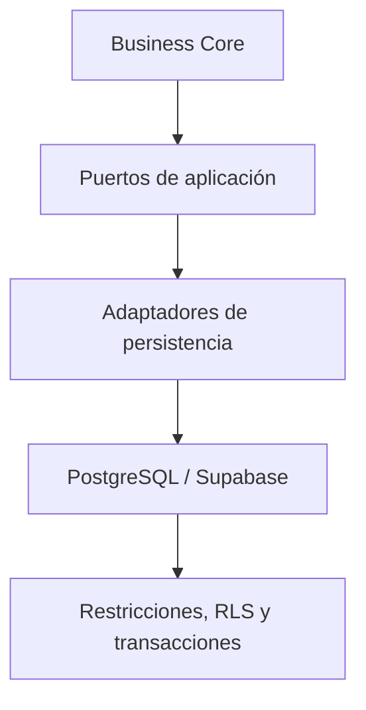

# Arquitectura de Datos de CRUMAFOOD Platform

> **Los datos representan hechos del negocio. Deben ser íntegros, trazables, protegidos y recuperables.**

## Estado del documento

| Campo | Valor |
|---|---|
| Estado | Propuesto para aprobación |
| Versión | 1.0 |
| Propietarios | Product Owner, responsable de arquitectura y responsable de datos |
| Alcance | Persistencia, propiedad, integridad, seguridad, evolución y operación de datos |
| Autoridad | Derivado de `system-overview.md`, `business-core.md`, la Constitución y los Principios del CES |
| Revisión | Cuando cambie la fuente de autoridad, el modelo de aislamiento, la estrategia de migraciones o una frontera de datos |

---

## 1. Propósito

Este documento define cómo CRUMAFOOD Platform debe modelar, almacenar, proteger, consultar, evolucionar y recuperar sus datos.

Su propósito es asegurar que:

- PostgreSQL conserve el estado transaccional compartido de forma confiable;
- cada dato tenga propietario y significado de negocio;
- las invariantes se protejan en la fuente de autoridad;
- inventario, lotes, producción, compras y ventas sean trazables;
- seguridad y aislamiento no dependan únicamente de la interfaz;
- los cambios de esquema sean reproducibles;
- los datos derivados puedan explicarse y reconstruirse;
- y una falla no deje al negocio en un estado ambiguo.

Este documento gobierna la arquitectura de datos. No reemplaza el catálogo técnico de tablas, los diccionarios de campos, las migraciones SQL ni los ADR.

---

## 2. Declaración arquitectónica

> **PostgreSQL, operado actualmente mediante Supabase, es la fuente de autoridad del estado transaccional compartido de CRUMAFOOD Platform.**

Supabase es un proveedor e interfaz de infraestructura. No es el modelo de dominio.

Las reglas del negocio no deberán depender de:

- nombres de tablas;
- objetos del cliente Supabase;
- respuestas PostgREST;
- componentes React;
- formularios;
- ni detalles particulares del proveedor.

El Business Core define intención e invariantes. PostgreSQL protege integridad y atomicidad. La infraestructura traduce entre ambos.

---

## 3. Alcance

Esta arquitectura cubre:

- datos maestros;
- datos transaccionales;
- movimientos de inventario;
- lotes y caducidades;
- documentos operativos;
- costos y dinero;
- identidad, autorización y alcance;
- auditoría;
- vistas y datos derivados;
- eventos persistidos;
- migraciones;
- seguridad y RLS;
- rendimiento;
- respaldo y recuperación;
- retención y eliminación;
- y calidad de datos.

Quedan fuera de este documento:

- el diseño visual de pantallas;
- la selección detallada de herramientas analíticas;
- un data warehouse empresarial;
- machine learning;
- y la definición campo por campo de cada tabla.

Estas materias tendrán documentos específicos cuando el riesgo o la escala lo justifiquen.

---

## 4. Principios rectores

La arquitectura de datos obedecerá los siguientes principios:

1. una sola fuente de autoridad por hecho;
2. propiedad explícita por módulo;
3. integridad antes que conveniencia;
4. hechos transaccionales trazables;
5. mínimo privilegio;
6. cambios reproducibles y reversibles;
7. consistencia proporcional al riesgo;
8. datos derivados reconstruibles;
9. historial suficiente para explicar decisiones;
10. optimización basada en evidencia.

Cuando dos principios entren en tensión, se priorizarán seguridad, integridad, trazabilidad y continuidad operativa.

---

## 5. Estado actual

El repositorio refleja una plataforma funcional en evolución.

El levantamiento actual identifica:

- PostgreSQL/Supabase como persistencia principal;
- acceso a datos desde Server Components, Server Actions y rutas;
- al menos 37 relaciones o vistas detectables mediante referencias directas, además de relaciones usadas en llamadas distribuidas en varias líneas;
- funciones PostgreSQL para operaciones específicas;
- modelos operativos de catálogo, inventario, compras, producción, ventas, picking y cobranza;
- borrado lógico en varios maestros;
- vistas de stock, ATP y FEFO;
- y operaciones multi-paso implementadas parcialmente desde la aplicación.

También se identifican brechas:

- no existe todavía un historial SQL completo y reproducible dentro del repositorio;
- los directorios de migraciones, esquemas y tipos contienen marcadores, no contratos ejecutables;
- `database-map.md` expresa una visión parcial y no representa por sí solo el esquema desplegado;
- parte del acceso a Supabase está distribuido entre páginas y acciones;
- algunas operaciones relacionadas se ejecutan como escrituras independientes;
- y no existe evidencia en el repositorio que permita verificar todas las políticas RLS, restricciones, índices, triggers y funciones desplegadas.

Por tanto, la base desplegada contiene conocimiento arquitectónico que todavía debe trasladarse al repositorio.

---

## 6. Estado objetivo

El estado objetivo tendrá:

- esquema versionado como código;
- migraciones aplicables desde cero;
- tipos generados y versionados;
- propiedad de datos por módulo;
- repositorios y adaptadores de persistencia;
- restricciones estructurales explícitas;
- RLS verificable;
- transacciones atómicas para flujos críticos;
- idempotencia en comandos reintentables;
- auditoría de operaciones sensibles;
- vistas y proyecciones con propietario;
- respaldo con restauración probada;
- y controles automatizados contra deriva.

La transición será incremental. No requiere reescribir toda la aplicación antes de mejorar la integridad.



---

## 7. Jerarquía de autoridad

Cuando existan discrepancias, se aplicará esta jerarquía:

1. migraciones aprobadas y aplicadas;
2. restricciones y contratos activos de PostgreSQL;
3. decisiones ADR vigentes;
4. este documento;
5. contratos de aplicación y tipos generados;
6. documentación de tablas y diagramas;
7. código de interfaz;
8. documentos históricos o exploratorios.

`database-map.md` se tratará como material de intención hasta reconciliarlo con migraciones y propiedad modular.

Ningún diagrama manual será autoridad superior al esquema versionado.

---

## 8. Dominios de datos

Los datos se organizan por capacidad de negocio, no por pantalla.

| Dominio | Responsabilidad de datos |
|---|---|
| Catalog | Productos, materias primas, categorías, familias, sabores, preparación y unidades descriptivas |
| Inventory | Movimientos, reservas, disponibilidad y saldos derivados |
| Warehouse | Almacenes, ubicaciones y estructura física |
| Production | Recetas operativas, órdenes, consumos, resultados y estados de fabricación |
| Purchasing | Proveedores, requisiciones, órdenes y recepciones de compra |
| Sales | Clientes, pedidos, líneas, compromisos comerciales y cobranza originada por venta |
| Quality | Estado de liberación, bloqueo, inspección y disposición de lotes |
| Costing | Costos de materiales, producción, variaciones y reglas de valorización |
| Distribution | Picking, despacho, entrega e incidencias logísticas |
| Identity & Access | Usuarios, organizaciones, roles, permisos y alcances operativos |
| Planning | Pronósticos, necesidades y recomendaciones de abastecimiento o producción |
| System Operations | Jobs, notificaciones técnicas y registros operativos controlados |

La ubicación física de una tabla no altera su propietario lógico.

---

## 9. Propiedad de datos

Cada relación deberá declarar:

- módulo propietario;
- significado;
- clave primaria;
- alcance organizacional;
- invariantes;
- política de escritura;
- política de lectura;
- clasificación de seguridad;
- retención;
- y estrategia de auditoría.

Solo el módulo propietario modifica directamente su estado.

Otros módulos deberán utilizar:

- casos de uso;
- puertos;
- funciones controladas;
- eventos;
- o proyecciones de lectura aprobadas.

Una clave foránea permite relacionar datos, pero no concede propiedad sobre ellos.

---

## 10. Inventario preliminar de relaciones

El código actual referencia las siguientes relaciones o vistas. La agrupación representa propiedad objetivo preliminar y deberá validarse contra el esquema desplegado.

### 10.1 Catalog

- `categories`;
- `families`;
- `flavors`;
- `preparation_types`;
- `product_families`;
- `products`;
- `raw_materials`;
- `units_of_measure`;
- `recipes`;
- `recipe_items`.

### 10.2 Inventory y Warehouse

- `warehouses`;
- `inventory_locations`;
- `inventory_movements`;
- `inventory_reservations`;
- `product_lots`;
- `raw_material_lots`;
- `inventory_stock`;
- `inventory_stock_by_item`;
- `inventory_available_to_promise`;
- `inventory_product_lots_fefo`.

### 10.3 Purchasing

- `suppliers`;
- `purchase_orders`;
- `purchase_order_items`.

El código también utiliza requisiciones de compra; sus relaciones deberán incorporarse al catálogo canónico aunque no aparezcan en todos los barridos estáticos.

### 10.4 Production, Planning y Costing

- `production_orders`;
- `production_order_items`;
- `production_costs`;
- `demand_forecasts`;
- `approvals`.

### 10.5 Sales y Distribution

- `customers`;
- `sales_orders`;
- `sales_order_items`;
- `picking_orders`;
- `picking_order_items`;
- `accounts_receivable`.

La cobranza utiliza además pagos asociados a cuentas por cobrar; deberán registrarse en el catálogo canónico.

### 10.6 Identity y System Operations

- `user_roles`;
- `notifications`;
- `orders`.

`orders` deberá clasificarse como modelo vigente, legado o compatibilidad. No coexistirá indefinidamente con `sales_orders` sin una decisión explícita.

Este inventario no sustituye la introspección del esquema ni una migración baseline.

---

## 11. Convenciones de nombres

En PostgreSQL se utilizará:

- `snake_case` para esquemas, tablas, vistas, columnas, funciones e índices;
- nombres plurales para relaciones de entidades;
- nombres en pasado o sustantivos de hecho para eventos persistidos;
- sufijo `_id` para referencias;
- sufijo `_at` para instantes;
- sufijo `_date` para fechas sin hora;
- sufijo `_amount` para dinero cuando el contexto lo requiera;
- sufijo `_quantity` para cantidades;
- y nombres que expresen negocio, no la pantalla que los consume.

Las restricciones e índices tendrán nombres predecibles:

- `pk_<table>`;
- `fk_<table>__<column>`;
- `uq_<table>__<columns>`;
- `ck_<table>__<rule>`;
- `idx_<table>__<columns>`.

No se usarán abreviaturas ambiguas.

---

## 12. Identificadores

Las entidades utilizarán identificadores estables, opacos y no reutilizables.

La opción predeterminada será UUID.

Los números visibles del negocio, como folios, órdenes o lotes:

- no sustituirán la clave primaria;
- tendrán unicidad dentro de un alcance definido;
- se generarán de manera segura ante concurrencia;
- conservarán reglas de formato separadas;
- y no dependerán únicamente de `Date.now()` cuando exista riesgo de colisión.

Una relación deberá referenciar identificadores, no nombres mutables.

---

## 13. Alcance organizacional y multi-tenancy

El modelo actual contiene intención multi-tenant en `database-map.md`, mientras el esquema real debe ser verificado.

Antes de declarar multi-tenancy productivo se aprobará un ADR que defina:

- unidad de aislamiento;
- nombre canónico del alcance, por ejemplo `tenant_id` u `organization_id`;
- relación entre empresa, sucursal, almacén y usuario;
- estrategia de RLS;
- unicidades por alcance;
- administración privilegiada;
- y migración de los datos existentes.

Si una tabla es multi-tenant:

- la clave de alcance será obligatoria;
- las referencias deberán impedir cruces accidentales;
- las unicidades incluirán el alcance cuando corresponda;
- los índices comenzarán por el alcance en patrones frecuentes;
- y RLS verificará el alcance desde atributos confiables.

No se asumirá que ocultar registros en la UI proporciona aislamiento.

---

## 14. Integridad estructural

PostgreSQL protegerá todas las invariantes que pueda expresar de forma estable.

Se utilizarán:

- claves primarias;
- claves foráneas;
- `NOT NULL`;
- `UNIQUE`;
- `CHECK`;
- tipos apropiados;
- valores predeterminados controlados;
- restricciones de exclusión cuando sean necesarias;
- y triggers únicamente cuando su responsabilidad esté documentada.

Ejemplos:

- una cantidad recibida no puede ser negativa;
- una línea debe pertenecer a su documento;
- un código no se duplica dentro de su alcance;
- un lote referencia un artículo existente;
- un estado pertenece al conjunto permitido;
- y una reserva no puede liberar más de lo reservado.

La validación en TypeScript mejora la experiencia, pero no reemplaza estas protecciones.

---

## 15. Estados y transiciones

Los documentos operativos tendrán estados explícitos y transiciones autorizadas.

Ejemplos:

- orden de compra;
- orden de producción;
- pedido de venta;
- recepción;
- picking;
- lote;
- aprobación;
- cuenta por cobrar.

No se actualizará un estado crítico mediante una escritura genérica.

La transición deberá comprobar:

- estado anterior esperado;
- permiso;
- precondiciones;
- efectos relacionados;
- actor;
- fecha efectiva;
- e idempotencia cuando aplique.

Los estados se representarán con `CHECK`, tipo enumerado o tabla de referencia según su estabilidad y necesidad de configuración.

---

## 16. Transacciones y unidad de trabajo

Una operación es atómica cuando todos sus efectos se confirman o ninguno lo hace.

Requieren transacción, entre otras:

- recibir una compra, crear el lote, registrar el movimiento y actualizar el documento;
- consumir materiales y avanzar una orden de producción;
- terminar producción, crear lote y registrar entrada;
- reservar o liberar inventario;
- confirmar picking y descontar el lote;
- entregar un pedido y generar la cuenta por cobrar;
- aprobar y materializar una recomendación;
- y persistir un cambio junto con su evento de outbox.

Estas operaciones no se implementarán como llamadas independientes desde la interfaz si una falla intermedia puede dejar datos inválidos.

La transacción vivirá en:

- una función PostgreSQL controlada;
- un adaptador transaccional;
- o una unidad de trabajo de infraestructura.

El dominio no dependerá del mecanismo de transacción.

---

## 17. Concurrencia

Las operaciones que leen un estado y luego escriben deberán contemplar cambios concurrentes.

Casos prioritarios:

- stock disponible;
- reservas;
- lotes;
- recepción acumulada;
- folios;
- transiciones de estado;
- aprobación;
- y pagos.

Las estrategias permitidas incluyen:

- actualización condicional;
- bloqueo de filas;
- control optimista mediante versión;
- restricciones;
- niveles de aislamiento apropiados;
- y funciones atómicas.

No se aceptará el patrón leer-calcular-actualizar sin una protección proporcional al riesgo.

---

## 18. Idempotencia

Todo comando crítico que pueda repetirse por red, reintento, doble clic, webhook o sincronización móvil deberá ser idempotente.

La persistencia de idempotencia incluirá:

- clave;
- alcance;
- tipo de operación;
- huella de la solicitud cuando corresponda;
- estado de procesamiento;
- resultado;
- y vencimiento si es seguro eliminarla.

Dos solicitudes con la misma clave e intención devolverán el mismo resultado lógico.

La misma clave con contenido incompatible será rechazada.

---

## 19. Inventario como libro de movimientos

El inventario no se modelará únicamente como un campo editable de stock.

`inventory_movements` representa hechos trazables.

Cada movimiento deberá conservar, según corresponda:

- artículo y tipo de artículo;
- cantidad;
- unidad;
- dirección o naturaleza del movimiento;
- almacén y ubicación;
- lote;
- documento de origen;
- causa;
- actor;
- fecha efectiva;
- fecha de registro;
- clave de idempotencia;
- y operación correlacionada.

Los saldos serán proyecciones derivadas del libro de movimientos o tablas de balance mantenidas atómicamente con él.

No se corregirá un hecho histórico mediante edición silenciosa. Se registrará un ajuste o reversión relacionado con el movimiento original.

---

## 20. Disponibilidad, reservas y ATP

Se distinguirá entre:

- existencia física;
- existencia reservada;
- existencia bloqueada;
- existencia disponible;
- disponibilidad prometible;
- y existencia en tránsito.

La fórmula canónica de ATP deberá definirse y tener un único propietario.

`inventory_stock`, `inventory_stock_by_item` e `inventory_available_to_promise` se tratarán como proyecciones hasta documentar su implementación exacta.

Toda reserva tendrá:

- origen;
- cantidad;
- estado;
- fecha de creación;
- fecha de expiración cuando aplique;
- y liberación o consumo trazable.

---

## 21. Lotes, FEFO y trazabilidad

Los lotes deberán permitir rastrear materiales recibidos, consumos, producción terminada y salidas.

Un lote conservará, según el tipo:

- número de lote;
- artículo;
- proveedor u orden de producción de origen;
- cantidad inicial y saldo;
- unidad;
- fecha de fabricación;
- fecha de caducidad;
- estado de calidad;
- almacén y ubicación;
- y referencias de trazabilidad.

FEFO asignará primero el lote elegible con vencimiento más próximo.

La elegibilidad deberá considerar:

- liberación de calidad;
- bloqueo;
- saldo;
- reserva;
- ubicación;
- caducidad;
- y reglas del producto.

`inventory_product_lots_fefo` será una proyección de lectura, no una autoridad independiente.

---

## 22. Unidades y cantidades

Toda cantidad relevante tendrá valor y unidad.

Reglas:

- se utilizará `numeric`, no punto flotante, para cantidades de negocio;
- la precisión y escala se definirán por uso;
- cada artículo tendrá unidad base;
- las conversiones serán explícitas y versionables;
- no se sumarán cantidades incompatibles;
- la receta declarará la unidad de cada ingrediente;
- y el redondeo se realizará en un límite definido.

Una conversión no se inferirá por nombre, presentación o interfaz.

El modelo canónico de unidades requiere ADR antes de una normalización amplia.

---

## 23. Dinero y costos

Todo valor monetario tendrá:

- importe;
- moneda;
- precisión;
- regla de redondeo;
- fecha o contexto de valoración;
- y fuente.

Se utilizará `numeric`, no `float`.

Se distinguirán:

- precio;
- costo de compra;
- costo promedio;
- costo estándar;
- costo real de producción;
- impuesto;
- descuento;
- pago;
- saldo;
- y margen.

Los totales materializados deberán poder reconciliarse con sus líneas y conservar la política de cálculo utilizada.

Una corrección de costo histórico no reescribirá silenciosamente decisiones ya contabilizadas.

---

## 24. Tiempo y zonas horarias

Los instantes se almacenarán como `timestamptz` y se interpretarán en UTC.

La presentación utilizará la zona horaria del contexto operativo, inicialmente compatible con `America/Mexico_City` cuando corresponda.

Se diferenciará entre:

- instante técnico;
- fecha de negocio;
- hora local de operación;
- fecha de fabricación;
- fecha de caducidad;
- y periodo contable.

Una fecha sin hora se almacenará como `date`.

`created_at` representa registro. No sustituye `occurred_at`, `effective_at`, `received_at`, `manufactured_on` o `expires_on`.

---

## 25. Ciclo de vida y eliminación

Los datos maestros podrán utilizar borrado lógico cuando deban conservar referencias históricas.

El patrón será:

- `deleted_at` nulo para registros vigentes;
- consultas activas con filtro explícito o vista segura;
- unicidad compatible con la política de reactivación;
- actor y causa cuando el riesgo lo requiera;
- y prohibición de reutilizar identidad.

Los hechos transaccionales no se eliminarán para corregirlos.

Se utilizarán:

- cancelación;
- reversión;
- ajuste;
- anulación;
- o estado terminal.

La eliminación física quedará reservada para retención vencida, datos temporales, solicitudes legales aprobadas o información sin valor histórico.

---

## 26. Datos derivados, vistas y proyecciones

Un dato derivado deberá declarar:

- fuente;
- fórmula;
- propietario;
- frescura esperada;
- estrategia de actualización;
- tolerancia a inconsistencia;
- y procedimiento de reconstrucción.

Las vistas son apropiadas para:

- stock consolidado;
- ATP;
- FEFO;
- rentabilidad;
- alertas;
- indicadores;
- y consultas de lectura que combinan varios propietarios.

Una vista no deberá convertirse en canal de escritura implícito.

Las vistas materializadas solo se introducirán con evidencia de rendimiento y tendrán estrategia de refresco y recuperación.

---

## 27. Eventos y transactional outbox

Cuando otros módulos necesiten reaccionar a un hecho, el propietario emitirá un evento.

Ejemplos:

- `PurchaseOrderReceived`;
- `InventoryMovementRecorded`;
- `ProductionOrderCompleted`;
- `LotReleased`;
- `SalesOrderConfirmed`;
- `PaymentRegistered`.

Si el evento debe ser consistente con una escritura, se persistirá dentro de la misma transacción mediante transactional outbox.

El evento incluirá:

- identificador;
- tipo y versión;
- agregado;
- fecha de ocurrencia;
- alcance organizacional;
- correlación;
- causación;
- y payload mínimo.

Los consumidores serán idempotentes.

No se incorporará mensajería externa sin una necesidad operativa demostrable.

---

## 28. Auditoría

Las operaciones críticas deberán responder:

- quién actuó;
- qué acción ejecutó;
- sobre qué recurso;
- cuándo ocurrió;
- desde qué contexto;
- qué documento la originó;
- cuál fue el resultado;
- y qué valores relevantes cambiaron.

Se auditarán prioritariamente:

- cambios de permisos;
- aprobaciones;
- movimientos y ajustes;
- liberación o bloqueo de lotes;
- cambios de costo;
- cancelaciones;
- pagos;
- operaciones privilegiadas;
- y cambios de configuración.

La auditoría será append-only y tendrá controles de acceso más estrictos que los datos ordinarios.

Logs técnicos y auditoría no son equivalentes.

---

## 29. Clasificación y protección

Los datos se clasificarán como:

| Clase | Ejemplos | Protección mínima |
|---|---|---|
| Público | Catálogo publicado | Integridad y control de publicación |
| Interno | Costos operativos, recetas, métricas | Autenticación y autorización |
| Confidencial | Datos de clientes, proveedores y empleados | Acceso por función, auditoría y minimización |
| Restringido | Secretos, credenciales y datos sensibles regulados | Almacenamiento especializado, acceso excepcional y rotación |

Los secretos no se almacenarán en tablas de negocio, logs, eventos ni repositorio.

Solo se recopilarán datos personales necesarios para una finalidad definida.

---

## 30. Row Level Security

Toda tabla expuesta mediante Supabase tendrá RLS habilitada y políticas explícitas.

Las políticas deberán:

- partir de denegación por defecto;
- verificar identidad y alcance con atributos confiables;
- separar lectura, inserción, actualización y eliminación;
- incluir `WITH CHECK` en escrituras cuando corresponda;
- evitar condiciones globales permisivas en producción;
- y tener pruebas positivas y negativas.

La service role:

- solo se utilizará en backend seguro;
- nunca llegará al navegador;
- tendrá casos de uso controlados;
- y no sustituirá la autorización de aplicación.

RLS protege filas. Las reglas de negocio y permisos de operación seguirán verificándose en los casos de uso.

---

## 31. Acceso mediante Supabase

Existirá un único camino canónico para crear clientes:

- cliente de servidor;
- cliente de navegador;
- y cliente privilegiado, si se requiere, solo en infraestructura segura.

El estado objetivo prohíbe acceso directo a Supabase fuera de adaptadores de infraestructura, salvo excepciones transitorias registradas.

Los repositorios:

- no devolverán filas crudas al dominio;
- traducirán errores;
- aplicarán mappers;
- encapsularán consultas;
- y expondrán intención de negocio.

Los tipos generados de Supabase pertenecerán a infraestructura y no serán entidades de dominio.

Ruta objetivo sugerida:

```text
src/infrastructure/integrations/supabase/
├── browser.ts
├── server.ts
├── admin.ts
└── database.types.ts
```

Las rutas duplicadas `browser.ts` y `client.ts` deberán consolidarse mediante una migración controlada.

---

## 32. Funciones, triggers y procedimientos

Las funciones PostgreSQL se utilizarán cuando aporten:

- atomicidad;
- control de concurrencia;
- proximidad a los datos;
- reutilización segura;
- o reducción comprobada de viajes de red.

El código actual referencia al menos:

- `create_production_order_items`;
- `decrease_product_lot_quantity`.

Estas funciones deberán estar versionadas, documentadas y probadas.

Una función privilegiada deberá:

- validar actor y alcance;
- utilizar permisos mínimos;
- fijar un `search_path` seguro cuando corresponda;
- evitar SQL dinámico innecesario;
- y devolver errores comprensibles.

Los triggers se limitarán a responsabilidades inevitables y transparentes. No contendrán flujos de negocio extensos difíciles de descubrir.

---

## 33. Migraciones y esquema como código

El repositorio será la autoridad del historial de esquema.

Mientras Supabase sea el proveedor principal, la ruta canónica propuesta será:

```text
supabase/
├── migrations/
│   ├── <timestamp>_baseline.sql
│   ├── <timestamp>_catalog_constraints.sql
│   └── <timestamp>_inventory_atomic_operations.sql
├── seed.sql
└── config.toml
```

Reglas:

- toda modificación de esquema tendrá migración;
- una migración aplicada no se reescribirá;
- las correcciones se harán con una migración posterior;
- la migración incluirá estructura, políticas, funciones e índices relacionados;
- los cambios destructivos utilizarán estrategia expand-contract;
- los backfills serán reanudables y observables;
- y los cambios con bloqueo se planificarán.

No se aceptarán cambios permanentes hechos solo desde el panel de Supabase.

Una intervención de emergencia deberá convertirse inmediatamente en migración reconciliada.

---

## 34. Baseline y prevención de deriva

Antes de continuar la expansión del esquema se creará una baseline del estado desplegado.

Proceso:

1. obtener el esquema real mediante una fuente autorizada;
2. inventariar tablas, vistas, funciones, triggers, índices, extensiones y RLS;
3. identificar objetos temporales, duplicados y legados;
4. asignar propietario modular;
5. comparar con el código y `database-map.md`;
6. producir migración baseline revisada;
7. comprobar que una base vacía puede reconstruirse;
8. generar tipos;
9. añadir verificación en CI;
10. documentar las diferencias que requieran ADR.

CI deberá detectar:

- migraciones que no aplican;
- tipos desactualizados;
- políticas faltantes;
- funciones no versionadas;
- y diferencias no aprobadas entre el esquema esperado y el desplegado.

---

## 35. Compatibilidad de cambios

Los cambios se diseñarán para permitir despliegues graduales.

Secuencia preferida:

1. agregar estructura compatible;
2. desplegar código que soporte ambos modelos;
3. migrar o rellenar datos;
4. cambiar lecturas y escrituras;
5. observar;
6. retirar estructura anterior.

No se renombrará o eliminará una columna usada por una versión desplegada en el mismo paso que introduce el reemplazo.

Las vistas de compatibilidad serán temporales, tendrán propietario y fecha de retiro.

---

## 36. Datos semilla y pruebas

Los datos semilla serán:

- deterministas;
- mínimos;
- no sensibles;
- repetibles;
- y separados de los datos productivos.

Se distinguirán:

- catálogos obligatorios;
- datos de desarrollo;
- fixtures de prueba;
- y escenarios de demostración.

Las pruebas de integración verificarán:

- restricciones;
- transacciones;
- concurrencia crítica;
- idempotencia;
- RLS;
- funciones;
- mappers;
- y migración desde versiones soportadas.

No se copiarán datos personales productivos a desarrollo sin anonimización aprobada.

---

## 37. Rendimiento e índices

Los índices se crearán a partir de patrones medidos.

Se priorizarán consultas de:

- stock por artículo, almacén y ubicación;
- lotes elegibles por caducidad;
- movimientos por artículo y fecha;
- documentos por estado;
- líneas por documento;
- reservas activas;
- pedidos por cliente;
- cuentas por cobrar por vencimiento;
- y datos por alcance organizacional.

Cada índice tendrá una consulta o restricción que justifique su existencia.

Se revisará:

- selectividad;
- orden de columnas;
- índices parciales para registros activos;
- impacto en escrituras;
- planes de ejecución;
- y crecimiento.

No se resolverá un problema de modelado acumulando índices.

---

## 38. Calidad de datos

La calidad se evaluará mediante dimensiones observables:

- completitud;
- validez;
- unicidad;
- consistencia;
- actualidad;
- exactitud operacional;
- y trazabilidad.

Controles prioritarios:

- movimientos sin documento o causa;
- saldos que no reconcilian;
- lotes negativos;
- reservas vencidas activas;
- líneas huérfanas;
- documentos con totales incompatibles;
- estados imposibles;
- datos activos con referencias eliminadas;
- y registros sin alcance cuando sea obligatorio.

Las correcciones se realizarán mediante procesos auditables, no ediciones manuales silenciosas.

---

## 39. Observabilidad de datos

La operación deberá medir:

- errores de consulta y mutación;
- latencia;
- conflictos de concurrencia;
- reintentos idempotentes;
- fallas de funciones;
- crecimiento de tablas e índices;
- consultas lentas;
- bloqueos;
- fallas de migración;
- antigüedad de proyecciones;
- y resultados de reconciliación.

Los registros técnicos incluirán correlación, pero no expondrán secretos ni datos personales innecesarios.

---

## 40. Respaldo y recuperación

Un respaldo no se considerará válido hasta demostrar restauración.

La estrategia deberá definir:

- RPO;
- RTO;
- frecuencia;
- retención;
- cifrado;
- ubicación;
- responsables;
- procedimiento de restauración;
- y pruebas periódicas.

Se respaldarán también:

- migraciones;
- configuración necesaria;
- funciones;
- políticas;
- y documentación operativa.

La recuperación deberá validar integridad, no solo disponibilidad del servidor.

---

## 41. Retención y privacidad

Cada clase de datos tendrá una política de retención basada en:

- obligación legal;
- necesidad operativa;
- trazabilidad;
- seguridad;
- y costo.

La política definirá:

- plazo;
- archivo;
- anonimización;
- eliminación;
- excepciones por investigación;
- y evidencia de ejecución.

La eliminación de datos personales deberá preservar, cuando legalmente proceda, la integridad de documentos comerciales mediante anonimización o seudonimización.

---

## 42. Tipos y contratos de esquema

Los tipos de base de datos se generarán desde el esquema versionado.

Reglas:

- los tipos generados no se editarán manualmente;
- su actualización formará parte de la migración;
- los adaptadores mapearán filas a objetos de dominio;
- los DTO de aplicación serán independientes;
- y CI detectará desalineación.

Una fila nullable no se convertirá en una entidad válida mediante aserciones TypeScript.

Primero se corregirá el contrato o se manejará explícitamente la ausencia.

---

## 43. Estrategia de migración desde el estado actual

La transición se ejecutará por etapas.

### Etapa 1 — Descubrimiento

- extraer el esquema desplegado;
- capturar políticas, funciones e índices;
- clasificar las relaciones o vistas detectadas y completar el inventario mediante introspección;
- identificar relaciones adicionales usadas dinámicamente;
- y reconciliar `database-map.md`.

### Etapa 2 — Reproducibilidad

- crear `supabase/migrations`;
- generar baseline;
- añadir configuración local;
- generar tipos;
- y validar reconstrucción desde cero.

### Etapa 3 — Integridad crítica

- priorizar inventario, lotes, reservas, recepción, producción, picking y pagos;
- añadir restricciones faltantes;
- convertir escrituras multi-paso en transacciones;
- y agregar idempotencia.

### Etapa 4 — Seguridad

- inventariar RLS;
- corregir políticas;
- probar aislamiento;
- consolidar clientes Supabase;
- y controlar la service role.

### Etapa 5 — Encapsulación

- mover consultas hacia repositorios;
- introducir mappers;
- eliminar acceso directo desde presentación;
- y formalizar contratos entre módulos.

### Etapa 6 — Operación

- automatizar detección de deriva;
- probar recuperación;
- medir calidad;
- y gobernar evolución mediante ADR y revisión.

Cada etapa deberá entregar valor y reducir riesgo por sí misma.

---

## 44. Antipatrones prohibidos

Se prohíbe:

- tratar el cliente Supabase como dominio;
- cambiar producción solo desde un panel sin migración;
- confiar únicamente en validación de formularios;
- utilizar RLS permisiva por comodidad;
- exponer service role al cliente;
- editar saldos sin movimiento trazable;
- ejecutar flujos atómicos como escrituras independientes;
- usar `float` para dinero;
- mezclar unidades sin conversión;
- duplicar una fuente de verdad;
- crear vistas derivadas sin estrategia de reconstrucción;
- borrar hechos para corregirlos;
- usar `created_at` como todas las fechas del negocio;
- generar folios críticos solo con tiempo local;
- devolver filas crudas al dominio;
- y mantener objetos de base de datos sin propietario.

---

## 45. Definition of Done para cambios de datos

Un cambio de datos está completo cuando:

- tiene propietario de negocio;
- su intención está documentada;
- incluye migración versionada;
- puede aplicarse desde el estado soportado;
- define compatibilidad y reversión;
- protege invariantes;
- actualiza RLS;
- considera concurrencia;
- considera idempotencia;
- actualiza tipos;
- actualiza repositorios y mappers;
- tiene pruebas proporcionales al riesgo;
- no expone secretos ni datos sensibles;
- tiene estrategia de observación;
- y actualiza documentación o ADR cuando corresponde.

---

## 46. Gobierno

Los cambios se clasificarán por riesgo.

### Bajo

- índice no bloqueante justificado;
- comentario;
- vista de lectura compatible;
- o campo opcional sin efectos de negocio.

### Medio

- nueva tabla;
- nueva relación;
- nueva política;
- backfill;
- o cambio de consulta crítica.

### Alto

- eliminación o cambio de significado;
- modificación de cantidades o dinero;
- cambio de aislamiento;
- alteración de inventario;
- nueva función privilegiada;
- migración masiva;
- o cambio que pueda detener operación.

Los cambios de alto riesgo requerirán plan, revisión, respaldo, verificación y estrategia de recuperación.

---

## 47. Decisiones que requieren ADR

Se deberán formalizar, al menos:

1. alcance multi-tenant y nombre canónico de la clave organizacional;
2. frontera entre Inventory y Warehouse;
3. modelo canónico de artículos: productos y materias primas separados o generalizados;
4. modelo de unidades y conversiones;
5. estrategia de valorización de inventario;
6. autoridad de stock: libro puro o libro más balance transaccional;
7. semántica de reserva y ATP;
8. numeración de documentos;
9. estrategia de auditoría;
10. baseline del esquema desplegado;
11. ubicación canónica de migraciones;
12. política de soft delete y reactivación;
13. estrategia de outbox;
14. RPO y RTO;
15. retención de datos personales y comerciales.

Hasta aprobarlos, se evitarán decisiones irreversibles que bloqueen una alternativa razonable.

---

## 48. Criterios de conformidad

Una implementación cumple esta arquitectura si:

- reconoce PostgreSQL como autoridad transaccional;
- preserva propiedad modular;
- protege invariantes en la fuente adecuada;
- mantiene trazabilidad;
- utiliza migraciones versionadas;
- aplica mínimo privilegio y RLS;
- trata concurrencia e idempotencia de forma explícita;
- separa datos fuente de proyecciones;
- y puede recuperarse de una falla conocida.

Una excepción deberá registrar:

- motivo;
- alcance;
- riesgo;
- responsable;
- compensación;
- y fecha de revisión.

---

## 49. Evolución

Este documento evolucionará cuando:

- cambie la topología de persistencia;
- se introduzca operación offline con sincronización;
- aparezca un almacén analítico;
- se incorpore mensajería externa;
- se adopte multi-tenancy productivo;
- cambien requisitos regulatorios;
- o la escala exija particionamiento, archivado o separación física.

La evolución conservará el principio de que los hechos del negocio deben seguir siendo explicables.

---

## 50. Declaración final

> **CRUMAFOOD Platform no tratará la base de datos como un detalle accidental ni como una colección de tablas conectadas a pantallas.**

Los datos son memoria operativa, evidencia y fundamento de las decisiones del negocio.

Por ello:

- tendrán significado y propietario;
- sus invariantes se protegerán;
- sus cambios serán trazables;
- su evolución será reproducible;
- su acceso será seguro;
- y su recuperación será comprobable.

Esta arquitectura permite que la plataforma crezca sin perder confianza en la información que dirige la operación.
