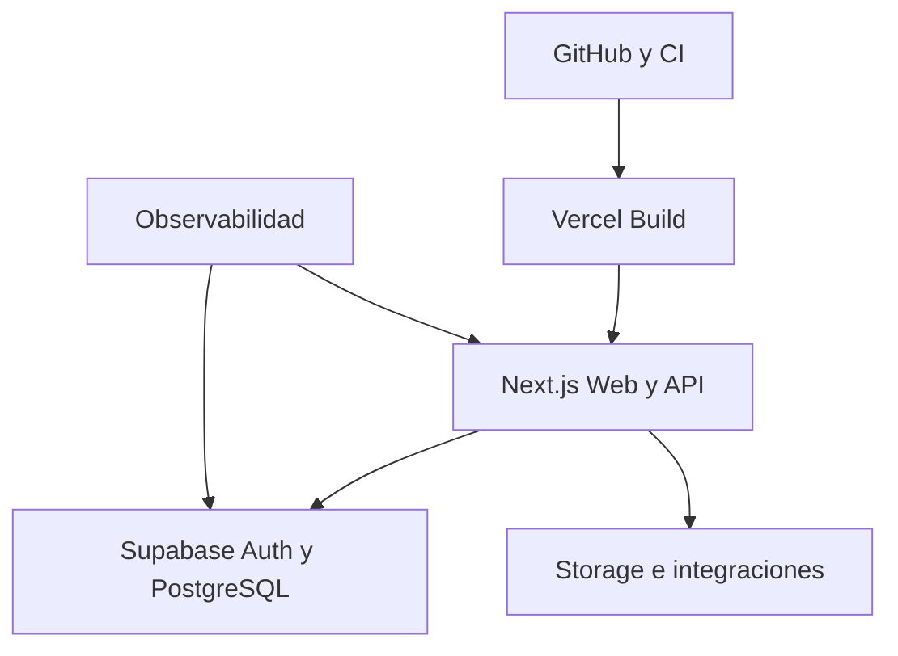
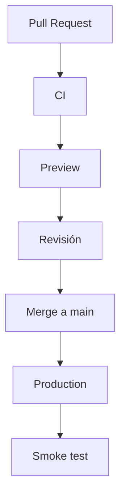

# Arquitectura de Despliegue de CRUMAFOOD Platform

> **Una versión no está terminada cuando compila; está terminada cuando puede desplegarse, observarse y recuperarse con confianza.**

## Estado del documento

| Campo | Valor |
|---|---|
| Estado | Propuesto para aprobación |
| Versión | 1.0 |
| Propietarios | Product Owner, responsable de arquitectura y responsable de operación |
| Alcance | Build, entornos, despliegue, topología, configuración, observabilidad, escalado y recuperación |
| Autoridad | Derivado de `system-overview.md`, `data-architecture.md`, `security-architecture.md`, `integration-architecture.md` y el CES |
| Revisión | Cuando cambie una unidad de despliegue, proveedor, entorno, región, objetivo de servicio o estrategia de recuperación |

---

## 1. Propósito

Este documento define cómo CRUMAFOOD Platform se construirá, configurará, desplegará, verificará, operará, revertirá y recuperará.

Su propósito es asegurar que:

- cada versión sea reproducible;
- los entornos estén separados;
- los secretos no lleguen al cliente;
- las migraciones sean compatibles con el código;
- los despliegues tengan evidencia;
- los fallos sean detectables;
- una versión defectuosa pueda contenerse;
- los datos puedan recuperarse;
- y la topología evolucione solo cuando exista una necesidad real.

---

## 2. Declaración arquitectónica

> **CRUMAFOOD desplegará un monolito modular Next.js en Vercel conectado a Supabase como topología inicial, sin impedir la evolución futura de Mobile, Desktop, workers e integraciones.**

La topología de ejecución no define la arquitectura del Business Core.

Web, Mobile, Desktop e integraciones compartirán contratos y reglas sin duplicarlas.

No se dividirá el sistema en microservicios por anticipación.

---

## 3. Alcance

Esta arquitectura cubre:

- repositorio y artefactos;
- instalación de dependencias;
- build;
- CI/CD;
- Vercel;
- Supabase;
- PostgreSQL;
- Storage;
- dominios y TLS;
- variables y secretos;
- Production, Preview y Development;
- cron jobs;
- futuros workers;
- PWA/Mobile;
- Desktop/Tauri;
- observabilidad;
- rollback;
- respaldo;
- recuperación;
- escalabilidad;
- costos;
- y gobierno operacional.

No sustituye runbooks específicos ni contratos comerciales de proveedores.

---

## 4. Principios rectores

1. un commit identificable produce un artefacto identificable;
2. el mismo código se promueve mediante configuración por entorno;
3. los despliegues son pequeños y observables;
4. el esquema evoluciona de forma compatible;
5. los secretos nunca forman parte del artefacto público;
6. producción no se prueba por primera vez;
7. rollback y roll-forward se diseñan antes del incidente;
8. respaldo no equivale a recuperación probada;
9. escalado responde a evidencia;
10. cada unidad desplegable tiene propietario;
11. automatización reemplaza pasos manuales frágiles;
12. seguridad y operación son parte de la entrega.

---

## 5. Estado actual

El repositorio contiene:

- Next.js 15.5.19 y React 19.1.0;
- TypeScript estricto;
- despliegue objetivo en Vercel;
- `vercel.json` con un cron diario a `/api/jobs/run`;
- integración con Supabase SSR;
- PostgreSQL y Auth mediante Supabase;
- App Router con Admin, Storefront, Mobile y API en una aplicación;
- manifiesto web para CRUMAFOOD;
- encabezados básicos de seguridad;
- workflow de GitHub Actions;
- documentos iniciales de monitoring y backup;
- y dominios adquiridos `crumafood.com` y `crumafood.com.mx`.

El levantamiento también identifica brechas:

- CI solo ejecuta checkout y no valida, construye ni prueba;
- el workflow se activa en `push` a `main`, no en Pull Requests;
- `next build` ignora ESLint;
- el script de lint no demuestra todavía una política de cero advertencias;
- no se identificó lockfile versionado para instalación determinista;
- no existen scripts de test ni typecheck dedicados en `package.json`;
- las migraciones Supabase no están en el repositorio;
- la estrategia de backups es declarativa, sin evidencia de restauración;
- Sentry y Vercel Analytics aparecen como plan, no como implementación verificable;
- el health endpoint solo confirma que el proceso responde;
- el manifiesto PWA no tiene todavía una estrategia de service worker u offline;
- los iconos del manifiesto son marcadores;
- y las carpetas de workers no contienen un proceso desplegable.

Estas brechas deberán cerrarse de forma incremental antes de considerar madura la operación.

---

## 6. Estado objetivo

El estado objetivo tendrá:

- build determinista;
- CI obligatorio en Pull Requests;
- Preview aislada;
- promoción controlada a Production;
- migraciones versionadas;
- secretos separados por entorno;
- smoke tests posteriores al despliegue;
- observabilidad con release y correlación;
- rollback de aplicación;
- roll-forward de datos;
- backups con restauración ensayada;
- jobs idempotentes;
- y topologías separadas solo para capacidades que lo requieran.



---

## 7. Unidades de despliegue

La unidad actual es:

- una aplicación Next.js;
- desplegada como proyecto Vercel;
- conectada a un proyecto Supabase;
- con funciones, páginas y assets administrados por el framework y proveedor.

Unidades futuras posibles:

- worker Node.js;
- aplicación Desktop Tauri;
- PWA/Mobile optimizada;
- portal especializado;
- servicio de sincronización;
- o servicio independiente de integración.

Una carpeta no se considera unidad de despliegue hasta tener runtime, build, configuración, observabilidad y propietario.

---

## 8. Entornos

Se mantendrán como mínimo:

| Entorno | Propósito | Datos |
|---|---|---|
| Development | Desarrollo local y pruebas rápidas | Sintéticos o locales |
| Preview | Validación de ramas y Pull Requests | No productivos y aislados |
| Production | Operación real | Productivos |

Podrá existir Staging estable cuando la complejidad de integraciones, migraciones o pruebas operativas lo justifique.

Cada entorno tendrá:

- configuración;
- secretos;
- dominios;
- proveedores;
- datos;
- y controles de acceso propios.

---

## 9. Desarrollo local

Development deberá poder iniciarse con instrucciones versionadas.

El objetivo incluye:

- versión de Node definida;
- gestor de paquetes definido;
- lockfile;
- `.env.example` completo sin secretos;
- Supabase local o proyecto de desarrollo;
- migraciones reproducibles;
- seed determinista;
- y comandos de verificación.

Un desarrollador no deberá depender de cambios manuales desconocidos en una base remota para ejecutar la aplicación.

---

## 10. Preview

Cada Pull Request relevante deberá producir una Preview desplegable.

Preview servirá para:

- revisión funcional;
- UX/UI;
- smoke tests;
- validación de rutas;
- integración en sandbox;
- y revisión de configuración.

Preview no deberá:

- usar datos productivos;
- cobrar pagos reales;
- enviar mensajes reales sin control;
- compartir service role productiva;
- ejecutar jobs productivos;
- ni recibir webhooks de producción.

Las URLs de Preview se tratarán como superficies expuestas.

---

## 11. Production

Production recibirá únicamente cambios que hayan superado las puertas definidas.

Un despliegue productivo tendrá:

- commit;
- autor;
- fecha;
- resultado de CI;
- migraciones relacionadas;
- configuración requerida;
- responsable;
- evidencia de smoke test;
- y estrategia de recuperación.

La rama `main` podrá representar producción mientras el flujo sea simple, protegido y verificable.

---

## 12. Topología web actual

La aplicación Next.js contiene:

- `/dashboard` y superficies administrativas;
- Storefront;
- `/mobile` para operación;
- `/api` para endpoints;
- Server Components;
- Server Actions;
- middleware;
- y assets públicos.

Estas superficies comparten despliegue, pero no comparten automáticamente permisos, caché ni exposición.

La topología se mantendrá unificada hasta que exista una razón verificable para separarla.

---

## 13. Vercel

Vercel es el proveedor de despliegue web actual.

Será responsable de:

- builds;
- Preview deployments;
- Production deployments;
- funciones de servidor;
- distribución de assets;
- dominios;
- TLS;
- y cron configurado en el proyecto.

CRUMAFOOD seguirá siendo responsable de:

- arquitectura;
- configuración;
- seguridad;
- contratos;
- datos;
- observabilidad;
- y recuperación.

Usar un proveedor administrado no elimina responsabilidad operacional.

---

## 14. Dominios

Los dominios adquiridos son:

- `crumafood.com`;
- `crumafood.com.mx`.

Se aprobará cuál es el dominio canónico.

El otro deberá:

- redirigir de forma permanente;
- conservar rutas cuando corresponda;
- utilizar TLS válido;
- y evitar contenido duplicado.

También se decidirá la política para:

- `www`;
- subdominios de Admin y portales;
- APIs;
- webhooks;
- y ambientes no productivos.

El dominio canónico requiere ADR o decisión operativa registrada.

---

## 15. DNS y TLS

Los registros DNS tendrán:

- propietario;
- proveedor;
- propósito;
- TTL;
- fecha de cambio;
- y procedimiento de recuperación.

TLS será obligatorio.

Se verificará:

- emisión y renovación;
- redirección HTTP a HTTPS;
- cobertura de hosts;
- y ausencia de contenido mixto.

Un cambio de DNS crítico tendrá plan de propagación y reversión.

---

## 16. Build de Next.js

El build canónico utilizará una versión fija de Node y dependencias reproducibles.

La puerta mínima incluirá:

```text
install determinista
typecheck
lint
tests requeridos
next build
```

`next build` seguirá siendo obligatorio, pero no sustituirá pruebas, lint ni verificación de migraciones.

El build no deberá descargar datos productivos ni depender de servicios mutables innecesarios.

---

## 17. Dependencias deterministas

El repositorio deberá versionar:

- lockfile;
- versión o rango controlado de Node;
- gestor de paquetes;
- y configuración necesaria.

CI utilizará instalación limpia.

Se corregirán dependencias duplicadas en `package.json` y se evitarán instalaciones que modifiquen el lockfile durante el build.

Un despliegue debe poder reconstruirse desde el commit sin resolver versiones distintas de forma accidental.

---

## 18. TypeScript

Las opciones estrictas actuales forman parte del contrato de calidad:

- `strict`;
- `noUncheckedIndexedAccess`;
- `exactOptionalPropertyTypes`;
- `noImplicitOverride`;
- y demás verificaciones configuradas.

Los errores de tipo bloquearán el despliegue.

Una excepción temporal como `any` deberá:

- ser localizada;
- tener causa;
- no cruzar límites críticos;
- y registrar deuda para tipado posterior.

No se desactivará el modo estricto para desbloquear una versión.

---

## 19. Lint

Lint deberá ejecutarse de forma explícita en CI.

El estado objetivo:

- tendrá comando compatible con la versión de Next.js y ESLint;
- aplicará reglas del proyecto;
- fallará ante errores;
- y no dependerá de `ignoreDuringBuilds` como control permanente.

Ignorar lint durante `next build` solo será aceptable si CI ya ejecutó una verificación equivalente y obligatoria.

---

## 20. Pruebas

La entrega incluirá pruebas proporcionales al riesgo:

- unitarias del dominio;
- aplicación;
- integración con PostgreSQL/Supabase;
- RLS;
- contratos;
- seguridad;
- y E2E de flujos críticos.

Flujos prioritarios:

- autenticación;
- catálogo;
- recepción;
- inventario;
- producción;
- picking;
- venta;
- pago;
- y permisos.

No se perseguirá una métrica de cobertura aislada de riesgo.

---

## 21. CI

El workflow actual solo realiza checkout y deberá completarse.

CI objetivo ejecutará en Pull Requests y `main`:

1. checkout;
2. configuración de runtime;
3. instalación limpia;
4. validación de formato cuando exista;
5. typecheck;
6. lint;
7. pruebas;
8. build;
9. validación de migraciones;
10. análisis de seguridad proporcional;
11. y publicación de resultados.

Una puerta requerida no podrá omitirse fusionando directamente sin excepción registrada.

---

## 22. CD

Vercel podrá desplegar automáticamente desde GitHub.

El flujo objetivo será:



La automatización no elimina la necesidad de evidencia de promoción.

Los cambios de alto riesgo podrán requerir aprobación manual antes de Production.

---

## 23. Protección de ramas

`main` deberá protegerse mediante:

- Pull Request;
- checks requeridos;
- revisión proporcional al riesgo;
- bloqueo de force-push;
- y trazabilidad.

Los cambios de emergencia seguirán el proceso del Engineering Operating System y se reconciliarán después.

No se corregirá producción mediante cambios locales que no regresen al repositorio.

---

## 24. Artefactos y procedencia

Cada despliegue deberá relacionarse con:

- commit SHA;
- dependencias;
- build;
- variables no secretas relevantes;
- migraciones;
- y release.

La versión se expondrá en observabilidad y, cuando sea seguro, en un endpoint interno de diagnóstico.

No se reconstruirá una versión para rollback si puede conservarse o promoverse el artefacto ya verificado.

---

## 25. Configuración

La configuración se separará del código sin perder tipado y validación.

Se clasificará como:

- pública;
- interna;
- secreta;
- específica de build;
- o específica de runtime.

La aplicación validará al iniciar:

- presencia;
- formato;
- combinación;
- y entorno.

Un valor faltante crítico producirá fallo explícito, no comportamiento parcial silencioso.

---

## 26. Variables públicas

Solo usarán `NEXT_PUBLIC_*` valores destinados al navegador.

Actualmente:

- `NEXT_PUBLIC_APP_NAME`;
- `NEXT_PUBLIC_SUPABASE_URL`;
- `NEXT_PUBLIC_SUPABASE_ANON_KEY`.

La anon key es pública por diseño, pero depende de RLS y políticas correctas.

Ningún token privilegiado, secreto de webhook, clave de cron o credencial de pago tendrá prefijo público.

---

## 27. Secretos

Los secretos se configurarán por entorno en Vercel y proveedores correspondientes.

Incluyen:

- `SUPABASE_SERVICE_ROLE_KEY`;
- `CRON_SECRET`;
- `MP_ACCESS_TOKEN`;
- firmas de webhook;
- claves de correo;
- y tokens futuros.

Reglas:

- mínimo privilegio;
- separación por entorno;
- acceso limitado;
- rotación;
- no exposición en logs;
- y revocación ante sospecha.

Production, Preview y Development no compartirán secretos productivos.

---

## 28. Supabase

Supabase es actualmente proveedor de:

- PostgreSQL;
- Auth;
- sesión;
- y posibles capacidades de Storage.

Se recomendará separación de proyectos para:

- desarrollo;
- validación no productiva;
- y producción.

Si Preview comparte un proyecto no productivo, utilizará aislamiento de datos y limpieza controlada.

Production no será base de pruebas para ramas.

---

## 29. Migraciones

El esquema vivirá en `supabase/migrations` conforme a `data-architecture.md`.

Toda versión que dependa de un cambio de esquema deberá declarar:

- migración;
- compatibilidad;
- orden;
- tiempo estimado;
- bloqueo esperado;
- backfill;
- verificación;
- y recuperación.

Las migraciones se probarán desde una base vacía y desde versiones soportadas.

No se harán cambios permanentes únicamente desde el panel.

---

## 30. Orden entre código y base de datos

Se utilizará expand-contract:

1. agregar estructura compatible;
2. desplegar código que tolere ambos modelos;
3. ejecutar backfill;
4. cambiar lecturas y escrituras;
5. observar;
6. retirar estructura anterior.

El orden exacto será parte del plan de release.

No se desplegará código que requiera una columna inexistente ni se eliminará una columna aún utilizada.

---

## 31. Backfills

Un backfill será:

- reanudable;
- idempotente;
- limitado por lotes;
- observable;
- verificable;
- y cancelable cuando sea posible.

No se ejecutará trabajo masivo dentro de una función web con timeout corto.

Los backfills grandes requerirán job o worker controlado.

El éxito se medirá por reconciliación, no solo por salida cero.

---

## 32. Rollback de aplicación

Vercel permite promover o volver a una versión de aplicación anterior, pero el rollback solo es seguro si el esquema sigue siendo compatible.

Antes de desplegar se definirá:

- condición de rollback;
- responsable;
- versión objetivo;
- compatibilidad de datos;
- smoke test;
- y comunicación.

Un rollback no deberá repetir webhooks, pagos, jobs o movimientos.

---

## 33. Rollback de base de datos

Las migraciones destructivas no se revertirán automáticamente.

Se preferirá roll-forward mediante una nueva migración.

Si se requiere reversión:

- se preservarán datos;
- se evaluará bloqueo;
- se detendrán escritores incompatibles;
- se verificará respaldo;
- y se auditará.

Rollback de aplicación y recuperación de datos son procedimientos distintos.

---

## 34. Feature flags

Los flags podrán desacoplar despliegue de activación.

Un flag tendrá:

- propietario;
- alcance;
- valor seguro por defecto;
- entornos;
- observabilidad;
- fecha de retiro;
- y comportamiento de rollback.

No se utilizarán flags para mantener dos arquitecturas indefinidamente.

Un flag no evita migraciones compatibles ni autorización.

---

## 35. Smoke tests

Después de cada despliegue se verificarán capacidades mínimas.

Según el cambio:

- health;
- login;
- página principal;
- lectura autorizada;
- mutación controlada en no producción;
- conectividad con Supabase;
- assets;
- y endpoints críticos.

Production utilizará smoke tests seguros, idempotentes y sin alterar datos reales innecesariamente.

---

## 36. Health y readiness

El endpoint actual `/api/health` confirma proceso y timestamp.

Se distinguirá:

- liveness;
- readiness;
- versión;
- y salud observada de dependencias.

El health público no expondrá secretos, esquema, variables ni detalles internos.

Una dependencia opcional caída no deberá declarar muerta toda la aplicación.

---

## 37. Cron jobs

`vercel.json` programa actualmente:

```text
0 6 * * * -> /api/jobs/run
```

La programación se interpretará en la zona del proveedor y se documentará en relación con `America/Mexico_City`.

El job deberá:

- usar método de mutación apropiado;
- autenticar todo entorno compartido;
- ser idempotente;
- impedir superposición;
- tener timeout;
- registrar ejecución;
- y alertar fallos.

Un cron dispara; no garantiza por sí solo procesamiento durable.

---

## 38. Workers

Los directorios `src/workers` son marcadores actuales.

Se desplegará un worker separado cuando exista necesidad real de:

- colas;
- procesamiento largo;
- reintentos durables;
- backfills;
- eventos;
- o aislamiento de fallos.

El worker tendrá:

- runtime;
- artefacto;
- configuración;
- escalado;
- health;
- logs;
- y propietario propios.

Su tecnología y proveedor requerirán ADR.

---

## 39. Vercel Functions y runtime

Cada función declarará necesidades de:

- runtime;
- duración;
- memoria;
- región;
- acceso de red;
- y concurrencia.

Las dependencias Node-only no se importarán en middleware o runtimes Edge incompatibles.

Los avisos actuales de compatibilidad de Supabase en Edge deberán resolverse mediante imports y runtime explícitos, no ignorarse indefinidamente.

Una función web no alojará un worker permanente.

---

## 40. Caché y renderizado

Cada ruta definirá si es:

- estática;
- dinámica;
- revalidada;
- o no cacheable.

Datos autenticados, inventario, costos y permisos no se almacenarán en caché compartida sin clave y política correctas.

La invalidación será explícita y observable.

No se utilizará caché para ocultar consultas incorrectas o falta de índices.

---

## 41. Assets e imágenes

Los assets públicos deberán:

- ser válidos;
- tener versión o hash;
- comprimirse;
- y tener política de caché.

Las imágenes externas se limitarán a hosts aprobados.

El hostname de Supabase fijado en `next.config.js` deberá pasar a configuración revisada si cambia por entorno.

Los iconos PWA marcadores deberán sustituirse antes de promover instalación pública.

---

## 42. PWA y Mobile

El manifiesto actual es una base, no una PWA completa.

Para considerarla instalable y operable se definirán:

- iconos válidos;
- service worker;
- estrategia de caché;
- actualización;
- fallback;
- seguridad;
- telemetría;
- y experiencia offline.

Offline de negocio requerirá ADR separado.

No se cachearán datos sensibles o transacciones sin diseño explícito.

---

## 43. Desktop con Tauri

Tauri 2 es la tecnología objetivo actual para Desktop, sujeta a ADR definitivo.

El despliegue Desktop deberá definir:

- plataformas;
- build reproducible;
- firma de código;
- certificados;
- empaquetado;
- canal estable y de prueba;
- actualizaciones firmadas;
- rollback;
- compatibilidad con API;
- y soporte.

El binario no contendrá secretos de servidor.

La versión Desktop podrá evolucionar a ritmo distinto y requerirá contratos compatibles.

---

## 44. Integraciones externas

Cada integración tendrá configuración separada por entorno.

Preview y Development usarán sandbox.

Callbacks y webhooks declararán:

- dominio;
- secreto;
- versión;
- y destino correcto.

Mercado Pago no utilizará `MP_ACCESS_TOKEN` en frontend ni en repositorio.

La promoción de un proveedor tendrá prueba controlada y plan de desactivación.

---

## 45. Observabilidad

La observabilidad cubrirá:

- aplicación Next.js;
- funciones;
- Supabase;
- PostgreSQL;
- jobs;
- integraciones;
- y futuros workers.

Cada señal incluirá, cuando corresponda:

- entorno;
- release;
- commit;
- ruta o operación;
- correlación;
- latencia;
- resultado;
- y dependencia.

Auditoría y observabilidad seguirán separadas.

---

## 46. Logs

Los logs de Vercel Functions son una fuente operativa actual.

Se utilizarán para diagnosticar runtime mediante despliegue, función, ruta y correlación.

No incluirán:

- secretos;
- tokens;
- cookies;
- payloads completos no clasificados;
- datos personales innecesarios;
- ni errores SQL expuestos.

La retención y exportación requerirán política.

---

## 47. Errores y tracing

Se implementará captura central de errores antes de declarar activo un proveedor como Sentry.

La herramienta elegida deberá relacionar:

- release;
- entorno;
- excepción;
- ruta;
- usuario seudonimizado cuando sea legítimo;
- y correlación.

El tracing distribuido se incorporará cuando integraciones o workers hagan insuficiente el seguimiento por logs.

No se enviarán datos sensibles a observabilidad sin revisión.

---

## 48. Métricas

Se medirán, como mínimo:

- disponibilidad;
- latencia;
- errores;
- builds fallidos;
- despliegues;
- rollback;
- funciones lentas;
- cron exitoso o fallido;
- conexiones y consultas;
- y dependencia externa.

También se incluirán métricas de negocio que demuestren salud operacional sin confundirlas con telemetría técnica.

Una métrica tendrá propietario y acción esperada.

---

## 49. Alertas

Las alertas serán accionables.

Cada alerta tendrá:

- condición;
- severidad;
- destinatario;
- runbook;
- ventana;
- y criterio de cierre.

Prioridades iniciales:

- producción no disponible;
- error elevado;
- cron fallido;
- migración fallida;
- webhook degradado;
- base de datos saturada;
- y respaldo o restauración fallidos.

---

## 50. SLO, RPO y RTO

Se definirán objetivos explícitos:

- SLO de disponibilidad;
- SLO de latencia por flujo;
- RPO de datos;
- RTO de recuperación;
- y frescura de proyecciones.

No se declararán números sin medir capacidad, costo e impacto de negocio.

Los objetivos distinguirán:

- Storefront;
- operación Admin;
- Mobile;
- pagos;
- y procesos diferidos.

Los valores finales requieren ADR o acuerdo operativo.

---

## 51. Escalabilidad

La aplicación escalará primero mediante capacidades administradas y optimización basada en evidencia.

Orden preferido:

1. medir;
2. corregir consultas y modelos;
3. añadir índices;
4. ajustar caché;
5. separar trabajo diferido;
6. escalar recursos;
7. introducir colas;
8. considerar réplicas o separación física.

Redis, read replicas, multi-region y microservicios permanecen planeados hasta demostrar necesidad.

---

## 52. Regiones y latencia

La aplicación y Supabase deberán ubicarse para minimizar latencia de la operación principal en México sin ignorar disponibilidad y restricciones del proveedor.

Se medirá:

- tiempo entre Vercel y Supabase;
- latencia del usuario;
- latencia de integraciones;
- y transferencia entre regiones.

Multi-region no se adoptará sin estrategia de consistencia, escritura y recuperación.

La región es una decisión arquitectónica y económica.

---

## 53. Capacidad y límites

Se mantendrá inventario de límites del proveedor:

- duración de funciones;
- memoria;
- payload;
- conexiones;
- concurrencia;
- rate limits;
- almacenamiento;
- y cuotas.

El límite global de 10 MB para Server Actions no será presupuesto predeterminado de cada caso de uso.

Una capacidad que se acerque a un límite tendrá alerta y plan antes de fallar.

---

## 54. Backups

La intención actual declara:

- backups diarios;
- snapshots semanales;
- archivos mensuales;
- backup de Storage;
- y recuperación punto en el tiempo.

Estos puntos no se considerarán implementados hasta verificar capacidad, plan contratado, retención y evidencia.

Cada backup tendrá:

- cifrado;
- alcance;
- propietario;
- retención;
- ubicación;
- y estado.

---

## 55. Restauración

Se probará restauración periódica en un entorno aislado.

La prueba verificará:

- tablas y datos;
- funciones;
- RLS;
- Auth relacionado;
- Storage;
- integridad;
- secretos externos;
- y capacidad de la aplicación.

El resultado registrará duración real y diferencias contra RTO/RPO.

Un backup que nunca se restauró es una hipótesis, no una garantía.

---

## 56. Recuperación ante desastre

El plan deberá cubrir:

- caída de Vercel;
- caída o degradación de Supabase;
- pérdida o corrupción de datos;
- secreto comprometido;
- DNS incorrecto;
- despliegue defectuoso;
- dependencia externa;
- y error humano.

El plan definirá:

- decisión;
- responsables;
- comunicación;
- pasos;
- verificación;
- y retorno a operación normal.

---

## 57. Incidentes de despliegue

Ante un despliegue defectuoso se seguirá:

1. detectar;
2. clasificar;
3. detener promoción;
4. contener;
5. decidir rollback o roll-forward;
6. verificar datos;
7. recuperar;
8. comunicar;
9. y aprender.

No se ocultará un incidente corrigiendo el síntoma sin registrar causa y alcance.

---

## 58. Mantenimiento

Las ventanas de mantenimiento se usarán cuando una operación no pueda ser completamente compatible o en línea.

Se definirá:

- impacto;
- duración;
- responsable;
- comunicación;
- modo de solo lectura cuando sea posible;
- respaldo;
- y criterio de abortar.

El mantenimiento planificado no justifica pérdida de trazabilidad.

---

## 59. Runbooks

Existirán runbooks para:

- desplegar;
- revertir aplicación;
- aplicar migraciones;
- recuperar migración;
- rotar secretos;
- verificar cron;
- restaurar backup;
- cambiar DNS;
- responder a dependencia caída;
- y promover Desktop.

Un runbook será ejecutable por otra persona autorizada y se probará periódicamente.

---

## 60. Costos

La arquitectura observará costos de:

- Vercel;
- Supabase;
- almacenamiento;
- transferencia;
- logs;
- errores;
- backups;
- integraciones;
- y futuros workers.

Se configurarán alertas de presupuesto cuando el proveedor lo permita.

No se reducirá seguridad, integridad o recuperación crítica para ocultar costos.

Las optimizaciones se basarán en uso medido.

---

## 61. Acceso operacional

El acceso a Vercel, Supabase, DNS, GitHub y observabilidad utilizará:

- cuentas individuales;
- MFA;
- mínimo privilegio;
- roles;
- revisión periódica;
- y baja inmediata cuando corresponda.

No se compartirán credenciales administrativas.

Las acciones privilegiadas dejarán evidencia en los proveedores y registros internos apropiados.

---

## 62. Deriva de configuración

Se inventariará configuración fuera del repositorio:

- variables;
- dominios;
- cron;
- permisos;
- proyectos Supabase;
- políticas del proveedor;
- y callbacks.

Cuando sea posible, se declarará como código.

Cuando no sea posible, se documentará, revisará y exportará de forma segura.

La consola no será una fuente invisible de arquitectura.

---

## 63. Monorepo y evolución

La estructura objetivo contempla futuras aplicaciones y paquetes.

Se migrará a monorepo con tooling dedicado solo cuando existan:

- al menos dos aplicaciones reales;
- paquetes compartidos estables;
- builds diferenciados;
- y beneficio mayor al costo.

Turborepo u otra herramienta requerirá evaluación y ADR.

La estructura actual no se reorganizará masivamente antes de estabilizar límites.

---

## 64. Separación de servicios

Un módulo podrá convertirse en servicio independiente solo por:

- escalado diferente;
- aislamiento de fallos;
- requisito regulatorio;
- despliegue independiente;
- tecnología necesaria;
- o límite organizacional real.

Antes se evaluarán opciones más simples:

- proceso separado;
- worker;
- cola;
- función;
- o paquete.

Separar red y datos aumenta costo operativo y consistencia distribuida.

---

## 65. Prioridades de implementación

### P0 — Entrega confiable mínima

- completar CI;
- ejecutar typecheck, lint y build;
- proteger `main`;
- separar secretos por entorno;
- asegurar cron;
- y documentar rollback.

### P1 — Datos y observabilidad

- crear migraciones baseline;
- validar orden de despliegue;
- implementar captura de errores;
- añadir smoke tests;
- y verificar backups.

### P2 — Madurez operativa

- definir SLO/RPO/RTO;
- probar restauración;
- completar alertas y runbooks;
- controlar deriva;
- y medir costos.

### P3 — Nuevas unidades

- PWA completa;
- Desktop Tauri;
- worker;
- y topología ampliada según necesidad.

---

## 66. Estrategia de transición

### Etapa 1 — Determinismo

- fijar runtime;
- añadir lockfile;
- normalizar scripts;
- y completar CI.

### Etapa 2 — Entornos

- inventariar variables;
- separar proyectos y secretos;
- definir Preview;
- y registrar dominios.

### Etapa 3 — Datos

- crear baseline;
- probar migraciones;
- adoptar expand-contract;
- y preparar backfills.

### Etapa 4 — Operación

- instrumentar releases;
- añadir smoke tests;
- alertar;
- documentar rollback;
- y ensayar restauración.

### Etapa 5 — Evolución

- habilitar workers, PWA o Desktop solo cuando cumplan su Definition of Done.

Cada etapa debe reducir riesgo por sí misma.

---

## 67. Antipatrones prohibidos

Se prohíbe:

- desplegar desde un equipo personal sin trazabilidad;
- usar Production para probar ramas;
- compartir secretos productivos con Preview;
- ignorar fallas de TypeScript o lint;
- cambiar base solo desde la consola;
- ejecutar migraciones destructivas junto con código incompatible;
- asumir que rollback de código revierte datos;
- operar sin release identificable;
- considerar un backup no restaurado como garantía;
- ejecutar trabajos largos en una función web inadecuada;
- cachear datos sensibles sin política;
- introducir multi-region o microservicios por anticipación;
- y declarar activa una capacidad que solo tiene carpetas vacías.

---

## 68. Definition of Done de despliegue

Una versión está lista cuando:

- tiene commit identificable;
- instalación reproducible;
- typecheck aprobado;
- lint aprobado;
- pruebas requeridas aprobadas;
- build aprobado;
- migraciones versionadas y compatibles;
- configuración validada;
- secretos correctos por entorno;
- Preview revisada cuando corresponde;
- plan de rollback o roll-forward;
- observabilidad de release;
- smoke test definido;
- propietario de promoción;
- y documentación o runbook actualizado.

---

## 69. Gobierno

Los cambios de despliegue se revisarán por:

- impacto;
- reversibilidad;
- datos;
- seguridad;
- disponibilidad;
- costo;
- y recuperación.

Los cambios de alto riesgo requerirán aprobación explícita.

Las excepciones serán temporales, compensadas y registradas.

---

## 70. Decisiones que requieren ADR

Se formalizarán, al menos:

1. dominio canónico;
2. separación de proyectos Supabase por entorno;
3. versión de Node y gestor de paquetes;
4. pipeline CI/CD definitivo;
5. orden y automatización de migraciones;
6. herramienta de errores y observabilidad;
7. SLO, RPO y RTO;
8. retención de logs;
9. estrategia de backups y restauración;
10. runtime y proveedor de workers;
11. PWA y offline;
12. distribución y actualización de Tauri;
13. región de aplicación y datos;
14. adopción de monorepo;
15. criterios para separar servicios.

---

## 71. Criterios de conformidad

Una implementación cumple esta arquitectura si:

- es reproducible;
- separa entornos;
- protege secretos;
- verifica calidad antes de promover;
- coordina código y esquema;
- identifica releases;
- observa comportamiento;
- puede revertir aplicación de forma segura;
- puede recuperar datos;
- y evoluciona topología con evidencia.

La conformidad se demuestra con workflow, configuración, migraciones, logs, pruebas y runbooks.

---

## 72. Evolución

Este documento evolucionará cuando:

- cambie Vercel o Supabase;
- se agregue Staging;
- se habilite Mercado Pago productivo;
- se implemente PWA offline;
- se distribuya Desktop;
- se despliegue un worker;
- se adopte monorepo;
- o cambien objetivos de disponibilidad y recuperación.

Toda evolución conservará trazabilidad entre código, datos y operación.

---

## 73. Declaración final

> **CRUMAFOOD Platform desplegará cambios como operaciones controladas sobre un sistema vivo.**

Cada release combinará código, esquema, configuración, seguridad y evidencia.

Por ello:

- el build será reproducible;
- los entornos estarán separados;
- los cambios serán compatibles;
- las versiones serán observables;
- los fallos podrán contenerse;
- y los datos podrán recuperarse.

La velocidad de entrega será sostenible porque la plataforma sabrá cómo avanzar, cómo detenerse y cómo volver a un estado confiable.
