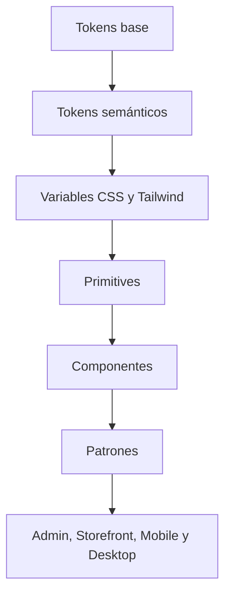

# Arquitectura del Design System de CRUMAFOOD Platform

> **Una interfaz coherente no nace de repetir estilos: nace de un lenguaje visual compartido, accesible y gobernado.**

## Estado del documento

| Campo | Valor |
|---|---|
| Estado | Propuesto para aprobación |
| Versión | 1.0 |
| Propietarios | Product Owner, responsable de diseño, responsable de frontend y responsable de accesibilidad |
| Alcance | Tokens, temas, primitives, componentes, patrones, documentación, pruebas, distribución y gobierno visual |
| Autoridad | Derivado de `system-overview.md`, `frontend-architecture.md`, `mobile-architecture.md`, `desktop-architecture.md`, `testing-strategy.md`, `performance-architecture.md` y el CES |
| Revisión | Cuando cambie la identidad visual, plataforma, accesibilidad, sistema de tokens, librería de componentes o estrategia de distribución |

---

## 1. Propósito

Este documento define cómo CRUMAFOOD Platform construirá y mantendrá su lenguaje visual.

Su propósito es asegurar que:

- colores, tipografía, espaciado y tamaños tengan una fuente de verdad;
- Web, Mobile y Desktop compartan semántica;
- los componentes sean accesibles;
- los estados sean consistentes;
- los temas no rompan contraste;
- los equipos reutilicen patrones en lugar de copiar clases;
- el cambio visual sea controlado;
- y la evolución pueda probarse y documentarse.

---

## 2. Declaración arquitectónica

> **Los design tokens serán la autoridad visual; se resolverán mediante variables CSS, se expondrán a Tailwind y serán consumidos por primitives, componentes y patrones documentados.**

Los valores visuales hardcodeados en componentes de producto se migrarán progresivamente.

Storybook es la herramienta objetivo para el catálogo ejecutable, sujeta a un spike de integración, mantenimiento y despliegue.

La presencia de stories no se considerará un Storybook funcional hasta existir configuración, scripts, CI y publicación controlada.

---

## 3. Alcance

Esta arquitectura cubre:

- design tokens;
- colores;
- tipografía;
- espaciado;
- tamaños;
- radios;
- sombras;
- z-index;
- breakpoints;
- motion;
- iconografía;
- temas;
- primitives;
- componentes;
- patrones;
- formularios;
- tablas;
- gráficos;
- feedback;
- overlays;
- navegación;
- Web;
- Mobile;
- Desktop;
- accesibilidad;
- Storybook;
- pruebas visuales;
- versionado;
- y gobierno.

No define el logotipo final ni sustituye investigación de experiencia.

---

## 4. Principios rectores

1. tokens como única autoridad visual;
2. semántica antes que color literal;
3. accesibilidad desde el token hasta el patrón;
4. primitives pequeñas;
5. componentes compuestos por contrato;
6. patrones basados en tareas;
7. variantes explícitas;
8. responsive por contenido;
9. Mobile y Desktop comparten lenguaje, no necesariamente layout;
10. temas completos, no parches;
11. estados siempre visibles;
12. preferencia por plataforma Web estándar;
13. catálogo ejecutable;
14. cambio versionado;
15. migración incremental;
16. excepciones visibles y temporales.

---

## 5. Estado actual

El repositorio contiene:

- Tailwind CSS;
- `next-themes`;
- un `ThemeProvider` con light, dark y system;
- `src/shared/design-system/tokens/`;
- archivos para color, tipografía, spacing, radius, shadows, sizes, breakpoints, motion y z-index;
- `tokens.css` con variables mínimas;
- una colección amplia bajo `src/shared/ui`;
- primitives, formularios, tablas, gráficos, overlays, layouts y patrones;
- algunas stories;
- Class Variance Authority como dependencia;
- Lucide;
- y utilidades de composición de clases.

Sin embargo:

- los archivos TypeScript de tokens están vacíos;
- Tailwind tiene `theme.extend` vacío;
- `src/app/globals.css` no demuestra importar `tokens.css`;
- la paleta CSS solo define un tema claro mínimo;
- Button, Card y Badge primitives no aplican estilos a sus variantes;
- existen componentes duplicados o superpuestos;
- muchas carpetas contienen marcadores vacíos;
- abundan colores, radios, spacing y tamaños directos;
- y no existe configuración verificable de Storybook.

---

## 6. Brechas inmediatas

Las brechas prioritarias son:

- tokens declarados pero no operativos;
- dos globals CSS sin cadena de importación canónica;
- temas sin paridad;
- primitives sin apariencia consistente;
- variantes sin implementación;
- estilos de estado duplicados;
- páginas Mobile fuertemente hardcodeadas;
- y stories sin runner.

Primero se cerrará la cadena de autoridad; después se migrarán superficies.

---

## 7. Capas del sistema



Cada capa podrá depender de la anterior.

Una página de producto no definirá un color de estado nuevo por conveniencia.

---

## 8. Tokens base

Los tokens base describen escalas sin significado de producto:

- familias tipográficas;
- tamaños;
- pesos;
- alturas de línea;
- espacios;
- radios;
- sombras;
- duraciones;
- easing;
- breakpoints;
- tamaños;
- y paletas.

No se consumirán directamente en la mayoría de componentes de negocio.

---

## 9. Tokens semánticos

Los tokens semánticos expresan intención:

- background;
- foreground;
- surface;
- border;
- primary;
- secondary;
- muted;
- accent;
- success;
- warning;
- danger;
- info;
- focus;
- disabled;
- selected;
- y interactive.

Cambiar de tema modificará valores, no nombres semánticos.

---

## 10. Tokens de componente

Solo se crearán cuando una necesidad no pueda expresarse limpiamente con semánticos.

Ejemplos:

- button-height;
- sidebar-width;
- table-row-height;
- dialog-max-width;
- scanner-reticle-size.

No se crearán tokens por cada instancia de una página.

---

## 11. Nomenclatura

Los nombres seguirán:

```text
<categoría>-<concepto>-<estado>-<variante>
```

Ejemplos:

- `color-surface-default`;
- `color-action-primary-hover`;
- `space-layout-section`;
- `radius-control`;
- `motion-duration-fast`.

Los nombres no incluirán valores como `blue-500` en la capa semántica.

---

## 12. Fuente de verdad

La fuente canónica residirá en `src/shared/design-system/tokens`.

La implementación deberá decidir una representación primaria:

- datos TypeScript generadores;
- CSS mantenido directamente;
- o formato interoperable.

No se editarán manualmente dos representaciones equivalentes.

La generación deberá ser determinista.

---

## 13. Variables CSS

Los tokens runtime se expondrán como custom properties:

```css
:root {
  --color-background: ...;
  --color-foreground: ...;
  --color-action-primary: ...;
  --space-4: ...;
  --radius-control: ...;
}
```

Las variables permitirán temas sin recompilar cada componente.

No se usarán fallbacks que oculten tokens ausentes en Production.

---

## 14. Integración con Tailwind

Tailwind mapeará utilidades semánticas a variables.

Ejemplos conceptuales:

- `bg-background`;
- `text-foreground`;
- `border-border`;
- `bg-primary`;
- `text-danger`;
- `rounded-control`.

`theme.extend` dejará de estar vacío.

Las utilities arbitrarias se limitarán a casos documentados.

---

## 15. Globals CSS

Existirá un único entrypoint global.

Este importará, en orden:

1. Tailwind base;
2. tokens;
3. estilos base;
4. utilidades aprobadas.

`src/app/globals.css` y `src/shared/design-system/styles/globals.css` se consolidarán para evitar deriva.

---

## 16. Color

El sistema de color cubrirá:

- superficies;
- texto;
- bordes;
- acciones;
- feedback;
- gráficos;
- overlays;
- y foco.

Cada combinación tendrá contraste verificado.

El color nunca será el único canal para comunicar estado.

---

## 17. Paleta base

La paleta base podrá conservar escalas de marca y neutrales.

Su formato deberá:

- ser consistente;
- permitir temas;
- soportar cálculo de contraste;
- y mantener amplia compatibilidad.

La elección final de espacio de color requerirá spike visual y técnico.

---

## 18. Colores semánticos

Se definirán estados:

- success;
- warning;
- danger;
- info;
- neutral;
- pending;
- disabled;
- y selected.

Cada estado tendrá:

- fondo;
- foreground;
- borde;
- icono;
- y estados interactivos cuando aplique.

---

## 19. Marca

La marca se expresará en tokens específicos.

No se confundirá:

- primary action;
- color de marca;
- estado informativo;
- y enlace.

Un cambio de branding no deberá obligar a editar cientos de componentes.

---

## 20. Contraste

Se verificará contraste para:

- texto;
- iconos;
- bordes esenciales;
- foco;
- controles;
- gráficos;
- estados;
- y disabled.

Los objetivos seguirán WCAG vigente adoptada por el proyecto.

Disabled no será ilegible.

---

## 21. Tipografía

La escala tipográfica incluirá:

- display;
- heading;
- title;
- body;
- label;
- caption;
- code;
- y numeric.

Cada estilo definirá:

- familia;
- tamaño;
- peso;
- altura de línea;
- tracking;
- y uso.

---

## 22. Tipografía funcional

Los números operativos requerirán:

- alineación;
- tabular nums cuando ayude;
- unidades;
- moneda;
- signo;
- y jerarquía.

No se dependerá solo de tamaño extremo para comunicar importancia.

Las tablas mantendrán legibilidad a escala.

---

## 23. Fuentes

Las fuentes:

- tendrán licencia;
- subsets necesarios;
- preload selectivo;
- fallback métrico;
- y estrategia offline para Desktop.

No se descargarán variantes no utilizadas.

La fuente de sistema será fallback seguro.

---

## 24. Espaciado

El spacing usará una escala limitada.

Se distinguirán:

- inline;
- stack;
- control;
- component;
- section;
- y page.

No se crearán valores arbitrarios para ajustar cada pantalla.

Las excepciones deberán convertirse en token si se repiten.

---

## 25. Densidad

Se soportarán densidades por contexto:

- comfortable;
- compact;
- y touch.

Admin Desktop podrá ser compacto.

Mobile operativo necesitará targets amplios.

La densidad no reducirá accesibilidad ni legibilidad.

---

## 26. Tamaños

Los tokens de tamaño cubrirán:

- controles;
- iconos;
- avatares;
- containers;
- sidebar;
- topbar;
- touch targets;
- y overlays.

Los targets táctiles seguirán los mínimos definidos en Mobile Architecture.

---

## 27. Radios

La escala de radio será pequeña y semántica:

- control;
- card;
- overlay;
- pill;
- y full.

El uso actual indiscriminado de `rounded-xl` y `rounded-2xl` se migrará.

La geometría comunicará jerarquía, no decoración aleatoria.

---

## 28. Sombras

Las sombras expresarán elevación:

- base;
- raised;
- overlay;
- modal;
- y focus cuando corresponda.

No sustituirán bordes requeridos para contraste.

Dark mode tendrá valores propios.

---

## 29. Z-index

La escala de z-index definirá:

- content;
- sticky;
- dropdown;
- popover;
- drawer;
- modal;
- toast;
- y critical.

No se usarán números arbitrarios crecientes.

Cada portal conocerá su capa.

---

## 30. Breakpoints

Los breakpoints se definirán por necesidades de contenido.

Cubrirán:

- compact Mobile;
- Mobile amplio;
- tablet;
- Desktop;
- y Desktop ancho

sin asociarlos a modelos específicos.

Los componentes podrán usar container queries cuando la compatibilidad lo permita.

---

## 31. Layout

Se definirán tokens para:

- ancho de contenido;
- gutters;
- columnas;
- gaps;
- sidebar;
- topbar;
- y secciones.

Admin, Storefront y Mobile usarán layouts distintos construidos sobre la misma escala.

---

## 32. Responsive

El componente decidirá adaptación antes que la página.

Se probarán:

- reflow;
- wrapping;
- overflow;
- tablas;
- modales;
- formularios;
- teclado virtual;
- y zoom.

Responsive no será simplemente ocultar contenido.

---

## 33. Motion

Los tokens de motion incluirán:

- duration;
- easing;
- delay;
- y stagger.

La animación deberá:

- orientar;
- confirmar;
- o explicar relación.

No retrasará tareas operativas.

---

## 34. Reduced motion

Toda animación respetará `prefers-reduced-motion`.

Se eliminarán:

- desplazamientos intensos;
- parallax;
- loops no esenciales;
- y transiciones largas.

La ausencia de motion conservará significado.

---

## 35. Iconografía

Lucide será la dirección actual.

Los iconos tendrán:

- tamaño por token;
- stroke coherente;
- nombre accesible cuando corresponda;
- y fallback textual.

No se usarán emojis como iconos operativos canónicos.

---

## 36. Ilustración e imagen

Las ilustraciones se reservarán para:

- onboarding;
- empty states;
- educación;
- y marca.

No competirán con datos ni acciones.

Tendrán alt apropiado o serán decorativas de forma explícita.

---

## 37. Temas

El sistema soportará:

- light;
- dark;
- y system.

Un tema estará completo cuando cubra:

- surfaces;
- texto;
- bordes;
- estados;
- gráficos;
- overlays;
- focus;
- imágenes;
- y código.

---

## 38. Dark mode

La presencia de `next-themes` no demuestra soporte completo.

Antes de habilitar dark mode públicamente se verificará:

- no flash incorrecto;
- contraste;
- gráficos;
- formularios;
- sombras;
- estados;
- y contenido externo.

---

## 39. Tema por tenant

El branding por tenant será limitado y gobernado.

Podrá permitir:

- logotipo;
- color de marca dentro de rango;
- nombre;
- y assets aprobados.

No permitirá sobrescribir danger, focus, contrastes o componentes completos.

Requiere ADR de multi-tenancy y theming.

---

## 40. Primitives

Las primitives son bloques de bajo nivel:

- Button;
- Input;
- Textarea;
- Select;
- Checkbox;
- Switch;
- Radio;
- Card;
- Badge;
- Dialog;
- Tooltip;
- y Separator.

Tendrán semántica, teclado, foco y variantes.

---

## 41. Contrato de primitive

Cada primitive definirá:

- elemento o rol;
- props;
- variantes;
- tamaños;
- estados;
- eventos;
- ref;
- accesibilidad;
- y composición.

No contendrá lógica de negocio.

Deberá permitir `className` sin romper sus invariantes.

---

## 42. Variantes

Las variantes se implementarán con una estrategia consistente, preferentemente Class Variance Authority.

Ejemplo conceptual:

```text
Button
  intent: primary | secondary | destructive | ghost | link
  size: sm | md | lg | icon
  state: default | loading | disabled
```

Un `data-variant` sin estilos no constituye una variante.

---

## 43. Button

Button cubrirá:

- primary;
- secondary;
- outline;
- ghost;
- destructive;
- link;
- icon;
- loading;
- y disabled.

Loading preservará ancho y nombre accesible.

Un Button no se usará para navegación ordinaria si corresponde un enlace.

---

## 44. Inputs

Los controles de entrada compartirán:

- altura;
- label;
- description;
- required;
- error;
- focus;
- disabled;
- read-only;
- y aria relationships.

Placeholder no sustituirá label.

Los errores no dependerán solo de rojo.

---

## 45. Select y autocomplete

Select se usará para conjuntos pequeños.

Autocomplete cubrirá conjuntos grandes con:

- búsqueda;
- teclado;
- loading;
- vacío;
- error;
- y virtualización si se justifica.

No se renderizarán miles de opciones en un select nativo sin análisis.

---

## 46. Overlays

Dialog, Drawer, Dropdown, Popover y Tooltip tendrán:

- focus management;
- escape;
- click outside controlado;
- portal;
- scroll lock;
- título;
- descripción;
- y retorno de foco.

No se implementarán overlays ad hoc en módulos.

---

## 47. Feedback

El sistema definirá:

- inline validation;
- alert;
- toast;
- banner;
- empty state;
- error state;
- success state;
- y progress.

Cada uno tendrá propósito y duración.

Un toast no será el único registro de un error crítico.

---

## 48. Estados de datos

Toda superficie de datos contemplará:

- initial;
- loading;
- empty;
- success;
- stale;
- partial;
- error;
- permission denied;
- y offline cuando aplique.

Los estados compartirán componentes y lenguaje.

---

## 49. Status

Los estados de dominio usarán mappers semánticos centralizados.

Ejemplos:

- orden;
- pago;
- inventario;
- producción;
- calidad.

La UI no repetirá ternarios de colores por página.

El label y el color derivarán del mismo contrato.

---

## 50. Cards

Card definirá:

- surface;
- padding;
- border;
- radius;
- header;
- content;
- footer;
- interactive;
- y selected.

No toda agrupación necesita card.

La primitive actual sin estilos deberá evolucionar antes de considerarse completa.

---

## 51. DataTable

DataTable estandarizará:

- headers;
- sorting;
- filtering;
- pagination;
- selection;
- actions;
- density;
- loading;
- empty;
- error;
- responsive;
- y accesibilidad.

La tabla no cargará colecciones ilimitadas.

---

## 52. Tablas en Mobile

Mobile transformará tablas mediante:

- lista;
- cards;
- disclosure;
- columnas prioritarias;
- y detalle.

No se ocultarán datos esenciales sin alternativa.

El patrón se documentará por caso.

---

## 53. Formularios

Los patrones de formulario definirán:

- estructura;
- secciones;
- acciones;
- validación;
- resumen de errores;
- draft;
- confirmación;
- y salida.

Las forms compartidas no usarán `any` como contrato permanente.

---

## 54. Navegación

Se estandarizarán:

- sidebar;
- topbar;
- breadcrumbs;
- tabs;
- pagination;
- stepper;
- command palette;
- y bottom navigation Mobile.

La navegación reflejará permiso sin tratarlo como control de seguridad.

---

## 55. Layouts

Los layouts aprobados incluirán:

- CRUD;
- detail;
- master-detail;
- dashboard;
- analytics;
- settings;
- y task flow Mobile.

Los patrones actuales duplicados entre `compositions` y `patterns` se consolidarán.

---

## 56. Gráficos

Los charts tendrán:

- paleta accesible;
- título;
- unidad;
- periodo;
- leyenda;
- tooltip;
- tabla alternativa;
- empty;
- loading;
- error;
- y responsive.

Recharts vivirá detrás de componentes del sistema.

---

## 57. Datos numéricos

Los formatters centralizarán:

- moneda;
- cantidad;
- porcentaje;
- fecha;
- tiempo;
- y unidad.

Respetarán locale y zona horaria.

No se formateará dinero mediante lógica repetida en componentes.

---

## 58. Contenido y microcopy

El lenguaje será:

- claro;
- específico;
- accionable;
- consistente;
- y respetuoso.

Los errores explicarán qué ocurrió y qué hacer.

No se mostrarán stack traces ni mensajes SQL.

---

## 59. Internacionalización

El design system estará preparado para:

- textos largos;
- plurales;
- formatos;
- locale;
- y futura dirección RTL.

Los componentes no fijarán anchos basados en una frase.

La adopción de i18n completa requerirá estrategia propia.

---

## 60. Accesibilidad

El objetivo seguirá WCAG adoptada por el proyecto.

El sistema cubrirá:

- semántica;
- teclado;
- foco;
- contraste;
- zoom;
- lectores;
- motion;
- touch;
- y lenguaje.

La accesibilidad será requisito de componente, no corrección posterior.

---

## 61. Foco

Todos los controles interactivos tendrán focus visible.

El token de focus:

- contrastará;
- no dependerá de color únicamente;
- funcionará en temas;
- y no quedará oculto por overflow.

No se eliminará outline sin reemplazo equivalente.

---

## 62. Teclado

Los componentes seguirán patrones ARIA conocidos.

Se probarán:

- Tab;
- Shift+Tab;
- Enter;
- Space;
- Escape;
- flechas;
- Home;
- End;
- y typeahead cuando aplique.

No se inventarán comportamientos inesperados.

---

## 63. Lectores de pantalla

Se definirán:

- nombres;
- descripciones;
- estados;
- live regions;
- errores;
- y orden.

Los icon buttons tendrán nombre.

Los cambios dinámicos importantes se anunciarán sin ruido excesivo.

---

## 64. Touch

Los targets Mobile tendrán tamaño y separación suficientes.

Se considerarán:

- una mano;
- guantes;
- precisión;
- scroll;
- teclado virtual;
- y landscape.

Hover nunca será el único acceso a información.

---

## 65. Admin Web

Admin priorizará:

- densidad controlada;
- teclado;
- tablas;
- filtros;
- multi-panel;
- y productividad.

Usará los mismos tokens semánticos que las demás superficies.

No impondrá su layout a Mobile.

---

## 66. Storefront

Storefront priorizará:

- marca;
- claridad;
- conversión;
- velocidad;
- confianza;
- y responsive.

La expresión visual podrá diferir dentro de tokens y componentes aprobados.

No reutilizará componentes administrativos inadecuados solo por conveniencia.

---

## 67. Mobile

Mobile priorizará:

- tarea;
- targets amplios;
- estado visible;
- operación con una mano;
- scanner;
- offline;
- y mínima decisión.

Los estilos directos actuales se migrarán primero en flujos de recepción, picking y producción.

---

## 68. Desktop

Desktop reutilizará el frontend y los tokens mediante WebView.

Añadirá patrones para:

- ventanas;
- menú;
- atajos;
- hardware;
- diagnóstico;
- archivos;
- y updater.

Los diálogos nativos seguirán convenciones del sistema operativo.

---

## 69. Storybook

Storybook es la dirección para:

- catálogo;
- documentación;
- interacción;
- accesibilidad;
- estados;
- y revisión.

Su adopción incluirá:

- configuración;
- scripts;
- addons aprobados;
- temas;
- CI;
- y hosting seguro.

---

## 70. Stories

Cada componente estable tendrá stories para:

- default;
- variantes;
- tamaños;
- estados;
- contenido extremo;
- temas;
- responsive;
- y accesibilidad.

Una story vacía o que no compila se eliminará.

Las stories usarán datos sintéticos.

---

## 71. Documentación de componente

La documentación incluirá:

- propósito;
- cuándo usar;
- cuándo no usar;
- anatomy;
- props;
- variantes;
- accesibilidad;
- contenido;
- ejemplos;
- antipatrones;
- y estado de madurez.

---

## 72. Estados de madurez

Los componentes se clasificarán:

- experimental;
- candidate;
- stable;
- deprecated;
- y removed.

Solo stable se considerará contrato general.

Experimental no se usará en flujos críticos sin aprobación.

---

## 73. API de componentes

Las APIs:

- serán tipadas;
- pequeñas;
- composables;
- consistentes;
- y compatibles con refs.

No se expondrán props puramente visuales si una variante semántica es suficiente.

Los breaking changes se versionarán.

---

## 74. Prop ownership

El componente controlará:

- accesibilidad;
- estructura;
- estados;
- y apariencia base.

El consumidor controlará:

- contenido;
- eventos;
- datos;
- y layout permitido.

`className` no deberá desactivar invariantes esenciales.

---

## 75. Composición

Se preferirá composición sobre componentes con docenas de flags.

Los compound components se usarán para:

- Dialog;
- Tabs;
- Dropdown;
- Table;
- y formularios complejos.

La composición mantendrá una API comprensible.

---

## 76. Dependencias

Una dependencia de UI se evaluará por:

- accesibilidad;
- bundle;
- compatibilidad;
- mantenimiento;
- theming;
- SSR;
- licencia;
- y salida.

No se mezclarán varias librerías completas con patrones incompatibles.

---

## 77. Distribución

Mientras exista un solo repositorio, el design system vivirá en `src/shared`.

No se publicará un paquete por anticipación.

Si surge más de un consumidor independiente se evaluará:

- paquete;
- monorepo;
- versionado;
- build;
- y compatibilidad.

---

## 78. Versionado

Los cambios se clasificarán:

- patch visual compatible;
- minor aditivo;
- major incompatible.

La semántica se documentará aunque no exista paquete publicado.

Los tokens retirados tendrán deprecation antes de eliminación.

---

## 79. Changelog

Los cambios relevantes registrarán:

- token;
- componente;
- motivo;
- impacto;
- migración;
- screenshots;
- y fecha.

No se cambiará la semántica de un token silenciosamente.

---

## 80. Testing

La estrategia seguirá `testing-strategy.md`.

Incluirá:

- unitarias de variantes;
- interacción;
- accesibilidad automatizada;
- teclado;
- stories;
- responsive;
- temas;
- visual regression selectiva;
- y E2E de patrones críticos.

---

## 81. Pruebas visuales

Las baselines se crearán para:

- primitives;
- componentes estables;
- layouts;
- estados;
- etiquetas;
- y documentos.

Cada diferencia requerirá revisión.

Actualizar snapshots no será aprobación automática.

---

## 82. Pruebas de tokens

CI verificará:

- nombres;
- duplicados;
- referencias;
- variables faltantes;
- temas completos;
- contraste;
- generación;
- y uso de valores prohibidos.

Un token roto deberá fallar antes de build productivo.

---

## 83. Lint visual

Se incorporarán controles progresivos para detectar:

- hex directos;
- colores Tailwind literales;
- spacing arbitrario;
- z-index arbitrario;
- tamaños no tokenizados;
- y imports no aprobados.

La migración usará allowlist temporal con propietario.

---

## 84. Rendimiento

El design system medirá:

- CSS;
- JavaScript;
- tree shaking;
- render;
- animación;
- fuentes;
- iconos;
- y charts.

Una primitive no importará dependencias pesadas sin necesidad.

Storybook no formará parte del bundle productivo.

---

## 85. Seguridad

Los componentes:

- escaparán contenido mediante React;
- no usarán HTML inseguro;
- validarán URLs;
- evitarán secretos en stories;
- y respetarán CSP.

El design system no implementará autorización.

Ocultar una acción no sustituye controles.

---

## 86. Observabilidad

Se observarán:

- errores de componente;
- navegación;
- Web Vitals;
- interacción fallida;
- accesibilidad reportada;
- y regresiones de bundle.

No se enviará contenido de inputs a telemetría.

La señal ayudará a priorizar migraciones.

---

## 87. Gobernanza

Los cambios a tokens o stable components requerirán:

- issue o propuesta;
- diseño;
- revisión de accesibilidad;
- implementación;
- stories;
- pruebas;
- documentación;
- y migración.

El responsable del design system aprobará la semántica visual.

---

## 88. Contribución

Antes de crear un componente se buscará:

1. primitive existente;
2. componente existente;
3. patrón componible;
4. extensión legítima;
5. nuevo componente.

La similitud visual no siempre implica la misma responsabilidad.

---

## 89. Deprecación

Un componente deprecated:

- mostrará advertencia en documentación;
- indicará reemplazo;
- tendrá fecha;
- conservará compatibilidad temporal;
- y medirá consumidores.

No se eliminará mientras existan flujos críticos sin migrar, salvo riesgo de seguridad.

---

## 90. Migración: estrategia

La migración será vertical e incremental:

1. activar tokens;
2. estilizar primitives;
3. completar componentes;
4. migrar un flujo;
5. medir;
6. repetir;
7. retirar estilos antiguos.

No se realizará una reescritura visual masiva sin entregas intermedias.

---

## 91. Inventario visual

Se catalogarán:

- colores;
- tipografías;
- radios;
- sombras;
- spacing;
- componentes;
- duplicados;
- estados;
- y páginas.

Cada hallazgo se mapeará a token o componente objetivo.

---

## 92. Consolidación

Se resolverán duplicados como:

- Badge primitive frente a feedback Badge;
- patterns frente a compositions;
- DataTable frente a data-list;
- globals CSS;
- formularios;
- y overlays.

La consolidación conservará API mediante adaptadores temporales cuando sea necesario.

---

## 93. Orden de superficies

La migración priorizará:

1. primitives;
2. shell Admin;
3. estados y feedback;
4. formularios;
5. tablas;
6. Mobile operativo;
7. Storefront;
8. Desktop patterns;
9. superficies secundarias.

El orden podrá cambiar por riesgo de producto.

---

## 94. Definition of Done

Un componente estará terminado cuando:

- usa tokens;
- tiene variantes;
- cubre estados;
- es responsive;
- funciona con teclado;
- tiene foco;
- pasa contraste;
- funciona en temas;
- tiene stories;
- tiene pruebas;
- está documentado;
- y no duplica una capacidad estable.

---

## 95. Prioridades

### P0 — Fuente de verdad

- completar tokens;
- elegir representación canónica;
- consolidar globals;
- conectar Tailwind;
- definir light y dark;
- implementar Button, Input, Select, Card y Badge;
- crear lint básico;
- y eliminar marcadores engañosos.

### P1 — Sistema utilizable

- formularios;
- overlays;
- feedback;
- estados;
- DataTable;
- layouts;
- gráficos;
- accesibilidad;
- Storybook;
- stories;
- y pruebas visuales.

### P2 — Madurez

- themes por tenant;
- catálogo publicado;
- métricas de adopción;
- package independiente;
- automatización de migraciones;
- documentación avanzada;
- y contribución externa

solo cuando exista necesidad.

---

## 96. Antipatrones

Se evitará:

- hex en componentes;
- colores literales de Tailwind para semántica;
- spacing arbitrario repetido;
- variantes solo en `data-*`;
- primitives sin estilos;
- componentes de negocio en shared;
- emojis como iconos canónicos;
- stories vacías;
- dark mode parcial;
- outline eliminado;
- className que rompe accesibilidad;
- y duplicar patterns con nombres distintos.

---

## 97. Riesgos y controles

| Riesgo | Control |
|---|---|
| Deriva visual | Tokens y lint |
| Tema incompleto | Matriz y pruebas |
| Regresión accesible | Axe, teclado y revisión |
| API inestable | Madurez y versionado |
| Bundle creciente | Budgets y tree shaking |
| Duplicación | Inventario y ownership |
| Migración interminable | Orden por superficies |
| Branding inseguro | Tokens limitados |
| Snapshots aprobados sin revisar | Revisión humana |
| Shared convertido en cajón | Criterios de contribución |

---

## 98. Criterios de conformidad

Una superficie será conforme cuando:

- consume tokens;
- usa componentes aprobados;
- contempla estados;
- funciona en temas;
- responde al contenido;
- es accesible;
- mantiene rendimiento;
- tiene evidencia visual;
- y no redefine el lenguaje del sistema.

La conformidad se demuestra con código, catálogo, pruebas y revisión.

---

## 99. Decisiones pendientes

Requieren spike o ADR:

- formato canónico de tokens;
- espacio de color;
- fuente;
- estrategia de dark mode;
- Storybook;
- visual regression;
- librería headless para overlays;
- theming por tenant;
- paquete independiente;
- breakpoints definitivos;
- y estrategia de i18n/RTL.

---

## 100. Resultado esperado

Al aplicar esta arquitectura, CRUMAFOOD podrá:

- mantener coherencia entre productos;
- cambiar temas sin reescribir componentes;
- mejorar accesibilidad;
- acelerar nuevas pantallas;
- reducir duplicación;
- probar estados visuales;
- controlar el bundle;
- y evolucionar su identidad con seguridad.

---

## 101. Declaración final

> **El Design System de CRUMAFOOD será un lenguaje operativo compartido: los tokens expresarán intención, los componentes protegerán interacción y accesibilidad, y los patrones permitirán que cada producto sea reconocible sin sacrificar su contexto.**
