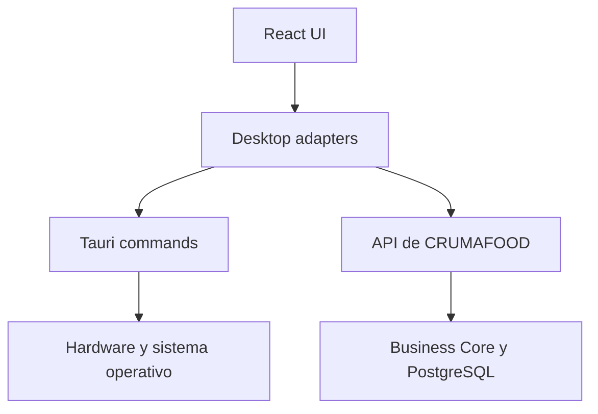
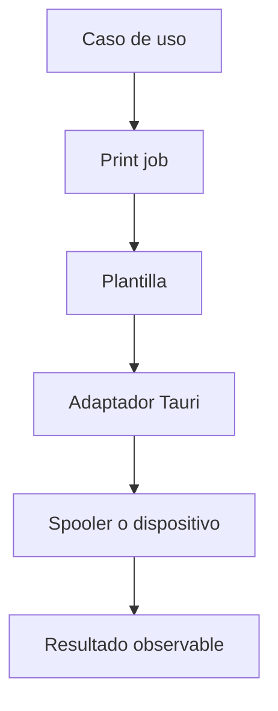

# Arquitectura Desktop de CRUMAFOOD Platform

> **Desktop debe ampliar la capacidad operativa mediante integración local segura, sin convertirse en una segunda fuente de reglas o datos.**

## Estado del documento

| Campo | Valor |
|---|---|
| Estado | Aprobado |
| Versión | 1.0 |
| Propietarios | Product Owner, responsable de arquitectura y responsable de Desktop |
| Aprobado por | Product Owner de CRUMAFOOD Platform |
| Fecha de aprobación | 2026-08-01 |
| Estado de implementación | Arquitectura objetivo no implementada; Tauri 2 permanece como propuesta del ADR-0004 y su adopción definitiva está condicionada al spike técnico, el threat model, la distribución firmada, la integración con hardware y un piloto controlado según las prioridades P0–P3 de la sección 75 |
| Base de evidencia | Revisión de `package.json`, `next.config.js`, `.github/workflows/ci.yml`, `src/app`, `src/contracts`, `src/core/contracts` y `docs/architecture/adr/0004-desktop-tauri-topology.md`; contraste con la documentación oficial de Tauri 2 y Next.js; no existen `src-tauri`, código Rust, dependencias Tauri, API de negocio versionada, pipeline Desktop, instaladores ni updater, y el frontend actual depende de 36 archivos con `'use server'`, tres Route Handlers, middleware y 152 referencias a `revalidatePath` sin `output: 'export'` |
| Alcance | Tauri, interfaz Desktop, bridge nativo, hardware, archivos, distribución, actualización y operación local |
| Autoridad | Derivado de `system-overview.md`, `business-core.md`, `data-architecture.md`, `security-architecture.md`, `multi-tenancy-architecture.md`, `integration-architecture.md`, `deployment-architecture.md`, `frontend-architecture.md`, `design-system-architecture.md`, `mobile-architecture.md`, `observability-architecture.md`, `testing-strategy.md`, `performance-architecture.md` y el CES |
| Revisión | Cuando cambie la tecnología Desktop, plataforma, bridge, hardware, distribución, seguridad o estrategia offline |

---

## 1. Propósito

Este documento define cómo CRUMAFOOD Platform construirá y operará un cliente Desktop para trabajo administrativo y operativo intensivo.

Su propósito es asegurar que Desktop:

- comparta reglas con Web y Mobile;
- consuma contratos de la plataforma;
- integre hardware mediante puertos;
- limite capacidades nativas;
- proteja sesiones y datos locales;
- se distribuya con firma;
- se actualice de forma segura;
- soporte diagnóstico;
- y evolucione sin duplicar el Business Core.

---

## 2. Declaración arquitectónica

> **Tauri 2 es la tecnología objetivo actual para Desktop, sujeta a ADR definitivo y a un piloto técnico de seguridad, distribución y hardware.**

Desktop será un cliente de CRUMAFOOD Platform.

No será:

- una base de datos paralela;
- un ERP independiente;
- una copia divergente de reglas;
- ni un acceso privilegiado implícito por estar instalado.

La interfaz y el bridge nativo se mantendrán separados por contratos pequeños.

---

## 3. Alcance

Esta arquitectura cubre:

- Tauri 2;
- WebView y frontend;
- Rust;
- commands;
- capabilities y permisos;
- autenticación;
- sesiones;
- API;
- impresión;
- etiquetas;
- escáneres;
- básculas;
- archivos;
- almacenamiento local;
- conectividad;
- offline;
- sincronización;
- ventanas;
- actualizaciones;
- firma;
- empaquetado;
- distribución;
- observabilidad;
- soporte;
- y pruebas.

No define todavía un instalador productivo ni compromete soporte para todas las plataformas.

---

## 4. Principios rectores

1. Platform-first;
2. Business Core independiente;
3. capacidades nativas mínimas;
4. contratos explícitos;
5. frontend no confiable frente al bridge;
6. secretos fuera del binario;
7. actualización firmada;
8. hardware detrás de puertos;
9. datos locales mínimos;
10. offline por capacidad;
11. compatibilidad versionada;
12. diagnóstico incorporado;
13. distribución reproducible;
14. piloto antes de expansión.

Instalar una aplicación no le concede autoridad adicional sobre el negocio.

---

## 5. Estado actual

El repositorio actual:

- solo contiene este documento y el ADR-0004 como artefactos específicos de Desktop;
- mantiene el ADR-0004 en estado Propuesto, condicionado a spike técnico y piloto;
- no contiene `src-tauri`;
- no contiene `tauri.conf.json`;
- no contiene `Cargo.toml`, `Cargo.lock` ni código Rust;
- no incluye dependencias o scripts Tauri;
- no tiene pipeline Desktop, instaladores, firma de código ni updater;
- no tiene adaptadores Desktop de impresora, báscula o escáner;
- no tiene almacenamiento local ni protocolo de sincronización Desktop;
- no expone una API de negocio versionada para este cliente;
- solo tiene Route Handlers activos para health, jobs y webhooks;
- y sus dos archivos detectados como contratos API son marcadores de un byte.

El frontend Next.js actual tampoco puede empaquetarse directamente como assets locales de Tauri:

- `next.config.js` no define `output: 'export'`;
- existen 36 archivos con `'use server'`;
- existen tres Route Handlers activos;
- existe middleware;
- `next.config.js` define headers de servidor;
- y existen 152 referencias estáticas a `revalidatePath`.

Sí contiene bases reutilizables:

- Business Core documentado y capacidades de dominio en evolución;
- frontend React y Next.js;
- Design System y arquitectura frontend;
- scanner web Mobile;
- módulos de inventario y producción;
- y documentación de seguridad, datos, integración, despliegue, pruebas y rendimiento.

Desktop es una dirección arquitectónica, no una capacidad implementada.

---

## 6. Estado objetivo

El estado objetivo tendrá:

- aplicación Tauri 2 separada;
- frontend empaquetado localmente o estrategia aprobada;
- API de plataforma versionada;
- commands nativos mínimos;
- capabilities por ventana;
- autenticación segura;
- tokens protegidos;
- adaptadores de hardware;
- actualizaciones firmadas;
- canales de release;
- CI multiplataforma;
- telemetría;
- y soporte operativo.



---

## 7. Rol de Desktop

Desktop priorizará:

- trabajo intensivo;
- teclado;
- múltiples paneles;
- impresión;
- archivos;
- dispositivos;
- operación de escritorio;
- y continuidad de sesión controlada.

Mobile seguirá siendo mejor para tareas táctiles de piso.

Storefront seguirá atendiendo clientes.

No se trasladará una función a Desktop solo porque sea posible.

---

## 8. Plataformas

Las plataformas posibles son:

- Windows;
- macOS;
- Linux.

La primera plataforma se elegirá con evidencia de equipos, hardware, soporte y costo.

La recomendación operativa es iniciar con una plataforma prioritaria y ampliar después de estabilizar:

- instalación;
- firma;
- actualización;
- drivers;
- y soporte.

Cada plataforma tendrá una matriz de compatibilidad.

---

## 9. Estrategias de interfaz

Se evaluarán tres estrategias.

### 9.1 Web remota dentro de carcasa

Carga la aplicación desplegada.

Ventaja: entrega web inmediata.

Riesgos: dependencia de red, ejecución remota, compatibilidad de versión y superficie de navegación.

### 9.2 Frontend empaquetado localmente

Distribuye assets con la aplicación y consume API.

Ventaja: control de versión, arranque y seguridad.

Costo: pipeline y compatibilidad de contratos.

### 9.3 Aplicación React dedicada

Reutiliza paquetes y construye UX Desktop específica.

Ventaja: experiencia optimizada.

Costo: superficie adicional.

La decisión final requiere ADR.

---

## 10. Dirección recomendada

La dirección propuesta es:

- frontend Desktop empaquetado localmente;
- contratos API de plataforma;
- paquetes compartidos estables;
- y bridge nativo limitado a capacidades locales.

Esta dirección evita cargar código remoto arbitrario con privilegios nativos.

El frontend Next.js actual no se empaquetará directamente, porque depende de capacidades de servidor incompatibles con una exportación estática.

El spike decidirá entre:

- una aplicación React dedicada que reutilice paquetes compartidos;
- o una variante Next.js exportable y separada de las capacidades de servidor.

Si se elige Next.js, el build Desktop deberá:

- usar `output: 'export'`;
- producir assets locales;
- adaptar imágenes y rutas al modo estático;
- y excluir Server Actions, Route Handlers, middleware, headers de servidor y dependencias de runtime servidor.

Las operaciones de servidor vivirán detrás de una API de plataforma versionada.

No se considera decisión definitiva hasta validar:

- autenticación;
- updater;
- hardware;
- tamaño;
- exportación o build del frontend;
- y experiencia de desarrollo.

---

## 11. Business Core

Desktop no implementará reglas diferentes.

Ejemplos:

- FEFO;
- estados de órdenes;
- permisos;
- inventario;
- costos;
- reservas;
- y trazabilidad.

El Business Core seguirá independiente de:

- Tauri;
- Rust;
- WebView;
- sistema operativo;
- y hardware.

---

## 12. Contratos de aplicación

Desktop consumirá casos de uso mediante:

- API HTTP;
- eventos autorizados;
- o paquetes de aplicación compatibles cuando la topología lo justifique.

El contrato tendrá:

- versión;
- autenticación;
- autorización;
- DTO;
- errores;
- idempotencia;
- y compatibilidad.

El cliente Supabase no será la API informal de Desktop.

---

## 13. Capas

```text
Desktop Presentation
        │
Desktop Application Adapters
        │
Platform API Ports     Hardware Ports
        │                    │
HTTP Adapter          Tauri/Rust Adapters
        │                    │
CRUMAFOOD Platform    Operating System
```

La presentación no invocará plugins o commands directamente salvo a través de adaptadores tipados.

---

## 14. Estructura objetivo

Cuando exista monorepo:

```text
apps/
└── desktop/
    ├── src/
    │   ├── application/
    │   ├── presentation/
    │   └── infrastructure/
    ├── src-tauri/
    │   ├── src/
    │   │   ├── commands/
    │   │   ├── hardware/
    │   │   ├── security/
    │   │   └── diagnostics/
    │   ├── capabilities/
    │   ├── Cargo.toml
    │   └── tauri.conf.json
    └── package.json
```

La estructura se creará con responsabilidades reales, no como marcadores.

---

## 15. WebView

El WebView se considera una superficie no confiable frente a capacidades nativas.

Se limitará:

- navegación;
- orígenes;
- contenido remoto;
- apertura de ventanas;
- descargas;
- y acceso a commands.

Los enlaces externos se abrirán en navegador del sistema mediante una operación autorizada.

No se permitirá navegar libremente a contenido externo dentro de una ventana privilegiada.

---

## 16. Bridge nativo

El bridge expondrá acciones por intención.

Correcto:

```text
print_label(template_id, data, printer_id)
read_stable_weight(scale_id)
export_report(report_id, destination)
```

Incorrecto:

```text
execute(command)
read_any_file(path)
write_any_file(path, bytes)
```

No se expondrá una API genérica del sistema operativo.

---

## 17. Tauri commands

Cada command tendrá:

- nombre específico;
- DTO tipado;
- validación Rust;
- permiso;
- timeout;
- error estable;
- logging seguro;
- y pruebas.

El frontend no podrá elegir ejecutables, argumentos, rutas o dispositivos fuera de listas autorizadas.

Los commands no contendrán reglas del negocio que ya pertenecen a la plataforma.

---

## 18. Capabilities y permisos

Tauri utilizará capabilities mínimas por ventana y función.

Se separarán capacidades para:

- shell principal;
- impresión;
- archivos;
- diagnóstico;
- y updater.

Una ventana no heredará todos los permisos por conveniencia.

Los commands propios registrados por la aplicación se declararán explícitamente mediante `AppManifest::commands` y se asociarán a capabilities explícitas.

No conservarán la disponibilidad global predeterminada para todas las ventanas y WebViews.

Agregar un plugin requerirá revisar sus comandos, alcance y permisos.

---

## 19. Plugins

Solo se instalarán plugins necesarios y mantenidos.

Cada plugin tendrá:

- finalidad;
- propietario;
- permisos;
- plataformas;
- riesgo;
- versión;
- y alternativa.

Los plugins de shell, filesystem, updater, dialog, store o SQL no se habilitarán globalmente.

No se instalará un plugin para anticipar una necesidad futura.

---

## 20. Rust

Rust se utilizará para:

- commands;
- acceso nativo;
- adaptadores de hardware;
- seguridad local;
- diagnóstico;
- y tareas apropiadas al runtime.

No se reimplementará el Business Core en Rust salvo una decisión explícita con una estrategia de única fuente.

El código Rust tendrá formato, lint, pruebas y revisión.

---

## 21. Autenticación

Supabase Auth seguirá siendo proveedor actual de identidad.

El flujo Desktop deberá elegir entre:

- autenticación mediante navegador del sistema y retorno seguro;
- autenticación en WebView con controles apropiados;
- o flujo específico aprobado.

Se preferirá un flujo estándar con PKCE y callback controlado cuando sea compatible.

La decisión requiere prueba con empaquetado real.

---

## 22. Callback de autenticación

El retorno a Desktop deberá:

- validar state;
- validar nonce cuando corresponda;
- limitar esquema o puerto;
- evitar secuestro de callback;
- y limpiar datos temporales.

Un deep link se considerará entrada no confiable.

No ejecutará commands nativos directamente desde parámetros externos.

---

## 23. Tokens

Los tokens no se almacenarán en:

- código;
- configuración pública;
- logs;
- archivos planos;
- localStorage;
- ni parámetros de URL permanentes.

Se utilizará almacenamiento seguro del sistema operativo mediante un adaptador revisado.

La aplicación soportará expiración, renovación, revocación y logout.

---

## 24. Autorización

Desktop no obtendrá privilegio adicional por su canal.

Cada caso de uso verificará:

- actor;
- permiso;
- organización;
- almacén;
- recurso;
- y contexto.

El bridge nativo también verificará capability y parámetros.

Ocultar un menú no autoriza.

---

## 25. Comunicación con API

El cliente tendrá un adaptador HTTP con:

- base URL por entorno;
- autenticación;
- correlación;
- timeouts;
- retry selectivo;
- idempotency keys;
- traducción de errores;
- y versionado.

No se llamarán tablas Supabase desde componentes Desktop.

Las versiones soportadas de cliente y API serán explícitas.

---

## 26. Compatibilidad cliente-servidor

Desktop puede actualizarse más lento que Web.

Por ello:

- API conservará una ventana de compatibilidad;
- el cliente enviará versión;
- el servidor podrá exigir actualización mínima;
- los cambios incompatibles tendrán transición;
- y el updater mostrará estado.

No se desplegará una API incompatible sin conocer clientes activos.

---

## 27. Estado local

Se distinguirá:

- configuración local;
- preferencias;
- caché;
- credenciales protegidas;
- comandos pendientes;
- y datos de diagnóstico.

El estado de negocio autoritativo seguirá en PostgreSQL.

Zustand o stores React no reemplazarán persistencia local estructurada.

---

## 28. Almacenamiento local

La elección de almacenamiento requerirá ADR.

Opciones posibles:

- store de configuración;
- archivos controlados;
- SQLite;
- o almacenamiento del sistema.

Cada dato local tendrá:

- finalidad;
- esquema;
- cifrado;
- retención;
- migración;
- y limpieza.

No se introducirá SQLite como segunda autoridad del ERP.

---

## 29. Offline

La primera versión Desktop podrá ser online-first.

Offline se habilitará por capacidad y deberá definir:

- datos disponibles;
- duración;
- cola;
- idempotencia;
- conflictos;
- cifrado;
- revocación;
- actualización;
- y recuperación.

Las reglas seguirán `mobile-architecture.md` e `integration-architecture.md`.

---

## 30. Sincronización

Desktop enviará comandos de negocio, no snapshots de tablas.

Cada comando incluirá:

- ID;
- versión;
- actor;
- dispositivo;
- idempotency key;
- fecha capturada;
- expected version;
- y payload.

El servidor decidirá aceptación o conflicto.

No se usará last-write-wins para inventario, costos o documentos.

---

## 31. Identidad de instalación

Cada instalación podrá tener un identificador revocable.

Servirá para:

- soporte;
- auditoría;
- compatibilidad;
- licenciamiento futuro si aplica;
- y control de comandos.

No será secreto ni reemplazará autenticación.

El fingerprinting invasivo queda prohibido.

---

## 32. Hardware Ports

Las capacidades se expresarán como puertos:

```ts
interface LabelPrinter {
  list(): Promise<PrinterInfo[]>;
  print(job: LabelPrintJob): Promise<PrintResult>;
}

interface ScaleReader {
  readStable(request: ReadWeightRequest): Promise<WeightReading>;
}

interface BarcodeScanner {
  subscribe(handler: (scan: ScanResult) => void): Unsubscribe;
}
```

Los módulos dependerán de estos contratos, no de drivers.

---

## 33. Registro de dispositivos

Los dispositivos configurables tendrán:

- ID interno;
- tipo;
- nombre;
- ubicación;
- conexión;
- capacidades;
- estado;
- parámetros no secretos;
- y fecha de prueba.

Las credenciales o claves se almacenarán de forma protegida.

La configuración tendrá alcance por estación o instalación.

---

## 34. Impresoras

El adaptador de impresión deberá soportar la necesidad real:

- impresora del sistema;
- impresora térmica;
- impresora de etiquetas;
- o formato específico aprobado.

No se asumirá que todas aceptan el mismo lenguaje, tamaño o DPI.

La detección y selección se hará mediante catálogo de dispositivos.

---

## 35. Etiquetas

Una etiqueta se generará desde:

- plantilla versionada;
- datos autorizados;
- tamaño;
- unidad física;
- resolución;
- y perfil de impresora.

La plantilla no contendrá reglas de inventario.

Los datos podrán incluir:

- producto;
- lote;
- fabricación;
- caducidad;
- cantidad;
- código;
- y trazabilidad.

---

## 36. Pipeline de impresión



La impresión no se invocará directamente desde un componente con datos sin validar.

---

## 37. Semántica de impresión

El estado de un print job podrá ser:

- requested;
- rendered;
- dispatched;
- confirmed;
- failed;
- unknown;
- cancelled.

El sistema no afirmará que una etiqueta salió físicamente solo porque el spooler aceptó el trabajo.

Los reintentos automáticos serán conservadores para evitar duplicados.

---

## 38. Reimpresión

La reimpresión tendrá:

- permiso;
- motivo;
- referencia al trabajo original;
- número de copia cuando aplique;
- y auditoría.

Una reimpresión no creará un nuevo lote o movimiento.

Las etiquetas sensibles podrán marcarse como reimpresión.

---

## 39. Escáneres

Desktop deberá soportar adaptadores según hardware real:

- keyboard wedge;
- serial;
- USB;
- cámara;
- o SDK de fabricante aprobado.

El resultado se normalizará a `ScanResult`.

Un escaneo no autoriza ni ejecuta por sí solo una mutación.

Se mantendrá captura manual como fallback cuando sea seguro.

---

## 40. Keyboard wedge

Un escáner tipo teclado deberá distinguirse de escritura humana mediante configuración y terminador cuando sea posible.

La captura:

- tendrá foco controlado;
- límite de longitud;
- formatos permitidos;
- timeout;
- y feedback.

No interceptará teclas globales fuera del contexto de escaneo.

---

## 41. Puertos seriales y USB

El acceso a serial o USB se limitará a dispositivos autorizados.

Se validarán:

- vendor/product ID cuando aplique;
- puerto;
- velocidad;
- protocolo;
- framing;
- checksum;
- y timeout.

Los bytes del dispositivo son entrada no confiable.

No se expondrá acceso serial genérico al WebView.

---

## 42. Básculas

Una lectura de peso incluirá:

- valor;
- unidad;
- estabilidad;
- tare;
- timestamp;
- dispositivo;
- y error.

El adaptador diferenciará lectura instantánea de lectura estable.

El Business Core validará unidad, rango y tolerancia.

La UI no calculará una cantidad autoritativa a partir de texto sin contrato.

---

## 43. Archivos

El acceso a archivos utilizará dialogs y rutas concedidas por el usuario o configuración autorizada.

Se limitará:

- extensión;
- tipo real;
- tamaño;
- ubicación;
- y operación.

No se permitirá leer o escribir rutas arbitrarias desde el frontend.

Las rutas no se registrarán completas cuando revelen información sensible.

---

## 44. Importaciones

Una importación seguirá `integration-architecture.md`.

Tendrá:

- formato versionado;
- validación previa;
- preview;
- resumen;
- errores por fila;
- confirmación;
- idempotencia;
- y auditoría.

El archivo se procesará en servidor o local según riesgo y tamaño, pero las mutaciones de negocio pasarán por casos de uso.

---

## 45. Exportaciones

Una exportación verificará:

- permiso;
- alcance;
- filtros;
- clasificación;
- destino;
- y auditoría.

Los archivos temporales tendrán limpieza.

La UI no exportará datos fuera del alcance a partir de una caché local no verificada.

---

## 46. PDF y documentos

La generación podrá ocurrir:

- en servidor para documentos autoritativos;
- o localmente para representación aprobada.

El documento declarará fuente, versión y fecha.

La impresión de PDF y la impresión de comandos de etiqueta son capacidades distintas.

---

## 47. Shell y procesos

No se habilitará ejecución genérica de shell.

Si una integración requiere un proceso externo:

- tendrá binario aprobado;
- ruta controlada;
- argumentos definidos;
- timeout;
- límites;
- salida capturada de forma segura;
- y firma o procedencia.

No se concatenará entrada de usuario en comandos.

---

## 48. Navegación externa

Los enlaces externos se permitirán mediante lista de esquemas y dominios.

Se abrirán en navegador del sistema cuando corresponda.

Los deep links entrantes:

- validarán origen y formato;
- no ejecutarán mutaciones;
- y requerirán sesión y autorización.

---

## 49. Ventanas

Se preferirá una ventana principal.

Se agregarán ventanas adicionales solo para:

- impresión o preview;
- tarea especializada;
- monitor autorizado;
- o flujo que lo justifique.

Cada ventana tendrá capabilities mínimas.

No se compartirá estado sensible mediante globals sin control.

---

## 50. Tray y background

La ejecución en tray o background solo se habilitará si existe necesidad de:

- sincronización;
- notificaciones;
- dispositivos;
- o jobs locales.

El usuario sabrá cuándo la aplicación sigue activa.

Cerrar, salir y minimizar tendrán semántica clara.

No se mantendrán permisos o cámara activos sin indicación.

---

## 51. Notificaciones del sistema

Las notificaciones nativas requerirán permiso y finalidad.

No mostrarán datos sensibles en pantalla bloqueada sin política.

Una notificación:

- tendrá origen;
- acción segura;
- expiración;
- y deduplicación.

No sustituirá una cola de tareas dentro de la aplicación.

---

## 52. Seguridad de contenido

Se aplicará CSP restrictiva compatible con Tauri.

Se limitarán:

- scripts;
- conexiones;
- imágenes;
- estilos;
- frames;
- y recursos remotos.

No se usará `unsafe-eval` por comodidad sin excepción revisada.

El contenido remoto no heredará capabilities nativas.

---

## 53. Secretos

El binario no contendrá:

- service role;
- claves de base;
- tokens de proveedor;
- secretos de webhook;
- ni credenciales compartidas.

Las credenciales de usuario se obtendrán en runtime y se protegerán.

Todo secreto embebido en una aplicación distribuida debe considerarse recuperable por un atacante.

---

## 54. Actualizaciones

Las actualizaciones serán:

- firmadas;
- verificadas;
- servidas por origen controlado;
- compatibles con canal;
- y observables.

La aplicación verificará metadata y artefacto antes de instalar.

No se ejecutará código descargado fuera del mecanismo de updater aprobado.

---

## 55. Canales

Se podrán mantener:

- internal;
- beta;
- stable.

Cada canal tendrá:

- audiencia;
- versión;
- origen;
- criterio de promoción;
- y soporte.

Un dispositivo no cambiará de canal sin autorización.

---

## 56. Política de actualización

Se definirá:

- actualización opcional;
- obligatoria por seguridad;
- versión mínima de API;
- descarga en background;
- momento de instalación;
- y rollback.

No se interrumpirá una tarea crítica sin preservar estado.

Las versiones vulnerables podrán bloquearse de forma controlada.

---

## 57. Rollback

Rollback Desktop deberá considerar:

- compatibilidad de API;
- almacenamiento local;
- commands pendientes;
- plugins;
- y configuración.

No se instalará una versión anterior que no pueda leer el estado local.

Se preferirán cambios expand-contract entre cliente y servidor.

---

## 58. Firma de código

Los artefactos productivos se firmarán según plataforma.

La firma de código de plataforma y la firma criptográfica utilizada por el updater son controles distintos.

Ambas se configurarán, protegerán y verificarán explícitamente.

Las claves privadas de firma de plataforma y del updater:

- no vivirán en el repositorio;
- estarán restringidas;
- tendrán respaldo seguro;
- tendrán rotación cuando el mecanismo lo permita;
- y contarán con procedimiento de incidente y continuidad.

La clave pública del updater se distribuirá con la aplicación para verificar artefactos.

CI protegerá secretos de firma frente a código no confiable.

---

## 59. Empaquetado

Se generarán formatos apropiados por plataforma.

Cada paquete tendrá:

- nombre;
- versión;
- publisher;
- iconos;
- permisos;
- arquitectura;
- firma;
- y checksum.

No se distribuirá un ejecutable sin procedencia y versión identificables.

---

## 60. CI Desktop

El pipeline deberá:

1. instalar dependencias JS y Rust;
2. typecheck;
3. lint frontend;
4. format y lint Rust;
5. ejecutar pruebas;
6. construir por plataforma;
7. verificar capabilities;
8. firmar solo en contexto autorizado;
9. generar artefactos;
10. publicar metadata;
11. y conservar evidencia.

La matriz multiplataforma se ampliará según soporte real.

---

## 61. Reproducibilidad

Se fijarán:

- Node;
- gestor y lockfile;
- Rust toolchain;
- Cargo.lock;
- Tauri;
- plugins;
- targets;
- y configuración.

Una versión deberá poder reconstruirse desde su commit en entorno controlado.

Las diferencias por máquina se tratarán como defectos del pipeline.

---

## 62. Distribución

La distribución podrá realizarse mediante:

- portal interno;
- MDM;
- enlace controlado;
- o tienda/plataforma aprobada.

Se definirá:

- quién instala;
- quién actualiza;
- qué equipos son compatibles;
- y cómo se retira una versión.

No se enviarán ejecutables por canales informales sin verificación.

---

## 63. Entornos

Desktop distinguirá:

- Development;
- Preview o internal;
- Staging cuando exista;
- Production.

Cada build tendrá:

- API base;
- canal de update;
- identidad visual diferenciable cuando sea necesario;
- telemetría;
- y configuración.

Un build no productivo no apuntará accidentalmente a Production.

---

## 64. Configuración

La configuración se dividirá en:

- build-time no secreta;
- runtime administrada;
- preferencia local;
- dispositivo;
- y secreto protegido.

Se validará al iniciar.

La configuración corrupta tendrá fallback y recuperación.

No se editarán archivos internos manualmente como procedimiento normal.

---

## 65. Observabilidad

Desktop registrará de forma segura:

- versión;
- canal;
- plataforma;
- sistema operativo;
- instalación seudonimizada;
- inicio y cierre;
- errores;
- commands nativos;
- hardware;
- actualización;
- API;
- y sincronización.

No registrará tokens, rutas sensibles ni payloads completos.

---

## 66. Logs locales

Los logs locales tendrán:

- nivel;
- rotación;
- tamaño;
- retención;
- redacción;
- y exportación autorizada.

El usuario podrá generar un paquete de diagnóstico seguro.

La limpieza será automática.

Un log local no sustituye auditoría del servidor.

---

## 67. Diagnóstico

Una pantalla de diagnóstico podrá mostrar:

- versión;
- channel;
- API;
- conectividad;
- sesión;
- instalación;
- plugins;
- impresoras;
- escáneres;
- básculas;
- última actualización;
- y correlation IDs.

No mostrará secretos.

---

## 68. Manejo de errores

Los errores se normalizarán por capa:

- UI;
- API;
- command;
- plugin;
- driver;
- sistema operativo;
- y dispositivo.

El mensaje al usuario indicará acción posible.

El detalle técnico quedará en diagnóstico.

No se mostrará una excepción Rust sin traducción.

---

## 69. Recuperación

Desktop deberá recuperarse de:

- cierre inesperado;
- actualización interrumpida;
- configuración corrupta;
- dispositivo desconectado;
- API caída;
- token vencido;
- comando desconocido;
- y cola local pendiente.

La recuperación no repetirá efectos autoritativos sin idempotencia.

---

## 70. Rendimiento

Se medirán:

- tiempo de arranque;
- memoria;
- tamaño del instalador;
- carga de ventana;
- latencia API;
- impresión;
- lectura de hardware;
- y actualización.

No se moverá trabajo al bridge solo por rendimiento percibido sin medición.

El WebView mantendrá JavaScript bajo control.

---

## 71. Accesibilidad y productividad

Desktop cumplirá la arquitectura frontend y objetivo WCAG 2.2 AA.

Además priorizará:

- teclado;
- shortcuts configurados;
- foco;
- tablas densas;
- ventanas redimensionables;
- zoom;
- high contrast;
- y lectores de pantalla.

Los atajos no colisionarán con el sistema operativo o tecnologías de asistencia.

---

## 72. Testing

La estrategia incluirá:

- unitarias TypeScript;
- unitarias Rust;
- commands;
- capabilities;
- contratos API;
- autenticación;
- almacenamiento;
- migraciones locales;
- updater;
- instalador;
- y recuperación.

Hardware utilizará fakes y pruebas con dispositivos reales representativos.

---

## 73. Laboratorio de hardware

Se mantendrá una matriz con:

- modelo;
- firmware;
- driver;
- conexión;
- sistema operativo;
- configuración;
- protocolo;
- y resultado.

Se probarán:

- desconexión;
- papel agotado;
- lectura inestable;
- puerto ocupado;
- permisos;
- y reinicio.

---

## 74. Piloto

La primera versión Desktop tendrá un piloto limitado.

Definirá:

- usuarios;
- equipos;
- plataforma;
- hardware;
- tareas;
- soporte;
- métricas;
- rollback;
- y criterio de detener.

No se ampliará distribución hasta demostrar instalación, actualización y recuperación.

---

## 75. Prioridades de implementación

### P0 — Decisión y seguridad

- ejecutar el prototipo y spike Tauri;
- resolver el ADR-0004 con la evidencia del spike;
- elegir y validar la estrategia de frontend exportable o dedicado;
- restringir capabilities y commands propios;
- validar autenticación y callback;
- definir la API de plataforma versionada;
- y completar el threat model.

### P1 — Distribución básica

- pipeline;
- firma;
- instalador;
- updater;
- canales;
- y diagnóstico.

### P2 — Primer hardware

- elegir una impresora o dispositivo real;
- implementar port y adapter;
- probar errores;
- y pilotar.

### P3 — Operación avanzada

- múltiples dispositivos;
- almacenamiento local;
- offline selectivo;
- y sincronización.

---

## 76. Estrategia de transición

### Etapa 1 — Spike

- crear aplicación mínima;
- validar WebView;
- autenticación;
- API;
- capabilities;
- build;
- y tamaño.

### Etapa 2 — Distribución interna

- firma;
- installer;
- updater;
- logs;
- y soporte.

### Etapa 3 — Hardware piloto

- port;
- adapter;
- configuración;
- pruebas;
- y operación controlada.

### Etapa 4 — Producto Desktop

- UX específica;
- compatibilidad;
- canales;
- métricas;
- y expansión.

### Etapa 5 — Offline

- solo después de estabilizar plataforma, datos y sincronización.

---

## 77. Antipatrones prohibidos

Se prohíbe:

- cargar contenido remoto arbitrario con capabilities;
- exponer shell genérico;
- exponer filesystem completo;
- confiar en parámetros del WebView;
- guardar tokens en localStorage;
- incluir secretos en el binario;
- duplicar Business Core en Rust;
- llamar drivers desde componentes;
- asumir impresión física confirmada;
- reintentar impresión desconocida automáticamente;
- usar SQLite como segunda autoridad;
- habilitar todos los plugins;
- distribuir sin firma;
- actualizar sin verificación;
- y prometer todas las plataformas antes del piloto.

---

## 78. Definition of Done Desktop

Una capacidad Desktop está completa cuando:

- tiene necesidad real;
- usa contrato de aplicación;
- define capability mínima;
- valida frontend y Rust;
- protege tokens;
- aísla hardware;
- maneja desconexión;
- tiene errores estables;
- observa resultado;
- funciona en plataforma soportada;
- tiene pruebas;
- se empaqueta;
- se firma;
- se actualiza;
- se puede recuperar;
- y tiene soporte documentado.

---

## 79. Gobierno

Los cambios Desktop se revisarán por:

- plataforma;
- seguridad;
- API;
- hardware;
- distribución;
- actualización;
- accesibilidad;
- soporte;
- y recuperación.

Agregar un plugin, command o capability será una decisión de seguridad.

Los permisos no crecerán silenciosamente.

---

## 80. Decisiones que requieren ADR

Se formalizarán, al menos:

1. adopción definitiva de Tauri 2;
2. estrategia de interfaz;
3. plataforma inicial;
4. estructura monorepo;
5. autenticación y callback;
6. almacenamiento seguro de tokens;
7. capabilities base;
8. plugins permitidos;
9. API y compatibilidad;
10. almacenamiento local;
11. offline y sincronización;
12. impresión y formato de etiquetas;
13. escáneres y básculas;
14. firma y certificados;
15. updater y canales;
16. distribución;
17. observabilidad;
18. soporte multiplataforma.

---

## 81. Criterios de conformidad

Una implementación cumple esta arquitectura si:

- actúa como cliente de plataforma;
- conserva Business Core independiente;
- limita capabilities;
- valida commands;
- protege identidad;
- aísla hardware;
- distribuye artefactos firmados;
- actualiza de forma verificada;
- mantiene compatibilidad;
- y permite diagnóstico y recuperación.

La conformidad se demuestra con código, capabilities, pipeline, artefactos, pruebas y piloto.

---

## 82. Evolución

Este documento evolucionará cuando:

- concluya el spike Tauri;
- se elija plataforma inicial;
- se conecte el primer dispositivo;
- se distribuya el primer instalador;
- se habilite updater;
- se introduzca offline;
- o se amplíe soporte de sistemas operativos.

La evolución conservará el principio Platform-first.

---

## 83. Declaración final

> **CRUMAFOOD Desktop será una puerta segura a capacidades locales, no una bifurcación de la plataforma.**

La aplicación podrá imprimir, escanear, pesar, importar y operar con la ergonomía del escritorio.

Pero:

- las reglas seguirán en el Business Core;
- los datos conservarán su autoridad;
- los commands serán mínimos;
- el hardware estará aislado;
- los binarios estarán firmados;
- y las actualizaciones serán verificables.

Desktop ampliará el alcance de CRUMAFOOD sin multiplicar sus fuentes de verdad ni su superficie de riesgo.
