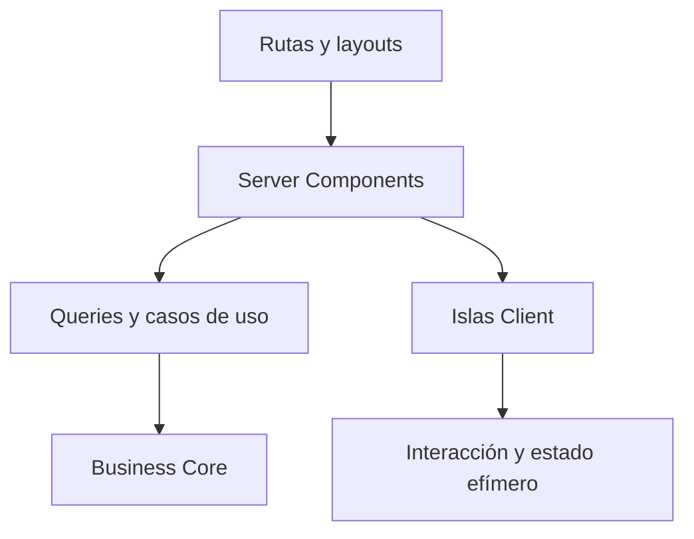

# Arquitectura Frontend de CRUMAFOOD Platform

> **La interfaz debe hacer comprensible la operación sin duplicar ni reinterpretar las reglas del negocio.**

## Estado del documento

| Campo | Valor |
|---|---|
| Estado | Aprobado |
| Versión | 1.0 |
| Propietarios | Product Owner, responsable de arquitectura y responsable de experiencia frontend |
| Aprobado por | Product Owner de CRUMAFOOD Platform |
| Fecha de aprobación | 2026-07-31 |
| Estado de implementación | En transición; Next.js App Router, Server Components, límites de carga y error, formularios operativos y puertas básicas de CI están activos, pero la separación consistente mediante casos de uso, el estado navegable en URL, la caché explícita, la plataforma visual accesible, Storefront, PWA y las pruebas frontend continúan pendientes |
| Base de evidencia | Revisión de `package.json`, `.github/workflows/ci.yml`, `src/app`, `src/providers`, `src/modules` y `src/shared/ui`; inventario de 281 páginas activas, 21 límites `loading.tsx`, 21 límites `error.tsx`, 20 páginas y dos Route Handlers deshabilitados, 180 archivos en Shared UI con 74 marcadores de un byte, 49 fronteras cliente, cero pruebas TSX y seis stories sin infraestructura ejecutable |
| Alcance | Admin, Storefront, Mobile Web, presentación, interacción, estado, accesibilidad y rendimiento |
| Autoridad | Derivado de `system-overview.md`, `business-core.md`, `data-architecture.md`, `security-architecture.md`, `multi-tenancy-architecture.md`, `integration-architecture.md`, `deployment-architecture.md`, `design-system-architecture.md`, `mobile-architecture.md`, `desktop-architecture.md`, `observability-architecture.md`, `testing-strategy.md`, `performance-architecture.md` y el CES |
| Revisión | Cuando cambie el framework, el sistema de diseño, una superficie, el modelo de estado o una regla de experiencia transversal |

---

## 1. Propósito

Este documento define cómo CRUMAFOOD Platform construirá experiencias frontend coherentes para:

- administración;
- operación móvil;
- Storefront;
- clientes;
- proveedores;
- y futuras superficies Desktop.

Su propósito es asegurar que:

- la lógica de negocio no se disperse en componentes;
- Server y Client Components tengan límites claros;
- los estados de interfaz sean consistentes;
- formularios y tablas sean reutilizables;
- la aplicación funcione con teclado, lector y móvil;
- el rendimiento sea una propiedad medible;
- y cada pantalla ayude a ejecutar una intención real.

---

## 2. Declaración arquitectónica

> **Next.js App Router compondrá las superficies; React presentará e interactuará; los casos de uso gobernarán el comportamiento.**

La interfaz podrá:

- presentar;
- solicitar comandos;
- ejecutar navegación;
- mantener estado efímero;
- y ofrecer retroalimentación.

La interfaz no será autoridad de:

- inventario;
- precios;
- permisos;
- estados transaccionales;
- costos;
- ni reglas de dominio.

---

## 3. Alcance

Esta arquitectura cubre:

- App Router;
- layouts y route groups;
- Server Components;
- Client Components;
- Server Actions;
- obtención de datos;
- caché;
- estado;
- formularios;
- tablas;
- navegación;
- búsqueda y filtros;
- diseño responsivo;
- sistema de diseño;
- temas;
- accesibilidad;
- internacionalización;
- SEO;
- rendimiento;
- errores;
- pruebas;
- PWA;
- y evolución.

No sustituye guías visuales de marca, research de usuarios ni especificaciones funcionales de cada módulo.

---

## 4. Principios rectores

1. servidor por defecto;
2. cliente solo cuando aporta interacción;
3. intención antes que pantalla;
4. una fuente de verdad por estado;
5. URL para estado navegable;
6. contexto antes que memoria del usuario;
7. mobile-first;
8. accesibilidad desde el diseño;
9. estados completos;
10. componentes por responsabilidad;
11. rendimiento medido;
12. consistencia sin rigidez;
13. seguridad en servidor;
14. evolución incremental.

La simplicidad para el usuario puede requerir complejidad bien contenida dentro del sistema.

---

## 5. Estado actual

El repositorio contiene:

- Next.js 15.5.19 y React 19.1.0;
- App Router con route groups para Admin, Auth y Storefront;
- una superficie `/mobile`;
- 281 páginas activas;
- 21 límites `loading.tsx` y 21 límites `error.tsx`;
- 49 fronteras cliente bajo `src/app`, con solo login y scan como páginas cliente completas;
- Tailwind CSS 3, `next-themes`, Sonner, Recharts, Framer Motion y Lucide;
- TanStack Query y Table;
- React Hook Form y Zod;
- Zustand instalado, aunque sin consumo real;
- formularios funcionales de catálogo y operación;
- puertas de CI para typecheck, lint, cobertura y build;
- y una estructura amplia en `src/shared/ui`.

También se identifican brechas:

- 180 archivos en `src/shared/ui`, de los cuales 74 son marcadores de un byte;
- `DataTable` todavía no implementa el comportamiento declarado;
- varios primitives exponen variantes sin estilos asociados;
- Tailwind no contiene tokens extendidos y `globals.css` solo contiene una base mínima;
- de 42 archivos con formularios, solo uno usa React Hook Form con Zod Resolver;
- TanStack Query está disponible globalmente, pero su uso funcional se limita actualmente a dos hooks de usuarios;
- Zustand no tiene consumidores y sus cuatro stores detectados son marcadores de un byte;
- existen 20 páginas y dos Route Handlers deshabilitados;
- Storefront y su navegación son mayormente placeholders;
- el sidebar Admin no es responsivo y consulta notificaciones directamente;
- Mobile enlaza `/mobile/receive`, `/mobile/inventory` y `/mobile/lots`, que no coinciden con rutas de lista implementadas;
- el acceso a Supabase continúa extendido directamente dentro de `src/app`, sin separación consistente mediante casos de uso y DTO;
- no existe uso verificable de la URL como estado navegable;
- la caché no se declara explícitamente y la invalidación depende de `revalidatePath`, con 152 referencias estáticas y ninguna a `revalidateTag`;
- varios límites y pantallas presentan `error.message` directamente al usuario;
- solo el layout raíz y una ruta de producto declaran metadata explícita;
- el manifest PWA no está conectado, no declara iconos, sus dos archivos de icono son marcadores de un byte y no existe service worker verificable;
- no se identificaron pruebas frontend TSX ni infraestructura ejecutable para las seis stories;
- y las señales estáticas de accesibilidad explícita son todavía escasas.

El frontend actual es funcional en áreas específicas, pero su plataforma visual y de interacción todavía debe consolidarse.

---

## 6. Estado objetivo

El estado objetivo tendrá:

- Server Components como opción predeterminada;
- islas cliente pequeñas;
- casos de uso detrás de Server Actions y queries;
- rutas organizadas por superficie y dominio;
- sistema de diseño con tokens;
- primitives accesibles;
- patrones de página compartidos;
- formularios RHF/Zod coherentes;
- DataTable completa;
- estados loading, empty, error y success;
- navegación responsiva;
- búsqueda global;
- filtros persistidos en URL;
- accesibilidad WCAG 2.2 AA como objetivo;
- pruebas por riesgo;
- y presupuestos de rendimiento.



---

## 7. Superficies

CRUMAFOOD distinguirá:

| Superficie | Objetivo |
|---|---|
| Admin | Configuración, control, análisis y decisiones |
| Mobile Operations | Ejecución rápida en piso y almacén |
| Storefront | Descubrimiento, compra y seguimiento para cliente |
| Auth | Entrada, recuperación y activación |
| Portales futuros | Experiencias específicas para cliente o proveedor |
| Desktop futuro | Operación empresarial y hardware mediante Tauri |

Compartirán tokens y primitives cuando sea útil, pero no navegación, densidad o lenguaje de interacción por accidente.

---

## 8. Route groups

Los route groups separarán superficies sin formar parte de la URL.

Estructura actual:

```text
src/app/
├── (admin)/
├── (auth)/
├── (storefront)/
├── mobile/
└── api/
```

Cada grupo tendrá:

- layout;
- navegación;
- protección;
- error boundary;
- loading;
- metadata;
- y estilos de superficie.

Un componente de navegación de Storefront no deberá aparecer en Admin o Mobile.

---

## 9. Organización por dominio

Las páginas compondrán capacidades de módulos.

```text
modules/<module>/
├── presentation/
│   ├── components/
│   ├── hooks/
│   ├── mappers/
│   └── views/
└── application/
```

`app/` conservará:

- rutas;
- layouts;
- metadata;
- límites de error;
- loading;
- y composición.

La lógica reutilizable de una capacidad no vivirá duplicada en varias páginas.

---

## 10. Responsabilidades de página

Una página deberá:

- resolver parámetros;
- obtener contexto autorizado;
- ejecutar una query;
- elegir un patrón de presentación;
- y componer componentes.

No deberá:

- implementar reglas complejas;
- contener consultas extensas repetidas;
- definir estilos de todo el sistema;
- ni mezclar varios flujos sin límite.

Las páginas serán fáciles de leer como descripción del caso de uso mostrado.

---

## 11. Server Components

Los Server Components serán predeterminados para:

- lectura inicial;
- autorización de vista;
- composición;
- metadata;
- acceso a secretos de servidor mediante adaptadores;
- y reducción de JavaScript enviado.

Podrán obtener datos, pero el estado objetivo lo hará mediante queries o repositorios de aplicación, no con llamadas a tablas dispersas.

Un Server Component no enviará al cliente más datos de los necesarios.

---

## 12. Client Components

Se utilizará `'use client'` cuando exista necesidad de:

- eventos del navegador;
- estado interactivo;
- hooks cliente;
- APIs del dispositivo;
- drag and drop;
- gráficos interactivos;
- formularios ricos;
- o proveedores cliente.

El límite cliente se colocará lo más abajo posible.

No se convertirá una página completa a cliente para habilitar un botón o un filtro.

---

## 13. Límites de hidratación

Los datos que cruzan del servidor al cliente deberán ser:

- serializables;
- mínimos;
- autorizados;
- estables;
- y libres de secretos.

Se evitarán diferencias de render entre servidor y cliente por:

- tiempo;
- tema;
- locale;
- acceso a `window`;
- valores aleatorios;
- o datos mutables.

`suppressHydrationWarning` se limitará a diferencias conocidas y justificadas, no ocultará problemas generales.

---

## 14. Providers

Los providers se limitarán al menor subárbol que los necesita.

Actualmente `AppProvider` incluye:

- Theme;
- TanStack Query;
- Toast.

Se revisará si todos deben envolver todas las superficies.

Reglas:

- no crear contextos globales para estado local;
- no usar `any` en contratos de contexto;
- evitar renders globales innecesarios;
- y documentar ciclo de vida.

---

## 15. Obtención de datos

Se preferirá lectura en servidor para el render inicial.

TanStack Query se utilizará cuando exista:

- interacción cliente prolongada;
- refetch controlado;
- actualización optimista;
- polling justificado;
- paginación cliente;
- o sincronización de caché interactiva.

No se obtendrá el mismo dato simultáneamente mediante Server Component y query cliente sin estrategia de hidratación y propiedad.

---

## 16. Queries de aplicación

Las lecturas se expresarán como intención:

```ts
const result = await listProducts.execute({
  filters,
  page,
  actor,
});
```

La presentación recibirá DTO adecuados para la vista.

No recibirá:

- clientes Supabase;
- filas crudas;
- errores del proveedor;
- ni campos sensibles innecesarios.

---

## 17. Server Actions

Una Server Action será un adaptador de entrada.

Flujo:

1. resolver actor;
2. validar entrada;
3. mapear a comando;
4. autorizar;
5. ejecutar caso de uso;
6. traducir resultado;
7. invalidar datos necesarios;
8. y responder con estado de UI seguro.

No contendrá la regla principal ni confiará en campos ocultos.

---

## 18. Caché

Cada lectura declarará:

- frescura;
- alcance;
- sensibilidad;
- clave;
- invalidación;
- y tolerancia a dato anterior.

Catálogo público puede admitir caché mayor.

Inventario, permisos, costos y estados operativos requieren políticas más estrictas.

`revalidatePath` se usará conscientemente; no sustituirá una estrategia de datos.

---

## 19. Estado de interfaz

El estado se clasificará antes de elegir herramienta:

| Estado | Propietario preferido |
|---|---|
| Persistente de negocio | Servidor y Business Core |
| Datos remotos interactivos | Server Component o TanStack Query |
| Navegable | URL |
| Formulario | React Hook Form o estado local controlado |
| Efímero local | `useState` o reducer |
| Transversal cliente | Context o Zustand con justificación |

No se copiará estado remoto a Zustand sin una necesidad explícita.

---

## 20. URL como estado

Búsqueda, filtros, orden y página deberán vivir en URL cuando deban:

- compartirse;
- conservarse al volver;
- soportar navegación;
- o permitir enlaces.

Ejemplo:

```text
/products?q=tequeno&status=active&category=...&page=2
```

Los parámetros se validarán y tendrán valores predeterminados.

---

## 21. Zustand

Zustand se reservará para estado cliente transversal que no pertenezca al servidor ni a la URL.

Casos posibles:

- preferencias temporales de workspace;
- selección compleja entre vistas;
- cola local offline aprobada;
- o interacción de herramienta.

Cada store tendrá:

- propietario;
- contrato tipado;
- alcance;
- persistencia explícita;
- y reset.

Las carpetas `store/.ts` actuales son marcadores.

---

## 22. TanStack Query

La configuración global actual define:

- `staleTime` de 60 segundos;
- un reintento;
- sin refetch al enfocar.

Estos valores no serán correctos para todos los dominios.

Se definirán defaults por tipo de dato:

- catálogo;
- inventario;
- notificaciones;
- dashboards;
- y configuración.

Las mutations invalidarán claves específicas y traducirán errores de negocio.

---

## 23. Actualización optimista

Se utilizará cuando:

- la acción sea reversible;
- la probabilidad de conflicto sea baja;
- el usuario reciba corrección clara;
- y exista rollback del estado local.

No se utilizará optimismo para afirmar:

- pago confirmado;
- inventario consumido;
- aprobación concedida;
- lote liberado;
- o producción completada antes de confirmación del servidor.

---

## 24. Formularios

El patrón objetivo utilizará:

- React Hook Form;
- Zod;
- componentes accesibles;
- validación cliente para experiencia;
- validación servidor para autoridad;
- y errores de negocio traducidos.

Los formularios manuales actuales migrarán cuando se modifiquen, no mediante una reescritura masiva.

El patrón de Identity con RHF/Zod servirá como referencia, después de completar sus primitives.

---

## 25. Esquemas de formulario

El esquema de UI podrá compartir conceptos, pero no será automáticamente el contrato de dominio.

Se diferenciarán:

- formato de campo;
- DTO de comando;
- regla de negocio;
- y restricción de datos.

Los mensajes estarán en español claro.

Un campo opcional vacío se normalizará explícitamente a ausencia o `null` según contrato.

---

## 26. Formularios dependientes

Las relaciones deberán mostrar contexto.

Ejemplo producto:

1. seleccionar categoría;
2. filtrar familias de esa categoría;
3. seleccionar familia;
4. mostrar sabor y preparación aplicables;
5. generar código con prefijo autorizado;
6. permitir edición consciente.

La familia mostrará su categoría en listas y selecciones.

El producto mostrará familia y categoría para evitar decisiones por memoria.

---

## 27. Envío de formularios

Durante el envío:

- el control principal indicará progreso;
- se evitarán dobles envíos;
- el formulario conservará datos ante error recuperable;
- el foco irá al primer error útil;
- y el éxito tendrá resultado visible.

No se dependerá únicamente de un toast.

Operaciones críticas utilizarán idempotencia en servidor.

---

## 28. Errores de campo y formulario

Los errores se mostrarán junto al campo y tendrán relación accesible mediante atributos apropiados.

Se distinguirán:

- requerido;
- formato;
- conflicto;
- permiso;
- regla de negocio;
- y falla temporal.

No se mostrará `error.message` técnico directamente al usuario.

El detalle técnico quedará en observabilidad con correlación.

---

## 29. Acciones destructivas

Eliminar, cancelar, revertir, ajustar o liberar requerirá confirmación proporcional al impacto.

La confirmación deberá mostrar:

- objeto;
- consecuencia;
- reversibilidad;
- y acción principal explícita.

Un botón destructivo tendrá estilo, texto y foco coherentes.

Las acciones de alto impacto podrán exigir motivo o confirmación reforzada.

---

## 30. Sistema de diseño

El sistema de diseño tendrá capas:

```text
tokens
primitives
components
patterns
module views
pages
```

Los tokens expresarán:

- color;
- tipografía;
- espacio;
- radio;
- sombra;
- movimiento;
- z-index;
- y breakpoints.

Tailwind consumirá estos tokens mediante configuración y variables CSS.

---

## 31. Tokens semánticos

Se utilizarán nombres por propósito:

- `background`;
- `foreground`;
- `surface`;
- `muted`;
- `primary`;
- `danger`;
- `warning`;
- `success`;
- `border`;
- `focus`.

No se codificará el significado como `blue-50` o `red-600` en cientos de páginas.

Los colores operativos deberán conservar contraste y significado en light y dark.

---

## 32. Primitives

Los primitives serán accesibles y estilizados:

- Button;
- Input;
- Select;
- Checkbox;
- Switch;
- Badge;
- Card;
- Dialog;
- Tooltip;
- Menu;
- Table primitives.

Props como `variant` y `size` deberán producir estilos reales y verificables.

No se declarará completo un primitive que solo propaga `data-*` sin una capa visual asociada.

---

## 33. Componentes

Un componente compartido debe:

- representar un patrón repetido;
- tener API pequeña;
- permitir composición;
- conservar semántica;
- y evitar conocimiento de un módulo específico.

Un componente que solo se utiliza en una capacidad vivirá en ese módulo hasta demostrar reutilización.

Reutilizar conocimiento no significa construir abstracciones prematuras.

---

## 34. Patrones de página

Se formalizarán:

- List Page;
- Detail Page;
- Create/Edit Form;
- Dashboard;
- Master-Detail;
- Settings;
- Workflow Task;
- Mobile Task.

Cada patrón definirá:

- encabezado;
- acciones;
- filtros;
- contenido;
- estados;
- y comportamiento responsivo.

Los patterns vacíos actuales se completarán solo cuando tengan consumidores reales.

---

## 35. Estados de interfaz

Toda vista de datos contemplará:

- initial;
- loading;
- empty;
- success;
- stale;
- partial;
- error;
- unauthorized;
- y offline cuando aplique.

El estado vacío explicará:

- qué significa;
- si es normal;
- y cuál es la siguiente acción.

Un spinner global no sustituye skeletons o streaming contextual.

---

## 36. Loading y Suspense

Se utilizarán límites próximos a la parte que espera.

Las cargas deberán:

- preservar layout;
- evitar saltos;
- mostrar progreso relevante;
- permitir streaming;
- y no bloquear navegación completa sin necesidad.

Los skeletons imitarán estructura, no serán decoración genérica.

No se mostrará información anterior como actual sin indicarlo.

---

## 37. Error boundaries

Los `error.tsx` tendrán:

- mensaje seguro;
- opción de reintento cuando sea válida;
- salida o navegación alternativa;
- correlación;
- y registro técnico.

No expondrán stack ni mensajes del proveedor.

Los 21 boundaries actuales se consolidarán en componentes compartidos sin perder contexto de módulo.

---

## 38. Toasts y feedback

Los toasts sirven para confirmación secundaria y eventos no bloqueantes.

No serán el único lugar para:

- errores de formulario;
- estado de proceso largo;
- cambios críticos;
- ni información que el usuario necesita conservar.

Los mensajes serán breves, accionables y accesibles.

No se mostrarán múltiples toasts duplicados por una misma operación.

---

## 39. Navegación Admin

La navegación Admin se organizará por tareas y dominios, no por cantidad de rutas.

Deberá incluir:

- secciones claras;
- ruta activa;
- permisos;
- colapso responsivo;
- atajos;
- badges con significado;
- y búsqueda.

Los emojis actuales podrán sustituirse por Lucide con etiquetas visibles.

Un icono nunca será la única explicación de una opción.

---

## 40. Navegación Mobile

Mobile priorizará tareas frecuentes:

- recepción;
- producción;
- picking;
- escaneo;
- conteos;
- y lotes.

Los targets táctiles serán amplios.

La navegación mostrará:

- tarea;
- contexto;
- progreso;
- conexión;
- y salida segura.

Todas las rutas visibles deberán existir y estar autorizadas antes de publicarse.

---

## 41. Storefront

Storefront tendrá arquitectura visual propia, cercana para B2C y clara para B2B.

Deberá cubrir:

- inicio;
- catálogo;
- producto;
- carrito;
- checkout;
- pago;
- pedido;
- y soporte.

La navegación actual es placeholder y no se considerará terminada hasta implementar semántica, responsive, carrito y accesibilidad.

No compartirá navegación administrativa.

---

## 42. Contexto operativo

Cada pantalla mostrará el contexto necesario para decidir.

Ejemplos:

- familia con categoría;
- producto con familia, preparación y unidad;
- movimiento con artículo, lote y ubicación;
- orden con proveedor o cliente;
- lote con vencimiento y calidad;
- tarea Mobile con almacén y documento.

No se obligará al usuario a memorizar códigos sin descripción.

---

## 43. Badges y estados

Todos los estados utilizarán un componente canónico.

El badge tendrá:

- texto;
- tono;
- color;
- icono opcional;
- y descripción cuando sea ambigua.

El color no será la única señal.

Los estados de inventario, producción, venta, pago y calidad podrán mapearse a un vocabulario visual común sin perder significado de dominio.

---

## 44. Tablas

La DataTable canónica deberá implementar de verdad:

- columnas tipadas;
- encabezados;
- orden;
- filtros;
- paginación;
- selección;
- loading;
- empty;
- acciones;
- responsive;
- y accesibilidad.

No utilizará `any[]` como contrato final.

En móvil, una tabla podrá convertirse en lista o cards priorizando información, no solo usar scroll horizontal.

---

## 45. Búsqueda global

La búsqueda global permitirá localizar:

- productos;
- materias primas;
- órdenes;
- clientes;
- proveedores;
- lotes;
- y acciones autorizadas.

Tendrá:

- autocomplete;
- navegación por teclado;
- agrupación por tipo;
- contexto;
- estados recientes cuando sea apropiado;
- y permisos.

No expondrá resultados fuera del alcance.

---

## 46. Filtros

Los filtros serán:

- comprensibles;
- combinables;
- visibles;
- limpiables;
- persistidos en URL cuando corresponda;
- y adaptados a móvil.

Se priorizarán:

- estado;
- fecha;
- categoría;
- familia;
- almacén;
- lote;
- cliente o proveedor.

La interfaz mostrará filtros activos y cantidad de resultados.

---

## 47. Dashboard

El dashboard será operativo, no una colección decorativa de tarjetas.

Cada métrica deberá responder:

- qué ocurrió;
- por qué importa;
- qué periodo cubre;
- cuál es su fuente;
- y qué acción permite.

Alertas y excepciones tendrán prioridad sobre métricas vanidosas.

La carga se dividirá por bloques y riesgo.

---

## 48. Gráficos

Los gráficos utilizarán Recharts detrás de componentes accesibles.

Deberán incluir:

- título;
- periodo;
- unidad;
- leyenda;
- tooltip;
- alternativa textual o tabla;
- y colores distinguibles.

No se utilizará un gráfico cuando una cifra o tabla comunique mejor.

Los charts vacíos actuales se completarán solo con datos y preguntas reales.

---

## 49. Accesibilidad

El objetivo será WCAG 2.2 nivel AA.

Se verificará:

- estructura semántica;
- headings;
- labels;
- nombres accesibles;
- teclado;
- foco visible;
- contraste;
- zoom;
- reflow;
- errores;
- mensajes dinámicos;
- y reducción de movimiento.

La accesibilidad formará parte de Definition of Done.

---

## 50. Teclado y foco

Todo flujo será utilizable con teclado.

Los dialogs:

- moverán foco al abrir;
- lo contendrán;
- cerrarán de forma predecible;
- y devolverán foco al origen.

Tras errores o navegación, el foco se moverá al contexto útil sin desorientar.

Los atajos no interferirán con lectores, formularios o navegador.

---

## 51. Responsive y mobile-first

El diseño comenzará por el espacio mínimo útil.

Se definirá comportamiento, no solo breakpoints:

- navegación;
- orden del contenido;
- densidad;
- acciones;
- tablas;
- formularios;
- charts;
- y dialogs.

Admin debe ser usable en tablet y móvil para consultas y tareas autorizadas, aunque Mobile Operations tenga flujos especializados.

---

## 52. Densidad

Cada superficie tendrá densidad apropiada.

- Admin: información densa pero escaneable;
- Mobile: una tarea, controles amplios y mínimo texto;
- Storefront: contenido visual, confianza y conversión;
- Desktop futuro: eficiencia, teclado y hardware.

No se aplicará la misma card grande a toda información ni una tabla densa a toda pantalla.

---

## 53. Tipografía e idioma

La aplicación utilizará español como idioma inicial y `lang="es"`.

Los textos serán:

- directos;
- consistentes;
- cercanos en B2C;
- profesionales en B2B y Admin;
- y basados en el lenguaje del negocio.

No se mezclarán términos como Warehouse, Almacén e Inventario sin glosario y decisión de producto.

---

## 54. Fechas, cantidades y dinero

La UI formateará desde valores canónicos.

Se mostrará:

- zona horaria cuando sea relevante;
- unidad junto a cantidad;
- moneda junto a dinero;
- precisión apropiada;
- y fecha de negocio diferenciada del timestamp técnico.

Los formatters compartidos dejarán de ser marcadores y tendrán tests.

No se calcularán costos o conversiones autoritativas solo en frontend.

---

## 55. Temas

`next-themes` permite light, dark y system.

Antes de declarar dark mode soportado se verificarán:

- tokens;
- contraste;
- gráficos;
- estados;
- formularios;
- overlays;
- y contenido externo.

Los estilos actuales con `bg-white` y colores directos deberán migrar gradualmente a tokens.

---

## 56. Iconografía

Lucide será la librería principal mientras siga aprobada.

Reglas:

- tamaño consistente;
- stroke consistente;
- etiqueta para acciones no universales;
- `aria-hidden` en iconos decorativos;
- nombre accesible en botones de solo icono;
- y no usar color como única señal.

Los emojis se reservarán para contenido, no como sistema de navegación empresarial.

---

## 57. Movimiento

Framer Motion se utilizará con propósito:

- continuidad espacial;
- entrada de overlays;
- reordenamiento;
- y feedback.

Se respetará `prefers-reduced-motion`.

No se animarán tareas operativas de forma que retrasen, distraigan o oculten estado.

Las animaciones placeholder no se considerarán componentes terminados.

---

## 58. SEO y metadata

Storefront utilizará metadata por ruta:

- título;
- descripción;
- canonical;
- Open Graph;
- producto;
- y robots cuando corresponda.

Admin, Preview y superficies privadas no deberán indexarse.

El `metadataBase` actual utiliza `https://crumafood.com.mx`; deberá alinearse con la decisión de dominio canónico de deployment architecture.

---

## 59. Imágenes

Las imágenes deberán tener:

- fuente aprobada;
- dimensiones;
- formato eficiente;
- `alt` significativo cuando informe;
- alt vacío cuando sea decorativa;
- placeholder cuando aporte;
- y política de caché.

Los hosts remotos serán configurables por entorno y no una dependencia oculta fija.

---

## 60. Seguridad frontend

Frontend cumplirá `security-architecture.md`.

Reglas:

- ocultar no autoriza;
- no enviar secretos;
- no confiar en IDs o totales del cliente;
- validar entradas;
- escapar salidas;
- limitar HTML activo;
- no registrar datos sensibles;
- y no exponer errores internos.

Los permisos controlan acciones visibles, pero el servidor verifica la intención.

---

## 61. Rendimiento

Se optimizará con evidencia.

Prioridades:

- reducir JavaScript cliente;
- Server Components;
- dividir código;
- imágenes optimizadas;
- evitar providers globales innecesarios;
- consultas eficientes;
- streaming;
- y listas virtualizadas cuando el volumen lo demuestre.

Se medirán Web Vitals por superficie, dispositivo y release.

---

## 62. Presupuestos

Se definirán presupuestos para:

- JavaScript inicial;
- imágenes;
- tiempo de interacción;
- render de tablas;
- consultas;
- y navegación.

Los valores se establecerán con medición real y objetivos de usuario.

Una dependencia nueva deberá justificar costo de bundle y mantenimiento.

---

## 63. PWA

El manifiesto actual es una base.

Antes de considerar PWA soportada se definirán:

- iconos válidos;
- instalación;
- service worker;
- actualización;
- caché;
- fallback;
- telemetría;
- y seguridad local.

Offline de negocio no se implementará solo mediante caché de páginas.

---

## 64. Testing frontend

La estrategia incluirá:

- unitarias para mappers y formatters;
- componentes interactivos;
- accesibilidad automatizada;
- integración de formularios;
- navegación;
- responsive crítico;
- y E2E de flujos.

Se probarán:

- éxito;
- loading;
- vacío;
- error;
- permiso denegado;
- conflicto;
- y conectividad degradada.

---

## 65. Catálogo de componentes

Las stories existentes deberán convertirse en un catálogo ejecutable si se aprueba la herramienta correspondiente.

El catálogo documentará:

- estados;
- variantes;
- accesibilidad;
- responsive;
- uso correcto;
- y antipatrones.

No se mantendrán stories vacías o desalineadas como evidencia falsa de cobertura.

La adopción de Storybook u otra herramienta requiere decisión proporcional a su costo.

---

## 66. Observabilidad de experiencia

Se observarán:

- errores por ruta;
- Web Vitals;
- navegación fallida;
- envíos fallidos;
- abandono de flujo;
- búsquedas sin resultado;
- filtros usados;
- y latencia percibida.

La analítica respetará privacidad y finalidad.

No se grabarán datos sensibles de formularios o pantallas operativas.

---

## 67. Prioridades de implementación

### P0 — Consistencia funcional

- corregir rutas visibles inexistentes;
- reemplazar errores técnicos;
- completar protección de superficies;
- y eliminar placeholders que se presentan como activos.

### P1 — Fundación visual

- definir tokens;
- estilizar primitives;
- completar Button, Input, Select, Badge y Dialog;
- consolidar estados;
- y hacer responsive el shell Admin.

### P2 — Productividad

- completar DataTable;
- búsqueda global;
- autocomplete;
- filtros en URL;
- command palette;
- y formularios RHF/Zod.

### P3 — Superficies

- Storefront;
- Mobile refinado;
- PWA;
- dashboards accesibles;
- y catálogo de componentes.

---

## 68. Estrategia de transición

### Etapa 1 — Inventario

- clasificar archivos reales y placeholders;
- eliminar duplicados;
- identificar patrones repetidos;
- y registrar consumidores.

### Etapa 2 — Tokens y primitives

- crear variables semánticas;
- conectar Tailwind;
- completar primitives;
- y probar accesibilidad.

### Etapa 3 — Patrones

- consolidar estados;
- DataTable;
- formularios;
- shells;
- navegación;
- y filtros.

### Etapa 4 — Migración por oportunidad

- aplicar patrones cuando una página cambie;
- no detener producto por reescritura;
- medir impacto;
- y retirar estilos duplicados.

### Etapa 5 — Madurez

- catálogo ejecutable;
- pruebas visuales;
- performance budgets;
- y telemetría de experiencia.

---

## 69. Estructura objetivo

```text
src/
├── app/
│   ├── (admin)/
│   ├── (auth)/
│   ├── (storefront)/
│   └── mobile/
├── modules/
│   └── <module>/presentation/
├── shared/
│   ├── design-system/
│   │   ├── styles/
│   │   ├── tokens/
│   │   └── typography/
│   └── ui/
│       ├── primitives/
│       ├── components/
│       ├── patterns/
│       └── utils/
└── providers/
```

La estructura seguirá responsabilidades reales y no replicará carpetas vacías.

---

## 70. Antipatrones prohibidos

Se prohíbe:

- poner reglas de negocio en componentes;
- convertir toda página a cliente por comodidad;
- consultar tablas directamente desde componentes reutilizables;
- duplicar estado remoto;
- usar Zustand como base de datos;
- esconder acciones como autorización;
- mostrar errores técnicos;
- usar color como única señal;
- crear botones sin nombre accesible;
- usar `any[]` como contrato final de DataTable;
- añadir styles ad hoc cuando existe token;
- depender solo de toast;
- enlazar rutas inexistentes;
- y declarar terminados componentes placeholder.

---

## 71. Definition of Done frontend

Una experiencia está completa cuando:

- representa una intención de usuario;
- usa contrato de aplicación;
- define Server/Client boundary;
- protege acceso;
- contempla responsive;
- contempla teclado y lector;
- tiene loading, empty, error y success;
- valida en cliente y servidor;
- no expone datos o errores sensibles;
- utiliza tokens y componentes aprobados;
- conserva contexto;
- tiene pruebas proporcionales;
- cumple presupuesto definido;
- y actualiza documentación cuando corresponde.

---

## 72. Gobierno

Los cambios transversales de frontend se revisarán por:

- experiencia;
- accesibilidad;
- arquitectura;
- rendimiento;
- seguridad;
- consistencia;
- y mantenimiento.

Una nueva abstracción compartida requerirá al menos consumidores claros o una necesidad transversal demostrada.

Los componentes obsoletos tendrán plan de retiro.

---

## 73. Decisiones que requieren ADR

Se formalizarán, al menos:

1. sistema de tokens y paleta final;
2. librería o estrategia de primitives accesibles;
3. DataTable canónica;
4. alcance de TanStack Query;
5. política de Zustand;
6. patrón canónico de formularios;
7. búsqueda global y command palette;
8. catálogo de componentes;
9. objetivo y verificación WCAG 2.2 AA;
10. dark mode;
11. PWA y service worker;
12. internacionalización futura;
13. presupuestos de rendimiento;
14. estrategia de pruebas E2E;
15. dominio canónico para metadata.

---

## 74. Criterios de conformidad

Una implementación cumple esta arquitectura si:

- mantiene el Business Core fuera de la UI;
- usa servidor por defecto;
- limita estado cliente;
- expresa contexto;
- utiliza componentes coherentes;
- es accesible;
- es responsiva;
- maneja todos sus estados;
- protege datos;
- y mide rendimiento.

La conformidad se demuestra con código, pruebas, revisión visual y evidencia de uso.

---

## 75. Evolución

Este documento evolucionará cuando:

- madure el sistema de diseño;
- Storefront entre en producción;
- Mobile implemente offline;
- se distribuya Desktop;
- cambie React o Next.js;
- se adopte un catálogo de componentes;
- o cambien los perfiles de usuario y accesibilidad.

La evolución conservará intención, coherencia y límites.

---

## 76. Declaración final

> **CRUMAFOOD Platform construirá interfaces que expliquen el negocio, reduzcan errores y permitan actuar con confianza.**

Cada superficie tendrá su propósito, pero compartirá principios y reglas esenciales.

Por ello:

- el servidor gobernará el estado autorizado;
- el cliente aportará interacción;
- el diseño conservará contexto;
- los componentes serán accesibles;
- los estados serán explícitos;
- y el rendimiento será verificable.

La calidad frontend no se medirá por cantidad de componentes, sino por la claridad, seguridad y eficacia con que las personas completan su trabajo.
