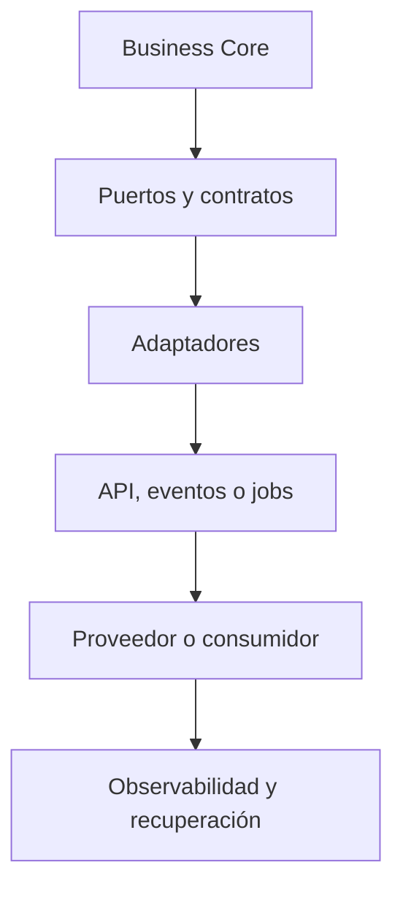
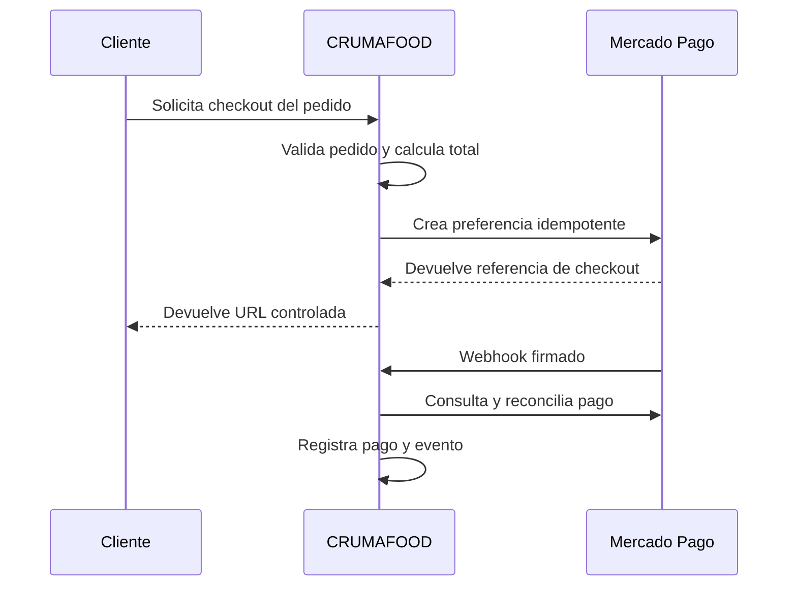

# Arquitectura de Integraciones de CRUMAFOOD Platform

> **Las integraciones conectan capacidades; no deben transferir desorden, autoridad ni fragilidad entre sistemas.**

## Estado del documento

| Campo | Valor |
|---|---|
| Estado | Propuesto para aprobación |
| Versión | 1.0 |
| Propietarios | Product Owner, responsable de arquitectura y responsables de integraciones |
| Alcance | APIs, eventos, webhooks, jobs, proveedores, dispositivos, sincronización y mensajería |
| Autoridad | Derivado de `system-overview.md`, `business-core.md`, `data-architecture.md`, `security-architecture.md` y el CES |
| Revisión | Cuando cambie un contrato, proveedor, modelo de entrega, canal, topología o requisito de resiliencia |

---

## 1. Propósito

Este documento define cómo CRUMAFOOD Platform intercambiará información y coordinará acciones:

- entre módulos;
- con aplicaciones Web, Mobile y Desktop;
- con proveedores de pago;
- con servicios de mensajería;
- con dispositivos;
- con automatizaciones y jobs;
- y con futuros sistemas externos.

Su propósito es evitar:

- acceso directo a datos ajenos;
- contratos implícitos;
- efectos duplicados;
- dependencias rígidas de proveedores;
- errores silenciosos;
- pérdida de eventos;
- filtración de secretos;
- y operaciones ambiguas ante fallos parciales.

---

## 2. Declaración arquitectónica

> **Toda integración será un contrato explícito entre capacidades, protegido por adaptadores y operado con expectativas de fallo.**

La API no será un acceso directo a tablas.

Un proveedor externo no formará parte del Business Core.

Los módulos se comunicarán mediante:

- casos de uso;
- puertos;
- eventos;
- consultas aprobadas;
- o contratos de integración versionados.

La decisión entre comunicación síncrona y asíncrona se tomará según necesidad de negocio, consistencia, latencia y recuperación.

---

## 3. Alcance

Esta arquitectura cubre:

- APIs HTTP;
- Server Actions como adaptadores internos;
- integraciones módulo a módulo;
- eventos de dominio e integración;
- bus interno;
- transactional outbox;
- inbox y deduplicación;
- webhooks entrantes y salientes;
- jobs y workers;
- pagos;
- correo, WhatsApp y notificaciones;
- realtime;
- archivos e intercambio por lotes;
- dispositivos y escaneo;
- sincronización Mobile y Desktop;
- observabilidad;
- seguridad;
- pruebas;
- y evolución de contratos.

No define la implementación comercial final de un proveedor todavía no aprobado.

---

## 4. Principios rectores

1. contratos antes que acoplamiento;
2. intención de negocio antes que transporte;
3. proveedores reemplazables;
4. fallos explícitos y recuperables;
5. idempotencia proporcional al impacto;
6. entrega confiable cuando el negocio lo requiera;
7. datos mínimos;
8. autenticación y autorización por canal;
9. observabilidad desde el diseño;
10. compatibilidad evolutiva;
11. simplicidad antes que infraestructura prematura;
12. una fuente de autoridad por hecho.

No se introducirá mensajería externa solo para aparentar desacoplamiento.

---

## 5. Estado actual

El repositorio contiene:

- integración activa con Supabase para Auth y PostgreSQL;
- clientes de servidor, navegador y middleware;
- endpoints activos de health, jobs y webhook genérico;
- endpoints de órdenes deshabilitados;
- funciones PostgreSQL invocadas mediante RPC;
- carpetas objetivo para contratos, mensajería, eventos, pagos, realtime, Twilio, Resend, Pusher y workers;
- tipos base `DomainEvent` e `IntegrationEvent` como marcadores;
- operación Mobile conectada directamente a Supabase;
- y escaneo desde la interfaz móvil.

También se identifican brechas:

- la mayoría de contratos y adaptadores de integración son archivos vacíos;
- no existe bus de eventos implementado;
- no existe outbox, inbox, cola o worker operativo en el repositorio;
- `/api/webhooks` acepta cualquier cuerpo sin verificar emisor;
- `/api/jobs/run` ejecuta trabajo desde un endpoint `GET`;
- las rutas deshabilitadas de órdenes exponen consultas a tablas en lugar de contratos de aplicación;
- no hay SDK de Mercado Pago instalado en el `package.json` actual;
- los directorios de Stripe, Resend, Pusher y Twilio no representan integraciones activas;
- y no existe catálogo versionado de contratos externos.

La arquitectura deberá distinguir claramente entre capacidad planeada, marcador técnico e integración productiva.

---

## 6. Estado objetivo

El estado objetivo tendrá:

- puertos definidos por necesidad de negocio;
- adaptadores aislados por proveedor;
- APIs versionadas;
- esquemas de entrada y salida;
- eventos tipados y versionados;
- outbox para efectos que deban sobrevivir fallos;
- consumidores idempotentes;
- jobs protegidos;
- webhooks verificables;
- catálogo de integraciones;
- observabilidad por correlación;
- pruebas de contrato;
- y procedimientos de recuperación.



---

## 7. Tipos de integración

CRUMAFOOD distinguirá:

| Tipo | Uso |
|---|---|
| Interna síncrona | Consulta o comando con respuesta inmediata dentro de la aplicación |
| Interna asíncrona | Reacción desacoplada a un hecho del negocio |
| API externa | Capacidad ofrecida a portales, dispositivos o terceros |
| Webhook entrante | Notificación enviada por un proveedor |
| Webhook saliente | Notificación controlada a un consumidor |
| Job programado | Trabajo iniciado por tiempo o planificación |
| Worker | Procesamiento fuera del ciclo de solicitud |
| Archivo | Intercambio por importación o exportación |
| Realtime | Actualización temporal de experiencia, no autoridad |
| Sincronización | Replicación controlada entre cliente y servidor |

Cada integración pertenecerá a una categoría principal y declarará su semántica.

---

## 8. Decisión síncrona o asíncrona

Se elegirá comunicación síncrona cuando:

- el actor necesita respuesta inmediata;
- la operación es corta;
- el receptor debe estar disponible;
- y el acoplamiento temporal es aceptable.

Se elegirá comunicación asíncrona cuando:

- el trabajo puede continuar después de responder;
- existen múltiples consumidores;
- se requiere absorber picos;
- un proveedor puede estar temporalmente caído;
- o la reacción no forma parte de la transacción principal.

No se utilizará asincronía para ocultar una regla que necesita consistencia inmediata.

---

## 9. Límites y propiedad

El módulo propietario decide:

- qué operación expone;
- qué datos acepta;
- qué hecho publica;
- qué garantías ofrece;
- y qué errores forman parte del contrato.

Un consumidor no deberá:

- escribir tablas de otro módulo;
- depender de su estructura interna;
- reutilizar sus entidades de persistencia;
- ni inferir cambios mediante consultas periódicas si existe un contrato adecuado.

Una relación en PostgreSQL no reemplaza un contrato de aplicación.

---

## 10. Puertos y adaptadores

El Business Core dependerá de puertos.

```ts
export interface PaymentGateway {
  createCheckout(
    request: CreateCheckoutRequest
  ): Promise<CreateCheckoutResult>;

  getPayment(
    externalPaymentId: string
  ): Promise<ExternalPayment>;
}
```

Los adaptadores implementarán detalles de proveedor:

```text
PaymentGateway
├── MercadoPagoPaymentAdapter
└── FakePaymentAdapter
```

El caso de uso no conocerá SDK, URLs, firmas ni nombres particulares de respuesta.

---

## 11. Anti-corruption layer

Cada proveedor tendrá una capa de traducción que:

- mapee tipos externos;
- normalice estados;
- traduzca errores;
- aplique unidades y moneda;
- elimine campos innecesarios;
- y preserve el lenguaje de CRUMAFOOD.

Ejemplo:

```text
approved -> PaymentStatus.Paid
pending  -> PaymentStatus.Pending
rejected -> PaymentStatus.Failed
```

Los nombres y estados de un proveedor no se propagarán por todo el dominio.

---

## 12. Contratos

Todo contrato declarará:

- nombre;
- versión;
- productor;
- consumidores;
- intención;
- autenticación;
- entrada;
- salida;
- errores;
- idempotencia;
- límites;
- compatibilidad;
- y propietario.

Los contratos vivirán en una ubicación estable, por ejemplo:

```text
src/contracts/
├── api/
├── events/
├── integrations/
└── messaging/
```

Compartir un contrato no autoriza compartir implementación.

---

## 13. Versionado

Los contratos públicos o consumidos por despliegues independientes tendrán versión explícita.

Se preferirán cambios compatibles:

- agregar campos opcionales;
- ampliar enumeraciones con consumidores tolerantes;
- añadir endpoints;
- y publicar una nueva versión de evento cuando cambie significado.

Son incompatibles:

- eliminar campos requeridos;
- cambiar tipo o unidad;
- reinterpretar estados;
- modificar semántica de errores;
- o cambiar autoridad.

Una versión tendrá política de soporte y retiro.

---

## 14. API HTTP

La API expondrá casos de uso, no tablas.

Ejemplos de intención:

```text
POST /api/v1/sales-orders
POST /api/v1/sales-orders/{id}/confirm
POST /api/v1/inventory-reservations
GET  /api/v1/products/{id}
GET  /api/v1/inventory/availability
```

Se evitarán endpoints genéricos que permitan seleccionar tablas, columnas o filtros arbitrarios.

Cada ruta resolverá autenticación, autorización, validación, ejecución, errores y observabilidad.

---

## 15. Semántica HTTP

Se utilizará:

- `GET` para lecturas sin efectos;
- `POST` para comandos o creación;
- `PUT` para reemplazo idempotente cuando aplique;
- `PATCH` para cambios parciales controlados;
- `DELETE` para solicitud de eliminación conforme al modelo.

Los códigos reflejarán resultado:

- `200` o `201` para éxito;
- `202` para trabajo aceptado;
- `204` sin contenido;
- `400` entrada inválida;
- `401` no autenticado;
- `403` no autorizado;
- `404` no encontrado dentro del alcance;
- `409` conflicto;
- `422` regla no cumplida cuando el contrato lo adopte;
- `429` límite excedido;
- y `5xx` falla interna o dependencia.

---

## 16. Formato de errores

Las APIs devolverán errores estables.

```json
{
  "error": {
    "code": "INSUFFICIENT_STOCK",
    "message": "No hay existencia disponible.",
    "correlationId": "...",
    "details": []
  }
}
```

El contrato no expondrá:

- stack traces;
- SQL;
- secretos;
- payloads del proveedor;
- ni detalles internos innecesarios.

La traducción conservará el error original en observabilidad segura.

---

## 17. Paginación, filtros y orden

Las colecciones tendrán:

- límites máximos;
- filtros permitidos;
- orden determinista;
- y cursor cuando la escala o mutabilidad lo requiera.

No se aceptarán filtros arbitrarios que expongan estructura interna.

Las respuestas declararán:

- elementos;
- cursor siguiente;
- y metadatos mínimos.

El total exacto solo se calculará cuando aporte valor y el costo sea aceptable.

---

## 18. Correlación y causación

Toda operación distribuida tendrá identificadores para seguir su recorrido.

- `correlation_id` agrupa una operación de negocio;
- `causation_id` identifica el mensaje que causó otro;
- `request_id` identifica una solicitud;
- `event_id` identifica un evento;
- e `idempotency_key` identifica una intención repetible.

Estos valores se propagarán sin utilizar datos personales como identificador técnico.

---

## 19. Eventos de dominio

Un evento de dominio representa un hecho ocurrido dentro de un módulo.

Ejemplos:

- `InventoryMovementRecorded`;
- `PurchaseOrderReceived`;
- `ProductionOrderCompleted`;
- `LotReleased`;
- `SalesOrderConfirmed`;
- `PaymentRegistered`.

Reglas:

- nombre en pasado;
- emitido por el propietario;
- datos mínimos;
- sin detalles de transporte;
- y significado estable.

Un evento no será una instrucción ambigua para modificar cualquier dato.

---

## 20. Eventos de integración

Un evento de integración es un contrato preparado para cruzar un límite.

Podrá derivarse de un evento de dominio, pero no serán necesariamente el mismo objeto.

Formato base:

```ts
type IntegrationEvent<T> = {
  eventId: string;
  eventType: string;
  eventVersion: number;
  aggregateId: string;
  organizationId?: string;
  occurredAt: string;
  correlationId: string;
  causationId?: string;
  payload: T;
};
```

No incluirá secretos, entidades completas ni datos sin finalidad.

---

## 21. Bus interno

En la primera etapa podrá utilizarse un bus tipado en proceso para desacoplar módulos dentro del monolito modular.

Ubicación objetivo:

```text
src/infrastructure/messaging/events/
├── event-bus.ts
├── in-memory-event-bus.ts
└── handlers/
```

Un bus en memoria:

- no es durable;
- pierde mensajes al caer el proceso;
- no coordina instancias distintas;
- y no garantiza procesamiento después de responder.

Solo se utilizará para reacciones donde esas limitaciones sean aceptables.

---

## 22. Transactional outbox

Cuando un mensaje deba existir si y solo si una transacción de negocio se confirma, se utilizará outbox.

La transacción persistirá:

- cambio del agregado;
- evento de integración;
- tipo y versión;
- correlación;
- fecha;
- y estado de publicación.

Un publicador separado:

- reclamará mensajes;
- enviará;
- registrará intentos;
- marcará resultado;
- y recuperará bloqueos abandonados.

No se publicará primero y se guardará después.

---

## 23. Inbox y deduplicación

Los consumidores persistirán mensajes procesados cuando un duplicado pueda causar impacto.

La inbox conservará:

- consumidor;
- `event_id`;
- versión;
- fecha de recepción;
- estado;
- resultado o referencia;
- e intentos.

La combinación consumidor-evento será única.

Recibir el mismo mensaje no repetirá el efecto de negocio.

---

## 24. Garantías de entrega

La arquitectura asumirá normalmente entrega **al menos una vez**.

Por tanto:

- pueden existir duplicados;
- los consumidores serán idempotentes;
- el orden global no se asumirá;
- y la recuperación será explícita.

No se prometerá exactamente una vez entre sistemas independientes.

Cuando el orden sea necesario, se definirá por agregado, partición o versión esperada.

---

## 25. Idempotencia

Las operaciones sensibles aceptarán una clave de idempotencia.

Casos prioritarios:

- crear preferencia de pago;
- confirmar pago;
- recibir compra;
- completar producción;
- registrar movimiento;
- reservar stock;
- despachar;
- ejecutar job;
- y sincronizar comando móvil.

La clave identificará intención, no solo solicitud técnica.

El sistema conservará el resultado suficiente para responder reintentos sin duplicar efectos.

---

## 26. Reintentos

Solo se reintentará un error transitorio.

Son candidatos:

- timeout;
- conexión interrumpida;
- límite temporal;
- indisponibilidad breve;
- o respuesta explícitamente reintentable.

No se reintentará automáticamente:

- entrada inválida;
- autenticación fallida;
- permiso denegado;
- conflicto funcional;
- o rechazo definitivo.

Los reintentos usarán espera exponencial, jitter, máximo de intentos y presupuesto total.

---

## 27. Timeouts y cancelación

Toda llamada externa tendrá timeout explícito.

Se distinguirán:

- conexión;
- lectura;
- operación total;
- y presupuesto del caso de uso.

El timeout del proveedor será menor que el del consumidor para permitir traducción y recuperación.

Cuando sea posible, la cancelación se propagará.

Una respuesta desconocida después de timeout se reconciliará antes de repetir una operación no segura.

---

## 28. Circuit breaker y aislamiento

Se introducirán circuit breakers cuando exista evidencia de fallas repetidas que consuman recursos o propaguen degradación.

Los adaptadores podrán aislar:

- pools;
- concurrencia;
- colas;
- y límites por proveedor.

No se implementará infraestructura compleja sin métricas y necesidad demostrable.

La degradación deberá conservar las capacidades esenciales del negocio cuando sea posible.

---

## 29. Backpressure y límites

Un productor no deberá saturar a un consumidor.

Se aplicarán:

- límites de concurrencia;
- capacidad de cola;
- lotes controlados;
- rate limiting;
- pausas;
- y rechazo explícito.

Las acumulaciones tendrán alertas por edad y volumen.

No se almacenarán mensajes indefinidamente sin política de retención.

---

## 30. Dead-letter y reparación

Un mensaje que agote reintentos pasará a estado de intervención.

La dead-letter conservará:

- mensaje o referencia segura;
- error;
- intentos;
- fechas;
- consumidor;
- correlación;
- y clasificación.

La reparación tendrá:

- autorización;
- corrección;
- reenvío idempotente;
- auditoría;
- y cierre.

No se descartará silenciosamente un mensaje crítico.

---

## 31. Jobs y workers

Los jobs ejecutarán trabajo programado o diferido.

La estructura objetivo podrá utilizar:

```text
src/workers/
├── jobs/
├── queues/
├── consumers/
├── processors/
├── schedulers/
└── orchestration/
```

Estas carpetas actuales son marcadores, no un runtime operativo.

Se introducirá un proceso Node.js separado cuando existan trabajos que excedan de forma demostrable el ciclo de solicitud o necesiten ejecución durable.

---

## 32. Programación de jobs

Cada job declarará:

- nombre;
- propietario;
- frecuencia o disparador;
- zona horaria;
- exclusión concurrente;
- idempotencia;
- timeout;
- reintentos;
- resultado;
- y runbook.

Una ejecución tendrá identificador único.

Los jobs no dependerán solo de memoria del proceso.

El endpoint actual `/api/jobs/run` deberá adoptar semántica de mutación, autenticación en entornos compartidos y control contra duplicados.

---

## 33. Webhooks entrantes

Un webhook entrante deberá:

- conservar el cuerpo original para verificar firma;
- identificar proveedor;
- verificar firma y timestamp;
- limitar replay;
- validar esquema;
- registrar el identificador externo;
- persistir recepción antes de efectos críticos;
- responder rápidamente;
- y procesar de forma idempotente.

El endpoint genérico actual no es apto para un proveedor productivo.

Cada proveedor tendrá ruta y adaptador explícitos.

---

## 34. Webhooks salientes

Los webhooks salientes tendrán:

- suscripción autorizada;
- secreto por consumidor;
- firma;
- identificador;
- timestamp;
- versión;
- reintentos;
- historial;
- desactivación por fallas;
- y mecanismo de prueba.

El consumidor no elegirá eventos o campos fuera de su autorización.

Los payloads minimizarán datos y evitarán referencias internas innecesarias.

---

## 35. Integración con Mercado Pago

Mercado Pago es el proveedor de pago previsto actualmente para el canal comercial.

Reglas:

- `MP_ACCESS_TOKEN` permanecerá exclusivamente en backend;
- nunca se usará como variable pública ni se almacenará en Git;
- el frontend no será autoridad del total;
- el servidor reconstruirá el pedido, precios, descuentos y moneda desde datos autorizados;
- la creación de preferencia será idempotente;
- el sistema conservará identificadores internos y externos;
- la redirección del navegador no confirmará por sí sola el pago;
- y la confirmación confiable utilizará webhook verificado y reconciliación con el proveedor.

El adaptador traducirá estados de Mercado Pago al modelo de pagos de CRUMAFOOD.

---

## 36. Flujo de pago

Flujo objetivo:



La respuesta de checkout mejora experiencia. El estado consultado y verificado es la evidencia de pago.

---

## 37. Reconciliación de pagos

La reconciliación resolverá:

- webhook perdido;
- webhook duplicado;
- pago pendiente;
- respuesta tardía;
- devolución;
- contracargo;
- monto incompatible;
- moneda incompatible;
- y referencia desconocida.

Nunca se marcará un pedido pagado solo por regresar a una URL de éxito.

Una discrepancia quedará en estado explícito para revisión y no se corregirá silenciosamente.

---

## 38. Proveedores alternativos

Las carpetas actuales para Stripe u otros proveedores no implican adopción.

Agregar un proveedor requerirá:

- necesidad de negocio;
- comparación;
- modelo de errores;
- costo operativo;
- seguridad;
- conciliación;
- pruebas;
- y ADR si la decisión es significativa.

No se mantendrán adaptadores ficticios como si fueran capacidades soportadas.

---

## 39. Correo, WhatsApp y notificaciones

Los canales de comunicación se expondrán mediante puertos:

```ts
interface NotificationGateway {
  send(command: SendNotificationCommand): Promise<NotificationResult>;
}
```

Cada envío tendrá:

- finalidad;
- destinatario validado;
- plantilla versionada;
- consentimiento cuando corresponda;
- idempotencia;
- estado;
- proveedor;
- y trazabilidad.

Las carpetas de Resend y Twilio son marcadores hasta aprobar proveedores y contratos.

---

## 40. Plantillas y contenido

Las plantillas no mezclarán lógica crítica de negocio.

Se versionarán por:

- canal;
- idioma;
- finalidad;
- y tipo de actor.

Los valores se escaparán según canal.

No se incluirán secretos ni datos sensibles innecesarios.

Los enlaces tendrán dominio controlado y expiración cuando concedan una acción.

---

## 41. Realtime

Realtime podrá mejorar:

- tableros;
- estado de órdenes;
- picking;
- alertas;
- y colaboración operativa.

No será fuente de autoridad.

Ante pérdida de conexión, el cliente reconstruirá estado mediante consulta autorizada.

Las suscripciones tendrán alcance, filtros y autorización.

Las carpetas de Pusher y realtime actuales no representan un proveedor aprobado.

---

## 42. Mobile y sincronización

La operación Mobile deberá enviar comandos de negocio, no réplicas arbitrarias de tablas.

Todo comando sincronizable incluirá:

- identificador del cliente;
- idempotency key;
- actor;
- dispositivo;
- alcance;
- fecha capturada;
- versión esperada;
- y payload validado.

El servidor decidirá:

- aceptación;
- conflicto;
- transformación;
- o rechazo.

El timestamp del dispositivo no será autoridad única.

---

## 43. Operación offline

Offline requerirá ADR y RFC antes de implementarse.

Deberán definirse:

- comandos permitidos;
- datos locales;
- cifrado;
- expiración de sesión;
- orden;
- conflictos;
- revocación;
- borrado;
- y recuperación parcial.

No todos los casos de uso serán aptos para offline.

Los movimientos de alto riesgo podrán exigir conectividad o autorización posterior.

---

## 44. Dispositivos y escaneo

Escáneres, impresoras, básculas y otros dispositivos se integrarán mediante puertos de capacidad.

Ejemplos:

- `BarcodeScanner`;
- `LabelPrinter`;
- `ScaleReader`.

El dato leído se validará contra contexto y catálogo.

Un código escaneado no autoriza por sí solo una operación.

La capa de dispositivo no contendrá reglas de inventario, producción o calidad.

---

## 45. Archivos e intercambio por lotes

Una importación declarará:

- formato y versión;
- codificación;
- tamaño;
- columnas;
- tipos;
- validación;
- estrategia parcial o atómica;
- idempotencia;
- y reporte de errores.

Una exportación aplicará autorización, minimización, expiración y auditoría.

Los archivos grandes se procesarán fuera del ciclo de solicitud cuando sea necesario.

No se utilizará una hoja de cálculo como fuente de autoridad permanente.

---

## 46. Supabase como integración de infraestructura

Supabase provee actualmente:

- acceso a PostgreSQL;
- Auth;
- sesión SSR;
- y capacidades potenciales adicionales.

El acceso quedará encapsulado detrás de infraestructura.

Los módulos no dependerán de:

- `SupabaseClient`;
- nombres de tablas;
- respuestas PostgREST;
- ni códigos específicos del proveedor.

Usar varios productos del mismo proveedor no elimina la necesidad de contratos y límites.

---

## 47. Funciones PostgreSQL

Las funciones PostgreSQL son integraciones internas cercanas a datos.

El código actual utiliza al menos:

- `create_production_order_items`;
- `decrease_product_lot_quantity`.

Estas funciones deberán:

- vivir en migraciones;
- tener contrato tipado;
- validar alcance;
- mantener atomicidad;
- traducir errores;
- y tener pruebas.

No se llamarán desde componentes de presentación sin caso de uso intermedio.

---

## 48. Seguridad

Cada integración cumplirá `security-architecture.md`.

Como mínimo:

- identidad de actor o servicio;
- mínimo privilegio;
- secretos en backend;
- validación;
- firma cuando aplique;
- replay protection;
- datos mínimos;
- rate limiting;
- auditoría;
- y rotación.

Un canal cifrado no reemplaza autenticación ni autorización.

---

## 49. Privacidad y clasificación

Antes de compartir datos se definirá:

- finalidad;
- campos;
- base autorizada;
- destinatario;
- retención;
- residencia cuando sea relevante;
- y eliminación.

Los eventos y logs no incluirán datos personales completos por conveniencia.

Los identificadores externos se mapearán sin exponer claves internas innecesarias.

---

## 50. Configuración y secretos

Cada adaptador tendrá configuración validada al iniciar.

Se distinguirá:

- URL;
- ambiente;
- credencial;
- secreto de firma;
- timeout;
- límites;
- y flags de capacidad.

Los nombres de entorno serán consistentes.

Los secretos no usarán `NEXT_PUBLIC_*` y no se mostrarán en errores.

La rotación tendrá procedimiento sin interrupción cuando el proveedor lo permita.

---

## 51. Observabilidad

Cada llamada o mensaje registrará de forma segura:

- integración;
- operación;
- resultado;
- latencia;
- intento;
- correlación;
- error normalizado;
- y dependencia.

Se medirán:

- disponibilidad;
- tasa de error;
- latencia;
- timeouts;
- reintentos;
- circuitos abiertos;
- edad de cola;
- dead letters;
- duplicados;
- y reconciliaciones pendientes.

No se registrarán tokens ni payloads completos no clasificados.

---

## 52. Health, readiness y dependencia

Se distinguirá:

- **liveness:** el proceso responde;
- **readiness:** puede atender su responsabilidad;
- **dependency health:** estado observado de una dependencia.

El endpoint público de health devolverá información mínima.

Una dependencia opcional caída no marcará toda la plataforma como muerta.

La salud del proveedor se inferirá con métricas y resultados, no con llamadas agresivas constantes.

---

## 53. Pruebas

La estrategia incluirá:

- unitarias para mappers y políticas;
- contrato para request y response;
- integración con sandbox o emulador;
- fakes deterministas;
- errores y timeouts;
- idempotencia;
- duplicados;
- orden alterado;
- reintentos;
- firmas;
- y reconciliación.

Las pruebas no dependerán siempre de un proveedor real.

Un mock que solo devuelve éxito no valida una integración.

---

## 54. Entornos y sandbox

Cada proveedor tendrá configuración separada por entorno.

Se evitará:

- enviar mensajes reales desde tests;
- cobrar desde Preview;
- mezclar webhooks de sandbox y producción;
- utilizar datos productivos;
- y compartir secretos.

Los endpoints de callback tendrán URL y credencial correctas por entorno.

La promoción a producción tendrá checklist y prueba controlada.

---

## 55. Catálogo de integraciones

Se mantendrá un catálogo con:

| Campo | Descripción |
|---|---|
| Nombre | Capacidad o proveedor |
| Propietario | Equipo o responsable |
| Estado | Planeada, sandbox, activa, degradada o retirada |
| Dirección | Entrante, saliente o bidireccional |
| Contrato | Ruta y versión |
| Datos | Clasificación compartida |
| Credenciales | Tipo y responsable, nunca valor |
| SLO | Expectativa operativa |
| Recuperación | Runbook |
| ADR | Decisión relacionada |

Una carpeta vacía no equivale a una entrada activa en el catálogo.

---

## 56. Estructura objetivo del repositorio

```text
src/
├── contracts/
│   ├── api/
│   ├── events/
│   ├── integrations/
│   └── messaging/
├── infrastructure/
│   ├── integrations/
│   │   ├── supabase/
│   │   ├── payments/
│   │   └── notifications/
│   └── messaging/
│       ├── events/
│       ├── outbox/
│       ├── inbox/
│       └── queue/
└── workers/
    ├── consumers/
    ├── processors/
    ├── schedulers/
    └── orchestration/
```

Solo se crearán implementaciones reales. Los marcadores sin responsabilidad deberán eliminarse o etiquetarse como planeados.

---

## 57. Prioridades de implementación

### P0 — Antes de conectar proveedores productivos

- reemplazar el webhook genérico;
- asegurar jobs;
- definir contratos;
- encapsular secretos;
- implementar idempotencia;
- y establecer correlación.

### P1 — Fundación

- implementar puertos y adaptadores;
- tipar eventos;
- crear bus interno;
- establecer catálogo;
- normalizar errores;
- y añadir pruebas de contrato.

### P2 — Entrega durable

- implementar outbox e inbox;
- introducir worker cuando exista carga real;
- añadir dead-letter y reparación;
- y monitorear colas.

### P3 — Expansión

- Mercado Pago productivo;
- notificaciones externas;
- realtime;
- dispositivos adicionales;
- y sincronización offline aprobada.

Las prioridades podrán ajustarse por necesidad comercial sin omitir controles P0.

---

## 58. Estrategia de transición

### Etapa 1 — Inventario

- clasificar carpetas activas y marcadores;
- inventariar endpoints y RPC;
- identificar propietarios;
- y cerrar superficies no usadas.

### Etapa 2 — Contratos

- definir esquemas;
- crear puertos;
- normalizar errores;
- introducir correlación;
- y documentar versiones.

### Etapa 3 — Seguridad y resiliencia

- verificar firmas;
- implementar idempotencia;
- añadir timeouts y reintentos;
- proteger jobs;
- y probar fallos.

### Etapa 4 — Eventos

- tipar eventos;
- implementar bus interno;
- identificar eventos durables;
- y crear outbox e inbox donde el riesgo lo justifique.

### Etapa 5 — Proveedores

- implementar un adaptador a la vez;
- operar en sandbox;
- reconciliar;
- observar;
- y promover con evidencia.

---

## 59. Antipatrones prohibidos

Se prohíbe:

- exponer tablas como API;
- importar SDK de proveedor en el dominio;
- confiar en totales del frontend;
- confirmar pago por redirección;
- aceptar webhooks sin firma;
- procesar duplicados sin control;
- reintentar todos los errores;
- llamar sin timeout;
- prometer exactamente una vez;
- publicar antes de confirmar la transacción;
- ignorar mensajes fallidos;
- usar realtime como fuente de autoridad;
- compartir secretos entre entornos;
- registrar payloads sensibles;
- y declarar activa una carpeta vacía.

---

## 60. Definition of Done de una integración

Una integración está completa cuando:

- tiene propietario;
- resuelve una necesidad real;
- define contrato y versión;
- utiliza puerto y adaptador;
- autentica y autoriza;
- valida entrada y salida;
- minimiza datos;
- protege secretos;
- define timeout;
- clasifica errores;
- considera idempotencia;
- define reintentos;
- preserva correlación;
- tiene observabilidad;
- tiene pruebas de éxito y fallo;
- tiene sandbox o estrategia equivalente;
- documenta recuperación;
- y actualiza catálogo, ADR y runbook cuando corresponde.

---

## 61. Gobierno

Todo contrato tendrá responsable de aprobar cambios.

Los cambios se revisarán por:

- negocio;
- compatibilidad;
- datos;
- seguridad;
- operación;
- costo;
- y capacidad de recuperación.

Un proveedor podrá retirarse cuando:

- deje de cumplir necesidad;
- aumente riesgo;
- degrade operación;
- incumpla expectativas;
- o exista una alternativa justificada.

La salida también requiere plan de migración y conservación de evidencia.

---

## 62. Decisiones que requieren ADR

Se formalizarán, al menos:

1. estándar de APIs y versionado;
2. bus interno en proceso;
3. transactional outbox e inbox;
4. runtime y tecnología de workers;
5. cola o mensajería externa;
6. Mercado Pago como proveedor productivo;
7. modelo canónico de pagos;
8. proveedor de correo;
9. proveedor de WhatsApp;
10. proveedor de realtime;
11. estándar de webhooks;
12. estrategia offline;
13. integración con dispositivos;
14. SLO de dependencias críticas;
15. retención de mensajes y dead letters.

---

## 63. Criterios de conformidad

Una implementación cumple esta arquitectura si:

- expresa intención de negocio;
- respeta propiedad modular;
- depende de contratos;
- aísla proveedores;
- contempla fallos;
- evita duplicados;
- protege secretos y datos;
- preserva trazabilidad;
- mantiene compatibilidad;
- y permite recuperación.

La conformidad se demuestra con código, contratos, pruebas, configuración y evidencia operativa.

---

## 64. Evolución

Este documento evolucionará cuando:

- se conecte el primer proveedor productivo;
- se active Mercado Pago;
- se introduzcan workers;
- se implemente outbox;
- se habilite Mobile offline;
- se distribuya Desktop;
- se integren dispositivos;
- o la escala requiera mensajería externa.

Cada evolución preservará el Business Core y la propiedad de los hechos.

---

## 65. Declaración final

> **CRUMAFOOD Platform se integrará mediante capacidades explícitas, no mediante dependencias accidentales.**

Cada canal, mensaje, proveedor y dispositivo será tratado como un límite que puede cambiar o fallar.

Por ello:

- los contratos serán claros;
- los proveedores estarán aislados;
- los mensajes serán trazables;
- los efectos serán idempotentes;
- los fallos serán recuperables;
- y los datos conservarán su autoridad.

La plataforma podrá conectarse con nuevos actores sin entregarles el control de su arquitectura ni la confianza del negocio.
