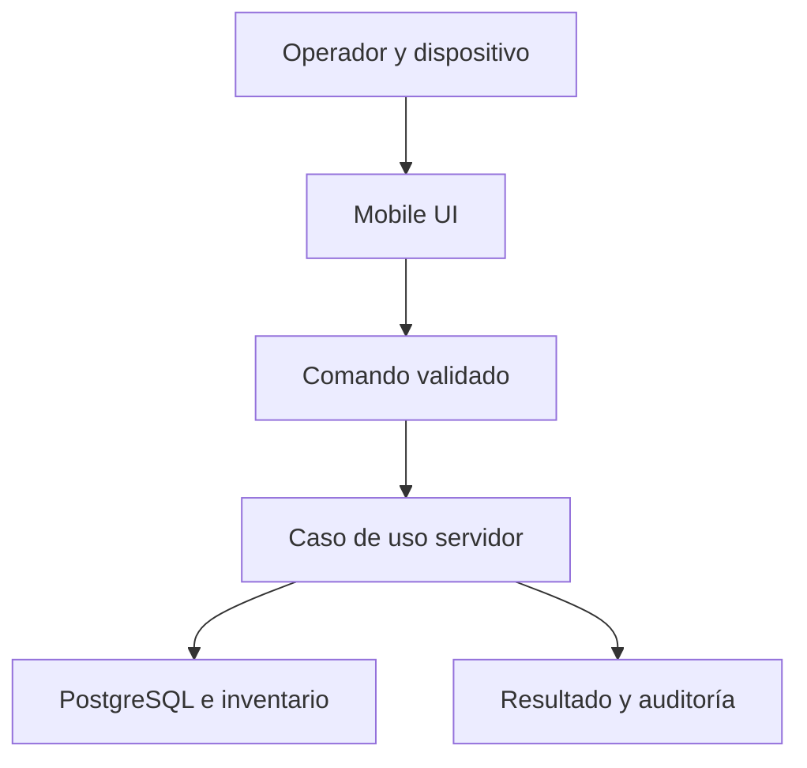

# Arquitectura Mobile de CRUMAFOOD Platform

> **La operación móvil debe convertir una tarea física en un registro simple, seguro y trazable.**

## Estado del documento

| Campo | Valor |
|---|---|
| Estado | Propuesto para aprobación |
| Versión | 1.0 |
| Propietarios | Product Owner, responsable de arquitectura y responsable de Mobile Operations |
| Alcance | Recepción, producción, picking, inventario, lotes, escaneo, PWA, conectividad y sincronización |
| Autoridad | Derivado de `system-overview.md`, `data-architecture.md`, `security-architecture.md`, `integration-architecture.md`, `frontend-architecture.md` y el CES |
| Revisión | Cuando cambie un flujo operativo, capacidad offline, dispositivo, estrategia de sincronización o superficie Mobile |

---

## 1. Propósito

Este documento define cómo CRUMAFOOD Mobile Operations permitirá ejecutar tareas en planta, almacén y distribución.

Su propósito es asegurar que:

- cada pantalla represente una tarea concreta;
- el operador conserve contexto;
- los códigos escaneados sean validados;
- FEFO se aplique desde la autoridad correcta;
- las mutaciones sean atómicas e idempotentes;
- la conectividad degradada sea visible;
- el soporte offline no duplique ni corrompa operaciones;
- y toda acción crítica deje trazabilidad.

---

## 2. Declaración arquitectónica

> **Mobile enviará comandos de negocio al servidor; no editará réplicas arbitrarias de tablas ni decidirá por sí solo el estado autoritativo.**

La interfaz Mobile podrá:

- capturar;
- escanear;
- guiar;
- validar formato;
- mantener progreso local;
- y solicitar comandos.

El servidor decidirá:

- autorización;
- transición;
- existencia;
- FEFO;
- concurrencia;
- aceptación;
- conflicto;
- y resultado.

---

## 3. Alcance

Esta arquitectura cubre:

- recepción de compras;
- consumo de materiales;
- ejecución de producción;
- picking;
- conteos físicos;
- ajustes controlados;
- consulta de lotes;
- trazabilidad;
- escaneo;
- ubicaciones;
- PWA;
- permisos de dispositivo;
- estado de red;
- almacenamiento local;
- cola de comandos;
- sincronización;
- conflictos;
- seguridad;
- accesibilidad;
- rendimiento;
- despliegue;
- y soporte.

No define todavía una aplicación nativa ni promete operación offline completa.

---

## 4. Principios rectores

1. una tarea principal por pantalla;
2. contexto visible;
3. servidor como autoridad;
4. escaneo con fallback;
5. FEFO verificable;
6. comandos idempotentes;
7. estado de red explícito;
8. offline por capacidad, no global;
9. conflictos visibles;
10. mínimo dato local;
11. targets táctiles amplios;
12. seguridad por alcance;
13. recuperación antes que ocultamiento;
14. evolución incremental.

La velocidad operativa nunca justificará pérdida de integridad o trazabilidad.

---

## 5. Estado actual

El repositorio contiene una superficie `/mobile` con:

- recepción;
- producción;
- picking;
- consulta de lote por ID;
- escaneo de lote;
- cámara mediante `getUserMedia`;
- `BarcodeDetector` cuando el navegador lo soporta;
- entrada manual como fallback;
- sugerencias FEFO;
- progreso de órdenes;
- Server Actions;
- y acceso a Supabase.

También se identifican brechas:

- no existe layout Mobile propio;
- no existe protección central visible para toda `/mobile`;
- la portada enlaza `/mobile/receive`, pero la ruta real es `/mobile/receiving`;
- la portada enlaza `/mobile/inventory` sin página implementada;
- la portada enlaza `/mobile/lots` y solo existe `/mobile/lots/[id]`;
- no existe service worker;
- no existe IndexedDB ni almacenamiento offline;
- no existe cola de comandos;
- no existe estado de conectividad;
- no existe identidad de dispositivo;
- el manifiesto PWA usa iconos marcadores inválidos;
- el escáner solicita cámara al montar;
- recepción, picking y producción realizan múltiples escrituras sin una transacción única demostrable;
- los casos de uso Mobile acceden a Supabase de forma directa o reciben `SupabaseClient`;
- no se observan permisos de almacén aplicados explícitamente en cada comando;
- y algunos errores del proveedor llegan a la experiencia.

Mobile actual debe considerarse online y experimental hasta cerrar las prioridades críticas.

---

## 6. Estado objetivo

El estado objetivo tendrá:

- shell Mobile protegido;
- rutas coherentes;
- tareas online confiables;
- casos de uso atómicos;
- permisos por organización y almacén;
- escaneo desacoplado del navegador;
- fallback manual y hardware externo;
- PWA instalable;
- indicador de conectividad;
- lectura local controlada;
- cola de comandos para capacidades aprobadas;
- sincronización idempotente;
- resolución explícita de conflictos;
- telemetría operativa;
- y runbooks de soporte.



---

## 7. Estrategia de producto

La evolución será:

1. online correcto;
2. instalable;
3. tolerante a reconexión;
4. lectura offline selectiva;
5. comandos offline de bajo riesgo;
6. comandos críticos solo después de pruebas operativas.

No se comenzará por offline completo.

Una experiencia online inconsistente no se vuelve confiable al agregar caché.

---

## 8. Usuarios y contexto

Los actores Mobile incluyen:

- receptor de mercancía;
- almacenista;
- operador de producción;
- picker;
- supervisor;
- calidad;
- y soporte autorizado.

El contexto puede incluir:

- organización;
- sucursal;
- almacén;
- ubicación;
- turno;
- orden;
- estación;
- y dispositivo.

La UI mostrará el contexto activo antes de confirmar una tarea.

---

## 9. Tareas principales

Mobile priorizará:

| Tarea | Resultado esperado |
|---|---|
| Recepción | Lote, movimiento y orden actualizados atómicamente |
| Producción | Material consumido y progreso registrado |
| Picking | Lote surtido, reserva liberada y pedido actualizado |
| Conteo | Evidencia de cantidad observada |
| Ajuste | Movimiento autorizado con causa |
| Escaneo | Recurso identificado dentro del alcance |
| Lote | Trazabilidad y estado consultados |

Cada tarea tendrá inicio, progreso, confirmación y recuperación.

---

## 10. Organización de rutas

Ruta objetivo:

```text
/mobile
├── receiving/
│   └── [id]/
├── production/
│   └── [id]/
├── picking/
│   └── [id]/
├── inventory/
├── counts/
├── lots/
│   └── [id]/
└── scan/
```

Una opción solo aparecerá si la ruta existe, está soportada y el actor tiene permiso.

La terminología de URL será consistente con el lenguaje del módulo.

---

## 11. Layout Mobile

`/mobile` tendrá layout propio con:

- protección de sesión;
- contexto de almacén;
- encabezado compacto;
- navegación de tareas;
- estado de red;
- estado de sincronización;
- acceso a perfil y salida;
- error boundary;
- y loading.

No heredará accidentalmente navegación Admin o Storefront.

---

## 12. Navegación

La navegación principal mostrará únicamente tareas frecuentes.

Deberá:

- usar etiquetas visibles;
- marcar ruta activa;
- respetar permisos;
- conservar contexto;
- funcionar con una mano;
- y evitar scroll excesivo.

Los accesos secundarios vivirán en menú o búsqueda.

Los emojis no serán el sistema iconográfico definitivo.

---

## 13. Arquitectura frontend

Se aplicará `frontend-architecture.md`.

- Server Components para listas y carga inicial;
- Client Components para cámara e interacción;
- Server Actions como adaptadores;
- estado local para progreso efímero;
- URL para recursos navegables;
- y TanStack Query solo cuando aporte sincronización cliente real.

El límite cliente se mantendrá cerca del escáner o tarea interactiva.

---

## 14. Casos de uso Mobile

Las acciones Mobile llamarán casos de uso explícitos:

- `ReceivePurchaseOrderItem`;
- `ConsumeProductionMaterial`;
- `CompleteProductionStep`;
- `ConfirmPickingItem`;
- `RegisterPhysicalCount`;
- `RegisterInventoryAdjustment`;
- `ResolveLotByCode`.

Los casos de uso recibirán comandos, no `SupabaseClient`.

El acceso a datos pertenecerá a infraestructura.

---

## 15. Comando Mobile

Todo comando sincronizable tendrá un envelope:

```ts
type MobileCommand<T> = {
  commandId: string;
  commandType: string;
  commandVersion: number;
  idempotencyKey: string;
  actorId: string;
  deviceId: string;
  organizationId: string;
  warehouseId?: string;
  capturedAt: string;
  expectedVersion?: number;
  payload: T;
};
```

El servidor validará cada campo contra la sesión y el recurso.

---

## 16. Autenticación

La sesión Mobile utilizará Supabase Auth mientras sea el proveedor actual.

Se deberá:

- verificar usuario en servidor;
- manejar expiración;
- renovar de forma controlada;
- revocar acceso;
- y bloquear comandos al perder autorización.

Una PWA instalada no implica sesión permanente.

El dispositivo perdido deberá poder perder acceso sin esperar a desinstalación.

---

## 17. Autorización

Cada comando verificará:

- permiso;
- organización;
- almacén;
- ubicación;
- documento;
- estado;
- y contexto operativo.

Ejemplos:

- un picker no ajusta inventario por defecto;
- un operador no libera calidad;
- un receptor solo recibe contra órdenes autorizadas;
- y un almacén no modifica otro alcance.

RLS complementará, no sustituirá, la autorización del caso de uso.

---

## 18. Identidad de dispositivo

Cuando el riesgo lo justifique, cada instalación tendrá `deviceId` opaco.

Se registrará:

- propietario o asignación;
- plataforma;
- versión;
- última actividad;
- estado;
- y revocación.

El `deviceId` no será secreto ni prueba suficiente de identidad.

Ayudará a auditoría, idempotencia, soporte y control de dispositivos.

---

## 19. Sesión y bloqueo local

Mobile manejará:

- timeout por inactividad;
- cambio de usuario;
- bloqueo de dispositivo;
- aplicación en background;
- y datos visibles en app switcher.

Las operaciones sensibles podrán exigir reautenticación.

Al cerrar sesión se limpiará estado local sensible y se detendrá sincronización del usuario anterior.

---

## 20. Recepción

El flujo objetivo será:

1. seleccionar orden;
2. validar proveedor y estado;
3. seleccionar partida;
4. capturar cantidad;
5. escanear o capturar lote;
6. capturar caducidad cuando aplique;
7. seleccionar ubicación;
8. revisar resumen;
9. confirmar;
10. recibir resultado.

La confirmación atómica deberá crear lote, movimiento y avance de la orden o no crear ninguno.

---

## 21. Recepción parcial

La UI distinguirá:

- pedido;
- recibido previo;
- recibido ahora;
- pendiente;
- excedente;
- y unidad.

No permitirá exceder sin política explícita.

Una recepción repetida con la misma idempotency key devolverá el mismo resultado.

El estado `partial` o `received` será calculado por el caso de uso.

---

## 22. Lotes de recepción

El lote deberá validar:

- formato;
- unicidad por alcance definido;
- artículo;
- proveedor;
- caducidad;
- cantidad;
- ubicación;
- y calidad inicial.

La UI no decidirá si un lote existente puede acumular cantidad.

Una colisión mostrará acción clara: revisar, elegir lote autorizado o cancelar.

---

## 23. Producción

El flujo objetivo mostrará:

- orden;
- receta;
- cantidad planeada;
- progreso;
- material actual;
- cantidad requerida;
- lote FEFO sugerido;
- ubicación;
- y estado.

El operador confirmará un paso a la vez.

El servidor consumirá inventario y actualizará la orden atómicamente.

---

## 24. FEFO en producción

La sugerencia FEFO provendrá del servidor.

El cliente podrá mostrarla y exigir escaneo.

El servidor volverá a validar:

- lote;
- saldo;
- caducidad;
- calidad;
- ubicación;
- reserva;
- y concurrencia.

Si la sugerencia cambió, se devolverá un conflicto y una nueva instrucción.

---

## 25. Consumo de varios lotes

Cuando un material requiera varios lotes, la UI mostrará una secuencia explícita.

Cada asignación incluirá:

- lote;
- cantidad;
- saldo previo;
- saldo posterior;
- y progreso restante.

No se consumirá silenciosamente un lote diferente al escaneado.

La política de confirmación por lote requiere decisión de producto y dominio.

---

## 26. Producto terminado

Completar producción podrá requerir:

- cantidad real;
- merma;
- lote terminado;
- fabricación;
- caducidad;
- ubicación;
- calidad;
- y evidencia.

La finalización deberá ser atómica con el movimiento de entrada.

No se marcará completada una orden si falta un efecto necesario.

---

## 27. Picking

El flujo objetivo será:

1. abrir orden;
2. ver cliente o destino;
3. ver producto y cantidad;
4. recibir lote FEFO sugerido;
5. ir a ubicación;
6. escanear lote;
7. confirmar cantidad;
8. completar partida;
9. completar picking.

La UI mostrará una partida principal y progreso total.

---

## 28. FEFO en picking

La vista FEFO es una proyección, no autoridad.

Al confirmar, el servidor verificará nuevamente:

- lote;
- stock;
- reserva;
- caducidad;
- calidad;
- y orden.

Un lote alternativo requerirá política y permiso.

El motivo de excepción quedará auditado.

---

## 29. Confirmación de picking

La confirmación atómica deberá:

- descontar lote;
- registrar movimiento;
- consumir o liberar reserva;
- actualizar partida;
- actualizar picking;
- y avanzar pedido cuando corresponda.

El flujo actual ejecuta estas escrituras por separado y deberá migrar a una operación controlada antes de exposición amplia.

---

## 30. Conteos físicos

El conteo será una observación, no un ajuste automático.

Capturará:

- artículo;
- lote;
- ubicación;
- cantidad contada;
- unidad;
- actor;
- fecha;
- y evidencia opcional.

La conciliación comparará contra sistema y generará una diferencia.

El ajuste requerirá política y autorización separadas.

---

## 31. Ajustes

Un ajuste Mobile tendrá:

- permiso especial;
- causa;
- cantidad;
- unidad;
- lote y ubicación;
- referencia;
- y auditoría.

Las diferencias grandes podrán requerir aprobación.

No se editará un saldo directamente.

El resultado será un movimiento trazable.

---

## 32. Consulta de lotes

La búsqueda por código mostrará:

- número;
- tipo de artículo;
- nombre;
- cantidad;
- unidad;
- ubicación;
- fabricación;
- caducidad;
- calidad;
- origen;
- y movimientos relacionados autorizados.

Un código desconocido tendrá opción de reintentar o captura manual, no asumirá lote nuevo.

---

## 33. Escaneo como capacidad

El escaneo se expondrá mediante un contrato:

```ts
interface CodeScanner {
  start(options: ScanOptions): Promise<void>;
  stop(): void;
  onDetected(handler: (result: ScanResult) => void): void;
}
```

Adaptadores posibles:

- cámara con `BarcodeDetector`;
- librería web compatible;
- escáner tipo teclado;
- captura manual;
- y futuro plugin Tauri.

El flujo operativo no dependerá de una API experimental específica.

---

## 34. Permiso de cámara

La cámara se solicitará después de una acción explícita del usuario y en contexto.

La UI explicará:

- para qué se usa;
- cómo permitirla;
- qué hacer si se deniega;
- y cómo usar captura manual.

Al salir, ocultar o pausar la tarea se detendrán tracks cuando sea apropiado.

No se mantendrá la cámara activa sin necesidad.

---

## 35. Formatos de código

Los formatos permitidos se configurarán por uso:

- QR;
- Code 128;
- EAN-13;
- EAN-8;
- u otros aprobados.

El resultado se normalizará sin destruir significado.

La detección incluirá:

- formato;
- valor;
- fecha;
- fuente;
- y confianza si la API la ofrece.

El servidor validará el contenido.

---

## 36. Duplicados de escaneo

El debounce de interfaz mejora experiencia, pero no garantiza idempotencia.

Se utilizarán:

- bloqueo temporal de lectura;
- confirmación visual;
- command ID;
- idempotency key;
- y deduplicación en servidor.

Escanear dos veces no deberá consumir, recibir o surtir dos veces.

---

## 37. Feedback de escaneo

Un escaneo exitoso o fallido utilizará señales combinadas:

- texto;
- color;
- icono;
- sonido opcional;
- vibración opcional;
- y foco.

El operador podrá desactivar señales cuando el entorno lo requiera.

Color o sonido nunca serán la única señal.

---

## 38. Estado de conectividad

La UI distinguirá:

- online;
- degradado;
- offline;
- sincronizando;
- pendiente;
- conflicto;
- y error.

`navigator.onLine` será una señal, no prueba suficiente de acceso al servidor.

La conectividad se confirmará mediante operaciones reales o health apropiado.

No se mostrará éxito autoritativo si el comando solo quedó local.

---

## 39. PWA

El manifiesto actual es una base incompleta.

Para considerar Mobile instalable se requerirán:

- iconos válidos;
- scope;
- start URL Mobile;
- identidad visual;
- instalación;
- actualización;
- service worker;
- fallback;
- y pruebas por navegador.

La instalación no implica soporte offline transaccional.

---

## 40. Service worker

El service worker administrará únicamente recursos definidos.

Podrá cachear:

- shell;
- assets versionados;
- fuentes;
- y lecturas públicas o seguras con política explícita.

No cacheará indiscriminadamente:

- respuestas autenticadas;
- inventario;
- costos;
- permisos;
- ni mutaciones.

La actualización tendrá estrategia para evitar ejecutar código viejo contra contratos incompatibles.

---

## 41. Almacenamiento local

Para datos estructurados offline se preferirá IndexedDB mediante un adaptador aprobado.

No se utilizará `localStorage` como cola transaccional.

Cada conjunto local declarará:

- finalidad;
- esquema;
- versión;
- propietario;
- cifrado;
- retención;
- tamaño;
- y limpieza.

Se almacenará el mínimo necesario.

---

## 42. Datos disponibles offline

La primera etapa podrá permitir lectura de:

- tareas asignadas;
- catálogos mínimos;
- ubicaciones autorizadas;
- identificadores de artículos;
- y datos necesarios para la tarea.

No se copiará todo el ERP al dispositivo.

Datos sensibles, costos, permisos y clientes tendrán restricciones específicas.

Una lectura local indicará cuándo fue sincronizada.

---

## 43. Cola de comandos

La cola local persistirá comandos aprobados con estados:

- draft;
- ready;
- sending;
- acknowledged;
- conflict;
- failed;
- cancelled.

Cada comando conservará envelope, payload mínimo, intentos y resultado.

La cola no permitirá edición silenciosa después de marcar un comando como enviado.

---

## 44. Capacidades offline

Cada caso de uso se clasificará:

| Clase | Política |
|---|---|
| Lectura segura | Cacheable con frescura visible |
| Captura de observación | Puede encolarse si es idempotente |
| Mutación reversible | Puede habilitarse tras pruebas |
| Mutación crítica | Online hasta aprobar protocolo robusto |
| Operación privilegiada | Online y reautenticada |

Recepción, consumo, picking y ajustes permanecerán online inicialmente.

---

## 45. Sincronización

La sincronización seguirá:

1. autenticar;
2. verificar dispositivo y alcance;
3. enviar comando más antiguo permitido;
4. deduplicar;
5. validar versión;
6. ejecutar caso de uso;
7. devolver resultado autoritativo;
8. actualizar estado local;
9. continuar.

El servidor no aceptará una réplica de tabla como verdad.

---

## 46. Idempotencia

Todo comando Mobile reintentable tendrá idempotency key única dentro de su alcance.

El servidor conservará:

- clave;
- actor;
- dispositivo;
- tipo;
- huella;
- resultado;
- y fecha.

La misma clave con payload diferente será rechazada.

Reinstalar o recargar no deberá repetir un efecto confirmado.

---

## 47. Orden

La cola no asumirá orden global.

Se podrá exigir orden por:

- documento;
- agregado;
- artículo-lote-ubicación;
- o sesión de trabajo.

Un comando dependiente no se enviará antes de confirmar su predecesor.

Los comandos independientes podrán sincronizarse con concurrencia limitada.

---

## 48. Conflictos

Existirá conflicto cuando:

- cambie el estado;
- cambie la versión;
- el lote ya no tenga saldo;
- el documento se cierre;
- el permiso expire;
- el recurso cambie de alcance;
- o el comando ya no sea válido.

La UI mostrará:

- qué cambió;
- qué no se aplicó;
- y qué acción autorizada sigue.

No se resolverá con last-write-wins para inventario o documentos críticos.

---

## 49. Resolución de conflictos

Las estrategias permitidas incluyen:

- descartar intención obsoleta;
- recargar y repetir;
- transformar comando;
- revisión de supervisor;
- o compensación.

Toda resolución conservará comando original, resultado y actor.

El usuario no editará directamente filas para resolver.

---

## 50. Tiempo

Se conservarán:

- `capturedAt` del dispositivo;
- `receivedAt` del servidor;
- `occurredAt` autorizado;
- y zona horaria.

El reloj del dispositivo no será autoridad única.

Desviaciones relevantes se registrarán y podrán bloquear procesos sensibles.

Una fecha de caducidad seguirá siendo fecha de negocio, no timestamp arbitrario.

---

## 51. Reintentos

Los reintentos usarán:

- clasificación de error;
- backoff;
- jitter;
- máximo;
- y estado visible.

No se reintentará automáticamente:

- permiso denegado;
- regla de negocio;
- conflicto;
- entrada inválida;
- o lote incorrecto.

El usuario podrá reintentar fallas transitorias sin crear un comando nuevo.

---

## 52. Background Sync

Background Sync podrá mejorar entrega, pero no se asumirá disponible en todos los navegadores o sistemas.

La aplicación funcionará con sincronización en foreground como base.

Cuando se use background:

- respetará sesión;
- límites;
- batería;
- conectividad;
- y política del sistema.

No se confirmará una tarea solo porque fue registrada para sincronizar.

---

## 53. Actualización de aplicación

La PWA detectará una versión nueva y aplicará una estrategia segura.

No se activará código nuevo en medio de una tarea crítica sin preservar estado.

Se definirá:

- aviso;
- momento de actualización;
- compatibilidad de cola;
- migración de almacenamiento local;
- y rollback.

Los comandos persistidos incluirán versión de contrato.

---

## 54. Seguridad local

Los dispositivos se consideran no confiables.

Se protegerán:

- tokens;
- datos cacheados;
- cola;
- evidencia;
- y contexto.

Se evitará guardar secretos de servidor.

La estrategia offline deberá definir cifrado, revocación, borrado, retención y comportamiento ante dispositivo perdido.

---

## 55. Privacidad

Mobile mostrará y almacenará solo datos necesarios para la tarea.

Se minimizarán:

- datos de cliente;
- datos de proveedor;
- precios;
- costos;
- y datos personales.

Capturas, fotografías o evidencia tendrán finalidad, consentimiento cuando corresponda, acceso y retención.

---

## 56. UX táctil

Los controles operativos tendrán targets recomendados de al menos 44 por 44 CSS px y separación suficiente.

Se priorizarán:

- acciones en zona alcanzable;
- una mano cuando sea posible;
- texto legible;
- alto contraste;
- confirmación clara;
- y mínimo tecleo.

No se dependerá de hover.

---

## 57. Una tarea por pantalla

La pantalla de detalle mostrará:

- contexto;
- elemento actual;
- acción principal;
- progreso;
- error;
- y salida.

Acciones secundarias no competirán visualmente.

El operador no navegará por menús extensos durante una secuencia crítica.

---

## 58. Progreso

El progreso deberá distinguir:

- total;
- completado;
- actual;
- pendiente;
- y bloqueado.

Un porcentaje no sustituirá cantidades y unidades.

El progreso local se reconciliará con el resultado del servidor.

No se mostrará completado antes de confirmación autoritativa.

---

## 59. Estados de interfaz

Cada tarea contemplará:

- loading;
- empty;
- ready;
- scanning;
- validating;
- submitting;
- confirmed;
- queued;
- offline;
- conflict;
- error;
- completed.

Los estados serán visibles y accesibles.

---

## 60. Accesibilidad

Mobile perseguirá WCAG 2.2 AA.

Se verificará:

- teclado y switch controls;
- lector de pantalla;
- labels;
- foco;
- contraste;
- target size;
- orientación;
- zoom;
- mensajes dinámicos;
- y alternativas a cámara, vibración y sonido.

La velocidad no justificará excluir una forma de interacción.

---

## 61. Orientación y viewport

La operación se diseñará primero para portrait, sin bloquear landscape cuando ayude a tablets o tablas.

Se considerarán:

- safe areas;
- teclado virtual;
- cámara;
- barras del navegador;
- y notch.

Los botones críticos no quedarán ocultos por el teclado.

---

## 62. Rendimiento

Mobile priorizará:

- poco JavaScript;
- payloads pequeños;
- imágenes limitadas;
- listas paginadas;
- queries sin N+1;
- y feedback inmediato.

El flujo actual de producción obtiene sugerencias por item secuencialmente y deberá consolidarse para reducir latencia.

Se medirá en dispositivos y redes reales de operación.

---

## 63. Batería y datos

La cámara, polling y sincronización consumen recursos.

Se deberá:

- detener cámara;
- limitar detección;
- evitar polling agresivo;
- agrupar lecturas;
- comprimir payloads;
- y respetar background.

La experiencia no asumirá Wi-Fi ilimitado ni batería permanente.

---

## 64. Observabilidad

Se observarán:

- versión;
- dispositivo;
- navegador;
- tarea;
- latencia;
- errores;
- permisos de cámara;
- escaneos fallidos;
- comandos pendientes;
- reintentos;
- conflictos;
- y sincronización.

Los identificadores serán seudonimizados y no se registrarán payloads sensibles completos.

---

## 65. Auditoría

Las operaciones críticas registrarán:

- actor;
- dispositivo;
- almacén;
- ubicación;
- acción;
- recurso;
- comando;
- fecha capturada;
- fecha recibida;
- resultado;
- y causa.

La auditoría vivirá en servidor y no dependerá del log local.

---

## 66. Manejo de errores

Los errores Mobile serán accionables:

- lote incorrecto;
- stock insuficiente;
- orden cerrada;
- sin permiso;
- conflicto;
- cámara denegada;
- sin conexión;
- y falla temporal.

No se mostrarán mensajes SQL o del proveedor.

Cada error indicará si se puede reintentar, corregir, escalar o cancelar.

---

## 67. Soporte

La pantalla de diagnóstico autorizada podrá mostrar:

- versión;
- entorno;
- conectividad;
- usuario;
- dispositivo;
- última sincronización;
- número de pendientes;
- y correlation ID.

No mostrará secretos ni tokens.

Permitirá copiar un reporte seguro para soporte.

---

## 68. Testing

La estrategia incluirá:

- reglas puras de FEFO;
- casos de uso;
- transacciones;
- idempotencia;
- RLS;
- scanner fake;
- cámara denegada;
- captura manual;
- red lenta;
- desconexión;
- duplicados;
- conflictos;
- actualización de PWA;
- y accesibilidad.

Los E2E se ejecutarán en navegadores y dispositivos representativos.

---

## 69. Pruebas operativas

Antes de liberar un flujo se probará en el entorno real o representativo:

- iluminación;
- guantes;
- ruido;
- distancia de escaneo;
- etiquetas dañadas;
- una mano;
- Wi-Fi débil;
- cambio de usuario;
- y presión de tiempo.

La validación de escritorio no demuestra usabilidad en almacén.

---

## 70. Compatibilidad

Se mantendrá una matriz de:

- sistema operativo;
- navegador;
- versión mínima;
- cámara;
- BarcodeDetector;
- instalación PWA;
- almacenamiento;
- y background sync.

Las capacidades se detectarán en runtime y tendrán fallback.

No se bloqueará todo Mobile por faltar una capacidad opcional.

---

## 71. Despliegue

Mobile Web comparte actualmente el despliegue Next.js en Vercel.

Cada release deberá verificar:

- rutas;
- manifest;
- iconos;
- service worker cuando exista;
- compatibilidad de cola;
- permisos;
- y flujos críticos.

Preview no utilizará datos, jobs o integraciones productivas.

---

## 72. Prioridades de implementación

### P0 — Integridad y acceso

- corregir rutas de portada;
- crear layout protegido;
- autorizar por almacén;
- convertir recepción, producción y picking en casos de uso atómicos;
- añadir idempotencia;
- y traducir errores.

### P1 — Experiencia online

- sistema visual Mobile;
- scanner adapter;
- permiso de cámara explícito;
- estados completos;
- feedback de escaneo;
- y observabilidad.

### P2 — PWA instalable

- iconos;
- manifest correcto;
- service worker de shell;
- actualización;
- y pruebas de compatibilidad.

### P3 — Offline selectivo

- IndexedDB;
- catálogos mínimos;
- cola de observaciones;
- sincronización;
- y conflictos.

### P4 — Offline crítico

- solo después de ADR, pruebas de concurrencia y piloto controlado.

---

## 73. Estrategia de transición

### Etapa 1 — Estabilización

- corregir navegación;
- proteger rutas;
- consolidar tipos;
- encapsular Supabase;
- y completar operaciones atómicas.

### Etapa 2 — Mobile online

- completar tareas;
- scanner;
- accesibilidad;
- performance;
- y telemetría.

### Etapa 3 — Instalación

- manifest;
- iconos;
- service worker;
- actualización;
- y soporte.

### Etapa 4 — Lectura offline

- almacenamiento local;
- frescura;
- limpieza;
- y seguridad.

### Etapa 5 — Comandos offline

- piloto de bajo riesgo;
- idempotencia;
- sincronización;
- conflictos;
- auditoría;
- y expansión por evidencia.

---

## 74. Estructura objetivo

```text
src/
├── app/mobile/
│   ├── layout.tsx
│   ├── loading.tsx
│   ├── error.tsx
│   └── <task>/
├── modules/mobile/
│   ├── application/
│   ├── presentation/
│   └── sync/
├── infrastructure/mobile/
│   ├── scanner/
│   ├── storage/
│   ├── connectivity/
│   └── sync/
└── shared/ui/mobile/
```

La estructura se introducirá al existir responsabilidades reales, no como carpetas vacías.

---

## 75. Antipatrones prohibidos

Se prohíbe:

- replicar tablas y subir diferencias arbitrarias;
- confiar en el reloj del dispositivo;
- confirmar éxito antes del servidor;
- usar `localStorage` como cola crítica;
- aplicar last-write-wins a inventario;
- consumir sin transacción;
- usar debounce como idempotencia;
- asumir que PWA significa offline;
- solicitar cámara sin contexto;
- depender solo de BarcodeDetector;
- mostrar rutas inexistentes;
- exponer errores del proveedor;
- almacenar secretos;
- y habilitar offline crítico sin ADR y piloto.

---

## 76. Definition of Done Mobile

Una tarea Mobile está completa cuando:

- tiene caso de uso;
- define actor y alcance;
- es atómica cuando corresponde;
- es idempotente;
- contempla concurrencia;
- muestra contexto;
- tiene fallback de captura;
- maneja loading, error, conflicto y éxito;
- es accesible y táctil;
- funciona en dispositivos objetivo;
- observa resultado;
- audita acción;
- tiene pruebas de red y duplicado;
- y documenta comportamiento online u offline.

---

## 77. Gobierno

Una nueva capacidad Mobile se revisará por:

- operación;
- seguridad;
- datos;
- conectividad;
- dispositivo;
- accesibilidad;
- recuperación;
- y soporte.

El piloto tendrá alcance, responsables, métricas y criterio de detener.

Las excepciones offline serán temporales y registradas.

---

## 78. Decisiones que requieren ADR

Se formalizarán, al menos:

1. PWA y service worker;
2. navegadores y dispositivos soportados;
3. scanner adapter y fallback;
4. identidad de dispositivo;
5. almacenamiento local;
6. cifrado local;
7. modelo de cola;
8. protocolo de sincronización;
9. clasificación de capacidades offline;
10. resolución de conflictos;
11. background sync;
12. actualización de PWA;
13. política de FEFO alternativo;
14. evidencia fotográfica;
15. offline para operaciones críticas.

---

## 79. Criterios de conformidad

Una implementación cumple esta arquitectura si:

- envía comandos de negocio;
- conserva autoridad en servidor;
- protege alcance;
- aplica idempotencia;
- contempla concurrencia;
- muestra conectividad real;
- limita datos locales;
- ofrece fallback;
- conserva trazabilidad;
- y habilita offline solo con garantías explícitas.

La conformidad se demuestra con código, pruebas, piloto y evidencia operacional.

---

## 80. Evolución

Este documento evolucionará cuando:

- Mobile entre en operación diaria;
- se complete PWA;
- se habilite offline;
- cambien dispositivos;
- se integren básculas o impresoras;
- se incorpore entrega;
- o se adopte una aplicación nativa.

La evolución conservará la misma autoridad e invariantes del Business Core.

---

## 81. Declaración final

> **CRUMAFOOD Mobile Operations acompañará el trabajo físico sin convertir la conectividad, el dispositivo o la velocidad en fuentes de inconsistencia.**

Cada recepción, consumo, surtido, conteo y escaneo será una intención identificable y recuperable.

Por ello:

- el operador verá contexto;
- el servidor protegerá reglas;
- el dispositivo capturará de forma segura;
- la sincronización evitará duplicados;
- los conflictos serán visibles;
- y cada efecto dejará trazabilidad.

Mobile será rápido porque reducirá decisiones innecesarias, no porque omita controles esenciales.
