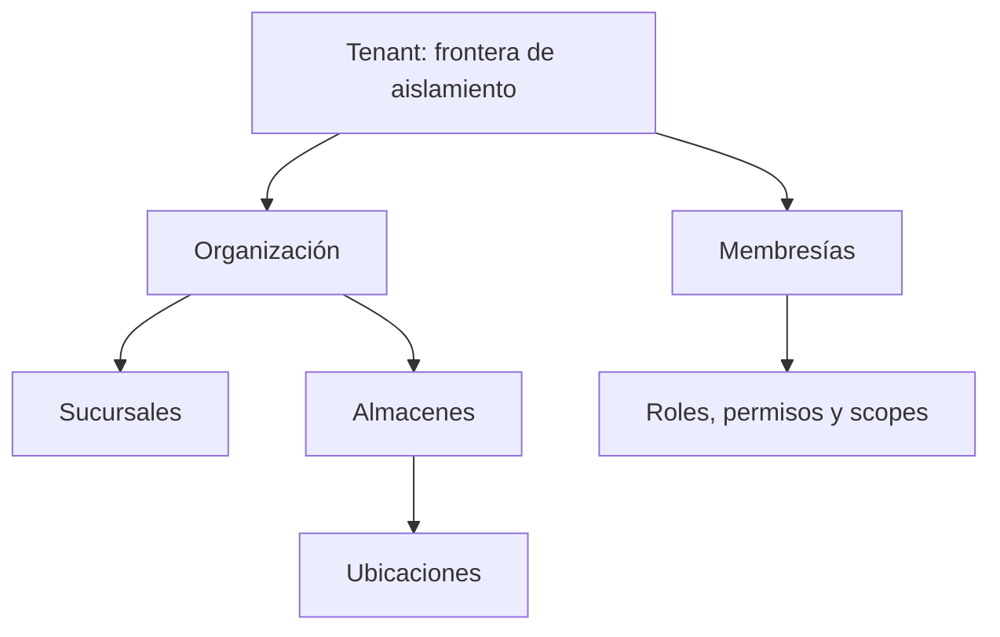

# Arquitectura Multi-tenant de CRUMAFOOD Platform

> **Compartir una plataforma nunca debe significar compartir datos, autoridad ni capacidad sin intención explícita.**

## Estado del documento

| Campo | Valor |
|---|---|
| Estado | Aprobado |
| Versión | 1.0 |
| Propietarios | Product Owner, responsable de arquitectura, responsable de Identity & Access y responsable de datos |
| Aprobado por | Product Owner de CRUMAFOOD Platform |
| Fecha de aprobación | 2026-07-27 |
| Estado de implementación | Arquitectura objetivo no productiva; su adopción está condicionada al ADR obligatorio, al baseline del esquema y al cierre de las prioridades P0 definidas en la sección 93 |
| Base de evidencia | Revisión documental del repositorio; el baseline SQL, las políticas RLS y las pruebas automatizadas de aislamiento continúan pendientes según las secciones 5, 6, 75–89 y 93 |
| Alcance | Tenant, organizaciones, membresías, alcances, aislamiento, RLS, APIs, operación, migración y gobierno |
| Autoridad | Derivado de `system-overview.md`, `business-core.md`, `data-architecture.md`, `security-architecture.md`, `integration-architecture.md`, `deployment-architecture.md`, `observability-architecture.md`, `testing-strategy.md`, `performance-architecture.md` y el CES |
| Revisión | Cuando cambie la frontera de aislamiento, jerarquía organizacional, autorización, RLS, esquema, administración privilegiada o modelo comercial |

---

## 1. Propósito

Este documento define cómo CRUMAFOOD Platform podrá servir a múltiples organizaciones sin mezclar datos, permisos, configuración ni capacidad.

Su propósito es asegurar que:

- cada tenant tenga una frontera explícita;
- el contexto provenga de identidad confiable;
- PostgreSQL aplique aislamiento mediante RLS y constraints;
- las referencias no crucen tenants accidentalmente;
- las APIs no acepten autoridad desde parámetros no confiables;
- Web, Mobile y Desktop compartan el mismo modelo;
- las tareas privilegiadas sean limitadas y auditadas;
- y la migración desde el estado actual sea verificable y reversible.

---

## 2. Declaración arquitectónica

> **CRUMAFOOD utilizará aislamiento lógico por fila en PostgreSQL como dirección inicial, con un Tenant técnico como frontera de seguridad y Organizaciones como entidades del negocio.**

Esta dirección está sujeta a un ADR obligatorio antes de declararse productiva.

El nombre físico canónico de la clave —`tenant_id` u `organization_id`— no se fijará mediante este documento sin verificar el esquema y aprobar el ADR.

No se declarará multi-tenancy productivo por la presencia de pantallas, DTOs o campos propuestos.

---

## 3. Alcance

Esta arquitectura cubre:

- Tenant;
- organización o empresa;
- sucursal;
- almacén;
- ubicación;
- usuario;
- membresía;
- rol;
- permiso;
- alcance;
- contexto activo;
- PostgreSQL;
- RLS;
- Auth;
- API;
- caché;
- Storage;
- Realtime;
- jobs;
- integraciones;
- auditoría;
- observabilidad;
- cuotas;
- soporte;
- migración;
- pruebas;
- y gobierno.

No define todavía el modelo comercial de planes o facturación.

---

## 4. Principios rectores

1. denegar por defecto;
2. el tenant se deriva de identidad confiable;
3. la UI no es frontera de seguridad;
4. toda fila compartida declara su alcance;
5. RLS complementa autorización de caso de uso;
6. las referencias preservan tenant;
7. las unicidades incluyen alcance;
8. la service role es excepcional;
9. el contexto activo es explícito;
10. la auditoría conserva actor y tenant;
11. la caché nunca mezcla scopes;
12. jobs e integraciones conservan contexto;
13. un tenant no degrada silenciosamente a otros;
14. la migración se prueba con datos representativos;
15. toda excepción privilegiada es visible y temporal.

---

## 5. Estado actual

El repositorio actual contiene:

- un `database-map.md` que propone tabla `tenants` y `tenant_id` en múltiples entidades;
- una prioridad “Auth y tenants”;
- un módulo Identity con contratos de Tenant, roles y permisos;
- páginas de Tenants, Roles y Permissions mayormente marcadoras;
- DTOs y repositorios iniciales;
- consultas actuales de roles mediante `user_roles`;
- comparaciones dispersas de texto como `role === 'admin'`;
- almacenes y ubicaciones usados como alcances operativos;
- y documentos que exigen RLS, permisos y aislamiento.

No se identificó evidencia verificable de:

- baseline SQL versionado;
- clave de tenant consistente en todas las tablas;
- relaciones compuestas que impidan cruces;
- políticas RLS multi-tenant completas;
- membresías canónicas;
- cambio seguro de contexto;
- administración cross-tenant;
- ni pruebas automatizadas de aislamiento.

---

## 6. Brechas inmediatas

Las brechas prioritarias son:

- intención documental no reconciliada con esquema real;
- terminología Tenant, Empresa y Organización no normalizada;
- roles sin alcance canónico;
- queries cliente sin garantía demostrada de aislamiento;
- cachés y query keys sin tenant uniforme;
- y falta de suite tenant A contra tenant B.

No se incorporarán nuevos campos de alcance de forma aislada antes del modelo canónico.

---

## 7. Terminología

| Término | Significado |
|---|---|
| Tenant | Frontera técnica de aislamiento y administración |
| Organización | Entidad empresarial representada dentro de la plataforma |
| Sucursal | Unidad operativa o comercial de una organización |
| Almacén | Unidad de custodia de inventario |
| Ubicación | Posición física dentro de un almacén |
| Membresía | Relación de una identidad con un tenant u organización |
| Contexto activo | Scope con el que opera una sesión |
| Alcance | Límite donde un permiso es aplicable |

Los términos de interfaz podrán ser “Empresa” u “Organización”, pero no cambiarán la semántica de seguridad.

---

## 8. Tenant frente a organización

Tenant y Organización no se asumirán equivalentes sin ADR.

Posibles relaciones:

- un tenant contiene una organización;
- un tenant contiene varias organizaciones relacionadas;
- o una organización ocupa una frontera dedicada.

La dirección inicial preferida es simple: una frontera de tenant con una organización principal, ampliable solo por necesidad real.

---

## 9. Frontera de aislamiento

La frontera de tenant protegerá:

- datos;
- configuración;
- usuarios y membresías;
- roles;
- archivos;
- integraciones;
- eventos;
- caché;
- cuotas;
- auditoría;
- y observabilidad.

Una fila global será excepcional y explícita.

---

## 10. Vista conceptual



La jerarquía operacional no implica que cada nivel sea un tenant.

Los permisos pueden limitarse a niveles inferiores sin crear fronteras de datos independientes.

---

## 11. Alternativas de aislamiento

Se consideran:

- filas compartidas con RLS;
- schema por tenant;
- base de datos por tenant;
- y modelo híbrido.

La dirección inicial de filas compartidas reduce complejidad y aprovecha PostgreSQL/Supabase.

Las alternativas dedicadas se reservarán para requisitos regulatorios, escala, residencia o clientes específicos demostrados.

---

## 12. Justificación inicial

El aislamiento lógico por fila permite:

- una sola evolución de esquema;
- operación centralizada;
- consultas agregadas autorizadas;
- onboarding más simple;
- y costo inicial menor.

Exige disciplina estricta en:

- claves;
- RLS;
- constraints;
- índices;
- pruebas;
- y administración privilegiada.

---

## 13. Identificador canónico

La clave de aislamiento será:

- UUID;
- obligatoria en filas scoped;
- inmutable;
- opaca;
- y no reutilizable.

El ADR decidirá el nombre físico.

Hasta entonces, `tenant_id` se usará en ejemplos conceptuales porque coincide con `database-map.md`, no como confirmación del esquema desplegado.

---

## 14. Entidades globales

Una tabla solo será global cuando:

- su contenido sea idéntico para todos;
- no revele información de clientes;
- tenga propietario;
- y no requiera personalización por tenant.

Ejemplos posibles:

- países;
- unidades estándar;
- permisos canónicos;
- y catálogos regulatorios.

Los datos “globales” editables por clientes requerirán overlay o alcance.

---

## 15. Entidades scoped

Serán scoped, como mínimo:

- usuarios internos vinculados;
- productos propios;
- proveedores;
- clientes;
- órdenes;
- inventario;
- lotes;
- compras;
- producción;
- pagos;
- archivos;
- integraciones;
- alertas;
- actividades;
- y configuración.

El catálogo definitivo se verificará contra el esquema.

---

## 16. Jerarquía organizacional

La jerarquía objetivo será:

```text
Tenant
└── Organización
    ├── Sucursal
    └── Almacén
        └── Ubicación
```

No se forzará que un almacén pertenezca a una sucursal si el negocio no lo requiere.

Cada relación tendrá cardinalidad e invariantes explícitas.

---

## 17. Membresía

Una identidad de Auth se relacionará con tenants mediante membresías.

Una membresía incluirá:

- tenant;
- usuario;
- estado;
- fecha de alta;
- fecha de baja;
- invitador;
- y metadatos mínimos.

Los roles se asignarán a la membresía o mediante una relación dependiente de ella.

---

## 18. Una identidad, varios tenants

Una identidad podrá pertenecer a varios tenants solo si existe necesidad aprobada.

En ese caso:

- la sesión no otorgará acceso simultáneo implícito;
- el contexto activo será explícito;
- el cambio será autorizado;
- la caché se limpiará;
- la UI mostrará el tenant;
- y la acción se auditará.

No se mezclarán resultados de contextos en una vista ordinaria.

---

## 19. Contexto activo

El contexto activo incluirá:

- identidad;
- tenant;
- membresía;
- roles;
- permisos;
- sucursales;
- almacenes;
- y capacidades relevantes.

Se resolverá en el servidor desde fuentes confiables.

El cliente podrá solicitar un contexto, pero no concedérselo.

---

## 20. Cambio de tenant

El cambio de tenant requerirá:

1. solicitar el destino;
2. verificar membresía activa;
3. establecer contexto seguro;
4. invalidar cachés;
5. renovar datos;
6. registrar auditoría;
7. y mostrar confirmación.

No se cambiará tenant modificando solo una query string.

---

## 21. Auth y claims

Los claims podrán ayudar a transportar contexto, pero:

- serán mínimos;
- tendrán expiración;
- se validarán;
- no contendrán listas enormes;
- y no reemplazarán autorización actual.

Los permisos altamente dinámicos se resolverán desde servidor o fuente autorizada.

Un claim obsoleto no deberá conservar acceso revocado indefinidamente.

---

## 22. Resolución del tenant

El tenant podrá resolverse desde:

- contexto de sesión autorizado;
- hostname verificado;
- o selección de membresía.

No se confiará únicamente en:

- header enviado por cliente;
- body;
- parámetro de URL;
- localStorage;
- ni nombre visible.

Toda discrepancia se denegará y observará.

---

## 23. Subdominios

El uso de subdominios por tenant es una opción de experiencia, no una barrera suficiente.

Si se adopta:

- el slug será único;
- el hostname se validará;
- la sesión comprobará membresía;
- los dominios personalizados tendrán verificación;
- y RLS seguirá aplicando.

Requiere ADR de dominios y onboarding.

---

## 24. RBAC y alcance

RBAC será la base.

Un permiso seguirá:

```text
<recurso>.<acción>
```

Su evaluación incluirá contexto:

- tenant;
- organización;
- sucursal;
- almacén;
- ubicación;
- recurso;
- y propiedad.

Un rol no será autoridad fuera de su membresía.

---

## 25. Roles

Se distinguirán:

- roles canónicos de plataforma;
- roles configurables del tenant;
- y roles operativos limitados.

Los roles agrupan permisos.

No se codificarán decisiones mediante comparaciones dispersas de strings.

Los cambios tendrán auditoría y efecto de revocación conocido.

---

## 26. Permisos

Los permisos serán:

- estables;
- descriptivos;
- versionados;
- y propiedad de módulos.

Un tenant podrá agrupar permisos en roles, pero no crear permisos que el sistema no comprende.

Los permisos peligrosos tendrán revisión adicional.

---

## 27. Scopes

Un assignment podrá limitarse a:

- todo el tenant;
- una organización;
- sucursales;
- almacenes;
- ubicaciones;
- recursos propios;
- o una combinación explícita.

Los scopes vacíos no significarán acceso total.

La semántica de herencia se documentará.

---

## 28. Autorización de caso de uso

Cada caso de uso sensible evaluará:

- identidad;
- membresía;
- permiso;
- scope;
- tenant del recurso;
- estado;
- y condiciones del negocio.

RLS será defensa adicional, no sustituto de mensajes de dominio accionables.

---

## 29. PostgreSQL

PostgreSQL será autoridad de aislamiento de datos.

Cada tabla scoped tendrá:

- clave de tenant obligatoria;
- índice;
- constraints;
- RLS habilitada;
- políticas;
- y pruebas.

No se dependerá de filtros opcionales en código.

---

## 30. Relaciones compuestas

Las referencias entre tablas scoped deberán impedir cruces de tenant.

La dirección recomendada es usar constraints que incluyan:

```text
(tenant_id, referenced_id)
```

La tabla referenciada expondrá una unicidad compatible.

No bastará con que ambas tablas tengan `tenant_id` sin relación entre ellos.

---

## 31. Unicidades

Las claves visibles se definirán dentro de alcance.

Ejemplos:

- SKU por tenant;
- folio por tenant o sucursal;
- código de almacén por organización;
- slug de tenant global;
- y ubicación por almacén.

Una restricción global se usará solo cuando el negocio lo exija.

---

## 32. Índices

Los índices de patrones scoped comenzarán por tenant cuando sea selectivo y útil.

Se considerarán:

- filtros;
- orden;
- joins;
- RLS;
- unicidades;
- y volumen.

No se agregará `tenant_id` mecánicamente a todo índice sin analizar la consulta.

---

## 33. RLS

RLS estará habilitada y forzada donde el modelo lo requiera.

Las políticas cubrirán:

- select;
- insert;
- update;
- delete;
- y funciones.

Usarán contexto confiable de Auth y membresía.

Toda tabla nueva scoped deberá fallar cerrada antes de tener acceso.

---

## 34. Política de lectura

Una lectura se permitirá cuando:

- el actor esté autenticado;
- tenga membresía activa;
- el tenant de la fila coincida;
- y el scope autorice la operación.

Los datos globales tendrán política separada.

Una consulta sin filas no demostrará por sí sola que la política sea correcta.

---

## 35. Política de inserción

Una inserción deberá verificar:

- membresía;
- permiso;
- tenant permitido;
- scope;
- y relaciones pertenecientes al mismo tenant.

El cliente no podrá insertar una fila para un tenant arbitrario.

Se preferirá derivar el tenant en una operación segura cuando sea viable.

---

## 36. Política de actualización

La actualización verificará tanto fila existente como resultado nuevo.

`USING` y `WITH CHECK` se diseñarán conjuntamente.

No se permitirá mover una fila entre tenants mediante update ordinario.

Una transferencia legítima requerirá proceso administrativo excepcional.

---

## 37. Política de eliminación

La eliminación respetará:

- tenant;
- permiso;
- estado;
- dependencias;
- retención;
- y auditoría.

El soft delete no sustituirá aislamiento.

Una fila eliminada seguirá protegida.

---

## 38. Funciones privilegiadas

Las funciones `SECURITY DEFINER`:

- serán mínimas;
- fijarán `search_path`;
- validarán tenant y permiso;
- tendrán owner controlado;
- revocarán ejecución pública;
- y se probarán.

No se usarán para eludir RLS de forma genérica.

---

## 39. Service role

La service role:

- solo vivirá en backend seguro;
- estará encapsulada;
- tendrá casos de uso explícitos;
- validará tenant;
- emitirá auditoría;
- y nunca se enviará a clientes.

Una consulta con service role no demuestra aislamiento.

---

## 40. Administración de plataforma

Los operadores de plataforma no tendrán acceso implícito a datos de todos los tenants.

El acceso de soporte requerirá:

- propósito;
- ticket;
- aprobación;
- tenant;
- duración;
- mínimo privilegio;
- aviso cuando corresponda;
- y auditoría.

---

## 41. Break-glass

El acceso de emergencia:

- será excepcional;
- requerirá MFA;
- expirará;
- alertará;
- registrará cada operación;
- y tendrá revisión posterior.

No existirá una cuenta “super admin” compartida de uso diario.

---

## 42. Impersonation

La suplantación de usuario permanecerá deshabilitada hasta contar con ADR.

Si se adopta:

- no ocultará al actor real;
- mostrará banner;
- limitará acciones;
- requerirá motivo;
- expirará;
- y auditará actor efectivo y actor original.

No se usarán credenciales del cliente.

---

## 43. API

Toda API derivará tenant desde contexto autorizado.

Los identificadores de recurso:

- serán opacos;
- se resolverán dentro del tenant;
- no revelarán existencia ajena;
- y se autorizarán en caso de uso y datos.

El endpoint no confiará en `tenantId` enviado por el cliente como autoridad.

---

## 44. Errores

Los errores cross-tenant devolverán una respuesta segura, normalmente equivalente a recurso no disponible o acceso denegado según el contrato.

No revelarán:

- nombre;
- existencia;
- propietario;
- IDs relacionados;
- ni detalles de política.

La observabilidad conservará contexto seguro.

---

## 45. Integraciones

Cada conexión externa pertenecerá a:

- plataforma;
- tenant;
- o alcance inferior explícito.

Las credenciales se separarán por tenant cuando el proveedor lo requiera.

Los callbacks resolverán la integración antes de procesar el payload.

---

## 46. Webhooks

Los webhooks incluirán una asociación segura con tenant mediante configuración interna.

No se confiará en un `tenant_id` dentro del body sin verificar proveedor, firma y vínculo.

Idempotencia, inbox y auditoría conservarán tenant.

Un secreto compartido entre todos los tenants se evitará cuando aumente el impacto.

---

## 47. Jobs

Los jobs:

- iterarán tenants de forma acotada;
- conservarán contexto;
- limitarán concurrencia;
- aislarán fallos;
- registrarán progreso;
- y evitarán que un tenant detenga a otros.

Los jobs globales distinguirán coordinación de trabajo scoped.

---

## 48. Outbox e inbox

Todo mensaje scoped incluirá tenant en el envelope interno.

El consumidor:

- validará contexto;
- aplicará idempotencia por tenant;
- resolverá recursos dentro del scope;
- y propagará correlación.

Una key de idempotencia podrá requerir composición con tenant.

---

## 49. Storage

Los objetos de Storage tendrán rutas o metadata scoped.

El acceso usará políticas que relacionen:

- bucket;
- tenant;
- actor;
- recurso;
- y acción.

Conocer una URL no otorgará acceso permanente.

Los nombres no expondrán datos sensibles.

---

## 50. Realtime

Las suscripciones Realtime respetarán RLS.

Los canales:

- no mezclarán tenants;
- limitarán payload;
- validarán membresía;
- y manejarán revocación.

No se publicará un canal global con eventos de clientes.

---

## 51. Caché

Toda clave scoped incluirá, cuando corresponda:

- entorno;
- versión;
- tenant;
- identidad o rol;
- recurso;
- filtros;
- y locale.

El cambio de tenant invalidará cachés cliente y servidor aplicables.

Una respuesta autorizada no se almacenará como caché pública.

---

## 52. React Query y estado cliente

Las query keys incluirán tenant activo.

Al cambiar contexto:

- se cancelarán requests;
- se limpiarán datos;
- se reiniciarán stores;
- y se recargará autorización.

LocalStorage no conservará datos de otro tenant accesibles desde la sesión nueva.

---

## 53. Mobile

Mobile mostrará claramente:

- tenant;
- almacén;
- ubicación;
- y usuario activos

antes de una operación crítica.

Los comandos offline incluirán contexto firmado o verificable y serán reautorizados al sincronizar.

Cambiar tenant con comandos pendientes requerirá resolución explícita.

---

## 54. Desktop

Desktop separará por tenant:

- sesión;
- almacenamiento local;
- caché;
- configuración;
- colas;
- archivos temporales;
- y diagnósticos.

El bridge nativo no confiará en tenant enviado por la WebView sin sesión autorizada.

---

## 55. Offline

El almacenamiento offline scoped:

- cifrará datos sensibles;
- tendrá límites;
- conservará tenant;
- aplicará expiración;
- soportará borrado;
- y evitará mezcla entre sesiones.

La revocación se aplicará al reconectar.

Offline multi-tenant requiere ADR de amenazas y piloto.

---

## 56. Auditoría

Toda acción crítica registrará:

- actor;
- actor original cuando aplique;
- tenant;
- membresía;
- scope;
- acción;
- recurso;
- resultado;
- fecha;
- y correlación.

La auditoría del tenant estará aislada de otros tenants.

---

## 57. Observabilidad

La telemetría incluirá tenant seudonimizado cuando sea necesario.

Se observarán:

- denegaciones cross-tenant;
- fallos RLS;
- cambio de contexto;
- uso privilegiado;
- jobs por tenant;
- cuotas;
- errores;
- latencia;
- y noisy neighbor.

No se usará el nombre comercial como label de alta cardinalidad.

---

## 58. Analítica y BI

Los reportes ordinarios solo incluirán el tenant activo.

Los agregados de plataforma:

- minimizarán datos;
- requerirán propósito;
- evitarán reidentificación;
- y tendrán autorización separada.

BI no será vía alternativa para eludir RLS.

---

## 59. Búsqueda

Todo índice o servicio de búsqueda conservará tenant.

La ingestión, consulta y eliminación estarán scoped.

Los resultados no se filtrarán solo después de recuperar documentos de varios tenants.

La clave de aislamiento formará parte del filtro obligatorio.

---

## 60. Exports

Una exportación:

- se autorizará;
- limitará tenant y scope;
- registrará filtros;
- tendrá expiración;
- se almacenará de forma segura;
- y dejará auditoría.

Los jobs de exportación volverán a validar autorización antes de entregar.

---

## 61. Imports

Un import se vinculará al tenant antes de procesar.

Cada referencia:

- se resolverá dentro del tenant;
- rechazará cruces;
- y producirá reporte seguro.

Los IDs externos no podrán apuntar a recursos de otro tenant.

---

## 62. Configuración

La configuración se dividirá en:

- global de plataforma;
- por tenant;
- por organización;
- por sucursal;
- por almacén;
- y por usuario.

Se definirá herencia y precedencia.

Un valor global no podrá sobrescribir silenciosamente una restricción de seguridad.

---

## 63. Feature flags

Los flags podrán asignarse por tenant.

La evaluación incluirá:

- entorno;
- tenant;
- actor;
- versión;
- y fallback.

No se usará un flag para conceder permiso.

Los cambios de flag se auditarán.

---

## 64. Límites y cuotas

Se podrán aplicar por tenant:

- usuarios;
- dispositivos;
- requests;
- almacenamiento;
- exports;
- integraciones;
- jobs;
- y eventos.

La cuota será visible y accionable.

No producirá corrupción ni pérdida silenciosa.

---

## 65. Noisy neighbor

Se controlará mediante:

- rate limiting;
- cuotas;
- concurrencia;
- batches;
- prioridades;
- timeouts;
- y observabilidad.

Un tenant con carga alta no deberá agotar conexiones o workers sin límite.

---

## 66. Rendimiento

Las consultas scoped:

- filtrarán tenant temprano;
- usarán índices apropiados;
- paginarán;
- y evitarán scans globales.

RLS se incluirá en pruebas de rendimiento.

No se desactivará aislamiento para mejorar benchmarks.

---

## 67. Backups

El respaldo puede ser compartido físicamente, pero la restauración deberá preservar aislamiento.

Se definirán:

- recuperación completa;
- recuperación de tenant;
- exportación autorizada;
- y eliminación.

La restauración de un tenant no deberá sobrescribir datos ajenos.

---

## 68. Portabilidad

La salida de un tenant requerirá:

- autorización;
- alcance;
- formato;
- integridad;
- archivos;
- auditoría;
- y entrega segura.

La portabilidad no incluirá datos globales o de otros tenants.

El contrato comercial definirá disponibilidad y plazo.

---

## 69. Borrado de tenant

El borrado será un proceso gobernado:

1. suspender acceso;
2. detener integraciones;
3. retener según obligación;
4. exportar si corresponde;
5. borrar o anonimizar;
6. verificar;
7. y conservar evidencia mínima.

No se resolverá con un `DELETE CASCADE` improvisado.

---

## 70. Suspensión

Un tenant suspendido:

- no iniciará nuevas operaciones;
- conservará datos según política;
- detendrá jobs no esenciales;
- rechazará integraciones;
- y permitirá solo flujos administrativos autorizados.

La suspensión no equivale a borrado.

---

## 71. Onboarding

El alta de tenant será transaccional o compensable.

Creará:

- frontera;
- organización;
- membresía administradora;
- roles base;
- configuración;
- y auditoría.

No expondrá el tenant hasta completar invariantes.

---

## 72. Invitaciones

Las invitaciones:

- estarán ligadas a tenant;
- tendrán rol y scope;
- expirarán;
- serán de un solo uso;
- podrán revocarse;
- y no revelarán datos antes de aceptación.

Aceptar una invitación no eliminará membresías existentes.

---

## 73. Offboarding de usuario

La baja:

- revocará membresía;
- cerrará sesiones cuando aplique;
- retirará dispositivos;
- reasignará responsabilidades;
- preservará auditoría;
- y limpiará acceso offline.

No se borrará identidad histórica necesaria para trazabilidad.

---

## 74. Administración de roles

Un administrador de tenant solo administrará roles y membresías dentro de su frontera y de sus propios permisos.

No podrá:

- otorgarse privilegios de plataforma;
- editar permisos canónicos;
- acceder a otro tenant;
- ni remover la última vía de administración sin recuperación.

---

## 75. Testing

La estrategia seguirá `testing-strategy.md`.

Se probarán:

- tenant A puede leer A;
- tenant A no puede leer B;
- insert cruzado;
- update cruzado;
- delete cruzado;
- relación cruzada;
- caché;
- Storage;
- Realtime;
- jobs;
- imports;
- exports;
- y administración.

---

## 76. Matriz RLS

Cada tabla scoped tendrá una matriz:

| Actor | Tenant | Operación | Resultado |
|---|---|---|---|
| Anónimo | Ninguno | Select | Denegado |
| Miembro A | A | Select A | Permitido por scope |
| Miembro A | A | Select B | Denegado |
| Miembro A | A | Insert B | Denegado |
| Suspendido A | A | Cualquier mutación | Denegado |
| Service role autorizada | Explícito | Caso de uso | Auditado |

La matriz se ampliará por rol y estado.

---

## 77. Pruebas de constraints

Se intentará:

- referenciar producto de B desde orden de A;
- usar almacén de B;
- reutilizar folio fuera de scope;
- mover tenant por update;
- y crear fila sin tenant.

PostgreSQL deberá rechazar cruces incluso si una capa superior falla.

---

## 78. Pruebas de caché

Se verificará:

- keys por tenant;
- cambio de contexto;
- logout;
- cambio de usuario;
- revalidación;
- caché compartida;
- y datos offline.

El test deberá demostrar ausencia de residuos visibles.

---

## 79. Pruebas de concurrencia

Se probarán simultáneamente:

- onboarding;
- invitaciones;
- asignaciones;
- folios;
- jobs;
- cuotas;
- y operaciones de inventario

entre varios tenants.

El resultado global deberá preservar aislamiento.

---

## 80. Seguridad

La revisión de amenazas incluirá:

- IDOR;
- mass assignment;
- claims manipulados;
- token robado;
- cache poisoning;
- subdominio;
- Storage;
- Realtime;
- service role;
- logs;
- exports;
- y soporte.

Todo flujo crítico tendrá pruebas negativas.

---

## 81. Migración: principio

La migración será expand–backfill–enforce–contract.

No se añadirá `NOT NULL` y RLS a tablas con datos desconocidos en un solo paso sin análisis.

Cada fase tendrá:

- respaldo;
- verificación;
- observabilidad;
- y rollback o roll-forward.

---

## 82. Inventario del esquema

Antes de migrar se obtendrá:

- esquema desplegado;
- tablas;
- FKs;
- policies;
- funciones;
- triggers;
- vistas;
- datos;
- y dependencias de código.

`database-map.md` es intención y no sustituye este baseline.

---

## 83. Clasificación de tablas

Cada tabla se clasificará como:

- global;
- tenant-scoped;
- organization-scoped derivada;
- técnica;
- auditoría;
- proyección;
- o pendiente.

La clasificación tendrá propietario.

No se migrará una tabla “pendiente” por inferencia.

---

## 84. Tenant inicial

Los datos existentes se asociarán a un tenant inicial solo después de verificar que pertenecen a una misma organización.

El proceso:

- creará tenant;
- vinculará organización;
- backfillará;
- verificará conteos;
- y conciliará referencias.

No se asignará un default silencioso a nuevas filas.

---

## 85. Backfill

El backfill será:

- idempotente;
- por batches;
- reanudable;
- observable;
- y verificable.

Registrará filas pendientes y conflictos.

Las filas ambiguas bloquearán enforcement hasta su resolución.

---

## 86. Enforcement

Después de verificar:

- se aplicará `NOT NULL`;
- se crearán constraints compuestas;
- se ajustarán unicidades;
- se añadirán índices;
- se habilitará RLS;
- y se probarán clientes.

La service role no será la única identidad de validación.

---

## 87. Compatibilidad de código

Durante transición, el código soportará el esquema expandido sin asumir enforcement antes de tiempo.

Se actualizarán:

- repositorios;
- mappers;
- contratos;
- queries;
- caches;
- eventos;
- y jobs.

Las versiones antiguas no podrán crear filas sin scope durante la ventana.

---

## 88. Rollout

La liberación será gradual:

1. entorno local;
2. CI;
3. Preview;
4. sandbox con dos tenants;
5. piloto;
6. Production monitoreada;
7. enforcement completo.

Feature flags no sustituirán constraints de aislamiento.

---

## 89. Monitoreo de migración

Se observarán:

- filas sin tenant;
- referencias cruzadas;
- denegaciones;
- errores RLS;
- latencia;
- consultas sin scope;
- y uso de service role.

Cualquier cruce confirmado se tratará como incidente.

---

## 90. Incidentes

Ante posible fuga cross-tenant:

- contener;
- revocar;
- preservar evidencia;
- identificar tenants;
- evaluar datos;
- notificar según obligación;
- corregir;
- y añadir regresión.

La severidad se basará en exposición e impacto.

---

## 91. Definition of Done

Una capacidad scoped estará terminada cuando:

- define frontera;
- deriva tenant de fuente confiable;
- autoriza permiso y scope;
- persiste tenant obligatorio;
- usa relaciones seguras;
- aplica RLS;
- separa caché;
- emite auditoría;
- observa contexto;
- prueba A contra B;
- y documenta migración.

---

## 92. Gobierno

Los cambios a:

- frontera;
- clave;
- jerarquía;
- membresía;
- roles;
- policies;
- administración privilegiada;
- y residencia

requerirán ADR o revisión arquitectónica formal.

Identity & Access será propietario del modelo transversal.

---

## 93. Prioridades

### P0 — Decisión y baseline

- verificar esquema;
- aprobar ADR de Tenant y Organización;
- elegir clave canónica;
- clasificar tablas;
- definir membresía;
- definir contexto;
- encapsular service role;
- y crear suite A/B inicial.

### P1 — Aislamiento productivo

- migraciones;
- backfill;
- constraints compuestas;
- índices;
- RLS;
- autorización de casos de uso;
- caché scoped;
- Storage;
- Realtime;
- jobs;
- auditoría;
- y observabilidad.

### P2 — Operación avanzada

- cambio multi-tenant;
- dominios personalizados;
- cuotas;
- soporte temporal;
- portabilidad;
- borrado;
- aislamiento dedicado;
- y chargeback

solo cuando el producto lo requiera.

---

## 94. Secuencia de adopción

1. reconciliar intención y realidad;
2. aprobar terminología;
3. modelar Tenant y membresía;
4. crear tenant inicial;
5. propagar clave;
6. asegurar relaciones;
7. habilitar RLS;
8. migrar autorización;
9. separar clientes y caches;
10. pilotear dos tenants;
11. activar monitoreo;
12. declarar conformidad.

---

## 95. Antipatrones

Se evitará:

- filtrar solo en UI;
- aceptar tenant desde body;
- usar service role en cliente;
- confiar solo en RLS;
- confiar solo en casos de uso;
- FKs sin tenant;
- uniques globales accidentales;
- cache keys incompletas;
- roles de texto dispersos;
- super admin compartido;
- jobs globales sin contexto;
- datos offline mezclados;
- y declarar multi-tenancy por una tabla `tenants`.

---

## 96. Riesgos y controles

| Riesgo | Control |
|---|---|
| Fuga cross-tenant | RLS, autorización, constraints y pruebas |
| Contexto manipulado | Resolución desde identidad confiable |
| FK cruzada | Claves compuestas |
| Caché mezclada | Keys scoped e invalidación |
| Service role amplia | Encapsulación y auditoría |
| Claims obsoletos | Expiración y resolución actual |
| Noisy neighbor | Cuotas, rate limiting y batches |
| Migración incompleta | Backfill y enforcement por fases |
| Soporte invasivo | Acceso temporal y trazable |
| Borrado incorrecto | Workflow gobernado |

---

## 97. Criterios de conformidad

Un módulo será conforme cuando:

- conoce su clasificación;
- usa clave canónica;
- impide relaciones cruzadas;
- aplica RLS;
- autoriza contexto;
- pagina e indexa por scope;
- separa cache y archivos;
- audita;
- observa;
- prueba A/B;
- y opera sin service role generalizada.

La conformidad se demuestra con esquema, código, policies, pruebas y evidencia.

---

## 98. Decisiones pendientes

Requieren ADR:

- Tenant frente a Organización;
- nombre canónico de clave;
- una o varias organizaciones por tenant;
- jerarquía;
- membresías múltiples;
- claims;
- subdominios;
- roles configurables;
- administración de plataforma;
- impersonation;
- aislamiento dedicado;
- residencia;
- portabilidad;
- borrado;
- y límites comerciales.

---

## 99. Resultado esperado

Al aplicar esta arquitectura, CRUMAFOOD podrá:

- incorporar organizaciones con seguridad;
- evitar cruces accidentales;
- administrar permisos por contexto;
- operar Web, Mobile y Desktop de forma coherente;
- escalar sin noisy neighbor;
- soportar y auditar sin privilegio permanente;
- y evolucionar a aislamientos dedicados cuando exista una necesidad real.

---

## 100. Declaración final

> **En CRUMAFOOD, el tenant será una frontera verificable, no una convención de interfaz. La identidad, el Business Core, PostgreSQL, RLS, las cachés y la operación deberán coincidir antes de afirmar que los datos de una organización están realmente aislados.**
