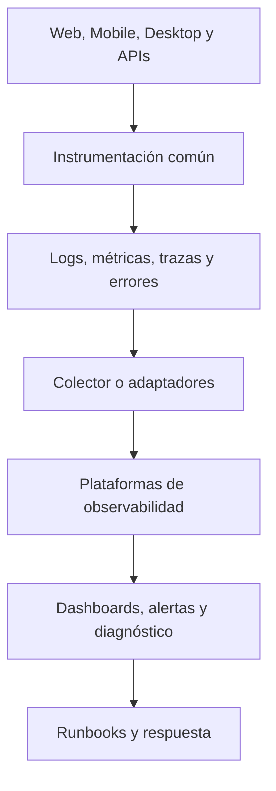

# Arquitectura de Observabilidad de CRUMAFOOD Platform

> **Un sistema observable permite detectar, comprender y corregir degradaciones antes de que se conviertan en pérdidas operativas o decisiones sin evidencia.**

## Estado del documento

| Campo | Valor |
|---|---|
| Estado | Propuesto para aprobación |
| Versión | 1.0 |
| Propietarios | Product Owner, responsable de arquitectura y responsable de operación |
| Alcance | Logs, métricas, trazas, errores, alertas, SLI/SLO, dashboards, diagnóstico, privacidad y respuesta operativa |
| Autoridad | Derivado de `system-overview.md`, `data-architecture.md`, `security-architecture.md`, `integration-architecture.md`, `deployment-architecture.md`, `frontend-architecture.md`, `mobile-architecture.md`, `desktop-architecture.md` y el CES |
| Revisión | Cuando cambie una unidad de ejecución, proveedor, flujo crítico, clasificación de datos, objetivo de servicio o modelo de soporte |

---

## 1. Propósito

Este documento define cómo CRUMAFOOD Platform producirá, transportará, almacenará, consultará y utilizará señales operativas.

Su propósito es asegurar que:

- los fallos sean detectables;
- el impacto pueda cuantificarse;
- una solicitud pueda correlacionarse entre componentes;
- los despliegues puedan compararse;
- las alertas conduzcan a una acción;
- el soporte disponga de diagnóstico seguro;
- las decisiones de capacidad se basen en evidencia;
- los datos sensibles no se filtren a telemetría;
- y la observabilidad evolucione junto con el sistema.

---

## 2. Declaración arquitectónica

> **CRUMAFOOD adoptará observabilidad estructurada, correlacionada y orientada a flujos críticos, con OpenTelemetry como dirección de interoperabilidad y proveedores seleccionados mediante ADR.**

La arquitectura será independiente del proveedor cuando resulte razonable.

Vercel, Supabase y los futuros runtimes podrán aportar señales nativas, pero ninguna consola aislada será la visión completa del sistema.

Sentry, Vercel Analytics y Supabase Monitoring son candidatos o fuentes previstas; no se considerarán implementados hasta existir configuración, captura verificable, retención, acceso y runbook.

---

## 3. Alcance

Esta arquitectura cubre:

- aplicación Next.js;
- Server Components y Route Handlers;
- Vercel Functions;
- Supabase Auth;
- PostgreSQL;
- Supabase Storage y Realtime;
- jobs programados;
- integraciones y webhooks;
- futuros workers;
- Storefront;
- Admin Web;
- Mobile;
- Desktop;
- errores;
- logs;
- métricas;
- trazas;
- eventos de release;
- health y readiness;
- alertas;
- SLI, SLO y error budgets;
- dashboards;
- diagnóstico;
- retención;
- privacidad;
- costo;
- runbooks;
- y gobierno.

No sustituye auditoría de negocio, analítica de producto ni inteligencia empresarial.

---

## 4. Principios rectores

1. observar primero los flujos que sostienen la operación;
2. cada señal debe responder una pregunta;
3. logs, métricas y trazas se correlacionan;
4. la telemetría es estructurada desde el origen;
5. los datos sensibles se excluyen por diseño;
6. una alerta exige acción y propietario;
7. disponibilidad se mide desde la experiencia útil;
8. el entorno y la release siempre son identificables;
9. la cardinalidad se controla;
10. el muestreo no oculta errores críticos;
11. auditoría y observabilidad permanecen separadas;
12. la instrumentación se prueba;
13. los proveedores son reemplazables mediante contratos razonables;
14. el costo de observar también se observa;
15. un despliegue no termina hasta confirmar su salud.

---

## 5. Estado actual

El repositorio actual contiene:

- un endpoint `/api/health` que devuelve estado y timestamp;
- logs nativos disponibles en el runtime de Vercel;
- referencias documentales a Vercel Analytics, Sentry y Supabase Monitoring;
- límites de error de React que usan `console.error`;
- un webhook genérico que registra el payload completo con `console.log`;
- un job programado sin correlación ni registro durable de ejecución visible;
- pantallas de analytics que en varios módulos son marcadores;
- y documentos arquitectónicos que ya exigen correlación, redacción y alertas accionables.

No se identificó implementación verificable de:

- logger estructurado común;
- captura central de errores;
- OpenTelemetry;
- tracing distribuido;
- catálogo de métricas;
- dashboards operativos;
- alertas técnicas configuradas;
- SLI o SLO medidos;
- error budgets;
- synthetic monitoring;
- ni carpeta funcional `infrastructure/observability`.

Este documento describe el objetivo y la transición; no presenta estas capacidades como existentes.

---

## 6. Brechas inmediatas

Las brechas de mayor riesgo son:

- logging de payloads no clasificados en webhooks;
- errores enviados directamente a consola;
- respuestas de jobs con detalles internos;
- ausencia de identificador de correlación;
- health que solo demuestra que el proceso responde;
- falta de relación entre error, entorno, release y usuario seudonimizado;
- y ausencia de alertas verificables para flujos críticos.

Estas brechas se tratarán en el plan P0–P2 de este documento.

---

## 7. Diferencia entre observabilidad, auditoría y analítica

| Disciplina | Pregunta principal | Ejemplo | Autoridad |
|---|---|---|---|
| Observabilidad | ¿Cómo se comporta técnicamente el sistema? | Latencia y error de confirmar una orden | Plataforma operativa |
| Auditoría | ¿Quién hizo qué acción de negocio y con qué resultado? | Usuario ajustó inventario | Registro append-only del servidor |
| Analítica de producto | ¿Cómo se utiliza una experiencia? | Adopción de una función | Plataforma de producto |
| BI de negocio | ¿Qué ocurrió en el negocio? | Ventas por canal | Modelos y datos gobernados |

Un log técnico no será evidencia suficiente de auditoría.

Una métrica de negocio no autorizará decisiones transaccionales.

Un evento de analítica no contendrá secretos ni reemplazará telemetría operativa.

---

## 8. Modelo de señales

CRUMAFOOD utilizará cinco tipos de señal:

- **logs:** hechos discretos con contexto;
- **métricas:** series numéricas agregables;
- **trazas:** recorrido causal de una operación;
- **errores:** excepciones y fallos agrupados;
- **eventos operativos:** despliegues, cambios de configuración e incidentes.

La auditoría se relacionará por identificadores cuando sea legítimo, pero se almacenará y gobernará por separado.

---

## 9. Vista lógica



La ruta podrá simplificarse inicialmente usando capacidades nativas del proveedor.

La semántica y los campos comunes no dependerán de una interfaz propietaria.

---

## 10. Capas de observabilidad

Se observarán cuatro capas:

1. **experiencia:** disponibilidad y desempeño percibidos;
2. **aplicación:** rutas, casos de uso, errores y dependencias;
3. **plataforma:** runtimes, base de datos, almacenamiento y red;
4. **negocio operativo:** éxito de flujos críticos y acumulaciones.

Una capa sana no demuestra que las demás estén sanas.

HTTP 200 no demuestra que una orden se haya procesado correctamente.

---

## 11. Flujos críticos iniciales

La primera instrumentación se concentrará en:

- iniciar sesión;
- consultar catálogo;
- crear y confirmar orden;
- procesar pago o confirmación de pago;
- reservar y mover inventario;
- recibir compra;
- producir y consumir lote;
- ejecutar job programado;
- recibir webhook;
- sincronizar Mobile;
- sincronizar Desktop;
- imprimir etiqueta;
- y restaurar servicio tras despliegue.

Cada flujo tendrá una definición explícita de inicio, éxito, fallo y latencia.

---

## 12. Convenciones de nombres

Los nombres usarán una taxonomía estable y legible.

Ejemplos:

- `http.server.request.duration`;
- `cruma.orders.confirmed`;
- `cruma.inventory.movement.failed`;
- `cruma.jobs.execution.duration`;
- `cruma.sync.pending_commands`.

Las métricas no incluirán valores dinámicos en el nombre.

Los atributos expresarán dimensiones controladas.

Los nombres propietarios se mapearán a esta taxonomía.

---

## 13. Contexto común

Toda señal incluirá, cuando aplique:

- `service.name`;
- `service.version`;
- `deployment.environment`;
- `release.id`;
- `commit.sha`;
- `region`;
- `runtime`;
- `operation.name`;
- `request.id`;
- `trace.id`;
- `tenant.id` seudonimizado;
- `actor.id` seudonimizado;
- `device.id` seudonimizado;
- resultado;
- duración;
- y código de error normalizado.

Los campos ausentes no se inventarán.

---

## 14. Identidad de servicio

Cada unidad de ejecución tendrá un nombre estable:

- Web/API Next.js;
- job runner;
- worker, cuando exista;
- Mobile;
- Desktop;
- adaptador de integración;
- y componente de sincronización.

El nombre lógico no cambiará con cada despliegue.

Instancias efímeras se distinguirán mediante atributos, no creando servicios nuevos.

---

## 15. Entornos

Production, Preview, Development y pruebas estarán separados.

Toda señal declarará su entorno desde configuración confiable.

No se mezclarán:

- alertas productivas con desarrollo;
- usuarios reales con datos de prueba;
- SLO productivos con tráfico sintético no identificado;
- ni releases de Preview con Production.

Los entornos locales tendrán exportación desactivada o destinos de desarrollo por defecto.

---

## 16. Releases y despliegues

Cada señal productiva podrá relacionarse con:

- versión;
- commit;
- artefacto;
- momento del despliegue;
- migración aplicada;
- feature flags relevantes;
- y resultado de smoke tests.

Los dashboards mostrarán marcadores de despliegue.

Un incremento de errores posterior a una release deberá ser visible sin correlación manual.

---

## 17. Correlación de solicitudes

Cada solicitud recibirá o heredará un `request_id`.

Cuando exista tracing, también propagará contexto W3C Trace Context mediante `traceparent` y `tracestate`.

El sistema:

- validará encabezados externos;
- generará identificadores cuando falten;
- devolverá un identificador seguro al cliente;
- lo propagará a llamadas salientes;
- y lo incluirá en logs y errores.

Un identificador de correlación no concederá autorización.

---

## 18. Correlación asíncrona

Jobs, outbox, inbox, reintentos y sincronización conservarán:

- `correlation_id`;
- `causation_id`;
- identificador del mensaje o comando;
- intento;
- fecha de creación;
- fecha de procesamiento;
- y resultado.

Cada reintento será un intento nuevo de la misma operación lógica.

No se creará una traza infinita para procesos de larga duración; se usarán enlaces cuando corresponda.

---

## 19. Logger estructurado

Se implementará una abstracción común en `infrastructure/observability`.

El logger emitirá JSON en runtimes de servidor y una representación apropiada en desarrollo.

La interfaz mínima soportará:

- nivel;
- mensaje estable;
- contexto tipado;
- error;
- correlación;
- redacción;
- y flush cuando el runtime lo requiera.

El Business Core no dependerá de una librería de logging.

Podrá emitir eventos mediante puertos definidos por caso de uso.

---

## 20. Niveles de log

| Nivel | Uso |
|---|---|
| Debug | Diagnóstico temporal o detallado, normalmente muestreado |
| Info | Inicio, final y cambio operacional esperado |
| Warn | Degradación recuperable que merece seguimiento |
| Error | Operación fallida o pérdida de capacidad |
| Fatal | Proceso o servicio incapaz de continuar |

No se elevará cada validación de usuario a error técnico.

No se usará `debug` como almacenamiento ilimitado de payloads.

---

## 21. Eventos de log

Los mensajes serán estables y orientados a eventos:

- `order.confirmation.completed`;
- `webhook.signature.rejected`;
- `job.execution.failed`;
- `database.query.slow`;
- `desktop.print.failed`.

Los valores variables irán en campos.

Esto permitirá buscar y agregar sin analizar texto libre.

---

## 22. Errores estructurados

Cada error normalizado incluirá:

- categoría;
- código estable;
- mensaje seguro;
- operación;
- causa técnica interna;
- condición reintentable;
- dependencia;
- correlación;
- y severidad.

El cliente recibirá un mensaje accionable y un identificador de soporte.

La causa, stack trace y detalles internos permanecerán en observabilidad protegida.

---

## 23. Captura central de errores

Se seleccionará una plataforma de errores mediante ADR.

Sentry es candidato por la documentación existente, pero requerirá:

- SDK aprobado;
- configuración por entorno;
- releases y source maps;
- redacción antes de envío;
- reglas de muestreo;
- agrupación;
- ownership;
- retención;
- control de acceso;
- prueba de captura;
- y runbook.

Instalar un paquete sin verificar estos elementos no completa la capacidad.

---

## 24. Source maps

Los source maps de producción:

- se generarán de forma controlada;
- se asociarán a una release;
- se cargarán al proveedor autorizado;
- no se publicarán accidentalmente al cliente;
- y se eliminarán del artefacto público cuando corresponda.

El pipeline fallará si una release exige símbolos y estos no pueden asociarse.

---

## 25. Métricas

Las métricas usarán contadores, histogramas y gauges según su semántica.

Se priorizarán:

- tasa;
- errores;
- duración;
- saturación;
- volumen;
- edad;
- y frescura.

Los promedios no sustituirán percentiles para latencia.

Toda métrica tendrá descripción, unidad, propietario y uso.

---

## 26. RED y USE

Para servicios y endpoints se aplicará RED:

- Rate;
- Errors;
- Duration.

Para recursos se aplicará USE:

- Utilization;
- Saturation;
- Errors.

Estas guías no reemplazan las métricas del flujo de negocio.

---

## 27. Cardinalidad

No se usarán como etiquetas métricas:

- ID de usuario;
- ID de orden;
- correo;
- URL sin normalizar;
- mensaje de error libre;
- SKU arbitrario;
- trace ID;
- ni payload.

Estos datos, si están autorizados, pertenecerán a logs o trazas con retención controlada.

Las dimensiones métricas tendrán conjuntos acotados.

---

## 28. Histogramas y latencia

Las duraciones se registrarán en unidades consistentes.

Los buckets se elegirán según experiencia y comportamiento observados.

Se analizarán:

- p50;
- p90;
- p95;
- p99;
- y máximos diagnósticos con cautela.

La latencia se medirá por operación normalizada, no por URL con IDs.

---

## 29. Tracing distribuido

OpenTelemetry es la dirección propuesta para instrumentación portable.

El tracing se incorporará progresivamente cuando:

- una operación cruce varias unidades;
- existan workers;
- las integraciones dificulten el diagnóstico;
- los reintentos oculten la causa;
- o la latencia no pueda atribuirse con métricas y logs.

No se instrumentará cada función interna como span.

---

## 30. Spans

Se crearán spans para límites relevantes:

- solicitud HTTP;
- caso de uso;
- consulta o transacción significativa;
- llamada a dependencia;
- publicación o consumo de mensaje;
- job;
- sincronización;
- operación de hardware;
- e importación o exportación.

Cada span tendrá nombre estable, estado y atributos seguros.

Los eventos dentro del span se reservarán para hitos útiles.

---

## 31. Muestreo

El muestreo tendrá reglas explícitas:

- errores críticos: conservar;
- transacciones lentas: conservar;
- operaciones sensibles: minimizar atributos;
- tráfico normal: muestreo proporcional;
- health checks frecuentes: reducir;
- y desarrollo: mayor detalle sin datos reales.

El head sampling podrá complementarse con tail sampling cuando la infraestructura lo justifique.

La tasa será observable y configurable.

---

## 32. Web y frontend

La observabilidad Web cubrirá:

- errores no controlados;
- fallos de navegación;
- llamadas de API;
- Web Vitals;
- carga de recursos;
- hidratación;
- estados de error;
- y compatibilidad de navegador.

Se distinguirá experiencia de Admin y Storefront.

No se capturarán entradas de formularios por defecto.

Session replay permanecerá desactivado hasta contar con ADR de privacidad, enmascaramiento y acceso.

---

## 33. Mobile

Mobile observará:

- versión;
- navegador o contenedor;
- dispositivo seudonimizado;
- permisos;
- cámara y escaneo;
- conectividad;
- comandos pendientes;
- reintentos;
- conflictos;
- edad de sincronización;
- y resultado de tareas.

La telemetría tolerará operación intermitente.

No agotará batería ni datos mediante envío agresivo.

Los logs locales tendrán límites y expiración.

---

## 34. Desktop

Desktop observará:

- versión y canal;
- plataforma y sistema operativo;
- instalación seudonimizada;
- arranque y cierre;
- bridge y commands;
- API;
- sincronización;
- impresoras;
- escáneres;
- básculas;
- archivos;
- y actualización.

Los paquetes de diagnóstico se generarán con consentimiento explícito y redacción.

Rutas locales sensibles, tokens y documentos no se incluirán.

---

## 35. API y Route Handlers

Cada ruta observará:

- método;
- plantilla de ruta;
- estado;
- duración;
- tamaño aproximado permitido;
- autenticación;
- resultado de autorización;
- rate limit;
- dependencia;
- y correlación.

No se registrarán Authorization, cookies ni respuestas completas.

Los 4xx esperados se separarán de los 5xx.

---

## 36. Jobs

Cada ejecución de job tendrá:

- `job_name`;
- `execution_id`;
- horario esperado;
- inicio;
- fin;
- duración;
- registros examinados;
- registros procesados;
- fallos;
- reintentos;
- lock o prevención de solapamiento;
- y estado final.

Se alertará por fallo, ausencia de ejecución, duración anómala y acumulación.

La respuesta HTTP del disparador no será la única evidencia de ejecución.

---

## 37. Workers y colas

Cuando existan workers, se medirán:

- profundidad;
- edad del mensaje más antiguo;
- throughput;
- tiempo de procesamiento;
- reintentos;
- dead letters;
- duplicados;
- poison messages;
- y saturación.

Un worker tendrá dashboards y alertas propios.

La cola vacía no demostrará que los resultados sean correctos.

---

## 38. Integraciones y webhooks

Cada integración medirá:

- operación;
- proveedor;
- resultado;
- latencia;
- timeout;
- reintento;
- circuit breaker;
- firma inválida;
- replay;
- idempotencia;
- reconciliación;
- y dependencia.

El webhook actual deberá dejar de registrar el body completo.

La observabilidad conservará metadatos permitidos y hash o identificadores seguros cuando sean necesarios.

---

## 39. PostgreSQL

La observabilidad de base de datos cubrirá:

- conexiones;
- utilización de pool;
- latencia de consulta;
- consultas lentas;
- locks;
- deadlocks;
- timeouts;
- errores;
- tamaño;
- crecimiento;
- índices;
- vacuum;
- replicación y respaldo cuando aplique;
- y capacidad.

Los textos SQL capturados se someterán a redacción.

Los parámetros no se exportarán por defecto.

---

## 40. Supabase

Se integrarán de forma gobernada las señales disponibles de:

- Auth;
- PostgreSQL;
- Storage;
- Realtime;
- Edge Functions, si se adoptan;
- backups;
- y límites del proyecto.

Supabase Monitoring será una fuente, no la única capa de diagnóstico.

La disponibilidad externa del proveedor se correlacionará con resultados reales de CRUMAFOOD.

---

## 41. RLS y autorización

Se observarán de forma agregada:

- denegaciones;
- errores de política;
- consultas inesperadamente vacías;
- uso de service role;
- cambios de rol;
- y operaciones privilegiadas.

No se reducirá la seguridad para obtener telemetría.

Una denegación esperada no será error, pero patrones anómalos podrán generar señal de seguridad.

Las pruebas de RLS producirán evidencia en CI sin usar datos productivos.

---

## 42. Storage y archivos

Se medirán:

- uploads;
- downloads;
- errores;
- tamaño;
- duración;
- expiración de URLs firmadas;
- rechazos de tipo o tamaño;
- procesamiento;
- y uso de cuota.

Los nombres y rutas se minimizarán o seudonimizarán.

El contenido de archivos no se enviará a observabilidad.

---

## 43. Realtime

Cuando Realtime participe en un flujo crítico, se observarán:

- conexiones;
- reconexiones;
- suscripciones;
- errores;
- latencia de propagación;
- eventos descartados;
- y recuperación.

La telemetría distinguirá desconexión esperada de degradación sostenida.

Realtime no será requisito de consistencia transaccional.

---

## 44. Dependencias externas

Cada dependencia tendrá:

- nombre estable;
- operación;
- timeout;
- latencia;
- resultado;
- código normalizado;
- rate limit;
- disponibilidad observada;
- y estado de circuito.

No se realizarán health checks agresivos a terceros.

La salud se inferirá principalmente desde tráfico real y pruebas sintéticas controladas.

---

## 45. Health, readiness y startup

Se distinguirá:

- **liveness:** el proceso responde;
- **readiness:** puede atender su responsabilidad;
- **startup:** completó inicialización necesaria;
- **dependency health:** estado reciente de dependencias.

El endpoint público devolverá información mínima.

Los detalles internos estarán protegidos.

Una dependencia opcional caída no declarará muerta toda la plataforma.

---

## 46. Synthetic monitoring

Se crearán pruebas sintéticas para:

- home pública;
- login disponible;
- endpoint de health;
- navegación crítica no destructiva;
- y flujos de sandbox autorizados.

Las pruebas se identificarán para excluirlas de analítica y auditoría de usuario.

No alterarán inventario, pagos ni órdenes productivas sin diseño idempotente y limpieza verificable.

---

## 47. Métricas de experiencia

Para Web se considerarán:

- LCP;
- INP;
- CLS;
- TTFB;
- errores de navegación;
- y éxito de carga.

Para Mobile y Desktop se agregarán:

- tiempo de inicio;
- tiempo hasta tarea disponible;
- éxito de sincronización;
- tiempo de escaneo a confirmación;
- y tiempo de comando nativo.

Los objetivos se segmentarán por producto y flujo.

---

## 48. Métricas de negocio operacional

Se podrán usar métricas agregadas para detectar salud:

- órdenes creadas y confirmadas;
- pagos pendientes;
- movimientos de inventario fallidos;
- lotes sin trazabilidad completa;
- webhooks pendientes;
- jobs sin completar;
- comandos offline acumulados;
- impresiones fallidas;
- y reconciliaciones abiertas.

Estas métricas no sustituirán reportes financieros ni auditoría.

Los importes sensibles no se usarán como etiquetas.

---

## 49. Catálogo de métricas

Cada métrica se registrará con:

| Campo | Descripción |
|---|---|
| Nombre | Identificador estable |
| Tipo | Counter, histogram o gauge |
| Unidad | Segundos, bytes, registros u otra |
| Descripción | Qué representa |
| Fuente | Componente que la emite |
| Labels | Dimensiones permitidas |
| Propietario | Equipo o rol responsable |
| Retención | Periodo requerido |
| Dashboard | Vista donde se usa |
| Alerta | Regla asociada, si existe |

Las métricas sin consumidor se revisarán y podrán eliminarse.

---

## 50. SLI

Un Service Level Indicator medirá un resultado útil.

SLI iniciales candidatos:

- proporción de solicitudes válidas atendidas correctamente;
- proporción de órdenes confirmadas sin error técnico;
- latencia de confirmación de orden;
- frescura de sincronización;
- ejecución puntual de jobs;
- procesamiento de webhooks dentro de ventana;
- disponibilidad de login;
- y éxito de impresión cuando el hardware está disponible.

La fórmula y fuente serán versionadas.

---

## 51. SLO

Cada SLO declarará:

- servicio o flujo;
- población de eventos;
- criterio bueno;
- ventana;
- objetivo;
- exclusiones justificadas;
- fuente de datos;
- propietario;
- y consecuencia de incumplimiento.

No se inventarán porcentajes antes de establecer una línea base y conocer el impacto de negocio.

Los objetivos serán revisables y más estrictos solo con evidencia.

---

## 52. Error budgets

El error budget traducirá el SLO en margen operacional.

Cuando su consumo sea acelerado:

- se investigará la causa;
- se limitarán cambios riesgosos;
- se priorizará confiabilidad;
- y se comunicará el impacto.

El presupuesto no será permiso para ignorar fallos.

La política exacta requerirá aprobación de Producto y Operación.

---

## 53. Burn rate

Las alertas de SLO usarán, cuando exista volumen suficiente, ventanas múltiples de burn rate.

Esto permitirá detectar:

- incidentes rápidos de gran impacto;
- degradaciones lentas;
- y consumo sostenido.

No se alertará por una sola muestra sin significado estadístico.

Flujos de bajo volumen usarán reglas adecuadas a su naturaleza.

---

## 54. Dashboards

Los dashboards iniciales serán:

- panorama de plataforma;
- experiencia Web;
- Mobile y sincronización;
- Desktop y hardware;
- API e integraciones;
- jobs y workers;
- PostgreSQL y Supabase;
- seguridad operacional;
- releases;
- y SLO.

Cada dashboard indicará entorno, ventana, zona horaria y última actualización.

Una gráfica sin unidad ni propietario se considerará incompleta.

---

## 55. Golden dashboard

El dashboard principal de Production mostrará:

- disponibilidad;
- volumen;
- errores;
- latencia;
- saturación;
- estado de flujos críticos;
- jobs;
- dependencias;
- release activa;
- incidentes;
- y consumo de error budget.

Permitirá pasar de síntoma a componente sin cambiar manualmente identificadores.

---

## 56. Alertas

Una alerta tendrá:

- nombre;
- condición;
- severidad;
- ventana;
- evidencia;
- servicio;
- entorno;
- propietario;
- canal;
- runbook;
- criterio de cierre;
- y política de silencio.

Las alertas que no requieren acción se convertirán en métricas o se eliminarán.

---

## 57. Severidades

| Severidad | Definición |
|---|---|
| SEV-1 | Interrupción crítica o riesgo inmediato para datos, seguridad u operación principal |
| SEV-2 | Degradación significativa con impacto amplio o creciente |
| SEV-3 | Impacto limitado, workaround disponible o riesgo no inmediato |
| SEV-4 | Señal informativa para horario laboral |

La severidad se basará en impacto, no en la excepción técnica.

Un mismo error podrá cambiar de severidad según volumen y flujo.

---

## 58. Alertas iniciales

Prioridades iniciales:

- Production no disponible;
- login críticamente degradado;
- tasa elevada de 5xx;
- confirmación de órdenes fallando;
- job omitido o fallido;
- webhook con acumulación;
- base de datos saturada;
- conexiones agotadas;
- migración fallida;
- respaldo o restauración fallidos;
- sincronización acumulada;
- error de actualización Desktop;
- y señal de seguridad crítica.

Los umbrales se calibrarán con línea base.

---

## 59. Enrutamiento

El enrutamiento considerará:

- servicio;
- severidad;
- horario;
- propietario;
- entorno;
- y tipo de señal.

El canal deberá estar probado.

No se enviarán alertas productivas únicamente a una persona.

Las escalaciones y contactos se documentarán fuera del código cuando contengan datos personales.

---

## 60. Runbooks

Toda alerta paginable tendrá runbook con:

- significado;
- impacto posible;
- verificaciones iniciales;
- dashboards;
- consultas seguras;
- mitigación;
- rollback o contención;
- criterios de escalación;
- validación de recuperación;
- y seguimiento.

El runbook no dependerá de conocimiento oral.

Se probará mediante ejercicios.

---

## 61. Incidentes

Durante un incidente se conservarán:

- hora de detección;
- severidad;
- alcance;
- timeline;
- decisiones;
- mitigaciones;
- releases;
- señales;
- y estado de recuperación.

Los cambios de emergencia seguirán la arquitectura de seguridad y despliegue.

La telemetría apoyará el análisis; no reemplazará la coordinación.

---

## 62. Post-incidente

El análisis posterior será sin culpa y orientado al sistema.

Identificará:

- impacto;
- causa directa;
- factores contribuyentes;
- señales disponibles;
- señales ausentes;
- tiempo de detección;
- tiempo de mitigación;
- barreras fallidas;
- y acciones con propietario y fecha.

Las acciones se priorizarán por reducción de riesgo.

---

## 63. Seguridad y privacidad

La observabilidad seguirá:

- minimización;
- necesidad de conocer;
- separación de entornos;
- cifrado en tránsito y reposo;
- control de acceso;
- retención limitada;
- revisión de proveedor;
- y trazabilidad administrativa.

La telemetría se tratará como dato potencialmente sensible.

No se confiará en que un proveedor redacte automáticamente todo.

---

## 64. Datos prohibidos

No se registrarán:

- contraseñas;
- tokens;
- cookies de sesión;
- claves API;
- secretos de webhook;
- encabezados Authorization;
- números completos de tarjeta;
- CVV;
- cuerpos completos no clasificados;
- documentos;
- contenido de archivos;
- variables de entorno;
- cadenas de conexión;
- ni datos personales sin propósito aprobado.

La prohibición aplicará a breadcrumbs, tags, URLs, stack context y session replay.

---

## 65. Redacción

La redacción ocurrirá antes de exportar la señal.

Se aplicará por:

- nombre de campo;
- clasificación;
- patrón;
- tipo;
- y contexto.

La lista de claves sensibles será común y probada.

Los valores desconocidos se excluirán por defecto en superficies de alto riesgo.

La redacción posterior en el proveedor será una segunda barrera.

---

## 66. Seudonimización

Cuando sea legítimo correlacionar actor, tenant, instalación o dispositivo, se usará un identificador:

- estable dentro del alcance necesario;
- no reversible sin información separada;
- no derivado directamente de correo;
- rotatable cuando sea posible;
- y documentado.

No se utilizará el mismo identificador entre proveedores sin necesidad.

El acceso a la tabla de correspondencia estará restringido.

---

## 67. Retención

La retención se definirá por tipo de señal y entorno.

Considerará:

- valor diagnóstico;
- volumen;
- sensibilidad;
- obligaciones;
- costo;
- investigación de incidentes;
- y derecho de eliminación cuando aplique.

Debug tendrá menor retención que errores y agregados de SLO.

La auditoría conservará su política independiente.

---

## 68. Acceso

El acceso a observabilidad utilizará:

- identidad individual;
- MFA;
- roles mínimos;
- separación de administración y lectura;
- revisión periódica;
- baja oportuna;
- y auditoría administrativa del proveedor.

No se compartirán cuentas.

El acceso a Production será más restrictivo que Preview y Development.

---

## 69. Exportación y soporte

La exportación de logs o trazas:

- requerirá propósito;
- minimizará el rango;
- aplicará redacción;
- tendrá destino autorizado;
- expirará;
- y dejará evidencia.

Los paquetes de soporte Mobile y Desktop se tratarán como archivos sensibles.

No se adjuntarán indiscriminadamente a tickets.

---

## 70. Costos

Se medirán:

- eventos ingeridos;
- bytes;
- spans;
- métricas activas;
- cardinalidad;
- retención;
- consultas;
- licencias;
- y egress.

El control de costos priorizará:

- eliminar ruido;
- ajustar niveles;
- agregar métricas;
- muestrear tráfico normal;
- y reducir cardinalidad.

No se eliminará visibilidad crítica sin evaluar el riesgo.

---

## 71. Disponibilidad de la observabilidad

La caída del proveedor de observabilidad no deberá detener el flujo de negocio.

Los emisores:

- tendrán timeout;
- usarán buffers acotados;
- descartarán de forma controlada;
- evitarán bloquear requests;
- y expondrán pérdida de telemetría cuando sea posible.

No se implementará una cola ilimitada dentro del proceso.

---

## 72. Configuración

La configuración incluirá:

- proveedor;
- endpoint;
- entorno;
- release;
- nivel;
- muestreo;
- redacción;
- flags de instrumentación;
- y credenciales de servidor.

Los secretos no usarán `NEXT_PUBLIC_*`.

Mobile y Desktop solo contendrán claves públicas diseñadas para SDK cliente, con límites de origen y volumen cuando el proveedor lo permita.

---

## 73. Arquitectura de implementación

La estructura objetivo será:

```text
src/infrastructure/observability/
  logger/
  metrics/
  tracing/
  errors/
  context/
  redaction/
  adapters/
```

Los módulos expondrán interfaces pequeñas.

La inicialización se ubicará en los composition roots de cada runtime.

No se importará un SDK de proveedor desde el Business Core.

---

## 74. Instrumentación automática y manual

La instrumentación automática cubrirá protocolos y runtime cuando sea estable.

La instrumentación manual cubrirá:

- casos de uso;
- transacciones de negocio;
- sincronización;
- idempotencia;
- colas;
- hardware;
- y resultados que el runtime no comprende.

No se duplicarán spans o métricas por instrumentar la misma capa dos veces.

---

## 75. Feature flags

La instrumentación riesgosa o costosa podrá activarse mediante flags.

Los flags tendrán:

- propietario;
- entorno;
- valor por defecto;
- fecha de revisión;
- y plan de eliminación.

Desactivar una señal crítica requerirá justificación y alternativa temporal.

---

## 76. Pruebas de instrumentación

Se probará:

- forma del log;
- campos requeridos;
- propagación de contexto;
- redacción;
- ausencia de secretos;
- métricas emitidas;
- spans principales;
- agrupación de errores;
- source maps;
- reglas de alerta;
- y dashboards.

Las pruebas usarán exporters en memoria o fakes deterministas cuando sea posible.

No dependerán siempre de un proveedor externo.

---

## 77. Pruebas de redacción

Se mantendrá un corpus de valores sensibles de prueba:

- token;
- cookie;
- correo;
- teléfono;
- dirección;
- cadena de conexión;
- secreto;
- payload de pago;
- y documento.

CI verificará que no aparezcan en señales exportadas.

Los hallazgos se tratarán como incidentes de seguridad según impacto.

---

## 78. Verificación de alertas

Cada alerta se validará antes de considerarse activa:

- condición controlada;
- recepción;
- contenido;
- enlace a dashboard;
- runbook;
- deduplicación;
- recuperación;
- y escalación.

Se repetirán pruebas periódicas.

Una regla guardada pero nunca ejercitada no es evidencia suficiente.

---

## 79. Definition of Done

Un cambio relevante estará terminado cuando:

- define señales necesarias;
- propaga correlación;
- no filtra datos sensibles;
- distingue errores esperados de fallos;
- incluye entorno y release;
- actualiza métricas y dashboards;
- añade o ajusta alertas cuando corresponde;
- tiene runbook para fallo operacional;
- prueba instrumentación;
- y permite verificar la release.

No todos los cambios requieren una métrica nueva.

Todos deben considerar su diagnosticabilidad.

---

## 80. Roles

| Rol | Responsabilidad |
|---|---|
| Product Owner | Define criticidad e impacto del flujo |
| Arquitectura | Mantiene semántica, límites y decisiones |
| Desarrollo | Instrumenta y prueba |
| Operación | Mantiene dashboards, alertas y runbooks |
| Seguridad | Revisa datos, accesos y señales de amenaza |
| Dueño de módulo | Responde por SLI y fallos de su capacidad |

La responsabilidad compartida no elimina un propietario explícito.

---

## 81. Gobierno

Los cambios a:

- proveedor principal;
- estándar de propagación;
- retención;
- session replay;
- identificación de usuarios;
- exportación a terceros;
- SLO críticos;
- y operación 24/7

requerirán ADR o aprobación equivalente.

El catálogo de señales se revisará junto con la arquitectura.

---

## 82. Prioridades de implementación

### P0 — Reducir exposición y habilitar diagnóstico

- retirar logging de bodies en webhooks;
- crear logger estructurado;
- crear redacción común;
- normalizar errores;
- incorporar request ID;
- registrar release y entorno;
- proteger detalles de jobs;
- mejorar health mínimo;
- y capturar errores de servidor y frontend de forma central.

### P1 — Operación confiable

- catálogo de métricas;
- dashboards principales;
- alertas críticas;
- registros durables de jobs;
- instrumentación de integraciones;
- métricas de PostgreSQL y Supabase;
- source maps;
- runbooks;
- synthetic monitoring;
- y línea base de SLI.

### P2 — Madurez

- OpenTelemetry completo donde aporte valor;
- tracing entre unidades;
- SLO y error budgets;
- burn-rate alerts;
- telemetría avanzada Mobile y Desktop;
- ejercicios operativos;
- optimización de costos;
- y automatización de gobierno.

---

## 83. Secuencia de transición

1. eliminar señales inseguras;
2. definir esquema común;
3. implementar logger y contexto;
4. capturar errores con release;
5. instrumentar flujos críticos;
6. publicar dashboards;
7. activar alertas probadas;
8. establecer línea base;
9. aprobar SLO;
10. ampliar tracing según necesidad.

Cada fase entregará valor verificable.

No se esperará a desplegar un stack perfecto para corregir logs inseguros.

---

## 84. Antipatrones

Se evitará:

- usar `console.log` como estrategia;
- registrar payloads completos;
- medir todo sin preguntas;
- alertar por cada excepción;
- usar IDs de alta cardinalidad como labels;
- depender de una sola consola;
- confundir HTTP 200 con éxito de negocio;
- ocultar errores mediante muestreo;
- llamar auditoría a un log;
- publicar source maps;
- usar session replay sin revisión;
- dejar dashboards sin propietario;
- definir SLO sin datos;
- y bloquear el negocio si falla la telemetría.

---

## 85. Riesgos y controles

| Riesgo | Control |
|---|---|
| Fuga de secretos | Redacción previa, pruebas y allowlists |
| Costo impredecible | Muestreo, retención y control de cardinalidad |
| Alert fatigue | Alertas accionables, severidad y revisión |
| Diagnóstico fragmentado | Correlación y taxonomía común |
| Dependencia de proveedor | Estándares y adaptadores |
| Telemetría perdida | Buffers acotados y monitoreo de exportación |
| Métricas engañosas | Definiciones versionadas y validación |
| Exceso de instrumentación | Presupuesto de desempeño y revisión |
| Acceso indebido | RBAC, MFA y revisión periódica |
| SLO irreales | Línea base e impacto de negocio |

---

## 86. Criterios de conformidad

Una unidad de ejecución será conforme cuando:

- tiene identidad estable;
- declara entorno y release;
- emite logs estructurados;
- propaga correlación;
- captura errores;
- mide RED o equivalente;
- protege datos;
- tiene dashboard;
- tiene alertas proporcionales;
- enlaza runbooks;
- prueba sus señales;
- y documenta propietario y retención.

La conformidad se evaluará en CI, revisión arquitectónica y ejercicios operativos.

---

## 87. Decisiones pendientes

Requieren ADR o spike:

- plataforma principal de errores y APM;
- estrategia OpenTelemetry en Next.js y runtimes futuros;
- backend o collector de telemetría;
- almacenamiento y consulta de logs;
- plataforma de synthetic monitoring;
- periodos de retención;
- session replay;
- política de seudonimización;
- objetivos SLO iniciales;
- modelo de guardia;
- y telemetría de clientes offline.

Cada decisión incluirá costo, privacidad, portabilidad, soporte y salida.

---

## 88. Resultado esperado

Al aplicar esta arquitectura, CRUMAFOOD podrá:

- detectar fallos antes;
- conocer su impacto;
- seguir operaciones entre clientes y servicios;
- comparar releases;
- responder con runbooks;
- proteger datos sensibles;
- establecer objetivos realistas;
- priorizar confiabilidad con evidencia;
- y escalar la plataforma sin perder comprensión operacional.

---

## 89. Declaración final

> **La observabilidad de CRUMAFOOD será una capacidad del producto y de la operación: segura, correlacionada, accionable y gobernada. No se medirá para acumular datos, sino para proteger flujos de negocio, acelerar el diagnóstico y sostener decisiones verificables.**
