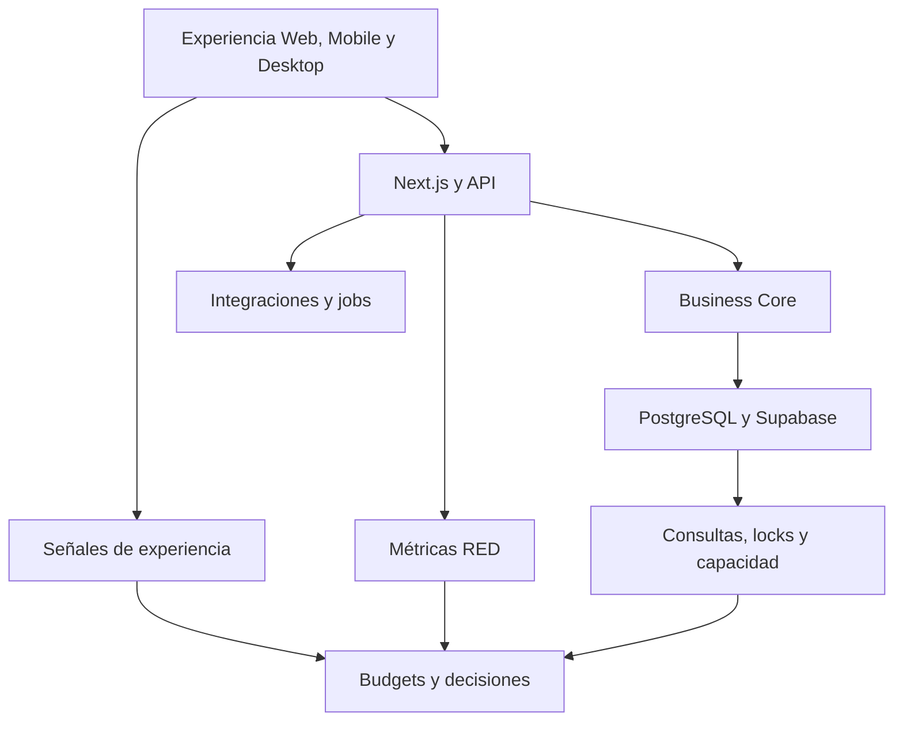

# Arquitectura de Rendimiento y Escalabilidad de CRUMAFOOD Platform

> **El rendimiento es la capacidad de completar trabajo útil dentro de límites conocidos; la escalabilidad es conservar esa capacidad mientras crece la demanda.**

## Estado del documento

| Campo | Valor |
|---|---|
| Estado | Propuesto para aprobación |
| Versión | 1.0 |
| Propietarios | Product Owner, responsable de arquitectura, responsable de datos y responsable de operación |
| Alcance | Experiencia, aplicación, datos, caché, capacidad, escalado, límites, pruebas, costos y evolución |
| Autoridad | Derivado de `system-overview.md`, `business-core.md`, `data-architecture.md`, `integration-architecture.md`, `deployment-architecture.md`, `frontend-architecture.md`, `mobile-architecture.md`, `desktop-architecture.md`, `observability-architecture.md`, `testing-strategy.md` y el CES |
| Revisión | Cuando cambie un flujo crítico, patrón de carga, proveedor, topología, objetivo de servicio, volumen o modelo de datos |

---

## 1. Propósito

Este documento define cómo CRUMAFOOD Platform medirá, protegerá y evolucionará su rendimiento.

Su propósito es asegurar que:

- los flujos críticos respondan dentro de objetivos conocidos;
- el crecimiento no degrade silenciosamente la operación;
- las consultas y payloads sean proporcionales al trabajo;
- la caché preserve autorización y consistencia;
- la capacidad se planifique con evidencia;
- los límites externos produzcan backpressure;
- Mobile y Desktop funcionen en condiciones representativas;
- y tecnologías de escalado se incorporen solo cuando resuelvan un cuello de botella medido.

---

## 2. Declaración arquitectónica

> **CRUMAFOOD optimizará primero el trabajo, las consultas y los contratos dentro del monolito modular; escalará infraestructura únicamente después de medir demanda, saturación y costo.**

La topología inicial seguirá siendo Next.js en Vercel conectado a Supabase/PostgreSQL.

Redis, colas, réplicas de lectura, Edge Functions, CDN avanzado y despliegue multirregión son opciones futuras, no componentes aprobados ni implementados.

Cada adopción requerirá evidencia, criterio de salida y ADR proporcional.

---

## 3. Alcance

Esta arquitectura cubre:

- experiencia Web;
- Admin y Storefront;
- Mobile;
- Desktop;
- Server Components;
- Route Handlers y Server Actions;
- Vercel Functions;
- API;
- PostgreSQL;
- Supabase;
- Storage y Realtime;
- integraciones;
- jobs y futuros workers;
- caché;
- CDN;
- concurrencia;
- capacidad;
- pruebas de carga;
- observabilidad;
- costos;
- y escalado evolutivo.

No define cifras finales de SLO sin línea base ni reemplaza reglas de consistencia del Business Core.

---

## 4. Principios rectores

1. medir antes de optimizar;
2. proteger trabajo útil, no métricas aisladas;
3. eliminar trabajo innecesario antes de añadir infraestructura;
4. optimizar por percentiles, no solo promedios;
5. paginar toda colección creciente;
6. seleccionar solo los datos requeridos;
7. preservar consistencia y autorización;
8. controlar cardinalidad y fan-out;
9. degradar de forma explícita;
10. aplicar límites y backpressure;
11. separar procesamiento interactivo y diferido;
12. probar con datos y concurrencia representativos;
13. vincular rendimiento con release;
14. considerar costo por operación;
15. escalar de manera reversible;
16. evitar soluciones distribuidas por anticipación.

---

## 5. Estado actual

El repositorio actual contiene:

- Next.js 15.5.19 y React 19.1.0;
- compresión habilitada;
- formatos AVIF y WebP configurados;
- Server Components y Server Actions;
- Supabase SSR;
- React Query y TanStack Table disponibles;
- Recharts y Framer Motion;
- revalidación de rutas después de mutaciones;
- un cron diario;
- y Vercel/Supabase como topología objetivo.

El levantamiento identifica:

- numerosas consultas `select('*')`;
- páginas que realizan varias consultas desde la renderización;
- colecciones sin paginación uniforme;
- invalidación amplia de varias rutas;
- Server Actions con límite de body de 10 MB;
- componentes cliente relativamente grandes en Mobile;
- iconos PWA actuales de un byte y no representativos;
- roadmaps que mencionan Redis, CDN, réplicas y multirregión sin criterios;
- ausencia de budgets verificables;
- ausencia de pruebas de rendimiento;
- y observabilidad todavía propuesta.

No existe evidencia suficiente para declarar cuellos de botella concretos ni necesidad actual de Redis, réplicas o microservicios.

---

## 6. Brechas inmediatas

Las brechas prioritarias son:

- falta de línea base;
- consultas con columnas innecesarias;
- listas crecientes sin contrato común de paginación;
- ausencia de medición por flujo;
- falta de análisis de consultas críticas;
- bundles y límites cliente sin presupuesto;
- invalidación no gobernada;
- y capacidad no documentada.

La primera etapa será obtener evidencia y corregir desperdicio evidente.

---

## 7. Rendimiento frente a escalabilidad

**Rendimiento** describe cuánto tarda y cuántos recursos consume una operación bajo una carga dada.

**Escalabilidad** describe cómo cambia ese comportamiento al crecer:

- usuarios;
- tenants;
- productos;
- lotes;
- movimientos;
- órdenes;
- integraciones;
- dispositivos;
- y datos históricos.

Un sistema rápido con pocos datos puede no escalar.

Un sistema horizontalmente escalable puede seguir ofreciendo una experiencia lenta.

---

## 8. Dimensiones de calidad

Se observarán:

- latencia;
- throughput;
- concurrencia;
- disponibilidad;
- saturación;
- frescura;
- tamaño;
- consumo de red;
- CPU;
- memoria;
- conexiones;
- y costo.

Toda optimización declarará qué dimensión mejora y qué trade-off introduce.

---

## 9. Vista de flujo

La optimización seguirá el recorrido del trabajo.

No se trasladará el problema a otra capa sin medir el resultado total.

---

## 10. Flujos críticos

Se priorizarán:

- login;
- carga de dashboard;
- consulta de catálogo;
- disponibilidad de inventario;
- recepción;
- reserva;
- picking;
- producción y consumo;
- confirmación de venta;
- pago;
- trazabilidad de lote;
- sincronización Mobile;
- impresión Desktop;
- webhook;
- y job.

Cada flujo tendrá inicio, final, criterio de éxito y distribución de latencia.

---

## 11. Escenarios de carga

Se definirán escenarios con:

- usuarios concurrentes;
- tenants;
- almacenes;
- productos;
- lotes;
- movimientos históricos;
- órdenes por periodo;
- dispositivos;
- integraciones;
- y picos.

Los valores se obtendrán de previsiones de Producto y medición real.

No se usará una cifra genérica para todos los módulos.

---

## 12. Performance budgets

Cada superficie podrá tener budgets para:

- latencia de flujo;
- respuesta de API;
- consulta;
- JavaScript;
- CSS;
- imágenes;
- payload;
- memoria;
- tiempo de inicio;
- y sincronización.

Los budgets iniciales se fijarán después de línea base y clasificación de flujo.

Un budget tendrá propietario y consecuencia cuando se exceda.

---

## 13. Percentiles

Se medirán p50, p90, p95 y p99 según volumen.

El promedio podrá acompañar, pero no ocultará la cola.

Para operaciones de bajo volumen se conservarán eventos y ventanas suficientes antes de inferir.

Los percentiles se segmentarán por:

- entorno;
- release;
- operación;
- producto;
- región;
- y tipo de cliente cuando sea útil.

---

## 14. SLI y SLO

Los SLI de rendimiento se alinearán con `observability-architecture.md`.

Podrán incluir:

- latencia de solicitud válida;
- tiempo de confirmación de orden;
- frescura de inventario;
- tiempo de sincronización;
- puntualidad de jobs;
- y propagación de eventos.

Los SLO no se definirán hasta medir capacidad y costo.

---

## 15. Línea base

La línea base registrará:

- dataset;
- entorno;
- versión;
- región;
- concurrencia;
- duración;
- percentiles;
- errores;
- saturación;
- y costo aproximado.

Se conservará junto con el cambio que la produjo.

Una medición local aislada no será baseline productiva.

---

## 16. Medición en Production

Production aportará Real User Monitoring y métricas de tráfico real.

Se aplicará:

- minimización;
- muestreo;
- seudonimización;
- correlación;
- y clasificación de datos.

No se ejecutarán pruebas destructivas ni cargas no autorizadas.

---

## 17. Rendimiento Web

Web observará:

- TTFB;
- LCP;
- INP;
- CLS;
- navegación;
- hidratación;
- JavaScript;
- recursos;
- y errores.

Admin y Storefront tendrán presupuestos separados.

La velocidad percibida se evaluará junto con la corrección del resultado.

---

## 18. Server Components

Se preferirán Server Components para:

- lecturas iniciales;
- reducción de JavaScript;
- acceso seguro a datos;
- y composición del servidor.

No se moverá interacción necesaria al servidor si aumenta viajes de red sin beneficio.

Cada frontera `use client` tendrá una razón.

---

## 19. Componentes cliente

Los componentes cliente:

- recibirán props serializables mínimas;
- dividirán tareas intensivas;
- evitarán renders globales;
- limitarán suscripciones;
- y no cargarán librerías pesadas sin uso inmediato.

Los componentes Mobile grandes se descompondrán por responsabilidad cuando la medición demuestre impacto o mantenibilidad insuficiente.

---

## 20. JavaScript

Se medirán:

- JavaScript inicial;
- chunks por ruta;
- dependencias duplicadas;
- código no utilizado;
- y costo de ejecución.

Recharts, Framer Motion y otras librerías se cargarán solo donde aporten valor.

La incorporación de una dependencia pesada requerirá comparación con alternativa.

---

## 21. Dynamic import

Se aplicará carga diferida a:

- gráficos;
- editores;
- vistas poco frecuentes;
- herramientas administrativas;
- y capacidades no críticas.

No se fragmentará cada componente pequeño.

El costo de una solicitud adicional se considerará junto con el ahorro inicial.

---

## 22. Imágenes

Las imágenes usarán:

- dimensiones;
- formato moderno;
- compresión;
- lazy loading;
- prioridad explícita;
- y origen aprobado.

Los assets PWA marcadores deberán sustituirse antes de medir instalación real.

No se servirá una imagen original grande cuando el contexto necesita miniatura.

---

## 23. Fuentes e iconos

Las fuentes:

- limitarán variantes;
- se precargarán solo cuando sean críticas;
- usarán fallback;
- y evitarán layout shift.

Lucide u otro sistema de iconos se importará de forma que permita tree shaking.

No se incorporarán packs completos innecesarios.

---

## 24. CSS y animación

El CSS evitará:

- selectores costosos innecesarios;
- duplicación;
- estilos no utilizados;
- y layout thrashing.

Las animaciones respetarán `prefers-reduced-motion`.

No bloquearán interacción ni convertirán el dashboard en una experiencia decorativa costosa.

---

## 25. Tablas y listas

Toda colección creciente tendrá:

- paginación;
- orden estable;
- filtros server-side;
- tamaño máximo;
- estados;
- y conteo solo cuando sea necesario.

La virtualización se adoptará cuando el número de filas renderizadas justifique su costo.

No sustituirá paginación de datos.

---

## 26. Búsqueda

La búsqueda definirá:

- campos;
- normalización;
- debounce;
- longitud mínima;
- paginación;
- índices;
- y cancelación.

No ejecutará una consulta por cada pulsación sin control.

La búsqueda full-text requerirá evidencia y diseño específico.

---

## 27. Formularios

Los formularios:

- validarán localmente lo inmediato;
- enviarán payloads mínimos;
- evitarán doble envío;
- mostrarán progreso;
- y conservarán respuesta accionable.

El límite actual de 10 MB para Server Actions no será tratado como tamaño normal.

Uploads grandes usarán un flujo dedicado y controlado.

---

## 28. React Query

React Query se usará cuando exista estado remoto interactivo en cliente.

Cada query definirá:

- key estable;
- scope de tenant;
- stale time;
- retry;
- cancelación;
- invalidación;
- y límite de memoria.

No duplicará lecturas ya resueltas adecuadamente por Server Components.

---

## 29. Estado cliente

Zustand y estado local se limitarán a estado de interfaz o coordinación legítima.

No almacenarán copias autoritativas grandes del negocio.

Las suscripciones serán selectivas.

Un store global no será caché general de todas las tablas.

---

## 30. Renderizado y streaming

Se considerarán:

- Suspense;
- streaming;
- loading boundaries;
- y renderizado progresivo.

Se priorizará contenido útil temprano.

No se ocultará una consulta lenta detrás de un skeleton permanente.

---

## 31. API

Los endpoints:

- devolverán campos necesarios;
- paginarán colecciones;
- limitarán tamaños;
- comprimirán cuando aplique;
- usarán códigos coherentes;
- y evitarán fan-out no acotado.

El contrato incluirá límites.

No se expondrá `select('*')` como contrato accidental.

---

## 32. Paginación

Cursor será preferible para colecciones grandes o mutables.

Offset podrá usarse en catálogos pequeños y estables.

Toda paginación declarará:

- orden único;
- tamaño por defecto;
- máximo;
- cursor opaco;
- y comportamiento ante cambios.

---

## 33. Payloads

Se medirán tamaño de request y response.

Se evitarán:

- objetos anidados sin límite;
- duplicación;
- strings derivables;
- datos binarios embebidos;
- y metadatos no utilizados.

La compresión no justificará respuestas innecesariamente grandes.

---

## 34. Round trips

Se reducirá el número de viajes mediante:

- composición server-side;
- consultas apropiadas;
- transacciones;
- batches;
- y contratos de caso de uso.

No se consolidarán operaciones independientes en un endpoint ambiguo solo para reducir llamadas.

La atomicidad seguirá definiendo el límite.

---

## 35. Timeouts

Cada límite remoto tendrá timeout explícito.

Los timeouts se definirán por:

- experiencia;
- dependencia;
- idempotencia;
- y capacidad de retry.

Una operación sin límite puede agotar funciones y conexiones.

El cliente recibirá un resultado controlado.

---

## 36. Retries

Los retries:

- se reservarán a fallos transitorios;
- usarán backoff y jitter;
- respetarán idempotencia;
- tendrán máximo;
- y serán observables.

No se reintentará validación, autorización ni conflicto permanente.

Los retries multiplican carga y deberán incluirse en capacidad.

---

## 37. Rate limiting

Se aplicarán límites por:

- identidad;
- tenant;
- IP cuando sea adecuado;
- operación;
- y proveedor.

La respuesta incluirá semántica estable.

Los límites protegerán recursos sin impedir operación normal.

La tecnología requerirá decisión de despliegue.

---

## 38. Backpressure

Cuando la demanda supere capacidad:

- se limitará admisión;
- se diferirá trabajo;
- se priorizarán flujos críticos;
- se rechazarán cargas no esenciales;
- y se comunicará recuperación.

Una cola ilimitada no es backpressure.

La degradación será medible.

---

## 39. Caché: principio

La caché es una copia derivada, no autoridad.

Antes de crearla se definirá:

- fuente;
- clave;
- alcance;
- TTL;
- invalidación;
- consistencia;
- tamaño;
- propietario;
- y comportamiento ante fallo.

No se usará caché para ocultar una consulta incorrecta.

---

## 40. Clasificación de caché

| Dato | Estrategia inicial |
|---|---|
| Asset versionado público | Caché larga e inmutable |
| Contenido público estable | Revalidación controlada |
| Catálogo autenticado | Scope, TTL e invalidación explícitos |
| Inventario disponible | Frescura estricta y lectura autoritativa |
| Permisos | No compartir entre identidades |
| Costos y finanzas | No usar caché compartida sin diseño |
| Sesión | Política del proveedor y seguridad |

La sensibilidad y volatilidad gobiernan la estrategia.

---

## 41. Claves de caché

Una clave incluirá cuando corresponda:

- entorno;
- versión de contrato;
- tenant;
- identidad o rol;
- recurso;
- filtros;
- locale;
- y versión del dato.

No se compartirán respuestas autenticadas mediante una clave incompleta.

Los identificadores sensibles no se expondrán en claves públicas.

---

## 42. Invalidación

Se preferirá invalidación explícita por:

- recurso;
- tag;
- evento;
- o versión.

La invalidación amplia de rutas se revisará conforme crezca el sistema.

Cada mutación declarará qué lecturas vuelve obsoletas.

No se prometerá coherencia inmediata con TTL largo.

---

## 43. Caché de Next.js

Cada ruta o lectura definirá de forma explícita:

- estática;
- dinámica;
- revalidada;
- no-store;
- o invalidada por tag.

La configuración deberá respetar autenticación y RLS.

No se confiará en defaults implícitos para datos sensibles.

---

## 44. CDN

El CDN se utilizará primero para:

- assets;
- imágenes públicas;
- documentos públicos versionados;
- y contenido Storefront seguro.

Admin, inventario, costos y permisos no se cachearán públicamente.

La CDN Optimization del roadmap requiere clasificación, headers y prueba.

---

## 45. Redis

Redis no forma parte de la topología actual.

Solo se evaluará ante necesidad medida de:

- caché compartida;
- rate limiting distribuido;
- coordinación;
- sesiones específicas;
- o colas compatibles.

La decisión incluirá disponibilidad, consistencia, invalidación, costo y operación.

---

## 46. PostgreSQL como prioridad

La primera optimización de datos será:

- seleccionar columnas;
- corregir N+1;
- paginar;
- añadir índices justificados;
- mejorar consultas;
- reducir round trips;
- y mantener estadísticas.

PostgreSQL seguirá siendo la autoridad.

No se duplicarán balances para ganar velocidad sin invariantes transaccionales.

---

## 47. Consultas

Cada consulta crítica tendrá:

- propósito;
- forma;
- cardinalidad esperada;
- filtros;
- orden;
- límite;
- índice;
- y medición.

`select('*')` se reemplazará gradualmente en superficies de negocio.

Los campos nuevos no deberán incrementar payloads accidentalmente.

---

## 48. N+1

Se detectarán patrones N+1 en:

- Server Components;
- mappers;
- detalles con líneas;
- dashboards;
- y resoluciones por fila.

Las soluciones podrán ser:

- join controlado;
- batch;
- consulta dedicada;
- o proyección.

No se crearán joins gigantes sin analizar multiplicación de filas.

---

## 49. Índices

Cada índice responderá a:

- consulta;
- restricción;
- orden;
- o aislamiento.

Se evaluará:

- selectividad;
- orden de columnas;
- tenant;
- filtros parciales;
- escritura;
- tamaño;
- y mantenimiento.

Los índices no usados se revisarán antes de conservarlos indefinidamente.

---

## 50. EXPLAIN

Las consultas críticas se analizarán con `EXPLAIN (ANALYZE, BUFFERS)` en entorno seguro y representativo.

Se observarán:

- scans;
- filas estimadas y reales;
- loops;
- sorts;
- memoria;
- buffers;
- y tiempo.

No se ejecutará `ANALYZE` destructivo o costoso en Production sin control.

---

## 51. RLS y rendimiento

RLS seguirá siendo obligatoria donde corresponda.

Las políticas:

- usarán predicados indexables;
- evitarán funciones costosas por fila;
- limitarán joins complejos;
- y se probarán con datos multi-tenant representativos.

No se desactivará RLS para mejorar una métrica.

---

## 52. Conexiones

Se observarán:

- conexiones activas;
- pool;
- espera;
- agotamiento;
- duración;
- y conexiones por función.

Los runtimes serverless usarán el mecanismo de pooling compatible con Supabase.

No se abrirá una conexión nueva por operación interna.

---

## 53. Transacciones y locks

Las transacciones:

- serán tan cortas como permita la integridad;
- mantendrán orden estable de locks;
- evitarán I/O externo;
- y tendrán timeout.

Se observarán deadlocks y esperas.

La reducción de duración no justificará dividir una operación atómica.

---

## 54. Funciones y RPC

Las funciones PostgreSQL/RPC se usarán para:

- atomicidad;
- reducción de round trips;
- y reglas cercanas a datos cuando corresponda.

Tendrán contrato, permisos, pruebas y observabilidad.

No se convertirán en una segunda capa de negocio sin propiedad.

---

## 55. Proyecciones

Dashboards y reportes podrán usar:

- vistas;
- vistas materializadas;
- tablas de proyección;
- o agregados.

Se definirá:

- autoridad;
- frescura;
- reconstrucción;
- invalidación;
- y consistencia.

Una proyección no autorizará una transacción.

---

## 56. Analítica

Las consultas analíticas pesadas no competirán indefinidamente con transacciones.

La separación se evaluará cuando exista evidencia de:

- scans grandes;
- saturación;
- locks;
- ventanas de reporte;
- o crecimiento histórico.

Una réplica de lectura no se adoptará antes de medir estos efectos.

---

## 57. Réplicas de lectura

Las réplicas son opción futura para lecturas tolerantes a retraso.

Antes de adoptarlas se definirá:

- lag aceptable;
- routing;
- fallback;
- consistencia read-your-writes;
- monitoreo;
- costo;
- y recuperación.

Inventario autoritativo y confirmaciones no leerán datos obsoletos sin política explícita.

---

## 58. Particionamiento

El particionamiento se evaluará solo cuando:

- el volumen lo requiera;
- exista clave natural;
- el pruning sea demostrable;
- y el costo operacional sea aceptable.

Movimientos y auditoría son candidatos futuros, no decisiones actuales.

Particionar temprano puede complicar constraints y consultas.

---

## 59. Archivado

El crecimiento histórico tendrá política de:

- retención;
- acceso;
- compresión;
- archivado;
- restauración;
- y cumplimiento.

Archivar no significará perder trazabilidad requerida.

Las consultas operativas evitarán recorrer historia innecesaria.

---

## 60. Supabase Storage

Storage se optimizará mediante:

- uploads directos autorizados;
- límites;
- tipos;
- compresión;
- transformaciones;
- URLs firmadas;
- CDN;
- y lifecycle.

La aplicación no transportará archivos grandes a través de Server Actions sin necesidad.

---

## 61. Realtime

Realtime se utilizará cuando reduzca polling y mejore un flujo.

Se controlarán:

- canales;
- suscriptores;
- filtros;
- payload;
- reconexiones;
- y fan-out.

No sustituirá consistencia ni se habilitará para todas las tablas.

---

## 62. Polling

El polling tendrá:

- intervalo;
- backoff;
- pausa en background;
- cancelación;
- y límite.

Se evitará sincronizar todos los clientes al mismo instante mediante jitter.

La frecuencia se basará en frescura requerida.

---

## 63. Jobs

Los jobs:

- trabajarán por batches;
- tendrán checkpoint;
- evitarán solapamiento;
- respetarán timeout;
- y expondrán progreso.

El cron dispara; no garantiza capacidad durable.

Procesos largos migrarán a worker cuando la evidencia lo requiera.

---

## 64. Colas

Una cola se adoptará ante:

- trabajo diferible;
- picos;
- reintentos durables;
- aislamiento;
- o backpressure.

La decisión definirá semántica de entrega, idempotencia, orden, dead letters, capacidad y operación.

Queue System del roadmap no se considera aprobado por aparecer en una lista.

---

## 65. Workers

Un worker tendrá:

- responsabilidad;
- concurrencia;
- límites;
- autoscaling;
- health;
- métricas;
- shutdown;
- y costo.

No se extraerá una función del monolito solo porque sea lenta antes de optimizar su trabajo.

---

## 66. Integraciones

Se observarán:

- latencia;
- timeout;
- cuota;
- rate limit;
- payload;
- retries;
- y circuit breaker.

Las llamadas independientes podrán paralelizarse con límites.

No se mantendrá una transacción abierta mientras se espera un proveedor.

---

## 67. Webhooks

Los webhooks responderán dentro de la ventana del proveedor.

Cuando el procesamiento sea largo:

- verificarán;
- persistirán de forma idempotente;
- responderán;
- y diferirán trabajo durable.

La recepción no esperará procesos secundarios no esenciales.

---

## 68. Mobile

Mobile optimizará:

- tiempo hasta tarea;
- payload;
- round trips;
- escaneo;
- sincronización;
- batería;
- cámara;
- y datos.

Se agruparán comandos cuando preserve semántica.

No se asumirá Wi-Fi rápido o constante.

---

## 69. Mobile offline

La operación offline definirá:

- dataset mínimo;
- índices locales;
- tamaño;
- compresión;
- cola;
- batch;
- conflictos;
- y limpieza.

Una caché offline ilimitada degrada inicio, almacenamiento y sincronización.

La estrategia requiere ADR y piloto.

---

## 70. Desktop

Desktop observará:

- arranque;
- memoria;
- CPU;
- bridge;
- commands;
- hardware;
- archivos;
- sincronización;
- y updater.

El trabajo nativo pesado no bloqueará la interfaz.

Los buffers de logs y datos locales serán acotados.

---

## 71. Hardware

Impresión, scanner y báscula tendrán:

- timeout;
- cancelación;
- cola acotada;
- estado;
- y recuperación.

La velocidad se medirá desde acción hasta resultado físico.

Un command rápido no demuestra que la etiqueta se imprimió.

---

## 72. Multi-tenancy

El modelo multi-tenant deberá controlar:

- índices por scope;
- cuotas;
- cardinalidad;
- caché;
- rate limiting;
- jobs;
- y observabilidad.

Se evitará que un tenant produzca noisy neighbor.

La unidad de aislamiento definitiva requiere ADR.

---

## 73. Cuotas

Se podrán definir cuotas para:

- requests;
- uploads;
- exports;
- jobs;
- integraciones;
- dispositivos;
- y almacenamiento.

Las cuotas serán visibles y acordes al plan de producto.

No se aplicarán límites ocultos que generen pérdida de trabajo.

---

## 74. Escalado vertical

Antes de distribuir se evaluará:

- optimización;
- índices;
- memoria;
- CPU;
- duración;
- y tamaño de instancia.

El escalado vertical puede ser la solución más simple y reversible en etapas iniciales.

Tendrá límite y costo conocidos.

---

## 75. Escalado horizontal

Las unidades stateless podrán escalar horizontalmente si:

- no dependen de memoria local;
- coordinan idempotencia;
- comparten estado autorizado;
- y manejan concurrencia.

El número de instancias aumenta presión sobre PostgreSQL y terceros.

Autoscaling no elimina el cuello de botella aguas abajo.

---

## 76. Serverless

Vercel Functions requieren observar:

- cold start;
- duración;
- memoria;
- concurrencia;
- región;
- payload;
- y conexiones.

El runtime se elegirá por compatibilidad y necesidad.

No se ejecutará un worker permanente dentro de una función.

---

## 77. Edge

Edge Functions solo se evaluarán cuando:

- la latencia geográfica sea material;
- las dependencias sean compatibles;
- y el trabajo sea apropiado.

Mover cómputo al edge mientras la base permanece lejana puede aumentar complejidad sin reducir latencia total.

La decisión requerirá medición.

---

## 78. Región

Aplicación y datos se ubicarán buscando:

- proximidad a usuarios;
- proximidad entre servicios;
- residencia;
- disponibilidad;
- y costo.

La región actual se documentará y medirá.

Cambiarla requerirá plan de datos y recuperación.

---

## 79. Multirregión

Multi-region Deployment es una opción futura de alta complejidad.

Requiere resolver:

- autoridad de escritura;
- consistencia;
- replicación;
- failover;
- datos;
- DNS;
- observabilidad;
- costo;
- y pruebas.

No se adoptará para corregir una consulta lenta.

---

## 80. Degradación controlada

Ante saturación se priorizarán:

- operaciones transaccionales;
- autenticación;
- inventario;
- producción;
- picking;
- y seguridad.

Podrán degradarse:

- dashboards;
- recomendaciones;
- exports;
- imágenes no críticas;
- y refresh frecuente.

La degradación será explícita y observable.

---

## 81. Circuit breakers

Se considerarán circuit breakers para dependencias inestables.

Definirán:

- umbral;
- ventana;
- open;
- half-open;
- fallback;
- y observabilidad.

No se aplicarán a consultas locales como sustituto de corregir capacidad.

---

## 82. Protección contra avalancha

Se evitarán:

- cache stampede;
- retries sincronizados;
- jobs simultáneos;
- refresh masivo;
- y reconexiones al mismo instante.

Se usarán locks acotados, jitter, stale-while-revalidate o single-flight cuando aplique.

El mecanismo no bloqueará indefinidamente.

---

## 83. Pruebas de rendimiento

La estrategia seguirá `testing-strategy.md`.

Se ejecutarán:

- baseline;
- load;
- stress;
- spike;
- soak;
- y capacity

según riesgo.

Cada prueba tendrá hipótesis, entorno, dataset, carga y criterio.

---

## 84. Dataset de prueba

Los datasets representarán:

- tenants;
- catálogos;
- lotes;
- movimientos;
- órdenes;
- líneas;
- historial;
- y distribución realista.

Serán sintéticos y reproducibles.

Una base vacía no revela planes ni cardinalidad reales.

---

## 85. Concurrencia de negocio

Se probarán simultáneamente:

- reservas;
- consumo;
- confirmaciones;
- pagos;
- webhooks;
- sync;
- y jobs.

El criterio incluirá integridad y no solo throughput.

Una solución rápida que duplica movimientos es inválida.

---

## 86. Regresión

Los Pull Requests ejecutarán checks ligeros de budgets cuando sean estables.

Suites pesadas podrán ejecutarse:

- periódicamente;
- antes de releases de riesgo;
- y tras cambios de datos.

Una regresión significativa requerirá explicación o corrección.

---

## 87. Profiling

Se perfilará cuando la señal ubique consumo en:

- servidor;
- cliente;
- SQL;
- memoria;
- red;
- o hardware.

Los perfiles usarán datos seguros y ventanas controladas.

No se optimizará una función por intuición sin medir su contribución.

---

## 88. Observabilidad

Se correlacionarán:

- release;
- request;
- trace;
- operación;
- query;
- dependencia;
- tenant seudonimizado;
- latencia;
- error;
- y saturación.

Los dashboards mostrarán volumen, errores, duración y recursos.

---

## 89. Consultas lentas

La captura de consultas lentas tendrá:

- umbral por entorno;
- fingerprint;
- duración;
- filas;
- plan cuando sea seguro;
- y correlación.

No registrará parámetros sensibles.

Los fingerprints permitirán priorizar por impacto total.

---

## 90. Capacidad

La planificación considerará:

- demanda normal;
- pico;
- crecimiento;
- margen;
- límites;
- dependencia;
- y recuperación.

Se documentará capacidad sostenible, no solo máximo de una prueba corta.

La revisión será periódica.

---

## 91. Límites de proveedores

Se mantendrá un registro de:

- Vercel Functions;
- ancho de banda;
- builds;
- Supabase;
- conexiones;
- Storage;
- Realtime;
- Auth;
- correo;
- pagos;
- y observabilidad.

Cada límite tendrá uso actual, umbral de alerta y plan.

---

## 92. Costos

Se calculará costo aproximado por:

- request;
- función;
- consulta;
- GB almacenado;
- egress;
- imagen;
- evento Realtime;
- job;
- y señal de observabilidad.

Optimizar costo no degradará compromisos críticos sin decisión explícita.

La eficiencia se evaluará junto con valor.

---

## 93. Alertas

Se alertará por:

- SLO o burn rate;
- latencia elevada;
- error;
- conexiones;
- locks;
- saturación;
- cola;
- job atrasado;
- cache miss anómalo;
- y límite próximo.

Los umbrales se calibrarán con baseline.

Cada alerta tendrá runbook.

---

## 94. Runbooks

Los runbooks de rendimiento incluirán:

- síntoma;
- impacto;
- dashboards;
- consultas seguras;
- releases;
- dependencias;
- mitigación;
- degradación;
- rollback;
- y verificación.

No recomendarán escalar indiscriminadamente como único paso.

---

## 95. Cambios y releases

Cada release de riesgo comparará:

- before;
- after;
- percentiles;
- errores;
- recursos;
- y costo.

Los marcadores de despliegue permitirán atribución.

Feature flags podrán limitar exposición.

---

## 96. Definition of Done

Un cambio con impacto de rendimiento estará terminado cuando:

- define escenario;
- mide baseline;
- respeta budget;
- limita datos;
- pagina;
- evita N+1;
- mantiene autorización;
- prueba concurrencia cuando aplica;
- actualiza observabilidad;
- documenta trade-offs;
- y tiene plan de rollback.

No todos los cambios requieren load test.

Todos deben evitar regresiones obvias.

---

## 97. Gobierno de optimizaciones

Una optimización deberá registrar:

- problema;
- evidencia;
- hipótesis;
- alternativa;
- cambio;
- resultado;
- trade-off;
- y seguimiento.

Los cambios de topología requerirán ADR.

Las microoptimizaciones locales no deberán deteriorar legibilidad sin beneficio material.

---

## 98. Prioridades

### P0 — Medir y eliminar desperdicio

- instrumentar Web Vitals y RED;
- identificar release y operación;
- crear baseline de flujos;
- inventariar consultas;
- reemplazar `select('*')` en rutas críticas;
- paginar listas crecientes;
- limitar payloads;
- revisar Server Action de 10 MB;
- medir bundles;
- y documentar límites.

### P1 — Proteger crecimiento

- budgets;
- índices justificados;
- EXPLAIN de consultas críticas;
- pruebas de carga;
- caché explícita;
- invalidación por recurso;
- dashboards;
- alertas;
- jobs por batch;
- backpressure;
- y capacity review.

### P2 — Escalar con evidencia

- colas y workers;
- Redis;
- proyecciones;
- réplica de lectura;
- archivado o particionamiento;
- Edge;
- y multirregión

solo cuando un cuello de botella medido lo justifique.

---

## 99. Secuencia de evolución

1. medir experiencia y servidor;
2. definir flujos y datasets;
3. reducir payloads y consultas;
4. añadir índices;
5. gobernar caché;
6. controlar concurrencia;
7. separar trabajo diferible;
8. revisar capacidad;
9. escalar recursos;
10. distribuir componentes solo si es necesario.

Cada etapa deberá demostrar mejora.

---

## 100. Antipatrones

Se evitará:

- optimizar sin medir;
- usar promedios únicamente;
- aplicar Redis por moda;
- añadir índices a toda columna;
- usar `select('*')`;
- devolver listas ilimitadas;
- cachear permisos sin scope;
- desactivar RLS;
- reintentar sin límite;
- usar polling agresivo;
- abrir transacciones durante I/O externo;
- adoptar microservicios para rendimiento;
- confundir autoscaling con capacidad infinita;
- y usar multirregión para ocultar SQL lento.

---

## 101. Riesgos y controles

| Riesgo | Control |
|---|---|
| Optimización prematura | Baseline e hipótesis |
| Caché incorrecta | Clasificación, scope e invalidación |
| Fuga multi-tenant | Claves completas y RLS |
| Base saturada | Consultas, índices, pool y capacidad |
| Retry storm | Backoff, jitter y límites |
| Noisy neighbor | Cuotas y rate limiting |
| Regresión de cliente | Budgets y RUM |
| Escalado costoso | Costo por operación y ADR |
| Datos obsoletos | Política de frescura |
| Complejidad distribuida | Evolución por evidencia |

---

## 102. Criterios de conformidad

Una capacidad será conforme cuando:

- tiene flujo y budget;
- mide percentiles;
- limita volumen;
- pagina colecciones;
- selecciona campos;
- evita fan-out no acotado;
- mantiene consistencia;
- protege tenants;
- observa saturación;
- prueba carga proporcional;
- documenta capacidad;
- y escala mediante decisión registrada.

La conformidad se demuestra con código, métricas, pruebas y análisis.

---

## 103. Decisiones pendientes

Requieren ADR o spike:

- budgets iniciales;
- estrategia de caché Next.js;
- rate limiting distribuido;
- Redis;
- proveedor de colas;
- runtime de workers;
- proyecciones;
- réplica de lectura;
- particionamiento;
- región;
- Edge Functions;
- CDN avanzado;
- multirregión;
- y herramienta de performance testing.

Cada decisión incluirá disparador, costo, complejidad, salida y evidencia.

---

## 104. Resultado esperado

Al aplicar esta arquitectura, CRUMAFOOD podrá:

- ofrecer flujos predecibles;
- detectar regresiones;
- crecer en datos y usuarios;
- proteger PostgreSQL;
- usar caché con seguridad;
- controlar picos;
- planificar capacidad;
- optimizar costos;
- y adoptar infraestructura adicional solo cuando aporte valor medido.

---

## 105. Declaración final

> **CRUMAFOOD escalará mediante conocimiento, no mediante acumulación de tecnología. Primero comprenderá el trabajo, luego eliminará desperdicio y finalmente ampliará capacidad en el punto exacto donde la evidencia lo exija.**
