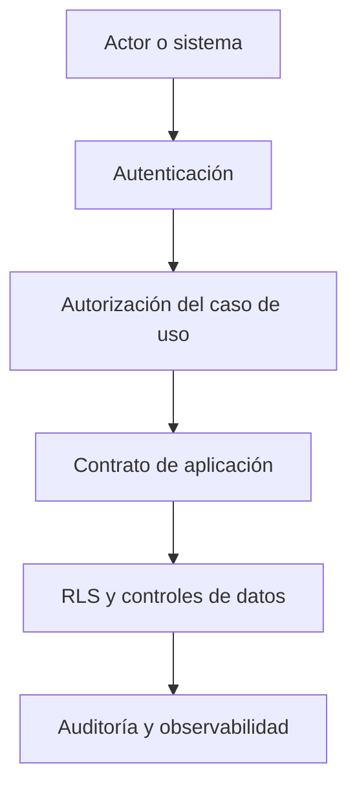

# Arquitectura de Seguridad de CRUMAFOOD Platform

> **La confianza no se agrega al final. Se diseña, se verifica y se opera.**

## Estado del documento

| Campo | Valor |
|---|---|
| Estado | Aprobado |
| Versión | 1.0 |
| Propietarios | Product Owner, responsable de arquitectura y responsable de seguridad |
| Aprobado por | Product Owner de CRUMAFOOD Platform |
| Fecha de aprobación | 2026-07-23 |
| Estado de implementación | En transición; existen remediaciones pendientes identificadas en las secciones 48 y 49 |
| Base de evidencia | Repositorio y configuración revisados en el commit abc1234 el 2026-07-23 |
| Alcance | Identidad, acceso, aplicación, datos, integraciones, secretos, operación y respuesta |
| Autoridad | Derivado de `system-overview.md`, `business-core.md`, `data-architecture.md`, la Constitución y los Principios del CES |
| Revisión | Ante cambios de identidad, autorización, exposición, datos sensibles, proveedores o amenazas materiales |

> La aprobación de este documento establece la política y dirección arquitectónica de seguridad. No constituye por sí sola una certificación de que la implementación actual cumpla todos los controles definidos.
---

## 1. Propósito

Este documento define cómo CRUMAFOOD Platform protegerá:

- personas;
- identidades;
- datos;
- inventario;
- producción;
- compras;
- ventas;
- costos;
- integraciones;
- infraestructura;
- y continuidad operativa.

Su propósito es establecer controles coherentes para prevenir, detectar, contener, responder y recuperarse de acciones accidentales o maliciosas.

La seguridad se aplicará según riesgo y no dependerá de que un usuario desconozca una ruta, una llamada o una estructura interna.

---

## 2. Declaración arquitectónica

> **Todo acceso será explícito, mínimo, verificable y limitado por identidad, acción, recurso, alcance y contexto.**

CRUMAFOOD aplicará defensa en profundidad:

1. la interfaz evita ofrecer acciones no permitidas;
2. la entrada autentica al actor;
3. el caso de uso autoriza la intención;
4. PostgreSQL y RLS protegen filas y alcance;
5. las operaciones privilegiadas se aíslan;
6. la auditoría conserva evidencia;
7. y la observabilidad detecta comportamiento anómalo.

Ninguna capa aislada sustituye a las demás.

---

## 3. Alcance

Esta arquitectura cubre:

- autenticación;
- sesiones;
- autorización;
- roles, permisos y alcances;
- RLS;
- Server Components y Server Actions;
- APIs, webhooks y jobs;
- portales web;
- operación móvil;
- cliente Desktop futuro;
- secretos;
- configuración;
- cifrado;
- validación;
- encabezados de seguridad;
- archivos;
- dependencias;
- auditoría;
- monitoreo;
- respuesta a incidentes;
- y recuperación.

No sustituye:

- políticas laborales;
- asesoría legal;
- continuidad de negocio completa;
- análisis de riesgos regulatorios;
- ni procedimientos particulares de proveedores.

---

## 4. Objetivos de seguridad

CRUMAFOOD protegerá:

- **confidencialidad:** solo personas y servicios autorizados acceden a información;
- **integridad:** los datos y procesos no cambian fuera de reglas autorizadas;
- **disponibilidad:** las capacidades críticas permanecen utilizables o recuperables;
- **autenticidad:** actores y sistemas pueden demostrar identidad;
- **trazabilidad:** las acciones críticas dejan evidencia;
- **privacidad:** los datos personales se minimizan y protegen;
- **resiliencia:** una falla se contiene y permite recuperación.

La integridad y trazabilidad tienen prioridad especial porque la plataforma representa operación física y compromisos comerciales.

---

## 5. Principios rectores

1. denegar por defecto;
2. mínimo privilegio;
3. defensa en profundidad;
4. separación de responsabilidades;
5. autorización en servidor;
6. aislamiento por alcance;
7. secretos fuera del código y del cliente;
8. datos mínimos;
9. fallos seguros;
10. evidencia sin exposición innecesaria;
11. controles proporcionales al riesgo;
12. seguridad verificable y automatizable.

La conveniencia de desarrollo no justificará un acceso permanente más amplio de lo necesario.

---

## 6. Estado actual

El repositorio ya contiene bases útiles:

- autenticación con Supabase Auth;
- inicio de sesión mediante contraseña;
- validación de usuario con `auth.getUser()` en puntos específicos;
- middleware para `/dashboard`, `/users` y `/products`;
- restricciones de rol en páginas de usuarios y productos;
- consulta de rol mediante `user_roles`;
- encabezados `X-Frame-Options`, `X-Content-Type-Options` y `Referrer-Policy`;
- separación entre cliente Supabase de servidor y navegador;
- `CRON_SECRET` para el job en producción;
- y estructura objetivo para Identity & Access.

El levantamiento también identifica brechas:

- el middleware solo cubre tres grupos de rutas administrativas;
- rutas administrativas y móviles adicionales no muestran una protección central uniforme;
- varios Server Actions no verifican autorización de caso de uso de forma explícita;
- guards, políticas y matrices de permisos son archivos marcadores vacíos;
- las entidades y casos de uso de Identity todavía son esqueletos;
- las políticas RLS desplegadas no están versionadas en el repositorio;
- `/api/webhooks` no verifica firma, registra el cuerpo y confirma cualquier solicitud;
- `/api/jobs/run` muta estado mediante `GET` y solo exige secreto cuando `VERCEL_ENV` es `production`;
- no existe evidencia de rate limiting central;
- no se observa una Content Security Policy;
- y existe configuración de Server Actions con cuerpo máximo de 10 MB sin política documentada por caso de uso.

Estas brechas describen el estado actual. No implican que toda ruta sea explotable, pero sí que los controles no son todavía demostrables de extremo a extremo.

### Evidencia de verificación

La auditoría del 2026-08-03 confirmó y amplió las brechas de autorización relacionadas con middleware, Server Actions, RPC, grants, RLS, atomicidad y contrato de roles:

- [Auditoría de autorización de funciones y mutaciones de base de datos](../engineering/security-audits/2026-08-03-database-function-authorization.md)

La auditoría es evidencia de implementación y no modifica las decisiones normativas ni el estado aprobado de esta arquitectura.

---

## 7. Estado objetivo

El estado objetivo tendrá:

- autenticación centralizada;
- sesión verificada en servidor;
- autorización por permisos y alcance;
- guardas reutilizables;
- matriz de permisos versionada;
- RLS coherente con el modelo organizacional;
- endpoints autenticados por intención;
- webhooks con firma y protección contra replay;
- secretos gestionados y rotables;
- encabezados completos;
- validación consistente;
- rate limiting basado en riesgo;
- auditoría de acciones sensibles;
- pruebas negativas automatizadas;
- inventario de superficies expuestas;
- y respuesta a incidentes ensayada.



---

## 8. Activos protegidos

Los activos prioritarios son:

- cuentas y sesiones;
- roles y permisos;
- secretos y claves;
- datos de clientes y proveedores;
- recetas y costos;
- movimientos y saldos;
- lotes y trazabilidad;
- órdenes y aprobaciones;
- pagos y cuentas por cobrar;
- archivos y documentos;
- bitácoras de auditoría;
- migraciones y configuración;
- canal de despliegue;
- y respaldos.

Cada activo tendrá propietario, clasificación y controles mínimos.

---

## 9. Actores

La arquitectura distinguirá:

- usuario operativo;
- supervisor;
- administrador;
- propietario de organización;
- soporte autorizado;
- servicio interno;
- job programado;
- integración externa;
- cliente anónimo del storefront;
- y actor privilegiado de emergencia.

No se utilizará un rol genérico de administrador para resolver toda necesidad de acceso.

Los servicios tendrán identidad propia. No actuarán como usuarios humanos compartidos.

---

## 10. Zonas de confianza

Se consideran límites de confianza:

- navegador;
- dispositivo móvil;
- cliente Desktop futuro;
- runtime de Next.js;
- Supabase Auth;
- PostgreSQL;
- almacenamiento de archivos;
- proveedores externos;
- CI/CD;
- y consola administrativa del proveedor.

Todo dato que cruza un límite se tratará como no confiable hasta verificarlo.

La red interna o una función server-side no conceden autorización implícita.

---

## 11. Modelo de amenazas

Se evaluarán al menos:

- suplantación de identidad;
- secuestro de sesión;
- escalamiento de privilegios;
- acceso entre organizaciones;
- manipulación de inventario o costos;
- doble ejecución de operaciones;
- inyección;
- XSS;
- CSRF;
- SSRF;
- carga de archivos maliciosos;
- filtración por logs;
- abuso de APIs;
- falsificación o replay de webhooks;
- exposición de secretos;
- dependencia comprometida;
- eliminación o cifrado destructivo;
- y uso interno indebido.

Los cambios de alto riesgo incluirán una revisión de amenazas específica.

---

## 12. Identidad

Supabase Auth es el proveedor de identidad actual.

El dominio no dependerá de detalles innecesarios del proveedor.

La aplicación utilizará un `Actor` explícito:

```ts
type Actor = {
  userId: string;
  organizationId?: string;
  roles: string[];
  permissions: string[];
  warehouseScopes: string[];
  sessionId?: string;
};
```

La identidad autenticada y el perfil operativo son conceptos relacionados, pero distintos.

Un usuario válido en Auth no obtiene automáticamente acceso a una organización, almacén o función.

---

## 13. Autenticación

La autenticación deberá:

- utilizar canales cifrados;
- verificar el usuario en servidor;
- aplicar controles contra enumeración;
- limitar intentos abusivos;
- registrar eventos relevantes;
- y fallar sin revelar detalles sensibles.

MFA deberá ser obligatorio para:

- propietarios;
- administradores;
- soporte privilegiado;
- y otras identidades con acceso elevado.

Las operaciones de especial riesgo podrán exigir autenticación reforzada o verificación adicional, aunque la sesión ya esté autenticada.

El ADR correspondiente definirá factores permitidos, enrolamiento, recuperación, autenticación reforzada, despliegue gradual y excepciones temporales. Su extensión a perfiles no privilegiados se decidirá según riesgo y experiencia operativa.

---

## 14. Credenciales y recuperación

Las contraseñas serán administradas por el proveedor de identidad, no por tablas de negocio.

La recuperación de cuenta deberá:

- verificar el canal;
- invalidar o revisar sesiones activas;
- limitar frecuencia;
- registrar el evento;
- y no revelar si una cuenta existe más de lo necesario.

Los códigos de recuperación, tokens y enlaces:

- tendrán vencimiento;
- serán de un solo uso;
- no se registrarán en texto claro;
- y se invalidarán después de utilizarse.

---

## 15. Sesiones

Las sesiones deberán:

- utilizar cookies seguras cuando el transporte sea web;
- renovar tokens mediante el flujo aprobado;
- verificar usuario con `getUser()` en límites sensibles;
- tener expiración;
- permitir revocación;
- y responder a cambios de privilegios.

Las cookies de sesión utilizarán, cuando corresponda:

- `HttpOnly`;
- `Secure`;
- `SameSite`;
- alcance de ruta mínimo;
- y dominio controlado.

Cerrar sesión deberá revocar o invalidar el estado necesario, no solo ocultar la interfaz.

---

## 16. Ciclo de vida de cuentas

Toda cuenta tendrá estados explícitos:

- invitada;
- activa;
- suspendida;
- bloqueada;
- desactivada;
- o eliminada conforme a política.

Se controlarán:

- alta;
- invitación;
- asignación de alcance;
- cambio de rol;
- suspensión;
- salida de personal;
- recuperación;
- y reactivación.

La baja revocará sesiones, accesos, tokens y asignaciones en un plazo proporcional al riesgo.

---

## 17. Autorización

La autorización se expresará como:

```text
actor + acción + recurso + alcance + contexto
```

Ejemplo:

```ts
authorization.require({
  actor,
  permission: 'inventory.adjustment.create',
  scope: {
    organizationId,
    warehouseId,
  },
});
```

Una operación se denegará cuando:

- falte identidad;
- falte permiso;
- el alcance no coincida;
- el recurso esté fuera del contexto;
- la transición no sea válida;
- o una condición de riesgo lo impida.

---

## 18. Roles, permisos y políticas

CRUMAFOOD utilizará RBAC como base y atributos de contexto cuando el alcance lo requiera.

Los permisos seguirán la convención:

```text
<recurso>.<acción>
```

Ejemplos:

- `catalog.product.read`;
- `catalog.product.manage`;
- `inventory.movement.create`;
- `inventory.adjustment.approve`;
- `production.order.start`;
- `quality.lot.release`;
- `sales.order.confirm`;
- `identity.role.manage`.

Los roles agrupan permisos. Las reglas del caso de uso no se codificarán como comparaciones dispersas de texto como `role === 'admin'`.

Las excepciones temporales tendrán vencimiento y auditoría.

---

## 19. Alcance organizacional

El alcance podrá incluir:

- organización;
- sucursal;
- almacén;
- ubicación;
- módulo;
- documento;
- o propiedad del recurso.

El modelo definitivo de multi-tenancy requiere ADR.

Mientras tanto, ningún control deberá asumir que todos los usuarios autenticados pertenecen al mismo alcance.

Las referencias, consultas, permisos y RLS deberán impedir cruces accidentales.

---

## 20. Protección de rutas

El middleware mejora navegación y renovación de sesión, pero no será la única barrera.

El estado objetivo tendrá:

- matcher coherente por superficies;
- layouts protegidos para grupos completos;
- guardas en casos de uso;
- autorización en cada mutación;
- y RLS como protección de datos.

Las superficies se clasificarán:

| Superficie | Acceso esperado |
|---|---|
| Storefront público | Anónimo con operaciones limitadas |
| Auth | Anónimo o sesión parcial |
| Admin | Usuario interno autenticado y autorizado |
| Mobile Operations | Usuario operativo con alcance |
| API pública | Contrato y protección específicos |
| API interna | Identidad de servicio |
| Health | Información mínima no sensible |

No se mantendrá una lista manual incompleta de tres rutas como control definitivo.

---

## 21. Server Components y lecturas

Un Server Component no se considera seguro solo por ejecutarse en servidor.

Toda lectura sensible deberá:

- resolver actor;
- aplicar alcance;
- utilizar RLS o repositorio autorizado;
- seleccionar solo columnas necesarias;
- y evitar serializar secretos al cliente.

Los datos cargados en servidor pueden terminar en HTML, payloads o caché y deberán clasificarse antes de enviarse.

---

## 22. Server Actions y mutaciones

Cada Server Action será un adaptador no confiable.

Deberá:

1. resolver sesión;
2. validar entrada;
3. construir comando;
4. autorizar caso de uso;
5. ejecutar de forma transaccional;
6. traducir errores;
7. auditar;
8. y devolver solo datos necesarios.

No se confiará en campos ocultos, IDs enviados por el cliente ni rutas visitadas previamente.

El límite de cuerpo se definirá por caso de uso. El valor global de 10 MB no autoriza cargas de ese tamaño en todas las acciones.

---

## 23. APIs

Cada endpoint declarará:

- consumidor;
- método;
- autenticación;
- autorización;
- esquema de entrada;
- límites;
- idempotencia;
- errores;
- auditoría;
- y versión.

Los métodos respetarán semántica HTTP. Una operación que cambia estado no utilizará `GET`.

Las respuestas no incluirán:

- stack traces;
- secretos;
- consultas;
- detalles internos del proveedor;
- ni datos fuera del alcance.

---

## 24. Webhooks

Todo webhook deberá:

- verificar firma sobre el cuerpo original;
- validar emisor;
- comprobar timestamp o nonce;
- limitar ventana de replay;
- registrar identificador del evento;
- ser idempotente;
- validar esquema;
- responder rápidamente;
- y procesar efectos mediante un flujo controlado.

No se registrará el payload completo sin clasificación y redacción.

El endpoint actual de `/api/webhooks` se considera marcador y no deberá conectarse a un proveedor productivo hasta implementar estos controles.

---

## 25. Jobs y automatizaciones

Los jobs tendrán identidad de servicio y permiso mínimo.

`/api/jobs/run` deberá evolucionar para:

- utilizar un método de mutación;
- exigir autenticación en todo entorno compartido;
- comparar secretos de forma segura;
- limitar origen o proveedor cuando sea posible;
- impedir ejecuciones duplicadas;
- registrar correlación;
- y no revelar errores internos.

Un entorno no productivo expuesto también requiere protección.

---

## 26. Row Level Security

RLS será obligatoria en relaciones expuestas mediante Supabase.

Esto incluye toda tabla ubicada en un esquema expuesto mediante la Data API.

Las vistas expuestas deberán respetar las políticas de las relaciones subyacentes mediante una estrategia explícita, como `security_invoker` cuando sea compatible, o permanecer en un esquema no expuesto.

Las funciones `SECURITY DEFINER` deberán:

- tener una justificación documentada;
- fijar un `search_path` seguro;
- aplicar permisos de ejecución mínimos;
- evitar exposición accidental mediante la API;
- y contar con pruebas específicas de autorización.
Las políticas deberán:

- denegar por defecto;
- usar identidad verificable;
- comprobar alcance;
- separar `SELECT`, `INSERT`, `UPDATE` y `DELETE`;
- aplicar `WITH CHECK` en escrituras;
- evitar expresiones globales permisivas;
- y tener pruebas de acceso y denegación.

Una política no sustituye:

- validación;
- autorización de acción;
- transición de estado;
- ni auditoría.

Las políticas se versionarán junto con el esquema.

---

## 27. Operaciones privilegiadas

Las credenciales secretas, service role o cualquier rol con capacidad de omitir RLS se consideran acceso administrativo total a los datos bajo su alcance técnico.

No deberán reutilizar el cliente SSR de un usuario ni aceptar que una sesión de usuario sustituya silenciosamente su contexto de autorización.

La service role y otras credenciales privilegiadas:

- existirán solo en runtime seguro;
- no se importarán desde módulos cliente;
- no se incluirán en respuestas;
- tendrán uso encapsulado;
- se rotarán;
- y dejarán auditoría.

El cliente privilegiado tendrá un nombre explícito, por ejemplo `admin.ts`, para evitar uso accidental.

Cada caso de uso privilegiado justificará por qué RLS ordinaria no es suficiente.

---

## 28. Secretos

Los secretos incluyen:

- service role;
- secretos de cron;
- firmas de webhook;
- credenciales de pagos;
- claves de correo;
- tokens de integración;
- y claves de cifrado.

Reglas:

- nunca en Git;
- nunca en variables `NEXT_PUBLIC_*` salvo valores realmente públicos;
- nunca en logs;
- nunca en fixtures;
- acceso por entorno y servicio;
- rotación documentada;
- revocación ante sospecha;
- y propietario definido.

`.env.example` solo contendrá nombres y valores no sensibles.

---

## 29. Validación de entrada

Toda entrada externa se validará en el límite.

Se utilizarán esquemas explícitos para:

- tipos;
- longitud;
- formato;
- rango;
- listas permitidas;
- relaciones;
- y tamaño.

La validación de formato no sustituye reglas de negocio.

Los IDs, cantidades, dinero, archivos, URLs y campos de texto recibirán controles específicos.

No se construirá una consulta dinámica a partir de entrada sin parámetros y lista permitida.

---

## 30. Salida, XSS y contenido activo

React escapará texto por defecto, pero todo contenido HTML requerirá revisión explícita.

Se evitará:

- `dangerouslySetInnerHTML`;
- HTML de proveedores sin sanitizar;
- URLs no verificadas;
- scripts inline innecesarios;
- y datos sensibles embebidos en el documento.

Si se permite contenido enriquecido, se definirá un formato y sanitizador con lista permitida.

---

## 31. CSRF y origen

Las operaciones autenticadas mediante cookies deberán considerar CSRF.

Se aplicarán, según superficie:

- atributos `SameSite`;
- validación de origen;
- tokens cuando sean necesarios;
- métodos no seguros solo para mutaciones;
- y prohibición de mutaciones mediante navegación `GET`.

Una Server Action sigue requiriendo autorización y validación aunque el framework aplique protecciones de transporte.

---

## 32. Encabezados y navegador

Se conservarán los controles actuales:

- `X-Frame-Options: DENY`;
- `X-Content-Type-Options: nosniff`;
- `Referrer-Policy: strict-origin-when-cross-origin`.

Se evaluarán y probarán:

- Content Security Policy;
- Strict Transport Security;
- Permissions Policy;
- política de recursos externos;
- y aislamiento adicional donde sea compatible.

CSP se introducirá en modo de reporte y se endurecerá con evidencia para evitar romper flujos legítimos.

---

## 33. CORS

CORS no es autenticación.

Las APIs que requieran acceso cross-origin tendrán:

- orígenes explícitos;
- métodos mínimos;
- encabezados mínimos;
- credenciales solo cuando sea imprescindible;
- y caché de preflight controlada.

No se utilizará comodín con credenciales.

Las APIs de uso exclusivo same-origin no habilitarán CORS innecesariamente.

---

## 34. Archivos y almacenamiento

Toda carga de archivo deberá controlar:

- identidad y permiso;
- tamaño;
- tipo declarado y tipo real;
- extensión;
- nombre generado;
- ruta y alcance;
- contenido activo;
- malware cuando el riesgo lo requiera;
- retención;
- y acceso posterior.

Los buckets serán privados por defecto.

Las URLs firmadas tendrán alcance y expiración mínimos.

Un archivo subido no se ejecutará ni servirá con un tipo controlado por el usuario.

---

## 35. Rate limiting y abuso

Se limitarán por riesgo:

- login;
- recuperación;
- invitaciones;
- webhooks inválidos;
- endpoints públicos;
- búsquedas costosas;
- exportaciones;
- archivos;
- jobs;
- y operaciones de alto impacto.

La clave podrá combinar identidad, IP, organización, endpoint y dispositivo.

El límite tendrá respuesta consistente y observabilidad.

No se bloqueará una operación crítica legítima sin estrategia operativa.

---

## 36. Datos, cifrado y privacidad

La arquitectura de datos define clasificación, minimización y retención.

Seguridad exigirá:

- cifrado en tránsito;
- cifrado en reposo provisto y verificado;
- acceso por necesidad;
- selección mínima de columnas;
- redacción en logs;
- y separación de datos sensibles.

Los campos extremadamente sensibles requerirán una decisión específica de cifrado a nivel de aplicación o servicio especializado.

No se inventará criptografía propia.

---

## 37. Logs y auditoría

Los logs técnicos ayudarán a operar. La auditoría demostrará acciones de negocio.

Los logs no contendrán:

- contraseñas;
- tokens;
- cookies;
- secretos;
- cuerpos completos no clasificados;
- datos de pago;
- ni información personal innecesaria.

Los eventos de seguridad incluirán:

- actor o identidad de servicio;
- acción;
- recurso;
- alcance;
- resultado;
- timestamp;
- correlación;
- y señal de riesgo.

El acceso a auditoría será restringido y auditado.

---

## 38. Manejo de errores

Un error externo será mínimo y estable.

La aplicación distinguirá:

- no autenticado;
- no autorizado;
- no encontrado dentro del alcance;
- entrada inválida;
- conflicto;
- límite excedido;
- y falla interna.

No se revelará si un recurso existe fuera del alcance del actor.

El detalle técnico quedará en observabilidad segura con correlación.

---

## 39. Dependencias y cadena de suministro

Las dependencias se gestionarán con:

- archivo de bloqueo;
- versiones revisadas;
- actualizaciones pequeñas;
- análisis de vulnerabilidades;
- revisión de paquetes nuevos;
- eliminación de dependencias sin uso;
- y procedencia confiable.

CI no ejecutará secretos en código de contribuciones no confiables.

Los workflows tendrán permisos mínimos y acciones fijadas de forma controlada.

---

## 40. Build, despliegue y entornos

Los entornos estarán separados por:

- datos;
- secretos;
- proyectos o recursos;
- permisos;
- y canales de despliegue.

Producción no utilizará credenciales de desarrollo.

Los despliegues deberán:

- provenir de código revisado;
- ejecutar verificaciones;
- registrar versión;
- permitir reversión compatible;
- y evitar mostrar variables sensibles.

Las previews no tendrán acceso automático a datos productivos.

---

## 41. Mobile y operación offline

Los dispositivos móviles se consideran entornos no confiables.

La operación móvil deberá:

- autenticar usuario y dispositivo cuando corresponda;
- aplicar alcance de almacén;
- minimizar datos locales;
- proteger tokens;
- registrar comandos con idempotencia;
- manejar pérdida o robo;
- y sincronizar sin confiar en timestamps o IDs del cliente.

El soporte offline requerirá un ADR de amenazas, cifrado local, conflictos, revocación y borrado remoto cuando sea viable.

---

## 42. Cliente Desktop

El cliente Desktop futuro no será considerado confiable por instalarse en equipo empresarial.

Deberá:

- limitar capacidades nativas;
- validar comandos del frontend;
- proteger tokens;
- restringir navegación y recursos;
- firmar actualizaciones;
- verificar origen de binarios;
- y aislar integraciones con impresoras, archivos o hardware.

La adopción de Tauri y su topología requerirán ADR y revisión de amenazas.

---

## 43. Integraciones externas

Cada integración tendrá:

- propietario;
- finalidad;
- datos compartidos;
- credenciales propias;
- permisos mínimos;
- timeout;
- reintentos;
- idempotencia;
- verificación de origen;
- auditoría;
- y procedimiento de revocación.

Los errores de un proveedor no deberán abrir acceso ni dejar operaciones ambiguas.

Los datos recibidos seguirán siendo entrada no confiable.

---

## 44. Respaldo y recuperación segura

Los respaldos:

- estarán cifrados;
- tendrán acceso restringido;
- conservarán retención definida;
- no se descargarán a equipos personales sin control;
- y se probarán mediante restauración.

Una restauración deberá verificar:

- integridad;
- RLS;
- permisos;
- secretos externos;
- funciones;
- y auditoría.

Recuperar datos sin recuperar controles de acceso no se considera recuperación válida.

---

## 45. Respuesta a incidentes

CRUMAFOOD mantendrá un proceso para:

1. detectar;
2. clasificar;
3. contener;
4. preservar evidencia;
5. erradicar;
6. recuperar;
7. comunicar;
8. y aprender.

Los runbooks prioritarios cubrirán:

- secreto expuesto;
- cuenta administrativa comprometida;
- acceso entre organizaciones;
- webhook abusado;
- modificación indebida de inventario;
- pérdida de datos;
- dependencia comprometida;
- y acceso anómalo a información personal.

Toda acción de emergencia será auditada y revisada posteriormente.

---

## 46. Pruebas de seguridad

La verificación incluirá:

- pruebas de autenticación;
- pruebas de sesión;
- matriz de permisos;
- acceso cruzado entre alcances;
- RLS positiva y negativa;
- IDOR;
- validación;
- inyección;
- XSS;
- CSRF;
- replay e idempotencia;
- webhooks;
- rate limiting;
- secretos;
- y errores.

Los flujos críticos tendrán pruebas de denegación, no solo de éxito.

Una prueba ejecutada con service role no demuestra que RLS funcione.

---

## 47. Observabilidad y métricas

Se observarán:

- logins fallidos;
- recuperaciones;
- MFA;
- cambios de rol;
- denegaciones;
- fallas RLS;
- firmas inválidas;
- replays;
- rate limits;
- uso privilegiado;
- errores por endpoint;
- y cambios de configuración.

Las alertas tendrán umbral, propietario, severidad y acción esperada.

No se alertará por cada evento normal hasta hacer inutilizable la señal.

---

## 48. Prioridades de remediación

### P0 — Antes de exposición o integración productiva

- proteger uniformemente Admin y Mobile;
- autorizar todas las mutaciones críticas;
- versionar y probar RLS;
- verificar firmas de webhooks;
- retirar logs de payloads;
- proteger jobs en todos los entornos compartidos;
- y confirmar que ningún secreto llegue al cliente.

### P1 — Fundación de seguridad

- implementar guards y servicio de autorización;
- crear matriz de permisos;
- consolidar middleware y sesión;
- completar Identity & Access;
- añadir rate limiting;
- introducir CSP;
- y formalizar auditoría.

### P2 — Resiliencia y madurez

- MFA por riesgo;
- automatización de pruebas;
- inventario continuo de superficies;
- gestión de vulnerabilidades;
- runbooks;
- simulacros;
- y métricas de seguridad.

---

## 49. Estrategia de transición

### Etapa 1 — Contención

- inventariar rutas y mutaciones;
- cerrar endpoints marcadores;
- ampliar protección de superficies;
- y verificar secretos.

### Etapa 2 — Autorización

- definir permisos;
- implementar `Actor`;
- crear guards;
- migrar comparaciones dispersas de roles;
- y añadir alcance.

### Etapa 3 — Datos

- incorporar RLS a migraciones;
- probar aislamiento;
- encapsular service role;
- y auditar operaciones privilegiadas.

### Etapa 4 — Exposición

- asegurar APIs, jobs, webhooks y archivos;
- añadir límites;
- mejorar encabezados;
- y revisar errores.

### Etapa 5 — Operación

- monitorear;
- responder;
- ensayar recuperación;
- y revisar riesgos periódicamente.

Cada etapa entregará reducción comprobable de riesgo.

---

## 50. Antipatrones prohibidos

Se prohíbe:

- usar ocultamiento de UI como autorización;
- asumir que middleware protege casos de uso;
- confiar en IDs enviados por el cliente;
- utilizar service role desde el navegador;
- permitir RLS global por comodidad;
- dejar guards vacíos como si fueran controles;
- comparar roles de texto en toda la aplicación;
- registrar tokens, cookies o payloads sensibles;
- aceptar webhooks sin firma;
- mutar mediante `GET`;
- exponer errores internos;
- habilitar CORS global sin necesidad;
- almacenar secretos en Git;
- crear cuentas compartidas;
- y desactivar un control sin excepción registrada.

---

## 51. Definition of Done de seguridad

Un cambio está completo cuando:

- identifica activos y amenazas;
- define actor y alcance;
- autentica cuando corresponde;
- autoriza en servidor;
- valida entrada;
- minimiza salida;
- considera RLS;
- protege secretos;
- evita efectos duplicados;
- audita acciones críticas;
- maneja errores sin filtrar detalles;
- tiene pruebas de éxito y denegación;
- actualiza documentación;
- y no introduce riesgo crítico conocido sin aceptación formal.

---

## 52. Excepciones

Una excepción deberá registrar:

- control omitido;
- motivo;
- riesgo;
- alcance;
- compensación;
- responsable;
- fecha de expiración;
- y plan de cierre.

No se aceptarán excepciones indefinidas por desconocimiento o conveniencia.

Los compromisos fundamentales de integridad, aislamiento y protección de secretos no podrán ignorarse silenciosamente.

---

## 53. Gobierno

La seguridad se revisará en:

- diseño;
- RFC;
- ADR;
- Pull Request;
- migración;
- liberación;
- incidente;
- y revisión periódica.

Los cambios de alto riesgo requerirán revisión por una persona distinta del autor cuando exista un revisor calificado disponible.

Si no existe revisor interno disponible, el cambio deberá:

- obtener revisión externa;
- posponerse;
- o registrar una excepción formal con riesgo, controles compensatorios, responsable y fecha de vencimiento.

La ausencia de un segundo colaborador no se interpretará como revisión independiente.

---

## 54. Decisiones que requieren ADR

Se formalizarán, al menos:

1. modelo de organización y multi-tenancy;
2. modelo canónico de roles, permisos y alcances;
3. mecanismo, enrolamiento, recuperación, autenticación reforzada y despliegue de MFA;
4. estrategia de sesiones y revocación;
5. política de service role;
6. estándar de webhooks;
7. rate limiting;
8. CSP;
9. almacenamiento y escaneo de archivos;
10. auditoría;
11. retención de logs;
12. secretos y rotación;
13. seguridad offline;
14. seguridad del cliente Desktop;
15. objetivos de respuesta y recuperación.

---

## 55. Criterios de conformidad

Una implementación cumple esta arquitectura si:

- deniega por defecto;
- aplica mínimo privilegio;
- autoriza cada intención sensible;
- limita alcance;
- protege datos en aplicación y PostgreSQL;
- mantiene secretos fuera del cliente;
- verifica entradas e integraciones;
- registra evidencia segura;
- prueba denegaciones;
- y puede contener y recuperar fallas previsibles.

La conformidad se demuestra con código, configuración, migraciones, pruebas y evidencia operativa.

---

## 56. Evolución

Este documento evolucionará cuando:

- se adopte multi-tenancy;
- cambie el proveedor de identidad;
- se habilite MFA;
- se conecten pagos o marketplaces;
- se active operación offline;
- se distribuya el cliente Desktop;
- se almacenen nuevos datos sensibles;
- o cambie el perfil de amenazas.

Las revisiones conservarán decisiones anteriores mediante ADR y control de versiones.

---

## 57. Declaración final

> **CRUMAFOOD Platform concederá acceso por responsabilidad demostrable, no por conveniencia técnica.**

La seguridad será parte de cada identidad, caso de uso, relación, integración, despliegue y procedimiento operativo.

Por ello:

- se verificará al actor;
- se limitará su alcance;
- se protegerá la intención;
- se preservará evidencia;
- se reducirá exposición;
- y se preparará recuperación.

Este tipo es conceptual.

Los nombres `organizationId`, `warehouseScopes` y la cardinalidad de los alcances no establecen todavía el modelo físico definitivo de tenancy. Deberán alinearse con `multi-tenancy-architecture.md` y el ADR correspondiente.

El contrato definitivo podrá representar múltiples organizaciones, sucursales, almacenes u otros alcances sin modificar el principio de autorización expresado en este documento.
La plataforma será confiable no porque asuma que nada fallará, sino porque sus controles harán que los fallos sean más difíciles, visibles, contenidos y recuperables.
