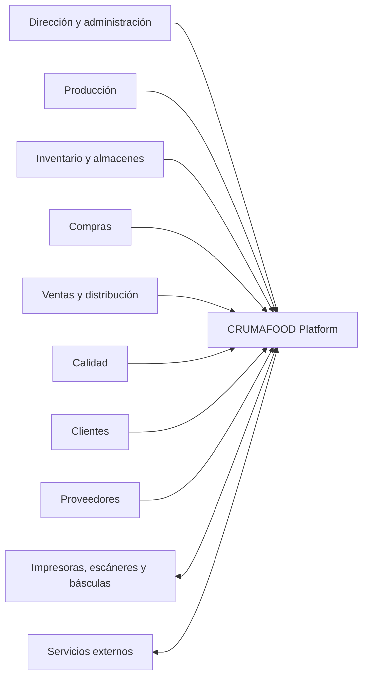
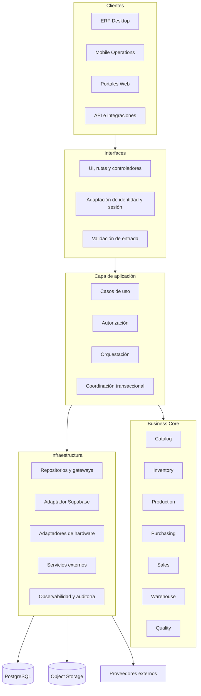
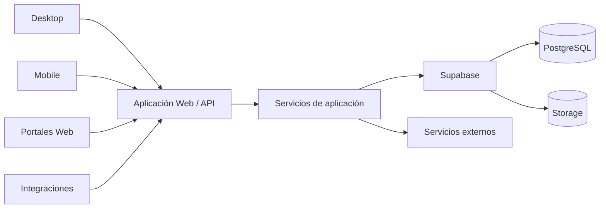
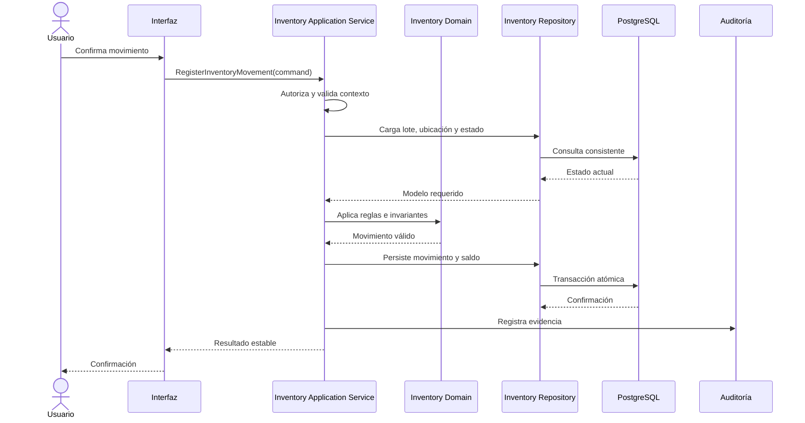

# Arquitectura General de CRUMAFOOD Platform

> **Ingeniería con propósito. Software al servicio de las personas.**

## Estado del documento

| Campo | Valor |
|---|---|
| Estado | Propuesto para aprobación |
| Versión | 1.0 |
| Propietarios | Product Owner y responsable de arquitectura de CRUMAFOOD Platform |
| Alcance | Visión técnica de alto nivel, límites, componentes y dirección evolutiva |
| Autoridad | Derivado de la Visión, la Constitución y los Principios del CES |
| Revisión | Cuando cambien de forma material la topología, los límites o la estrategia de plataforma |

---

## 1. Propósito

Este documento describe la arquitectura general de **CRUMAFOOD Platform**.

Su función es ofrecer un mapa común para comprender:

- qué sistema estamos construyendo;
- cuáles son sus productos y usuarios;
- dónde viven las reglas de negocio;
- cómo se relacionan las capas y módulos;
- qué responsabilidades pertenecen al backend;
- cómo se protegen los datos;
- cómo evolucionará el repositorio actual;
- y qué decisiones todavía requieren un ADR o RFC.

No sustituye la documentación detallada de cada módulo. Define el marco dentro del cual esos módulos deberán diseñarse.

---

## 2. Declaración arquitectónica

> **CRUMAFOOD es una plataforma empresarial modular y multiplataforma, organizada alrededor de un núcleo de negocio independiente de sus interfaces, con datos protegidos por una fuente de autoridad central y capacidades expuestas mediante contratos explícitos.**

Desktop, Web, Mobile e integraciones externas deberán utilizar las mismas reglas esenciales sin duplicarlas ni reinterpretarlas.

---

## 3. Estado actual y estado objetivo

### 3.1 Estado actual

El producto actual está construido principalmente como una aplicación administrativa con:

- Next.js;
- React;
- TypeScript;
- Supabase;
- PostgreSQL;
- autenticación apoyada en Supabase;
- páginas y formularios administrativos;
- y módulos de negocio en proceso de separación.

El repositorio actual es el punto de partida. No será descartado ni reescrito únicamente para alcanzar una estructura ideal.

### 3.2 Estado objetivo

CRUMAFOOD evolucionará hacia una plataforma con:

- un Business Core modular;
- servicios de aplicación independientes de la interfaz;
- adaptadores de infraestructura;
- una aplicación ERP de escritorio;
- aplicaciones web especializadas;
- operaciones móviles;
- una API para integraciones;
- y documentación arquitectónica versionada junto al código.

### 3.3 Estrategia de transición

La evolución será incremental:

1. identificar límites y responsabilidades actuales;
2. extraer reglas de negocio de páginas, componentes y acciones;
3. introducir servicios de aplicación;
4. encapsular Supabase detrás de adaptadores;
5. estabilizar contratos entre módulos;
6. crear paquetes compartidos solo cuando exista reutilización real;
7. incorporar el cliente Desktop sin duplicar el núcleo;
8. y migrar hacia un monorepositorio cuando el número de aplicaciones lo justifique.

No se realizará una gran reescritura.

---

## 4. Contexto del sistema



La plataforma transforma interacciones operativas en cambios de estado consistentes, trazables y autorizados.

---

## 5. Productos de la plataforma

### 5.1 ERP Desktop

Será la experiencia principal para trabajo administrativo y operativo intensivo:

- administración;
- producción;
- inventario;
- compras;
- ventas;
- almacenes;
- calidad;
- costos;
- reportes;
- configuración;
- e integración controlada con hardware local.

El Desktop será un consumidor de capacidades de la plataforma. No será propietario de las reglas de negocio.

### 5.2 Mobile Operations

Experiencia optimizada para tareas rápidas en planta y almacén:

- recepción;
- picking;
- conteos;
- escaneo;
- movimientos;
- ejecución de producción;
- y captura de evidencia.

### 5.3 Portales Web

Experiencias especializadas para clientes, proveedores y otros participantes externos.

Cada portal expondrá únicamente las capacidades y datos necesarios para su actor.

### 5.4 API e integraciones

Superficie controlada para:

- integraciones con terceros;
- automatizaciones;
- intercambio de datos;
- dispositivos;
- y futuros servicios internos.

La API será un contrato del sistema, no un acceso directo a tablas.

---

## 6. Vista lógica



Dirección principal de dependencias:

```text
Interfaces ──► Aplicación ──► Dominio
                       │
                       └────► Puertos de infraestructura
                                      ▲
                                      │
                           Adaptadores concretos
```

El dominio no deberá importar React, Next.js, Supabase, Tauri, almacenamiento local ni proveedores externos.

---

## 7. Capas y responsabilidades

### 7.1 Dominio

Representa conceptos, reglas e invariantes del negocio.

Puede contener:

- entidades;
- objetos de valor;
- políticas;
- cálculos;
- especificaciones;
- transiciones de estado;
- errores de dominio;
- y contratos necesarios para expresar el negocio.

No contiene consultas SQL, HTTP, componentes de interfaz, variables de entorno ni dependencias de framework.

### 7.2 Aplicación

Coordina casos de uso.

Es responsable de:

- recibir comandos o consultas normalizados;
- comprobar permisos;
- cargar estado mediante puertos;
- invocar reglas del dominio;
- coordinar transacciones;
- persistir resultados;
- producir respuestas estables;
- y registrar eventos o evidencia operativa.

La capa de aplicación describe **qué hace el sistema**, no cómo se muestra ni cómo se persiste físicamente.

### 7.3 Interfaces

Transforma interacciones externas en solicitudes para la aplicación.

Incluye:

- páginas;
- componentes;
- formularios;
- Server Actions;
- route handlers;
- controladores;
- y mapeo de errores hacia mensajes de usuario.

La interfaz puede validar formato para mejorar la experiencia, pero no será la única protección de invariantes.

### 7.4 Infraestructura

Implementa capacidades técnicas:

- acceso a Supabase y PostgreSQL;
- repositorios;
- archivos;
- correo y notificaciones;
- integraciones;
- impresión;
- escaneo;
- observabilidad;
- reloj;
- identificadores;
- y configuración.

---

## 8. Arquitectura modular

La plataforma se organiza por capacidades de negocio.

| Módulo | Responsabilidad principal |
|---|---|
| Identity & Access | Identidad, roles, permisos y contexto organizacional |
| Catalog | Productos, categorías, familias, sabores y presentaciones |
| Inventory | Existencias, lotes, movimientos, reservas y valuación |
| Warehouse | Ubicaciones, recepción, picking, transferencias y conteos |
| Production | Recetas, órdenes, consumos, rendimientos, mermas y terminados |
| Purchasing | Proveedores, necesidades, órdenes y recepción de compra |
| Sales | Clientes, cotizaciones, pedidos, precios y compromisos |
| Quality | Especificaciones, liberaciones, bloqueos e incidencias |
| Costing | Costos estándar, reales y variaciones |
| Distribution | Preparación, despacho, rutas y entregas |
| Reporting | Lecturas analíticas y proyecciones autorizadas |
| Administration | Configuración y catálogos transversales controlados |

Cada módulo declarará:

- datos que posee;
- invariantes que protege;
- operaciones que ofrece;
- eventos que produce;
- eventos que consume;
- y dependencias permitidas.

Un módulo no escribirá directamente datos propiedad de otro salvo mediante un contrato aprobado.

---

## 9. Datos y fuente de verdad

PostgreSQL, actualmente operado mediante Supabase, será la fuente de autoridad para el estado transaccional compartido.

La base de datos protegerá invariantes estructurales mediante:

- claves primarias y foráneas;
- `NOT NULL`;
- `UNIQUE`;
- `CHECK`;
- políticas de acceso;
- transacciones;
- y funciones controladas cuando una operación atómica lo requiera.

### 9.1 Estado derivado

Los datos derivados deberán:

- calcularse desde fuentes autorizadas;
- o materializarse con una estrategia explícita de actualización y reconstrucción.

No se duplicará información sin definir propiedad, sincronización y recuperación.

### 9.2 Inventario

El inventario se modelará como movimientos trazables, no únicamente como un número editable.

Cada movimiento conservará, según corresponda:

- causa;
- cantidad;
- unidad;
- lote;
- ubicación;
- documento de origen;
- actor;
- fecha efectiva;
- fecha de registro;
- y operación relacionada.

Los saldos serán una consecuencia controlada de esos movimientos.

### 9.3 Tiempo, dinero y cantidades

Los instantes se almacenarán de forma inequívoca y se presentarán en el contexto horario correspondiente.

Las fechas de negocio sin hora se modelarán como fechas.

Dinero y cantidades utilizarán precisión, unidad, moneda y reglas de redondeo explícitas.

---

## 10. Identidad, autorización y seguridad

### 10.1 Identidad

Supabase Auth es el proveedor actual de identidad.

Los conceptos del proveedor no deberán propagarse innecesariamente por el dominio.

### 10.2 Autorización

La autorización se aplicará en varios límites cuando el riesgo lo requiera:

1. la interfaz limita acciones visibles;
2. la aplicación verifica el permiso del caso de uso;
3. PostgreSQL y RLS protegen los datos;
4. las operaciones privilegiadas utilizan servicios controlados.

Ocultar un botón nunca será autorización suficiente.

### 10.3 Row Level Security

Las tablas expuestas mediante Supabase deberán operar con RLS habilitado y políticas explícitas.

Las políticas se basarán en atributos confiables y verificables.

### 10.4 Secretos

Las claves privilegiadas:

- no llegarán al navegador;
- no se almacenarán en el repositorio;
- tendrán alcance mínimo;
- y se rotarán ante sospecha de exposición.

### 10.5 Auditoría

Las operaciones críticas permitirán conocer quién actuó, qué cambió, cuándo ocurrió, desde qué contexto y cuál fue su origen.

---

## 11. Next.js en la arquitectura

Next.js es actualmente la superficie principal de la aplicación administrativa.

Reglas:

- los Server Components podrán leer datos para construir vistas;
- las mutaciones pasarán por casos de uso o servicios de aplicación;
- los Client Components se reservarán para interacción y estado local;
- Server Actions y route handlers serán adaptadores de entrada;
- el SDK de Supabase no será la API informal de todo el sistema;
- y las reglas de negocio no vivirán en `page.tsx`, componentes o formularios.

La ubicación en `src/app` define navegación y composición, no propiedad del negocio.

---

## 12. Cliente Desktop

El ERP Desktop utilizará una carcasa nativa para ofrecer instalación, integración local y una experiencia enfocada en trabajo intensivo.

**Tauri 2 es la tecnología objetivo actual**, pero su adopción definitiva y topología deberán registrarse mediante ADR.

Las capacidades nativas se expondrán mediante una frontera controlada:

```text
Aplicación
   │
Hardware Port
   │
Tauri Command / Plugin
   │
Impresora, escáner, archivo o dispositivo
```

Los componentes no invocarán directamente capacidades privilegiadas del sistema operativo.

### 12.1 Estrategias posibles

La arquitectura Desktop deberá elegir explícitamente entre:

- consumir una aplicación web desplegada desde la carcasa;
- construir una interfaz compatible con ejecución estática;
- o crear una aplicación React dedicada que reutilice paquetes compartidos.

La decisión dependerá de autenticación, actualizaciones, offline, seguridad y experiencia operativa.

---

## 13. Mobile y operación offline

Mobile Operations será un cliente especializado, no una réplica completa del ERP.

La primera versión podrá requerir conexión permanente.

El soporte offline deberá definir mediante RFC y ADR:

- datos locales;
- duración de desconexión;
- cola de comandos;
- idempotencia;
- sincronización;
- conflictos;
- revocación de acceso;
- cifrado local;
- y recuperación ante sincronizaciones parciales.

---

## 14. Integraciones y eventos

### 14.1 Integraciones síncronas

Se utilizarán cuando se requiera respuesta inmediata y el acoplamiento temporal sea aceptable.

Incluirán autenticación, autorización, validación, límites de tiempo, errores explícitos e idempotencia para operaciones sensibles.

### 14.2 Eventos

Los eventos representan hechos ocurridos, por ejemplo:

- `InventoryMovementRecorded`;
- `PurchaseOrderApproved`;
- `ProductionOrderCompleted`;
- `LotReleased`;
- `SalesOrderConfirmed`.

Un evento representa un hecho estable, no una instrucción ambigua.

### 14.3 Entrega confiable

Cuando un evento deba ser consistente con una transacción, se considerará transactional outbox.

No se incorporará mensajería externa hasta que exista una necesidad demostrable.

---

## 15. Concurrencia y consistencia

Las operaciones que dependan de un estado previo deberán contemplar concurrencia.

Ejemplos:

- consumir inventario;
- reservar existencias;
- completar una orden;
- recibir contra una compra;
- asignar folios;
- cambiar estados sujetos a transición.

Las estrategias podrán incluir:

- transacciones;
- restricciones;
- bloqueos apropiados;
- actualización condicional;
- control de versión;
- o funciones atómicas en PostgreSQL.

Las escrituras relacionadas no deberán ejecutarse como llamadas independientes si una falla intermedia puede dejar un estado inválido.

---

## 16. Manejo de errores

Categorías mínimas:

- validación;
- regla de negocio;
- recurso no encontrado;
- conflicto de concurrencia;
- operación no autorizada;
- dependencia no disponible;
- fallo inesperado.

El dominio expresará errores sin referencias a HTTP, Supabase o mensajes visuales.

La interfaz decidirá cómo presentarlos sin exponer secretos ni detalles internos.

---

## 17. Observabilidad y operación

### 17.1 Logs

Los logs serán estructurados e incluirán, cuando corresponda:

- identificador de correlación;
- actor;
- organización;
- caso de uso;
- entidad afectada;
- resultado;
- duración;
- y error clasificado.

### 17.2 Métricas

Se incorporarán gradualmente:

- disponibilidad;
- tasa de errores;
- latencia;
- fallos por caso de uso;
- trabajos pendientes;
- sincronizaciones fallidas;
- y señales críticas de negocio.

### 17.3 Auditoría frente a observabilidad

La auditoría explica una acción de negocio.

La observabilidad explica el comportamiento técnico.

Ambas se complementan, pero no se sustituyen.

---

## 18. Despliegue y topología

La topología inicial es una aplicación Next.js desplegada en infraestructura web y conectada a Supabase.

La dirección objetivo es:



No se dividirá la plataforma en microservicios por anticipación.

Un módulo podrá convertirse en servicio independiente únicamente ante razones verificables como escalado diferente, aislamiento de fallos, requisitos regulatorios, despliegue independiente o límites organizacionales reales.

---

## 19. Estructura objetivo del repositorio

```text
crumafood-platform/
├── apps/
│   ├── admin-web/
│   ├── desktop/
│   ├── mobile/
│   ├── customer-portal/
│   └── supplier-portal/
├── packages/
│   ├── business-core/
│   ├── application/
│   ├── ui/
│   ├── auth/
│   ├── shared/
│   └── config/
├── modules/
│   ├── catalog/
│   ├── inventory/
│   ├── production/
│   ├── purchasing/
│   ├── sales/
│   ├── warehouse/
│   └── quality/
├── infrastructure/
│   ├── supabase/
│   ├── hardware/
│   └── integrations/
├── docs/
│   ├── engineering/
│   ├── architecture/
│   ├── adr/
│   ├── rfc/
│   ├── guides/
│   └── runbooks/
└── tooling/
```

Esta estructura es una dirección, no una orden de migración inmediata.

Un paquete se extraerá únicamente cuando tenga responsabilidad clara, consumidores reales, contrato estable y beneficios superiores al costo de separación.

---

## 20. Dependencias permitidas

| Origen | Puede depender de |
|---|---|
| Dominio | Dominio y utilidades puras mínimas |
| Aplicación | Dominio y puertos |
| Interfaces | Aplicación, tipos de presentación y adaptadores de entrada |
| Infraestructura | Puertos, SDK, base de datos y proveedores |
| Apps | Módulos, servicios de aplicación, UI y composición |
| Paquetes compartidos | Solo dependencias declaradas por su responsabilidad |

Dependencias prohibidas:

- dominio hacia Next.js;
- dominio hacia Supabase;
- dominio hacia Tauri;
- aplicación hacia componentes React;
- un módulo escribiendo datos privados de otro;
- componentes usando credenciales privilegiadas;
- y paquetes `shared` sin propiedad definida.

Los ciclos entre módulos no serán aceptados como estado permanente.

---

## 21. Atributos de calidad

La arquitectura prioriza:

- **corrección:** preservar invariantes;
- **seguridad:** acceso mínimo y explícito;
- **trazabilidad:** reconstruir operaciones críticas;
- **mantenibilidad:** cambios seguros y comprensibles;
- **disponibilidad proporcional:** según impacto operativo;
- **rendimiento:** basado en mediciones;
- **portabilidad:** núcleo independiente de interfaces y proveedores;
- **recuperabilidad:** datos y despliegues con estrategia de recuperación;
- **observabilidad:** fallos detectables y diagnosticables.

---

## 22. Flujo representativo de inventario



La interfaz solicita una operación; no modifica existencias directamente.

---

## 23. Decisiones que requieren ADR

Deberán registrarse mediante ADR, como mínimo:

- estrategia definitiva para Desktop con Tauri;
- topología de API;
- modelo de organizaciones;
- esquema de autorización;
- estrategia de eventos;
- estrategia offline;
- patrón de inventario y valuación;
- tratamiento de auditoría;
- elección de monorepositorio;
- separación de un servicio;
- y sustitución de un proveedor principal.

---

## 24. Preguntas abiertas

1. ¿El Desktop consumirá una aplicación remota, una interfaz estática o una aplicación React dedicada?
2. ¿Qué operaciones deben continuar sin conexión?
3. ¿Cuál será el modelo de organizaciones, sucursales y almacenes?
4. ¿Qué permisos serán globales, por organización, sucursal o almacén?
5. ¿Qué método de valuación se utilizará?
6. ¿Qué integraciones de hardware son prioritarias?
7. ¿Qué capacidades necesitan API pública?
8. ¿Qué requisitos de retención y auditoría aplican?
9. ¿Qué objetivos de recuperación necesita cada módulo?
10. ¿Cuándo existe suficiente reutilización para adoptar un monorepositorio?

Cada respuesta material se documentará mediante RFC, ADR o documentación de módulo.

---

## 25. Fuera de alcance

Esta versión no define todavía:

- esquemas completos de base de datos;
- contratos HTTP concretos;
- diseño visual;
- librerías definitivas para cada cliente;
- topología final de producción;
- sincronización offline;
- configuración de hardware;
- objetivos numéricos de disponibilidad;
- ni distribución comercial del Desktop.

---

## 26. Conformidad arquitectónica

Un cambio respeta esta arquitectura cuando:

- pertenece a un módulo identificable;
- mantiene las reglas fuera de la interfaz;
- usa contratos explícitos;
- protege invariantes en la fuente adecuada;
- conserva autorización y trazabilidad;
- trata escrituras relacionadas de forma consistente;
- evita acoplamiento innecesario;
- incluye verificación proporcional al riesgo;
- actualiza documentación;
- y registra decisiones significativas.

Una excepción legítima deberá ser explícita, temporal cuando sea posible y respaldada por ADR.

---

## 27. Evolución

La arquitectura evolucionará mediante:

- cambios pequeños;
- métricas;
- retroalimentación;
- incidentes;
- aprendizaje operativo;
- RFC;
- ADR;
- y revisiones periódicas de límites.

El objetivo no es conservar una estructura por orgullo. Es preservar las propiedades que permiten al negocio evolucionar con seguridad.

---

## 28. Declaración final

> **CRUMAFOOD Platform se construirá alrededor del negocio, no alrededor de una interfaz. Sus módulos protegerán datos y reglas con propiedad explícita; sus clientes consumirán capacidades mediante contratos; y su arquitectura evolucionará de forma incremental, observable y documentada.**

Este documento es el mapa inicial.

Cada módulo, aplicación, integración y decisión futura deberá contribuir a que ese mapa sea más preciso sin perder su dirección fundamental.
