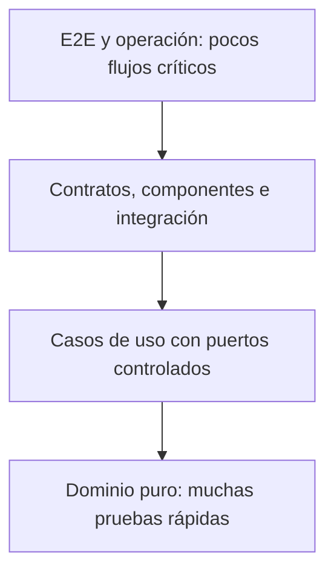

# Estrategia de Pruebas de CRUMAFOOD Platform

> **La calidad no se inspecciona al final: se diseña, se verifica y se demuestra con evidencia proporcional al riesgo.**

## Estado del documento

| Campo | Valor |
|---|---|
| Estado | Propuesto para aprobación |
| Versión | 1.0 |
| Propietarios | Product Owner, responsable de arquitectura y responsables de calidad e ingeniería |
| Alcance | Estrategia, niveles, herramientas, datos, automatización, CI, ambientes, evidencia y gobierno de pruebas |
| Autoridad | Derivado de `system-overview.md`, `business-core.md`, `data-architecture.md`, `security-architecture.md`, `integration-architecture.md`, `deployment-architecture.md`, `frontend-architecture.md`, `mobile-architecture.md`, `desktop-architecture.md`, `observability-architecture.md` y el CES |
| Revisión | Cuando cambie un flujo crítico, tecnología, entorno, modelo de riesgo, contrato, unidad desplegable o política de entrega |

---

## 1. Propósito

Este documento define cómo CRUMAFOOD Platform obtendrá evidencia de que sus capacidades funcionan, protegen datos, mantienen contratos y pueden operarse con confianza.

Su propósito es asegurar que:

- las reglas del negocio se verifiquen cerca del Business Core;
- los adaptadores se prueben contra infraestructura realista;
- los contratos sean compatibles;
- las autorizaciones se prueben por éxito y denegación;
- los flujos críticos tengan cobertura de extremo a extremo;
- Web, Mobile y Desktop se validen en condiciones representativas;
- los despliegues incluyan evidencia;
- los defectos produzcan regresiones automatizadas;
- y el esfuerzo de prueba sea proporcional al riesgo.

---

## 2. Declaración estratégica

> **CRUMAFOOD utilizará una estrategia por capas: muchas pruebas rápidas del dominio y aplicación, integración realista en límites críticos, contratos automatizados y pocos E2E enfocados en recorridos de negocio.**

La automatización protegerá comportamiento, no detalles incidentales de implementación.

Vitest, Testing Library y Playwright son la dirección inicial propuesta para TypeScript, componentes y E2E, sujetos a un spike corto y a decisión registrada si aparecen incompatibilidades.

PostgreSQL/Supabase se probará en un entorno aislado y reproducible.

Desktop añadirá las herramientas nativas de Rust y Tauri cuando esa unidad exista.

---

## 3. Alcance

Esta estrategia cubre:

- Business Core;
- dominio y casos de uso;
- adaptadores;
- PostgreSQL;
- Supabase;
- RLS;
- Auth;
- Storage y Realtime;
- API y Server Actions;
- contratos;
- webhooks;
- jobs;
- integraciones;
- Storefront;
- Admin Web;
- Mobile;
- Desktop/Tauri;
- hardware;
- seguridad;
- accesibilidad;
- rendimiento;
- resiliencia;
- observabilidad;
- migraciones;
- despliegue;
- recuperación;
- y pruebas manuales dirigidas.

No convierte al equipo de calidad en único responsable de la calidad.

---

## 4. Principios rectores

1. probar comportamiento observable;
2. comenzar por invariantes y riesgos;
3. mantener pruebas deterministas;
4. aislar datos y entornos;
5. preferir contratos estables sobre detalles internos;
6. probar denegaciones además de éxitos;
7. usar infraestructura real donde su semántica importe;
8. simular terceros en la mayoría de ejecuciones;
9. reservar E2E para flujos de alto valor;
10. no normalizar pruebas inestables;
11. convertir defectos en regresiones;
12. ejecutar evidencia antes de promover;
13. medir cobertura como señal, no como objetivo aislado;
14. diseñar testabilidad junto con el código;
15. mantener datos sensibles fuera de pruebas;
16. validar recuperación, no solo el camino feliz.

---

## 5. Estado actual

El repositorio actual contiene:

- TypeScript estricto;
- una prueba `product-code.test.ts`;
- directorios marcadores bajo `src/testing`;
- archivos de stories para algunos componentes compartidos;
- un workflow de GitHub Actions que solo ejecuta checkout;
- un script `lint` sin evidencia de ejecución en CI;
- y un script de build de Next.js.

No se identificó configuración verificable de:

- runner de pruebas;
- entorno DOM;
- Testing Library;
- Playwright o Cypress;
- cobertura;
- pruebas de integración;
- Supabase local para CI;
- RLS automatizada;
- contratos;
- pruebas de seguridad;
- rendimiento;
- visual regression;
- ni quality gates.

El archivo de prueba existente usa una API global de test, pero `package.json` no declara un runner capaz de ejecutarlo.

---

## 6. Brechas inmediatas

Las brechas prioritarias son:

- CI no valida ningún comportamiento;
- no existe comando dedicado de typecheck;
- no existe comando de pruebas;
- una prueba presente no es ejecutable de forma demostrada;
- RLS y permisos no tienen evidencia automatizada;
- rutas, jobs y webhooks carecen de pruebas de seguridad;
- no existen E2E para flujos críticos;
- y los marcadores de `src/testing` pueden crear una impresión falsa de madurez.

La transición P0–P2 cerrará estas brechas progresivamente.

---

## 7. Calidad basada en riesgo

Cada cambio se clasificará considerando:

- impacto en datos;
- impacto financiero;
- seguridad;
- trazabilidad;
- reversibilidad;
- alcance de usuarios;
- frecuencia de uso;
- complejidad;
- dependencia externa;
- operación offline;
- hardware;
- y facilidad de detección.

La estrategia de prueba crecerá con el riesgo.

Un cambio visual pequeño no exige la misma evidencia que una reserva de inventario o una migración.

---

## 8. Cuadrantes de prueba

La cobertura combinará:

- pruebas tecnológicas que guían el desarrollo;
- pruebas de negocio que guían el desarrollo;
- pruebas que evalúan el producto;
- y pruebas que critican el producto.

Esto incluye unitarias, integración, contratos, E2E, exploratorias, seguridad, rendimiento, accesibilidad y operación.

Ningún cuadrante será suficiente por sí solo.

---

## 9. Pirámide de pruebas



La base será rápida y determinista.

Las capas superiores aportarán realismo donde el riesgo lo justifique.

No se reemplazarán unitarias con una colección lenta de pruebas UI.

---

## 10. Taxonomía

CRUMAFOOD distinguirá:

- **unitaria:** una unidad lógica sin infraestructura real;
- **componente:** interfaz o componente con límites controlados;
- **aplicación:** caso de uso con puertos fake;
- **integración:** interacción con infraestructura real o emulada fielmente;
- **contrato:** compatibilidad entre productor y consumidor;
- **E2E:** recorrido mediante superficies públicas;
- **operativa:** comportamiento en entorno, dispositivo o hardware representativo;
- **no funcional:** seguridad, rendimiento, accesibilidad, resiliencia y recuperación.

El nombre de una carpeta no define el nivel; lo define el límite real de la prueba.

---

## 11. Herramientas objetivo

| Necesidad | Dirección propuesta |
|---|---|
| Unitarias y aplicación TypeScript | Vitest |
| Componentes React | Testing Library con entorno DOM |
| E2E Web | Playwright |
| Mock de red en cliente | Adaptador controlado o MSW si el spike lo justifica |
| PostgreSQL/Supabase | Supabase CLI o PostgreSQL efímero reproducible |
| Contratos | Esquemas Zod y artefactos versionados |
| Accesibilidad | Axe integrado y revisión manual |
| Cobertura | Provider compatible con Vitest |
| Rust | `cargo test`, `cargo clippy` y pruebas de integración |
| Rendimiento | Herramienta de carga elegida por ADR ligero |

Las herramientas se incorporarán solo con configuración, comandos, propietario y CI.

---

## 12. Estructura objetivo

```text
src/testing/
  builders/
  fixtures/
  fakes/
  mocks/
  contracts/
  helpers/
  integration/
  e2e/
  security/
  performance/
```

Las pruebas unitarias podrán vivir junto al código que protegen.

Las pruebas transversales vivirán en `src/testing` o en una raíz dedicada si la herramienta lo requiere.

Los archivos marcadores vacíos se reemplazarán o retirarán.

---

## 13. Convenciones de archivos

Se usarán nombres consistentes:

- `*.test.ts` para dominio, aplicación e integración cercana;
- `*.test.tsx` para componentes;
- `*.spec.ts` para E2E o convenciones específicas del runner;
- y nombres de escenario orientados a comportamiento.

Una prueba describirá condición, acción y resultado.

No se numerarán pruebas por orden de ejecución.

---

## 14. Patrón Given–When–Then

Los escenarios complejos seguirán:

- Given: contexto y precondiciones;
- When: acción;
- Then: resultado observable.

El patrón podrá expresarse sin comentarios cuando el código sea legible.

La preparación no ocultará reglas importantes dentro de helpers genéricos.

---

## 15. Independencia y aislamiento

Cada prueba podrá ejecutarse:

- sola;
- en cualquier orden;
- en paralelo cuando esté permitido;
- y repetidamente con el mismo resultado.

No dependerá de datos creados por otra prueba.

Los recursos compartidos usarán namespaces, transacciones o identificadores únicos controlados.

---

## 16. Determinismo

Se controlarán:

- reloj;
- aleatoriedad;
- zonas horarias;
- locale;
- red;
- dependencias;
- IDs;
- y concurrencia.

Los tests de fecha usarán instantes explícitos y `America/Mexico_City` cuando la regla del negocio dependa de la zona.

No se confiará en la fecha actual del runner.

---

## 17. Test doubles

Se distinguirán:

- **fake:** implementación funcional simplificada;
- **stub:** respuesta predeterminada;
- **spy:** observación de interacciones;
- **mock:** expectativa de interacción;
- **simulador:** comportamiento representativo de un sistema.

Se preferirán fakes en casos de uso y simuladores en protocolos.

Los mocks profundos de implementación serán evitados.

---

## 18. Builders y fixtures

Los builders:

- producirán datos válidos por defecto;
- permitirán sobrescribir solo lo relevante;
- usarán nombres de negocio;
- y evitarán valores mágicos repetidos.

Los fixtures:

- serán mínimos;
- deterministas;
- versionados;
- no sensibles;
- y explícitos sobre tenant, rol, almacén y estado.

No se copiarán datos productivos sin anonimización aprobada.

---

## 19. Datos semilla

Se distinguirán:

- catálogos obligatorios;
- seed de desarrollo;
- fixtures automatizados;
- escenarios de demostración;
- y datos sintéticos de rendimiento.

Los seeds deberán poder ejecutarse repetidamente.

Un entorno de pruebas no dependerá de edición manual para alcanzar estado válido.

---

## 20. Pruebas del dominio

El dominio tendrá pruebas rápidas para:

- invariantes;
- estados;
- transiciones;
- cantidades;
- unidades;
- redondeo;
- moneda;
- impuestos cuando correspondan;
- FEFO;
- caducidad;
- reservas;
- disponibilidad;
- y reglas de trazabilidad.

Estas pruebas no importarán Supabase, React, Next.js ni Tauri.

---

## 21. Value Objects

Cada Value Object probará:

- construcción válida;
- entradas inválidas;
- normalización;
- igualdad;
- serialización controlada;
- límites;
- y mensajes de error seguros.

Email, identificadores, dinero, cantidades, unidades y códigos tendrán escenarios de borde.

---

## 22. Entidades y agregados

Las pruebas verificarán:

- creación;
- comandos permitidos;
- transiciones prohibidas;
- invariantes antes y después;
- eventos emitidos;
- idempotencia interna;
- y reconstrucción desde persistencia.

No se afirmará solo el estado final si la evidencia intermedia es relevante.

---

## 23. FEFO y lotes

Los escenarios incluirán:

- varios lotes elegibles;
- misma fecha de caducidad;
- lote vencido;
- lote bloqueado;
- cantidad insuficiente;
- reserva parcial;
- unidades incompatibles;
- zona horaria;
- y concurrencia.

Las propiedades de orden y conservación de cantidad serán verificadas.

---

## 24. Cálculos

Se probarán:

- límites;
- cero;
- negativos rechazados;
- máximos soportados;
- precisión decimal;
- redondeo;
- acumulación;
- impuestos;
- descuentos;
- y conversiones.

Los tests usarán valores significativos, no solo ejemplos triviales.

Dinero no se comparará mediante floats sin política explícita.

---

## 25. Property-based testing

Se considerará property-based testing para reglas con espacios amplios:

- conversiones;
- códigos;
- FEFO;
- conservación de inventario;
- idempotencia;
- serialización;
- y ordenamientos.

La herramienta requerirá spike.

Las semillas de fallos se conservarán como regresiones.

---

## 26. Pruebas de aplicación

Cada caso de uso se probará con puertos controlados.

Los escenarios incluirán:

- éxito;
- validación;
- autorización;
- conflicto;
- dependencia fallida;
- retry permitido;
- idempotencia;
- auditoría;
- y evento de dominio.

La prueba verificará resultados y efectos relevantes, no el orden de llamadas irrelevantes.

---

## 27. Puertos y adaptadores

Los contratos de puerto tendrán suites reutilizables.

Un fake y un adaptador real deberán cumplir las mismas expectativas esenciales.

Esto aplicará a:

- repositorios;
- reloj;
- IDs;
- pagos;
- notificaciones;
- almacenamiento;
- impresión;
- scanner;
- báscula;
- y telemetría.

---

## 28. Repositorios

Las pruebas de contrato de repositorio verificarán:

- guardar;
- recuperar;
- ausencia;
- actualización;
- versión o concurrencia;
- filtros;
- paginación;
- orden;
- transacción;
- y mapeo.

Un repositorio fake no demostrará SQL, RLS ni restricciones.

El adaptador PostgreSQL ejecutará la misma suite más casos propios.

---

## 29. Mappers

Los mappers probarán:

- dominio a persistencia;
- persistencia a dominio;
- campos opcionales;
- enums;
- fechas;
- decimales;
- compatibilidad;
- datos corruptos;
- y pérdida de información.

Un mapper no corregirá silenciosamente un registro inválido sin política.

---

## 30. PostgreSQL aislado

Las pruebas de integración usarán una base efímera o proyecto Supabase local.

El entorno se creará desde:

- baseline;
- migraciones versionadas;
- configuración;
- y seed mínimo.

Cada ejecución comenzará desde un estado conocido.

Production nunca será destino de pruebas automatizadas.

---

## 31. Supabase local

La dirección preferida es ejecutar servicios compatibles mediante Supabase CLI cuando se necesiten Auth, RLS, Storage o Realtime.

El pipeline fijará versiones y verificará salud antes de probar.

Si una capacidad local no reproduce al proveedor con fidelidad suficiente, se añadirá una suite controlada en sandbox.

Las diferencias se documentarán.

---

## 32. Migraciones

Las migraciones se probarán:

- desde baseline limpio;
- desde versiones soportadas;
- con datos representativos;
- por repetibilidad del pipeline;
- por restricciones;
- por compatibilidad con código;
- y por duración cuando exista riesgo.

La estrategia productiva será forward-compatible.

No se exigirá un down migration destructivo como supuesto de rollback.

---

## 33. Backfills

Los backfills verificarán:

- reanudación;
- batches;
- idempotencia;
- checkpoint;
- observabilidad;
- concurrencia;
- datos inválidos;
- y ejecución repetida.

Se probarán con volúmenes representativos antes de Production.

Un backfill no estará escondido dentro del inicio normal de la aplicación.

---

## 34. Restricciones e integridad

La suite de datos comprobará:

- not null;
- foreign keys;
- unique;
- checks;
- estados válidos;
- invariantes transaccionales;
- y eliminación restringida.

Se probarán inserciones inválidas de forma explícita.

La validación de UI no sustituirá una restricción crítica.

---

## 35. Transacciones

Las pruebas verificarán:

- commit completo;
- rollback ante fallo;
- efectos parciales inexistentes;
- eventos o outbox en la misma transacción;
- locks;
- timeout;
- y reintento seguro.

Se incluirán fallos inyectados entre pasos.

---

## 36. Concurrencia

Los escenarios críticos incluirán operaciones simultáneas:

- reservar el mismo stock;
- consumir el mismo lote;
- confirmar la misma orden;
- recibir el mismo webhook;
- ejecutar el mismo job;
- y sincronizar el mismo comando.

La prueba verificará el resultado global, no solo respuestas individuales.

---

## 37. Idempotencia

Cada operación idempotente se probará con:

- misma key y mismo payload;
- misma key y payload distinto;
- retry tras timeout;
- concurrencia;
- resultado almacenado;
- expiración;
- y error reintentable.

Duplicar una solicitud no deberá duplicar el efecto.

---

## 38. RLS

Las políticas RLS tendrán pruebas automatizadas positivas y negativas.

La matriz cubrirá:

- usuario anónimo;
- usuario autenticado;
- tenant correcto;
- tenant distinto;
- rol permitido;
- rol insuficiente;
- fila propia;
- fila ajena;
- insert;
- select;
- update;
- delete;
- y funciones con privilegios.

Las pruebas se ejecutarán con credenciales equivalentes al cliente, no únicamente con service role.

---

## 39. Autenticación y sesión

Se probarán:

- login;
- logout;
- sesión expirada;
- refresh;
- revocación;
- recuperación;
- MFA cuando se adopte;
- cookies;
- redirección;
- PKCE para clientes aplicables;
- y cambio de usuario.

Los tests no incluirán secretos reales.

---

## 40. Autorización

Cada capacidad crítica tendrá una matriz de:

- actor;
- rol;
- tenant;
- almacén;
- estado del recurso;
- acción;
- y resultado.

Se verificarán UI, API, caso de uso y RLS según su responsabilidad.

Ocultar un botón no demuestra autorización.

---

## 41. API

Cada endpoint probará:

- método;
- autenticación;
- autorización;
- validación;
- request válido;
- respuesta;
- errores normalizados;
- códigos HTTP;
- correlación;
- rate limit;
- idempotencia;
- y redacción.

La prueba usará la superficie pública cuando evalúe el contrato.

---

## 42. Server Actions

Las Server Actions se tratarán como adaptadores.

Se probarán:

- parseo;
- identidad;
- autorización;
- llamada al caso de uso;
- traducción de error;
- revalidación;
- y respuesta segura.

Las reglas del negocio no se duplicarán en pruebas exclusivas de la Action.

---

## 43. Contratos

Los contratos incluirán:

- esquemas de request;
- esquemas de response;
- errores;
- eventos;
- webhooks;
- y compatibilidad de versión.

Los esquemas Zod podrán actuar como artefactos ejecutables cuando sean canónicos.

Una prueba de contrato fallará antes de promover un cambio incompatible.

---

## 44. Compatibilidad

Se probará que:

- clientes soportados consumen la API vigente;
- campos nuevos son aditivos cuando corresponde;
- campos opcionales mantienen semántica;
- enums no rompen consumidores;
- errores conservan forma;
- y Desktop/Mobile antiguos reciben una respuesta controlada.

Los contratos obsoletos tendrán fecha y telemetría de uso.

---

## 45. Webhooks

Las pruebas de webhook cubrirán:

- body crudo;
- firma válida;
- firma inválida;
- secreto incorrecto;
- timestamp;
- replay;
- duplicado;
- orden fuera de secuencia;
- payload inválido;
- timeout;
- idempotencia;
- y respuesta al proveedor.

No se enviarán eventos reales a terceros desde la suite normal.

---

## 46. Integraciones externas

Se usarán:

- fakes deterministas para unitarias;
- simuladores para protocolo;
- sandbox para integración controlada;
- y pruebas contractuales de payload.

Los fallos incluirán:

- timeout;
- rate limit;
- 4xx;
- 5xx;
- respuesta malformada;
- latencia;
- credencial expirada;
- y servicio no disponible.

---

## 47. Outbox, inbox y eventos

Se probarán:

- escritura atómica;
- publicación;
- consumo;
- duplicados;
- reintentos;
- orden cuando importe;
- dead letter;
- reconciliación;
- y recuperación tras caída.

La entrega al menos una vez exigirá consumidor idempotente.

---

## 48. Jobs

Cada job tendrá pruebas para:

- autenticación del disparador;
- horario interpretado;
- lock;
- no solapamiento;
- idempotencia;
- batch;
- timeout;
- reanudación;
- error;
- observabilidad;
- y ausencia de ejecución.

El job actual deberá probar también que no expone mensajes internos al cliente.

---

## 49. Componentes React

Los componentes interactivos se probarán desde la perspectiva del usuario:

- nombre accesible;
- roles;
- teclado;
- estados;
- eventos;
- validación;
- foco;
- loading;
- error;
- vacío;
- y permiso denegado.

Se evitarán aserciones sobre clases internas salvo que definan un contrato visual.

---

## 50. Formularios

Los formularios cubrirán:

- valores válidos;
- requeridos;
- formato;
- límites;
- errores del servidor;
- envío repetido;
- bloqueo durante envío;
- recuperación;
- foco del error;
- y conservación segura de datos.

Una validación cliente no sustituirá validación servidor.

---

## 51. Accesibilidad

La estrategia combinará:

- lint apropiado;
- axe automatizado;
- queries accesibles;
- navegación por teclado;
- foco;
- contraste;
- zoom;
- lectores de pantalla en flujos críticos;
- y revisión manual.

Pasar axe no demostrará accesibilidad completa.

---

## 52. Responsive

Se probarán breakpoints representativos, no cada pixel.

Los escenarios cubrirán:

- contenido realista;
- textos largos;
- tablas;
- modales;
- teclado virtual;
- orientación;
- zoom;
- y acciones críticas.

No se basará la validación Mobile únicamente en viewport de escritorio.

---

## 53. Visual regression

La regresión visual se aplicará selectivamente a:

- componentes compartidos;
- navegación;
- layouts críticos;
- estados de error;
- recibos;
- etiquetas;
- y documentos.

Las baselines tendrán revisión humana.

Una diferencia no se aprobará automáticamente regenerando imágenes.

---

## 54. Stories

Las stories existentes podrán convertirse en catálogo ejecutable.

Cada story útil documentará:

- estado;
- datos;
- interacción;
- accesibilidad;
- responsive;
- y variantes.

Storybook u otra herramienta requerirá decisión proporcional a su mantenimiento.

Una story vacía no contará como prueba.

---

## 55. E2E Web

Playwright es la dirección propuesta para recorridos Web.

Los E2E usarán:

- selectores accesibles;
- datos aislados;
- autenticación controlada;
- trazas al fallar;
- screenshots diagnósticos;
- y limpieza.

No se resolverá inestabilidad agregando esperas fijas.

---

## 56. Flujos E2E prioritarios

La primera suite cubrirá:

- login y logout;
- acceso denegado;
- catálogo;
- recepción;
- movimiento o ajuste autorizado;
- producción y consumo;
- picking;
- creación y confirmación de orden;
- pago en sandbox;
- trazabilidad de lote;
- y permisos entre tenants.

La cantidad se mantendrá pequeña y de alto valor.

---

## 57. Mobile

Mobile probará:

- navegadores soportados;
- permisos de cámara;
- scanner fake;
- captura manual;
- red lenta;
- offline;
- reintento;
- duplicado;
- conflicto;
- sesión expirada;
- actualización PWA;
- background;
- y accesibilidad táctil.

Los comandos críticos tendrán pruebas de red y servidor, no solo UI.

---

## 58. Pruebas operativas Mobile

Antes de liberar un flujo de piso se probará con:

- dispositivo representativo;
- iluminación variable;
- etiquetas dañadas;
- guantes;
- ruido;
- una mano;
- distancia;
- Wi-Fi débil;
- cambio de usuario;
- batería limitada;
- y presión de tiempo.

La evidencia registrará dispositivo, navegador, versión y resultado.

---

## 59. Desktop TypeScript

La interfaz Desktop reutilizará pruebas aplicables de frontend y contratos.

Además cubrirá:

- bridge no disponible;
- command rechazado;
- timeout;
- actualización pendiente;
- almacenamiento local;
- sincronización;
- y recuperación.

La WebView se tratará como cliente no confiable frente al bridge.

---

## 60. Rust y Tauri

Cuando exista `src-tauri`, CI ejecutará:

- `cargo fmt --check`;
- `cargo clippy`;
- `cargo test`;
- pruebas de commands;
- capabilities;
- allowlists;
- serialización;
- errores;
- almacenamiento seguro;
- y updater.

Los commands validarán entradas y permisos aunque la UI ya los haya validado.

---

## 61. Hardware

Cada puerto de hardware tendrá:

- fake determinista;
- suite contractual;
- simulador cuando sea viable;
- y pruebas con dispositivos reales.

Impresoras, scanners y básculas cubrirán desconexión, formato inválido, timeout, reconexión y duplicado.

Un fake no certificará compatibilidad física.

---

## 62. Laboratorio Desktop

Se mantendrá una matriz con:

- sistema operativo;
- arquitectura;
- versión;
- modelo de hardware;
- firmware;
- driver;
- conexión;
- configuración;
- y resultado.

La matriz inicial se basará en equipos realmente usados por la operación.

---

## 63. Instalación y actualización

Desktop probará:

- instalación limpia;
- actualización desde versiones soportadas;
- firma;
- canal;
- interrupción;
- rollback o recuperación;
- datos locales;
- desinstalación;
- permisos;
- y compatibilidad API.

Un binario compilado no demuestra una actualización segura.

---

## 64. Seguridad

La suite de seguridad incluirá:

- autenticación;
- sesiones;
- autorización;
- RLS;
- IDOR;
- inyección;
- XSS;
- CSRF;
- SSRF cuando aplique;
- replay;
- webhooks;
- rate limiting;
- secretos;
- errores;
- headers;
- dependencias;
- y capacidades Desktop.

Las pruebas negativas serán parte de los quality gates de flujos críticos.

---

## 65. Secretos

CI verificará:

- secretos en código;
- variables públicas indebidas;
- fixtures sensibles;
- logs;
- snapshots;
- artefactos;
- screenshots;
- y reportes.

Los repositorios de pruebas usarán credenciales propias de entorno.

Una clave productiva no se utilizará para simplificar una suite.

---

## 66. Observabilidad

Se probarán:

- logs estructurados;
- request ID;
- trace context;
- release;
- métricas;
- redacción;
- agrupación de errores;
- source maps;
- alertas;
- y dashboards.

Los tests usarán exporters en memoria o adaptadores controlados.

No dependerán siempre del proveedor externo.

---

## 67. Rendimiento

Las pruebas de rendimiento se basarán en objetivos por flujo.

Cubrirán:

- latencia;
- throughput;
- concurrencia;
- consultas;
- tamaño de payload;
- render;
- sincronización;
- y límites de proveedor.

Primero se establecerá una línea base.

No se inventarán objetivos sin impacto de negocio.

---

## 68. Tipos de carga

Se distinguirán:

- baseline;
- load;
- stress;
- spike;
- soak;
- y capacity.

Cada ejecución tendrá hipótesis, volumen, duración, entorno y criterio de salida.

Las pruebas destructivas o costosas no se ejecutarán en cada Pull Request.

---

## 69. Base de datos y rendimiento

Se verificarán consultas críticas de:

- stock;
- lotes FEFO;
- movimientos;
- reservas;
- órdenes;
- documentos;
- cuentas por cobrar;
- y trazabilidad.

Se observarán planes, índices, locks, conexiones y percentiles.

El test fallará por regresión significativa aprobada como umbral, no por variación mínima del runner.

---

## 70. Resiliencia

Se probarán fallos controlados de:

- red;
- timeout;
- Supabase;
- proveedor externo;
- Storage;
- job interrumpido;
- worker reiniciado;
- y dispositivo desconectado.

La prueba verificará degradación, retry, circuit breaker, recuperación y ausencia de corrupción.

Chaos engineering amplio solo se adoptará cuando la madurez lo justifique.

---

## 71. Respaldo y restauración

La estrategia verificará:

- respaldo disponible;
- restauración en entorno aislado;
- integridad;
- RPO observado;
- RTO observado;
- permisos;
- Storage asociado;
- y reconciliación posterior.

Un reporte de backup exitoso no sustituye una restauración probada.

---

## 72. Smoke tests

Cada despliegue tendrá smoke tests:

- proceso;
- assets;
- login o sesión controlada;
- lectura autorizada;
- endpoint crítico;
- conectividad;
- y versión.

Production usará operaciones seguras, idempotentes y no destructivas.

Los sintéticos estarán identificados.

---

## 73. Pruebas de despliegue

Se verificará:

- artefacto;
- variables;
- secretos;
- migraciones;
- dominio;
- TLS;
- headers;
- versión;
- feature flags;
- observabilidad;
- smoke test;
- y rollback.

Preview no promoverá automáticamente evidencia obtenida con configuración distinta de Production.

---

## 74. Compatibilidad de migración y código

El pipeline probará una secuencia expand–migrate–contract cuando aplique:

1. esquema compatible;
2. código nuevo;
3. backfill;
4. verificación;
5. retiro posterior.

Se probará coexistencia con la versión desplegada durante la transición.

Una migración irreversible requerirá plan de recuperación.

---

## 75. Análisis estático

Los gates básicos incluirán:

- formato;
- typecheck;
- lint;
- imports y límites;
- build;
- secretos;
- dependencias;
- y validación de configuración.

El análisis estático complementa pruebas; no demuestra comportamiento runtime.

Las excepciones tendrán justificación, propietario y vencimiento.

---

## 76. Comandos objetivo

```text
npm run format:check
npm run typecheck
npm run lint
npm run test
npm run test:coverage
npm run test:integration
npm run test:e2e
npm run build
```

Los nombres podrán ajustarse en la implementación.

Cada comando tendrá semántica estable y funcionará localmente y en CI.

---

## 77. Pipeline de Pull Request

Cada Pull Request ejecutará, como mínimo:

1. instalación determinista;
2. formato;
3. typecheck;
4. lint;
5. unitarias;
6. aplicación;
7. integración afectada;
8. contratos;
9. build;
10. y E2E críticos proporcionales.

Los checks requeridos bloquearán merge cuando fallen.

---

## 78. Pipeline de main

Main repetirá gates esenciales y producirá:

- artefacto identificable;
- reporte de pruebas;
- cobertura;
- resultados de integración;
- evidencia de migración;
- y release candidate.

Después del despliegue ejecutará smoke tests.

Una ejecución verde previa no sustituirá verificación del artefacto promovido.

---

## 79. Suites programadas

Las suites nocturnas o periódicas podrán incluir:

- matriz de navegadores;
- E2E ampliada;
- sandbox de terceros;
- rendimiento;
- seguridad dinámica;
- restauración;
- compatibilidad Desktop;
- dispositivos;
- y dependencias.

Los fallos tendrán propietario y no se ignorarán por no bloquear PR.

---

## 80. Paralelización

Las suites se paralelizarán solo si preservan aislamiento.

Se usarán:

- partición estable;
- datos por worker;
- puertos o schemas aislados;
- artefactos por shard;
- y combinación de reportes.

La paralelización no justificará condiciones de carrera en tests.

---

## 81. Pruebas inestables

Una prueba flaky:

- se investigará;
- tendrá propietario;
- registrará causa;
- podrá aislarse temporalmente;
- y tendrá fecha de resolución.

No se reintentará indefinidamente hasta obtener verde.

Los retries limitados servirán como diagnóstico, no como ocultamiento.

---

## 82. Cuarentena

La cuarentena será excepcional.

Requerirá:

- issue;
- propietario;
- impacto;
- fecha;
- evidencia;
- y plan.

Una prueba de seguridad, RLS, dinero o inventario crítico no se desactivará silenciosamente.

---

## 83. Cobertura

La cobertura ayudará a localizar áreas sin evidencia.

Se observarán:

- statements;
- branches;
- functions;
- y lines.

No se fijará un porcentaje global arbitrario como sustituto de riesgo.

Los módulos críticos exigirán cobertura de decisiones e invariantes, aunque el promedio general sea alto.

---

## 84. Mutation testing

Se podrá incorporar mutation testing selectivo para:

- cálculos;
- permisos;
- FEFO;
- idempotencia;
- y estados.

Su costo impide usarlo inicialmente en todo el repositorio.

Los mutantes sobrevivientes revelarán pruebas débiles, no necesariamente defectos.

---

## 85. Snapshots

Los snapshots se limitarán a estructuras estables y revisables.

No se usarán para ocultar aserciones:

- enormes;
- volátiles;
- con timestamps;
- con IDs;
- o con datos sensibles.

Actualizar un snapshot requerirá comprender el cambio.

---

## 86. Evidencia y artefactos

CI conservará según política:

- resumen;
- JUnit u otro formato interoperable;
- cobertura;
- screenshots de fallo;
- trazas E2E;
- videos selectivos;
- logs redactados;
- y resultados de migración.

La retención considerará costo y sensibilidad.

---

## 87. Defectos y regresiones

Todo defecto relevante incluirá:

- escenario mínimo;
- impacto;
- causa;
- capa correcta de prueba;
- y regresión automatizada cuando sea viable.

Se preferirá la prueba más baja que reproduzca fielmente el comportamiento.

Un E2E no será la respuesta automática a cada bug.

---

## 88. Pruebas exploratorias

La exploración se dirigirá por:

- cambio;
- riesgo;
- personas usuarias;
- datos;
- entorno;
- y heurísticas.

La sesión tendrá charter, tiempo, notas y hallazgos.

Automatización y exploración son complementarias.

---

## 89. Validación de usuario

Los flujos operativos requerirán validación con usuarios representativos cuando afecten:

- almacén;
- producción;
- picking;
- recepción;
- impresión;
- dispositivos;
- y decisiones críticas.

La aceptación no reemplazará pruebas técnicas.

La evidencia de laboratorio no reemplazará usabilidad real.

---

## 90. Entornos

| Entorno | Uso |
|---|---|
| Local | Ciclo rápido y pruebas aisladas |
| CI | Suites reproducibles y gates |
| Preview | Integración de rama y revisión |
| Sandbox | Proveedores externos controlados |
| Staging, si se aprueba | Ensayo estable de operaciones complejas |
| Production | Smoke y sintéticos seguros |

Cada entorno tendrá datos, secretos y propósito separados.

---

## 91. Production

En Production solo se permitirán:

- health;
- smoke no destructivo;
- sintéticos autorizados;
- verificación de configuración segura;
- y pruebas operativas controladas con plan.

No se ejecutarán cargas destructivas, fuzzing abierto ni fixtures comunes.

Las pruebas productivas estarán identificadas en observabilidad.

---

## 92. Seguridad de datos de prueba

Los datos de prueba:

- serán sintéticos;
- estarán clasificados;
- usarán identidades dedicadas;
- expirarán;
- y se limpiarán.

No se copiarán clientes, empleados, proveedores, pagos o documentos reales a entornos inferiores sin proceso aprobado.

Las herramientas de prueba seguirán mínimo privilegio.

---

## 93. Cuentas y roles de prueba

Se mantendrán identidades para:

- anónimo;
- usuario base;
- operador;
- supervisor;
- administrador limitado;
- tenant A;
- tenant B;
- y servicio.

Las cuentas tendrán propósito y rotación.

No se compartirá una cuenta administrativa personal entre pipelines.

---

## 94. Limpieza

Cada suite definirá limpieza por:

- rollback;
- truncado controlado;
- schema efímero;
- expiración;
- o eliminación por identificador de ejecución.

La limpieza no deberá borrar datos ajenos.

Los fallos de cleanup serán visibles.

---

## 95. Desempeño de la suite

Se medirán:

- duración total;
- tiempo por capa;
- cola de runners;
- tests más lentos;
- flakiness;
- y costo.

El ciclo de Pull Request debe permitir retroalimentación temprana.

Las suites lentas se optimizarán sin reducir evidencia crítica.

---

## 96. Estrategia de selección

La selección por cambio podrá acelerar CI si:

- el grafo de dependencias es confiable;
- los gates globales permanecen;
- las suites críticas se ejecutan periódicamente;
- y existe fallback completo.

Un cambio en contratos, esquema, seguridad o configuración ampliará automáticamente el alcance.

---

## 97. Responsabilidades

| Rol | Responsabilidad |
|---|---|
| Desarrollo | Diseñar, automatizar y mantener pruebas |
| Dueño de módulo | Definir riesgos y escenarios |
| Calidad | Guiar estrategia, exploración y evidencia |
| Arquitectura | Proteger límites y contratos |
| Seguridad | Definir casos negativos y revisión |
| Operación | Validar despliegue, resiliencia y recuperación |
| Product Owner | Priorizar criticidad y aceptación |

La calidad pertenece al equipo completo.

---

## 98. Revisión de Pull Request

La revisión comprobará:

- comportamiento protegido;
- capa adecuada;
- legibilidad;
- determinismo;
- datos;
- casos de borde;
- denegaciones;
- riesgo de flakiness;
- y evidencia CI.

No se pedirá una prueba nueva si una existente ya demuestra el comportamiento con claridad.

---

## 99. Definition of Done

Un cambio estará terminado cuando:

- cumple criterios de aceptación;
- tiene pruebas proporcionales al riesgo;
- cubre éxito y fallos relevantes;
- cubre denegación cuando aplica;
- actualiza contratos;
- verifica migraciones;
- no introduce datos sensibles;
- typecheck, lint, pruebas y build pasan;
- observabilidad se prueba;
- documentación se actualiza;
- y existe evidencia de despliegue o plan correspondiente.

---

## 100. Excepciones

Una excepción a la estrategia tendrá:

- justificación;
- riesgo;
- mitigación;
- propietario;
- aprobación;
- vencimiento;
- y seguimiento.

La urgencia no convertirá una omisión temporal en estándar permanente.

---

## 101. Prioridades

### P0 — Fundación ejecutable

- seleccionar y configurar Vitest;
- hacer ejecutable la prueba existente;
- añadir typecheck;
- corregir lint para la versión actual;
- configurar Testing Library;
- crear helpers y builders mínimos;
- activar CI en Pull Requests;
- ejecutar unitarias, lint, typecheck y build;
- retirar marcadores vacíos;
- y proteger secretos en artefactos.

### P1 — Riesgo de plataforma

- pruebas de Business Core;
- integración PostgreSQL/Supabase;
- migraciones;
- RLS positiva y negativa;
- contratos API;
- autenticación y autorización;
- webhooks;
- jobs;
- Playwright;
- flujos críticos;
- accesibilidad;
- cobertura;
- y reportes CI.

### P2 — Madurez

- rendimiento;
- resiliencia;
- restauración automatizada;
- visual regression selectiva;
- property-based testing;
- mutation testing selectivo;
- matrices Mobile y Desktop;
- laboratorio de hardware;
- sandbox periódico;
- y optimización de selección.

---

## 102. Secuencia de adopción

1. ejecutar la prueba existente;
2. crear comandos estables;
3. activar gates de Pull Request;
4. proteger reglas puras;
5. levantar PostgreSQL/Supabase aislado;
6. probar RLS y transacciones;
7. probar contratos;
8. incorporar componentes;
9. automatizar E2E críticos;
10. ampliar seguridad y operación;
11. establecer líneas base no funcionales;
12. medir y mejorar la suite.

Cada fase deberá reducir un riesgo observable.

---

## 103. Antipatrones

Se evitará:

- perseguir 100% de cobertura;
- probar detalles internos;
- mockear toda la infraestructura;
- ejecutar tests contra Production;
- usar service role para demostrar RLS;
- compartir estado entre pruebas;
- usar sleeps fijos;
- reintentar hasta verde;
- snapshots gigantes;
- fixtures productivos;
- E2E para toda combinación;
- tests sin aserciones útiles;
- desactivar pruebas críticas;
- y mantener carpetas vacías como evidencia.

---

## 104. Riesgos y controles

| Riesgo | Control |
|---|---|
| Suite lenta | Pirámide, paralelización y selección segura |
| Flakiness | Determinismo, aislamiento y cuarentena limitada |
| Falsa confianza | Capas complementarias y escenarios negativos |
| Datos sensibles | Datos sintéticos, redacción y mínimo privilegio |
| Divergencia fake/real | Suites contractuales reutilizables |
| Proveedor no disponible | Simuladores más sandbox periódico |
| RLS sin verificar | Credenciales de usuario y matriz positiva/negativa |
| E2E frágil | Selectores accesibles y pocos flujos |
| Cobertura vanidosa | Riesgo e invariantes |
| CI ignorado | Checks requeridos y ownership |

---

## 105. Criterios de conformidad

Un módulo será conforme cuando:

- identifica riesgos;
- protege invariantes;
- prueba casos de uso;
- verifica su adaptador real;
- cubre permisos y denegaciones;
- mantiene contratos;
- usa datos aislados;
- ejecuta en CI;
- no tiene flakiness aceptada indefinidamente;
- produce evidencia;
- y cumple Definition of Done.

La conformidad se demuestra con código, configuración, resultados y revisión.

---

## 106. Decisiones pendientes

Requieren spike o ADR:

- confirmación de Vitest y entorno DOM;
- Playwright como runner E2E;
- herramienta de mock de red;
- estrategia Supabase local en CI;
- herramienta de property-based testing;
- visual regression;
- performance testing;
- DAST;
- mutation testing;
- matriz de navegadores y dispositivos;
- y plataforma de reportes.

Cada decisión evaluará compatibilidad, costo, velocidad, mantenimiento y experiencia del equipo.

---

## 107. Resultado esperado

Al aplicar esta estrategia, CRUMAFOOD podrá:

- cambiar reglas con confianza;
- detectar regresiones temprano;
- demostrar aislamiento y permisos;
- evolucionar datos y contratos;
- liberar Web, Mobile y Desktop con evidencia;
- validar hardware y operación real;
- reducir defectos repetidos;
- y recuperar el sistema de manera comprobada.

---

## 108. Declaración final

> **Las pruebas de CRUMAFOOD protegerán los compromisos esenciales del negocio y de la plataforma. Serán rápidas donde sea posible, realistas donde sea necesario y siempre proporcionales al riesgo que buscan reducir.**
